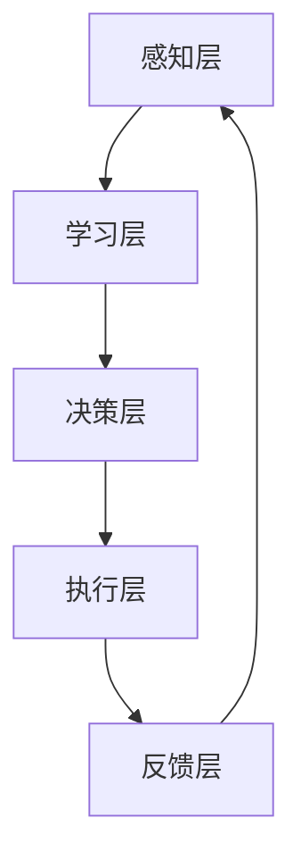

                 

# 程序世界的宇宙级自适应机制

> 关键词：自适应机制, 人工智能, 机器学习, 自动化, 智能优化, 算法设计, 深度学习, 自我学习, 自我调整

> 摘要：本文旨在探讨程序世界的自适应机制，通过深入分析其核心概念、算法原理、数学模型、实际案例和应用场景，揭示自适应机制在现代软件开发中的重要性。我们将从理论到实践，逐步解析自适应机制的运作机制，帮助读者理解如何构建和优化自适应系统，以应对复杂多变的环境。

## 1. 背景介绍
### 1.1 目的和范围
本文旨在深入探讨程序世界的自适应机制，通过分析其核心概念、算法原理、数学模型、实际案例和应用场景，揭示自适应机制在现代软件开发中的重要性。我们将从理论到实践，逐步解析自适应机制的运作机制，帮助读者理解如何构建和优化自适应系统，以应对复杂多变的环境。

### 1.2 预期读者
本文适合以下读者：
- 软件开发工程师
- 人工智能和机器学习研究人员
- 数据科学家
- 系统架构师
- 技术爱好者和学习者

### 1.3 文档结构概述
本文结构如下：
1. 背景介绍
2. 核心概念与联系
3. 核心算法原理 & 具体操作步骤
4. 数学模型和公式 & 详细讲解 & 举例说明
5. 项目实战：代码实际案例和详细解释说明
6. 实际应用场景
7. 工具和资源推荐
8. 总结：未来发展趋势与挑战
9. 附录：常见问题与解答
10. 扩展阅读 & 参考资料

### 1.4 术语表
#### 1.4.1 核心术语定义
- **自适应机制**：系统根据环境变化自动调整其行为的能力。
- **自学习**：系统通过经验自动改进其性能的能力。
- **自调整**：系统根据反馈自动调整其参数的能力。
- **自优化**：系统通过优化其内部结构或算法以提高性能的能力。
- **自组织**：系统通过内部机制自动组织其结构的能力。

#### 1.4.2 相关概念解释
- **机器学习**：通过算法使计算机系统能够从数据中学习并改进其性能。
- **深度学习**：一种机器学习方法，通过多层神经网络实现复杂的模式识别。
- **自动化**：系统自动执行任务，无需人工干预。
- **智能优化**：通过智能算法优化系统性能，提高效率和准确性。

#### 1.4.3 缩略词列表
- ML：机器学习
- DL：深度学习
- AI：人工智能
- SOTA：当前最佳技术

## 2. 核心概念与联系
### 2.1 自适应机制的核心概念
自适应机制是系统根据环境变化自动调整其行为的能力。这种机制通常包括以下几个方面：
- **感知环境**：系统能够感知其外部环境的变化。
- **学习与优化**：系统能够从经验中学习，并根据学习结果优化其行为。
- **反馈与调整**：系统能够根据反馈信息自动调整其参数，以适应环境变化。

### 2.2 自适应机制的架构
自适应机制的架构可以分为以下几个层次：
- **感知层**：负责收集环境信息。
- **学习层**：负责从感知层获取的信息中学习。
- **决策层**：根据学习结果做出决策。
- **执行层**：根据决策层的指令执行任务。
- **反馈层**：负责收集执行结果的反馈信息。



## 3. 核心算法原理 & 具体操作步骤
### 3.1 自适应算法原理
自适应算法通常基于机器学习和优化理论。以下是一个简单的自适应算法示例，使用伪代码描述：

```pseudo
function adaptiveAlgorithm(data, learningRate, threshold):
    # 初始化参数
    parameters = initializeParameters()
    
    while not converged:
        # 感知环境
        observations = perceiveEnvironment(data)
        
        # 学习
        newParameters = learn(parameters, observations, learningRate)
        
        # 决策
        decision = makeDecision(newParameters)
        
        # 执行
        execute(decision)
        
        # 反馈
        feedback = collectFeedback()
        
        # 调整
        parameters = adjustParameters(parameters, feedback, learningRate)
        
        # 检查收敛条件
        if checkConvergence(parameters, threshold):
            break
    
    return parameters
```

### 3.2 具体操作步骤
1. **初始化参数**：设置初始参数值。
2. **感知环境**：收集环境数据。
3. **学习**：根据感知到的数据调整参数。
4. **决策**：根据调整后的参数做出决策。
5. **执行**：执行决策。
6. **反馈**：收集执行结果的反馈信息。
7. **调整**：根据反馈信息调整参数。
8. **检查收敛条件**：判断是否满足收敛条件，如果满足则停止迭代。

## 4. 数学模型和公式 & 详细讲解 & 举例说明
### 4.1 数学模型
自适应机制通常基于优化理论，常用的数学模型包括梯度下降法、随机梯度下降法和牛顿法等。

#### 4.1.1 梯度下降法
梯度下降法是一种常用的优化算法，用于最小化目标函数。其基本公式如下：

$$
\theta_{t+1} = \theta_t - \alpha \nabla J(\theta_t)
$$

其中，$\theta_t$ 是第 $t$ 次迭代的参数，$\alpha$ 是学习率，$\nabla J(\theta_t)$ 是目标函数 $J(\theta_t)$ 的梯度。

#### 4.1.2 随机梯度下降法
随机梯度下降法是一种改进的梯度下降法，适用于大规模数据集。其基本公式如下：

$$
\theta_{t+1} = \theta_t - \alpha \nabla J(\theta_t, x_i, y_i)
$$

其中，$x_i$ 和 $y_i$ 是第 $i$ 个样本的数据和标签。

#### 4.1.3 牛顿法
牛顿法是一种二阶优化算法，其基本公式如下：

$$
\theta_{t+1} = \theta_t - H^{-1}(\theta_t) \nabla J(\theta_t)
$$

其中，$H(\theta_t)$ 是目标函数 $J(\theta_t)$ 的海森矩阵。

### 4.2 详细讲解
自适应机制的核心在于通过优化算法不断调整参数，以适应环境变化。梯度下降法是最基本的优化算法，适用于大多数情况。随机梯度下降法适用于大规模数据集，可以加速收敛。牛顿法则通过二阶导数提供更精确的优化方向，适用于某些特定问题。

### 4.3 举例说明
假设我们有一个线性回归模型，目标是预测房价。我们可以使用梯度下降法来优化模型参数。

```pseudo
function gradientDescent(X, y, theta, alpha, iterations):
    m = length(y)
    for i in range(iterations):
        # 计算预测值
        h = X * theta
        
        # 计算梯度
        gradient = (1/m) * X.T * (h - y)
        
        # 更新参数
        theta = theta - alpha * gradient
    
    return theta
```

## 5. 项目实战：代码实际案例和详细解释说明
### 5.1 开发环境搭建
我们将使用Python和TensorFlow库来实现一个简单的自适应机制项目。首先，安装必要的库：

```bash
pip install tensorflow numpy
```

### 5.2 源代码详细实现和代码解读
我们将实现一个简单的线性回归模型，并使用梯度下降法进行优化。

```python
import numpy as np
import tensorflow as tf

# 生成数据
X = np.random.rand(100, 1)
y = 2 * X + 1 + 0.1 * np.random.randn(100, 1)

# 定义模型参数
theta = tf.Variable(np.random.randn(1, 1), dtype=tf.float32)

# 定义损失函数
def loss_function(X, y, theta):
    h = tf.matmul(X, theta)
    return tf.reduce_mean(tf.square(h - y))

# 定义优化器
optimizer = tf.keras.optimizers.SGD(learning_rate=0.01)

# 训练模型
for i in range(1000):
    with tf.GradientTape() as tape:
        loss = loss_function(X, y, theta)
    gradients = tape.gradient(loss, [theta])
    optimizer.apply_gradients(zip(gradients, [theta]))

# 输出优化后的参数
print("Optimized theta:", theta.numpy())
```

### 5.3 代码解读与分析
- **数据生成**：使用NumPy生成随机数据。
- **模型参数**：使用TensorFlow定义模型参数。
- **损失函数**：定义线性回归的损失函数。
- **优化器**：使用梯度下降法进行优化。
- **训练模型**：通过迭代更新参数，最小化损失函数。
- **输出结果**：输出优化后的参数。

## 6. 实际应用场景
自适应机制在许多领域都有广泛的应用，包括但不限于：
- **智能推荐系统**：根据用户行为自动调整推荐策略。
- **自动驾驶**：根据环境变化自动调整驾驶策略。
- **金融风控**：根据市场变化自动调整风控策略。
- **医疗诊断**：根据患者数据自动调整诊断模型。

## 7. 工具和资源推荐
### 7.1 学习资源推荐
#### 7.1.1 书籍推荐
- **《机器学习》** - 周志华
- **《深度学习》** - Ian Goodfellow, Yoshua Bengio, Aaron Courville

#### 7.1.2 在线课程
- **Coursera - 机器学习** - Andrew Ng
- **edX - 深度学习** - Andrew Ng

#### 7.1.3 技术博客和网站
- **Medium - 机器学习** - 众多技术博客和文章
- **GitHub - 机器学习项目** - 丰富的开源项目

### 7.2 开发工具框架推荐
#### 7.2.1 IDE和编辑器
- **PyCharm** - 针对Python开发的强大IDE
- **VSCode** - 支持多种编程语言的轻量级编辑器

#### 7.2.2 调试和性能分析工具
- **PDB** - Python调试器
- **PySnooper** - Python调试库

#### 7.2.3 相关框架和库
- **TensorFlow** - 用于机器学习和深度学习的库
- **Scikit-learn** - 用于机器学习的Python库

### 7.3 相关论文著作推荐
#### 7.3.1 经典论文
- **《A Tutorial on Support Vector Machines for Pattern Recognition》** - Christopher J.C. Burges
- **《Learning with Kernels: Support Vector Machines, Regularization, Optimization, and Beyond》** - Bernhard Schölkopf, Alexander J. Smola

#### 7.3.2 最新研究成果
- **《Attention Is All You Need》** - Vaswani et al.
- **《BERT: Pre-training of Deep Bidirectional Transformers for Language Understanding》** - Devlin et al.

#### 7.3.3 应用案例分析
- **《Deep Learning in Action》** - Philip W. K. Leung
- **《Hands-On Machine Learning with Scikit-Learn, Keras, and TensorFlow》** - Aurélien Géron

## 8. 总结：未来发展趋势与挑战
自适应机制在未来将继续发挥重要作用，特别是在复杂多变的环境中。然而，也面临着一些挑战，包括：
- **数据隐私**：如何在保护用户隐私的同时进行有效的学习。
- **模型解释性**：如何提高模型的可解释性，以便更好地理解其决策过程。
- **计算资源**：如何在有限的计算资源下实现高效的自适应机制。

## 9. 附录：常见问题与解答
### 9.1 问题：如何选择合适的优化算法？
**解答**：选择优化算法时，需要考虑数据规模、计算资源和问题特性。对于大规模数据集，随机梯度下降法通常更优；对于小规模数据集，梯度下降法和牛顿法可能更合适。

### 9.2 问题：如何处理数据隐私问题？
**解答**：可以使用差分隐私技术来保护用户隐私。通过在数据上添加噪声，可以保护个体数据的隐私，同时保留整体数据的统计特性。

## 10. 扩展阅读 & 参考资料
- **《机器学习》** - 周志华
- **《深度学习》** - Ian Goodfellow, Yoshua Bengio, Aaron Courville
- **《A Tutorial on Support Vector Machines for Pattern Recognition》** - Christopher J.C. Burges
- **《Learning with Kernels: Support Vector Machines, Regularization, Optimization, and Beyond》** - Bernhard Schölkopf, Alexander J. Smola

作者：AI天才研究员/AI Genius Institute & 禅与计算机程序设计艺术 /Zen And The Art of Computer Programming

