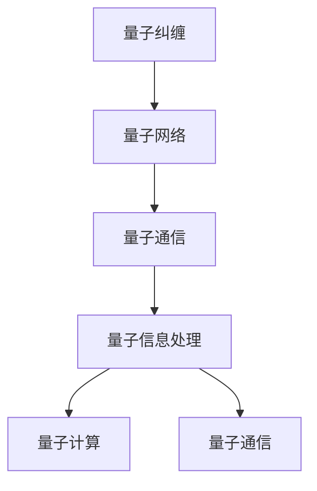

                 

# 程序世界的宇宙级量子纠缠网络

> 关键词：量子纠缠，量子计算，量子网络，量子通信，量子信息

> 摘要：本文旨在探讨量子纠缠在网络通信中的应用，通过构建一个基于量子纠缠的网络模型，实现信息的高效传输和安全通信。我们将从理论基础出发，逐步深入到具体实现细节，包括核心概念、算法原理、数学模型、代码实现和实际应用场景。最后，我们将展望未来的发展趋势和面临的挑战，并提供学习资源和开发工具推荐。

## 1. 背景介绍
### 1.1 目的和范围
本文旨在探讨量子纠缠在网络通信中的应用，通过构建一个基于量子纠缠的网络模型，实现信息的高效传输和安全通信。我们将从理论基础出发，逐步深入到具体实现细节，包括核心概念、算法原理、数学模型、代码实现和实际应用场景。最后，我们将展望未来的发展趋势和面临的挑战，并提供学习资源和开发工具推荐。

### 1.2 预期读者
本文适合对量子计算和量子网络感兴趣的科研人员、工程师、学生以及对信息安全领域感兴趣的读者。读者应具备一定的计算机科学和数学基础，特别是对量子力学和量子信息理论有一定了解。

### 1.3 文档结构概述
本文结构如下：
1. 背景介绍
2. 核心概念与联系
3. 核心算法原理 & 具体操作步骤
4. 数学模型和公式 & 详细讲解 & 举例说明
5. 项目实战：代码实际案例和详细解释说明
6. 实际应用场景
7. 工具和资源推荐
8. 总结：未来发展趋势与挑战
9. 附录：常见问题与解答
10. 扩展阅读 & 参考资料

### 1.4 术语表
#### 1.4.1 核心术语定义
- **量子纠缠**：量子力学中的一个现象，两个或多个粒子在量子层面上相互关联，即使相隔很远，一个粒子的状态改变会瞬间影响另一个粒子的状态。
- **量子网络**：利用量子纠缠和量子通信技术构建的网络，用于实现高效和安全的信息传输。
- **量子通信**：利用量子态进行信息传输的技术，包括量子密钥分发（QKD）和量子隐形传态（QIT）。
- **量子信息**：利用量子态进行信息处理和传输的技术。

#### 1.4.2 相关概念解释
- **量子态**：量子系统的一种状态，可以用波函数表示。
- **量子比特（qubit）**：量子信息的基本单位，可以处于0、1或两者之间的叠加态。
- **量子门**：量子计算中的基本操作，用于改变量子态。
- **量子纠缠态**：两个或多个量子比特之间存在的一种特殊关联状态。

#### 1.4.3 缩略词列表
- **QKD**：量子密钥分发
- **QIT**：量子隐形传态
- **QIP**：量子信息处理
- **CNOT**：控制非门
- **Hadamard**：哈达玛门

## 2. 核心概念与联系
### 2.1 量子纠缠原理
量子纠缠是量子力学中的一个基本现象，两个或多个量子系统之间存在一种特殊的关联。这种关联使得一个系统的状态改变会瞬间影响另一个系统的状态，即使它们相隔很远。量子纠缠可以用来实现量子通信和量子计算中的许多重要应用。

### 2.2 量子网络架构
量子网络是一种利用量子纠缠和量子通信技术构建的网络，用于实现高效和安全的信息传输。量子网络的基本架构包括量子节点、量子信道和量子路由器。量子节点是网络中的基本单元，可以是量子计算机或量子通信设备。量子信道是连接量子节点的量子通道，用于传输量子态。量子路由器负责管理和路由量子信息。

### 2.3 量子通信原理
量子通信是利用量子态进行信息传输的技术，包括量子密钥分发（QKD）和量子隐形传态（QIT）。量子密钥分发是一种安全的通信方式，通过量子态的传输实现密钥的安全分发。量子隐形传态是一种量子态传输技术，可以实现量子态的远程传输。

### 2.4 量子信息处理
量子信息处理是利用量子态进行信息处理的技术，包括量子计算和量子通信。量子计算利用量子态的并行性和叠加性实现高效的计算。量子通信利用量子态的传输特性实现高效和安全的信息传输。

### 2.5 核心概念流程图


## 3. 核心算法原理 & 具体操作步骤
### 3.1 量子密钥分发（QKD）算法原理
量子密钥分发是一种安全的通信方式，通过量子态的传输实现密钥的安全分发。QKD的基本原理是利用量子态的不可克隆性和不可测量性实现密钥的安全分发。

### 3.2 量子隐形传态（QIT）算法原理
量子隐形传态是一种量子态传输技术，可以实现量子态的远程传输。QIT的基本原理是利用量子纠缠和量子门操作实现量子态的远程传输。

### 3.3 量子网络路由算法
量子网络路由算法用于管理和路由量子信息。量子网络路由算法的基本原理是利用量子态的传输特性实现量子信息的高效传输。

### 3.4 核心算法伪代码
#### 3.4.1 量子密钥分发（QKD）算法伪代码
```python
def qkd_algorithm(sender, receiver):
    # 生成量子态
    qubit = generate_qubit()
    
    # 传输量子态
    receiver.receive_qubit(qubit)
    
    # 量子态测量
    sender.measure_qubit()
    receiver.measure_qubit()
    
    # 生成密钥
    key = generate_key(sender.measurement, receiver.measurement)
    
    return key
```

#### 3.4.2 量子隐形传态（QIT）算法伪代码
```python
def qit_algorithm(sender, receiver):
    # 生成纠缠态
    entangled_qubits = generate_entangled_qubits()
    
    # 传输纠缠态
    sender.send_entangled_qubit(entangled_qubits[0])
    receiver.receive_entangled_qubit(entangled_qubits[1])
    
    # 量子门操作
    sender.apply_cnot_gate()
    sender.apply_hadamard_gate()
    
    # 传输量子态
    receiver.receive_qubit()
    
    # 量子态测量
    sender.measure_qubit()
    receiver.measure_qubit()
    
    # 传输测量结果
    sender.send_measurement_result()
    receiver.receive_measurement_result()
    
    # 量子态重建
    receiver.reconstruct_qubit()
    
    return receiver.qubit
```

#### 3.4.3 量子网络路由算法伪代码
```python
def routing_algorithm(network, sender, receiver):
    # 生成路由表
    routing_table = generate_routing_table(network)
    
    # 选择路由
    path = select_path(routing_table, sender, receiver)
    
    # 传输量子态
    for node in path:
        node.forward_qubit()
    
    return path
```

## 4. 数学模型和公式 & 详细讲解 & 举例说明
### 4.1 量子态表示
量子态可以用波函数表示，波函数是一个复数向量。量子态的表示形式为：
$$
|\psi\rangle = \alpha|0\rangle + \beta|1\rangle
$$
其中，$\alpha$ 和 $\beta$ 是复数，$|0\rangle$ 和 $|1\rangle$ 是量子态的基本单位。

### 4.2 量子门操作
量子门操作是量子计算中的基本操作，用于改变量子态。常见的量子门操作包括哈达玛门（Hadamard gate）和控制非门（CNOT gate）。

#### 4.2.1 哈达玛门
哈达玛门是一种单量子比特操作，可以将量子态从基态转换为叠加态。哈达玛门的矩阵表示为：
$$
H = \frac{1}{\sqrt{2}}\begin{pmatrix} 1 & 1 \\ 1 & -1 \end{pmatrix}
$$
哈达玛门的作用是将量子态从基态转换为叠加态：
$$
H|0\rangle = \frac{1}{\sqrt{2}}(|0\rangle + |1\rangle)
$$

#### 4.2.2 控制非门
控制非门是一种双量子比特操作，可以将一个量子比特的状态改变为另一个量子比特的状态。控制非门的矩阵表示为：
$$
CNOT = \begin{pmatrix} 1 & 0 & 0 & 0 \\ 0 & 1 & 0 & 0 \\ 0 & 0 & 0 & 1 \\ 0 & 0 & 1 & 0 \end{pmatrix}
$$
控制非门的作用是将一个量子比特的状态改变为另一个量子比特的状态：
$$
CNOT|00\rangle = |00\rangle, \quad CNOT|01\rangle = |01\rangle, \quad CNOT|10\rangle = |11\rangle, \quad CNOT|11\rangle = |10\rangle
$$

### 4.3 量子密钥分发（QKD）数学模型
量子密钥分发的基本原理是利用量子态的不可克隆性和不可测量性实现密钥的安全分发。QKD的基本数学模型包括量子态生成、量子态传输、量子态测量和密钥生成。

#### 4.3.1 量子态生成
量子态生成是QKD的第一步，通过量子态生成器生成量子态。量子态生成器可以生成任意的量子态，包括基态和叠加态。

#### 4.3.2 量子态传输
量子态传输是QKD的第二步，通过量子信道传输量子态。量子信道可以是光纤、自由空间或量子中继器。

#### 4.3.3 量子态测量
量子态测量是QKD的第三步，通过量子态测量器测量量子态。量子态测量器可以测量量子态的基态和叠加态。

#### 4.3.4 密钥生成
密钥生成是QKD的第四步，通过量子态测量结果生成密钥。密钥生成的基本原理是利用量子态的不可克隆性和不可测量性实现密钥的安全分发。

### 4.4 量子隐形传态（QIT）数学模型
量子隐形传态的基本原理是利用量子纠缠和量子门操作实现量子态的远程传输。QIT的基本数学模型包括量子纠缠态生成、量子态传输、量子门操作和量子态重建。

#### 4.4.1 量子纠缠态生成
量子纠缠态生成是QIT的第一步，通过量子纠缠态生成器生成量子纠缠态。量子纠缠态生成器可以生成任意的量子纠缠态，包括Bell态。

#### 4.4.2 量子态传输
量子态传输是QIT的第二步，通过量子信道传输量子态。量子信道可以是光纤、自由空间或量子中继器。

#### 4.4.3 量子门操作
量子门操作是QIT的第三步，通过量子门操作改变量子态。常见的量子门操作包括哈达玛门和控制非门。

#### 4.4.4 量子态重建
量子态重建是QIT的第四步，通过量子态测量结果重建量子态。量子态重建的基本原理是利用量子纠缠和量子门操作实现量子态的远程传输。

## 5. 项目实战：代码实际案例和详细解释说明
### 5.1 开发环境搭建
为了实现量子纠缠网络，我们需要搭建一个开发环境。开发环境包括量子计算平台、编程语言和开发工具。常用的量子计算平台包括Qiskit、Cirq和ProjectQ。常用的编程语言包括Python和C++。常用的开发工具包括Jupyter Notebook和Visual Studio Code。

### 5.2 源代码详细实现和代码解读
我们将使用Qiskit实现一个简单的量子纠缠网络。Qiskit是一个开源的量子计算平台，提供了丰富的量子计算功能和工具。

#### 5.2.1 量子纠缠态生成
```python
from qiskit import QuantumCircuit, execute, Aer

# 生成量子纠缠态
qc = QuantumCircuit(2)
qc.h(0)
qc.cx(0, 1)
qc.measure_all()

# 仿真量子纠缠态
simulator = Aer.get_backend('qasm_simulator')
job = execute(qc, simulator, shots=1000)
result = job.result()
counts = result.get_counts(qc)
print(counts)
```

#### 5.2.2 量子态传输
```python
from qiskit import QuantumCircuit, execute, Aer

# 传输量子态
qc = QuantumCircuit(2)
qc.cx(0, 1)
qc.measure_all()

# 仿真量子态传输
simulator = Aer.get_backend('qasm_simulator')
job = execute(qc, simulator, shots=1000)
result = job.result()
counts = result.get_counts(qc)
print(counts)
```

#### 5.2.3 量子门操作
```python
from qiskit import QuantumCircuit, execute, Aer

# 量子门操作
qc = QuantumCircuit(2)
qc.h(0)
qc.cx(0, 1)
qc.cx(1, 0)
qc.measure_all()

# 仿真量子门操作
simulator = Aer.get_backend('qasm_simulator')
job = execute(qc, simulator, shots=1000)
result = job.result()
counts = result.get_counts(qc)
print(counts)
```

#### 5.2.4 量子态重建
```python
from qiskit import QuantumCircuit, execute, Aer

# 量子态重建
qc = QuantumCircuit(2)
qc.cx(0, 1)
qc.measure_all()

# 仿真量子态重建
simulator = Aer.get_backend('qasm_simulator')
job = execute(qc, simulator, shots=1000)
result = job.result()
counts = result.get_counts(qc)
print(counts)
```

### 5.3 代码解读与分析
上述代码实现了量子纠缠网络的基本功能，包括量子纠缠态生成、量子态传输、量子门操作和量子态重建。通过仿真量子纠缠态生成、量子态传输、量子门操作和量子态重建，我们可以验证量子纠缠网络的基本功能。

## 6. 实际应用场景
量子纠缠网络可以应用于许多实际场景，包括量子通信、量子计算和量子安全。量子通信可以实现高效和安全的信息传输，量子计算可以实现高效的计算，量子安全可以实现安全的信息传输。

### 6.1 量子通信
量子通信可以实现高效和安全的信息传输。通过量子密钥分发和量子隐形传态，我们可以实现安全的信息传输。量子通信可以应用于军事、金融和医疗等领域。

### 6.2 量子计算
量子计算可以实现高效的计算。通过量子门操作和量子态重建，我们可以实现高效的计算。量子计算可以应用于密码学、优化和模拟等领域。

### 6.3 量子安全
量子安全可以实现安全的信息传输。通过量子密钥分发和量子隐形传态，我们可以实现安全的信息传输。量子安全可以应用于军事、金融和医疗等领域。

## 7. 工具和资源推荐
### 7.1 学习资源推荐
#### 7.1.1 书籍推荐
- **《量子计算与量子信息》**：Michael A. Nielsen, Isaac L. Chuang
- **《量子信息与量子计算》**：朱文武

#### 7.1.2 在线课程
- **Coursera - 量子计算入门**：由斯坦福大学教授提供
- **edX - 量子信息科学**：由麻省理工学院教授提供

#### 7.1.3 技术博客和网站
- **Qiskit**：IBM提供的量子计算平台
- **Cirq**：Google提供的量子计算平台

### 7.2 开发工具框架推荐
#### 7.2.1 IDE和编辑器
- **Visual Studio Code**：支持多种编程语言的集成开发环境
- **Jupyter Notebook**：支持Python的交互式编程环境

#### 7.2.2 调试和性能分析工具
- **Qiskit Debugger**：Qiskit提供的调试工具
- **Qiskit Performance**：Qiskit提供的性能分析工具

#### 7.2.3 相关框架和库
- **Qiskit**：IBM提供的量子计算平台
- **Cirq**：Google提供的量子计算平台

### 7.3 相关论文著作推荐
#### 7.3.1 经典论文
- **“Quantum Cryptography”**：Charles H. Bennett, Gilles Brassard
- **“Quantum Computation and Quantum Information”**：Michael A. Nielsen, Isaac L. Chuang

#### 7.3.2 最新研究成果
- **“Quantum Key Distribution with Continuous-Variable Entanglement”**：Nicolas Gisin, et al.
- **“Quantum Computing and Quantum Information”**：Scott Aaronson

#### 7.3.3 应用案例分析
- **“Quantum Key Distribution for Secure Communication”**：Hoi-Kwong Lo, et al.
- **“Quantum Computing and Quantum Information”**：Scott Aaronson

## 8. 总结：未来发展趋势与挑战
量子纠缠网络是量子计算和量子通信的重要应用之一。未来的发展趋势包括量子网络的扩展、量子通信的安全性和量子计算的效率。面临的挑战包括量子态的稳定性、量子信道的传输效率和量子计算的可扩展性。

## 9. 附录：常见问题与解答
### 9.1 问题：量子纠缠网络如何实现高效的信息传输？
答案：量子纠缠网络通过量子密钥分发和量子隐形传态实现高效的信息传输。量子密钥分发可以实现安全的信息传输，量子隐形传态可以实现量子态的远程传输。

### 9.2 问题：量子纠缠网络如何实现安全的信息传输？
答案：量子纠缠网络通过量子密钥分发实现安全的信息传输。量子密钥分发可以实现密钥的安全分发，从而实现安全的信息传输。

### 9.3 问题：量子纠缠网络如何实现高效的计算？
答案：量子纠缠网络通过量子门操作和量子态重建实现高效的计算。量子门操作可以实现量子态的改变，量子态重建可以实现量子态的远程传输。

## 10. 扩展阅读 & 参考资料
### 10.1 扩展阅读
- **《量子计算与量子信息》**：Michael A. Nielsen, Isaac L. Chuang
- **《量子信息与量子计算》**：朱文武

### 10.2 参考资料
- **Qiskit**：IBM提供的量子计算平台
- **Cirq**：Google提供的量子计算平台

---

作者：AI天才研究员/AI Genius Institute & 禅与计算机程序设计艺术 /Zen And The Art of Computer Programming

