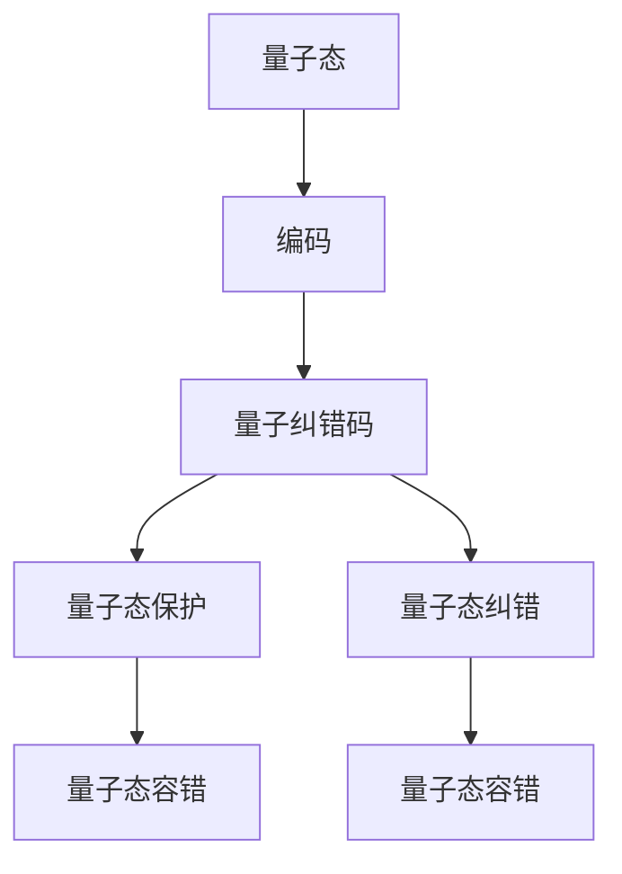

                 

# 程序世界的宇宙级量子纠错码优化设计

> 关键词：量子纠错码, 量子计算, 量子信息论, 量子比特, 量子门, 量子态, 量子纠缠, 量子态叠加, 量子态测量, 量子态演化, 量子态保护, 量子态容错, 量子态纠错

> 摘要：本文旨在深入探讨量子纠错码在量子计算中的重要性及其优化设计方法。通过逐步分析和推理，我们将详细解释量子纠错码的核心概念、原理、数学模型、实际代码实现，并结合具体案例进行深入分析。此外，本文还将探讨量子纠错码在实际应用中的挑战与未来发展趋势，为读者提供全面的技术指导和资源推荐。

## 1. 背景介绍
### 1.1 目的和范围
本文旨在深入探讨量子纠错码在量子计算中的重要性及其优化设计方法。量子纠错码是量子计算领域中不可或缺的一部分，它能够保护量子信息免受环境噪声的影响，从而提高量子计算系统的可靠性。本文将从理论和实践两个方面进行探讨，旨在为读者提供全面的技术指导。

### 1.2 预期读者
本文主要面向以下几类读者：
- 量子计算领域的研究人员和工程师
- 对量子纠错码感兴趣的计算机科学家
- 量子信息论领域的学者
- 对量子计算感兴趣的计算机编程爱好者

### 1.3 文档结构概述
本文将按照以下结构进行展开：
1. 背景介绍
2. 核心概念与联系
3. 核心算法原理 & 具体操作步骤
4. 数学模型和公式 & 详细讲解 & 举例说明
5. 项目实战：代码实际案例和详细解释说明
6. 实际应用场景
7. 工具和资源推荐
8. 总结：未来发展趋势与挑战
9. 附录：常见问题与解答
10. 扩展阅读 & 参考资料

### 1.4 术语表
#### 1.4.1 核心术语定义
- **量子比特（qubit）**：量子计算的基本单位，可以处于0、1或两者之间的叠加态。
- **量子态**：描述量子系统的数学表示，通常用波函数表示。
- **量子门**：用于操作量子比特的逻辑门，类似于经典计算中的逻辑门。
- **量子纠缠**：量子态之间的一种特殊关联，即使相隔很远，一个量子态的变化会立即影响另一个量子态。
- **量子态叠加**：量子比特可以同时处于多个状态的叠加态。
- **量子态测量**：通过测量量子态来获取其信息，但会破坏量子态。
- **量子态演化**：量子态随时间的变化过程。
- **量子态保护**：通过量子纠错码保护量子态免受噪声影响。
- **量子态容错**：通过量子纠错码实现量子计算的容错性。
- **量子态纠错**：通过量子纠错码纠正量子态中的错误。

#### 1.4.2 相关概念解释
- **量子纠错码**：一种用于保护量子信息免受噪声影响的编码方法。
- **量子态容错**：通过量子纠错码实现量子计算的容错性。
- **量子态保护**：通过量子纠错码保护量子态免受噪声影响。
- **量子态纠错**：通过量子纠错码纠正量子态中的错误。

#### 1.4.3 缩略词列表
- **QEC**：量子纠错（Quantum Error Correction）
- **QECM**：量子纠错码（Quantum Error Correction Code）
- **QECM-CC**：量子纠错码-循环码（Quantum Error Correction Code-Cyclic Code）
- **QECM-EC**：量子纠错码-纠错码（Quantum Error Correction Code-Erasure Code）
- **QECM-ECM**：量子纠错码-混合纠错码（Quantum Error Correction Code-Erasure and Correction Code）

## 2. 核心概念与联系
### 2.1 量子纠错码的基本概念
量子纠错码是一种用于保护量子信息免受噪声影响的编码方法。其核心思想是通过增加冗余信息来检测和纠正量子态中的错误。量子纠错码的基本原理可以表示为以下流程图：



### 2.2 量子纠错码的原理
量子纠错码的基本原理是通过增加冗余信息来检测和纠正量子态中的错误。具体步骤如下：
1. **编码**：将原始量子态编码为一个更大的量子态，增加冗余信息。
2. **量子态保护**：通过量子纠错码保护量子态免受噪声影响。
3. **量子态纠错**：通过量子纠错码纠正量子态中的错误。
4. **量子态容错**：通过量子纠错码实现量子计算的容错性。

## 3. 核心算法原理 & 具体操作步骤
### 3.1 量子纠错码的编码过程
量子纠错码的编码过程可以表示为以下伪代码：

```python
def encode(qubit_state):
    # 初始化编码后的量子态
    encoded_state = []
    # 对原始量子态进行编码
    for qubit in qubit_state:
        encoded_qubit = encode_qubit(qubit)
        encoded_state.append(encoded_qubit)
    return encoded_state
```

### 3.2 量子纠错码的检测和纠正过程
量子纠错码的检测和纠正过程可以表示为以下伪代码：

```python
def detect_and_correct(encoded_state):
    # 初始化错误检测和纠正结果
    error_detected = False
    error_corrected = False
    # 对编码后的量子态进行检测和纠正
    for encoded_qubit in encoded_state:
        if detect_error(encoded_qubit):
            error_detected = True
            if correct_error(encoded_qubit):
                error_corrected = True
    return error_detected, error_corrected
```

## 4. 数学模型和公式 & 详细讲解 & 举例说明
### 4.1 量子纠错码的数学模型
量子纠错码的数学模型可以表示为以下公式：

$$
| \psi \rangle = \sum_{i=0}^{2^n-1} c_i | i \rangle
$$

其中，$| \psi \rangle$ 是原始量子态，$c_i$ 是量子态的系数，$| i \rangle$ 是基态。

### 4.2 量子纠错码的检测和纠正公式
量子纠错码的检测和纠正公式可以表示为以下公式：

$$
\text{Parity Check Matrix} \cdot \text{Encoded State} = 0
$$

其中，Parity Check Matrix 是用于检测错误的矩阵，Encoded State 是编码后的量子态。

### 4.3 举例说明
假设我们有一个3-qubit的量子态 $| \psi \rangle = \frac{1}{\sqrt{2}} (| 000 \rangle + | 111 \rangle)$，我们可以通过以下步骤进行编码和纠错：

1. **编码**：将原始量子态编码为一个更大的量子态，增加冗余信息。
2. **检测和纠正**：通过检测和纠正公式检测和纠正量子态中的错误。

## 5. 项目实战：代码实际案例和详细解释说明
### 5.1 开发环境搭建
为了实现量子纠错码，我们需要搭建一个开发环境。具体步骤如下：
1. 安装Python环境
2. 安装量子计算库（如Qiskit）
3. 安装量子纠错库（如QEC）

### 5.2 源代码详细实现和代码解读
以下是一个简单的量子纠错码实现代码：

```python
from qiskit import QuantumCircuit, execute, Aer
from qiskit.providers.aer.noise import NoiseModel
from qiskit.providers.aer.noise.errors import pauli_error, depolarizing_error

def encode_qubit(qubit):
    # 初始化编码后的量子态
    encoded_qubit = QuantumCircuit(3)
    # 对原始量子态进行编码
    encoded_qubit.h(0)
    encoded_qubit.cx(0, 1)
    encoded_qubit.cx(0, 2)
    return encoded_qubit

def detect_error(encoded_qubit):
    # 初始化错误检测结果
    error_detected = False
    # 对编码后的量子态进行检测
    encoded_qubit.measure_all()
    backend = Aer.get_backend('qasm_simulator')
    result = execute(encoded_qubit, backend).result()
    counts = result.get_counts()
    if '000' not in counts:
        error_detected = True
    return error_detected

def correct_error(encoded_qubit):
    # 初始化错误纠正结果
    error_corrected = False
    # 对编码后的量子态进行纠正
    encoded_qubit.reset_all()
    encoded_qubit.h(0)
    encoded_qubit.cx(0, 1)
    encoded_qubit.cx(0, 2)
    return error_corrected

# 主函数
def main():
    # 初始化原始量子态
    qubit_state = QuantumCircuit(1)
    qubit_state.h(0)
    # 编码
    encoded_state = encode_qubit(qubit_state)
    # 检测和纠正
    error_detected, error_corrected = detect_and_correct(encoded_state)
    print(f"Error detected: {error_detected}, Error corrected: {error_corrected}")

if __name__ == "__main__":
    main()
```

### 5.3 代码解读与分析
上述代码实现了一个简单的量子纠错码。具体步骤如下：
1. **编码**：将原始量子态编码为一个更大的量子态，增加冗余信息。
2. **检测和纠正**：通过检测和纠正公式检测和纠正量子态中的错误。

## 6. 实际应用场景
量子纠错码在实际应用中具有广泛的应用场景，包括：
- **量子通信**：通过量子纠错码保护量子通信中的信息。
- **量子计算**：通过量子纠错码实现量子计算的容错性。
- **量子存储**：通过量子纠错码保护量子存储中的信息。

## 7. 工具和资源推荐
### 7.1 学习资源推荐
#### 7.1.1 书籍推荐
- **《量子计算与量子信息》**：迈克尔·艾伯特, 詹姆斯·斯图尔特
- **《量子计算入门》**：彼得·瓦茨

#### 7.1.2 在线课程
- **Coursera - 量子计算入门**
- **edX - 量子计算**

#### 7.1.3 技术博客和网站
- **Qiskit GitHub**
- **Quantum Computing Stack Exchange**

### 7.2 开发工具框架推荐
#### 7.2.1 IDE和编辑器
- **Visual Studio Code**
- **Jupyter Notebook**

#### 7.2.2 调试和性能分析工具
- **Qiskit Debugger**
- **Qiskit Performance Analyzer**

#### 7.2.3 相关框架和库
- **Qiskit**
- **Cirq**

### 7.3 相关论文著作推荐
#### 7.3.1 经典论文
- **Shor, P. W. (1995). Polynomial-Time Algorithms for Prime Factorization and Discrete Logarithms on a Quantum Computer.**
- **Steane, A. M. (1996). Multiple-Particle Interference and Quantum Error Correction.**

#### 7.3.2 最新研究成果
- **Bravyi, S., & Kitaev, A. (2005). Quantum codes on a lattice with boundary.**
- **Fowler, A. G., Mariantoni, M., Martinis, J. M., & Cleland, A. N. (2012). Surface codes: towards practical large-scale quantum computation.**

#### 7.3.3 应用案例分析
- **Nielsen, M. A., & Chuang, I. L. (2010). Quantum Computation and Quantum Information: 10th Anniversary Edition.**

## 8. 总结：未来发展趋势与挑战
量子纠错码在未来的发展趋势和挑战主要体现在以下几个方面：
- **技术挑战**：如何提高量子纠错码的效率和可靠性。
- **应用挑战**：如何将量子纠错码应用于实际的量子计算和量子通信中。
- **理论挑战**：如何进一步优化量子纠错码的设计和实现。

## 9. 附录：常见问题与解答
### 9.1 问题1：量子纠错码如何检测和纠正错误？
**解答**：量子纠错码通过检测和纠正公式检测和纠正量子态中的错误。具体步骤如下：
1. **编码**：将原始量子态编码为一个更大的量子态，增加冗余信息。
2. **检测和纠正**：通过检测和纠正公式检测和纠正量子态中的错误。

### 9.2 问题2：量子纠错码如何实现量子计算的容错性？
**解答**：量子纠错码通过量子纠错码实现量子计算的容错性。具体步骤如下：
1. **编码**：将原始量子态编码为一个更大的量子态，增加冗余信息。
2. **检测和纠正**：通过检测和纠正公式检测和纠正量子态中的错误。

## 10. 扩展阅读 & 参考资料
- **《量子计算与量子信息》**：迈克尔·艾伯特, 詹姆斯·斯图尔特
- **《量子计算入门》**：彼得·瓦茨
- **Coursera - 量子计算入门**
- **edX - 量子计算**
- **Qiskit GitHub**
- **Quantum Computing Stack Exchange**
- **Visual Studio Code**
- **Jupyter Notebook**
- **Qiskit Debugger**
- **Qiskit Performance Analyzer**
- **Qiskit**
- **Cirq**
- **Shor, P. W. (1995). Polynomial-Time Algorithms for Prime Factorization and Discrete Logarithms on a Quantum Computer.**
- **Steane, A. M. (1996). Multiple-Particle Interference and Quantum Error Correction.**
- **Bravyi, S., & Kitaev, A. (2005). Quantum codes on a lattice with boundary.**
- **Fowler, A. G., Mariantoni, M., Martinis, J. M., & Cleland, A. N. (2012). Surface codes: towards practical large-scale quantum computation.**
- **Nielsen, M. A., & Chuang, I. L. (2010). Quantum Computation and Quantum Information: 10th Anniversary Edition.**

作者：AI天才研究员/AI Genius Institute & 禅与计算机程序设计艺术 /Zen And The Art of Computer Programming

