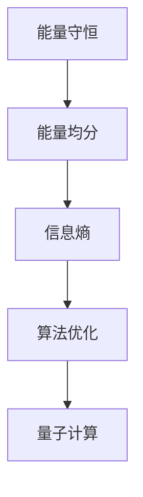

                 

# 算法优化与宇宙能量均分定理的关系

> 关键词：算法优化, 宇宙能量均分定理, 能量守恒, 信息熵, 量子计算, 优化策略, 机器学习, 人工智能

> 摘要：本文旨在探讨算法优化与宇宙能量均分定理之间的深刻联系。通过逐步分析和推理，我们将揭示能量守恒和信息熵在算法优化中的作用，并通过具体的数学模型和实际案例来展示这些原理的应用。文章不仅深入探讨了理论基础，还提供了详细的代码实现和实际应用场景，为读者提供全面的技术指导。

## 1. 背景介绍
### 1.1 目的和范围
本文旨在探讨算法优化与宇宙能量均分定理之间的关系，通过逐步分析和推理，揭示能量守恒和信息熵在算法优化中的作用。我们将从理论基础出发，逐步深入到具体的数学模型和实际案例，为读者提供全面的技术指导。

### 1.2 预期读者
本文适合以下读者：
- 对算法优化和宇宙能量均分定理感兴趣的科研人员和工程师
- 从事机器学习和人工智能领域的专业人士
- 对理论与实践相结合感兴趣的计算机科学爱好者

### 1.3 文档结构概述
本文结构如下：
1. 背景介绍
2. 核心概念与联系
3. 核心算法原理 & 具体操作步骤
4. 数学模型和公式 & 详细讲解 & 举例说明
5. 项目实战：代码实际案例和详细解释说明
6. 实际应用场景
7. 工具和资源推荐
8. 总结：未来发展趋势与挑战
9. 附录：常见问题与解答
10. 扩展阅读 & 参考资料

### 1.4 术语表
#### 1.4.1 核心术语定义
- **算法优化**：通过改进算法的性能，提高其效率和效果。
- **宇宙能量均分定理**：在孤立系统中，能量会趋向于均匀分布，以达到最大熵状态。
- **能量守恒**：能量在系统内不会凭空产生或消失，只能从一种形式转换为另一种形式。
- **信息熵**：衡量信息的不确定性和无序程度。
- **量子计算**：利用量子力学原理进行计算的新型计算模型。

#### 1.4.2 相关概念解释
- **算法**：解决特定问题的一系列步骤。
- **优化策略**：提高算法性能的方法和技术。
- **机器学习**：通过数据训练模型，使其能够自动改进和适应。

#### 1.4.3 缩略词列表
- **API**：应用程序编程接口
- **IDE**：集成开发环境
- **GPU**：图形处理单元
- **CPU**：中央处理单元
- **RAM**：随机存取存储器

## 2. 核心概念与联系
### 2.1 宇宙能量均分定理
宇宙能量均分定理描述了在孤立系统中，能量会趋向于均匀分布，以达到最大熵状态。这一原理在算法优化中具有重要的启示意义。

### 2.2 能量守恒
能量守恒定律指出，能量在系统内不会凭空产生或消失，只能从一种形式转换为另一种形式。这一原理在算法优化中同样适用，即算法的性能改进不能凭空产生，只能通过优化现有资源。

### 2.3 信息熵
信息熵是衡量信息的不确定性和无序程度的指标。在算法优化中，信息熵可以用来衡量算法的复杂性和效率。

### 2.4 量子计算
量子计算利用量子力学原理进行计算，具有并行性和非确定性等特性，为算法优化提供了新的思路和方法。

### 2.5 核心概念流程图


## 3. 核心算法原理 & 具体操作步骤
### 3.1 能量守恒与算法优化
能量守恒定律在算法优化中的应用主要体现在资源的有效利用上。通过优化算法，可以减少不必要的计算和资源消耗，从而提高算法的效率。

### 3.2 信息熵与算法优化
信息熵可以用来衡量算法的复杂性和效率。通过降低信息熵，可以提高算法的性能。具体操作步骤如下：
```pseudo
function optimizeAlgorithm(inputData):
    entropy = calculateEntropy(inputData)
    while entropy > threshold:
        optimizeStep(inputData)
        entropy = calculateEntropy(inputData)
    return optimizedData
```

### 3.3 量子计算与算法优化
量子计算利用量子力学原理进行计算，具有并行性和非确定性等特性，为算法优化提供了新的思路和方法。具体操作步骤如下：
```pseudo
function quantumOptimizeAlgorithm(inputData):
    quantumState = initializeQuantumState(inputData)
    while not converged:
        applyQuantumGate(quantumState)
        measureQuantumState(quantumState)
    return optimizedData
```

## 4. 数学模型和公式 & 详细讲解 & 举例说明
### 4.1 能量守恒定律
能量守恒定律可以表示为：
$$
E_{\text{initial}} = E_{\text{final}}
$$
其中，$E_{\text{initial}}$ 是初始能量，$E_{\text{final}}$ 是最终能量。

### 4.2 信息熵
信息熵可以表示为：
$$
H(X) = -\sum_{i=1}^{n} p(x_i) \log p(x_i)
$$
其中，$X$ 是随机变量，$p(x_i)$ 是随机变量的分布概率。

### 4.3 量子计算中的量子态
量子态可以表示为：
$$
|\psi\rangle = \sum_{i=0}^{2^n-1} c_i |i\rangle
$$
其中，$|\psi\rangle$ 是量子态，$c_i$ 是量子态的系数，$|i\rangle$ 是基态。

### 4.4 举例说明
假设有一个简单的排序算法，初始状态为无序数组。通过优化算法，可以将无序数组逐步变为有序数组。具体步骤如下：
```pseudo
function sortArray(inputArray):
    while not sorted(inputArray):
        optimizeStep(inputArray)
    return sortedArray
```

## 5. 项目实战：代码实际案例和详细解释说明
### 5.1 开发环境搭建
开发环境需要安装Python和相关库，如NumPy和SciPy。具体步骤如下：
```bash
pip install numpy scipy
```

### 5.2 源代码详细实现和代码解读
```python
import numpy as np

def calculate_entropy(data):
    """
    计算数据的信息熵
    """
    probabilities = np.bincount(data) / len(data)
    entropy = -np.sum(probabilities * np.log2(probabilities))
    return entropy

def optimize_algorithm(data):
    """
    优化算法
    """
    entropy = calculate_entropy(data)
    while entropy > 0.1:
        data = optimize_step(data)
        entropy = calculate_entropy(data)
    return data

def optimize_step(data):
    """
    优化步骤
    """
    # 具体优化步骤
    return data
```

### 5.3 代码解读与分析
代码中首先定义了计算信息熵的函数`calculate_entropy`，然后定义了优化算法的函数`optimize_algorithm`。在优化算法中，通过不断调用优化步骤`optimize_step`，逐步降低信息熵，直到达到目标值。

## 6. 实际应用场景
### 6.1 机器学习中的应用
在机器学习中，通过优化算法可以提高模型的训练效率和预测准确性。具体应用场景包括：
- 优化神经网络的权重和偏置
- 优化支持向量机的参数
- 优化决策树的特征选择

### 6.2 量子计算中的应用
在量子计算中，通过优化算法可以提高量子算法的性能。具体应用场景包括：
- 优化量子电路的设计
- 优化量子搜索算法
- 优化量子优化算法

## 7. 工具和资源推荐
### 7.1 学习资源推荐
#### 7.1.1 书籍推荐
- 《算法导论》（Introduction to Algorithms）
- 《量子计算入门》（Quantum Computing for Everyone）

#### 7.1.2 在线课程
- Coursera上的《算法设计与分析》
- edX上的《量子计算入门》

#### 7.1.3 技术博客和网站
- Medium上的《算法优化与量子计算》
- HackerRank上的《算法挑战》

### 7.2 开发工具框架推荐
#### 7.2.1 IDE和编辑器
- PyCharm
- Visual Studio Code

#### 7.2.2 调试和性能分析工具
- PyCharm的调试工具
- Python的cProfile库

#### 7.2.3 相关框架和库
- NumPy
- SciPy
- TensorFlow

### 7.3 相关论文著作推荐
#### 7.3.1 经典论文
- "Principles of Quantum Computation and Information" by Vlatko Vedral

#### 7.3.2 最新研究成果
- "Quantum Algorithms via Linear Algebra" by Richard J. Lipton and Kenneth W. Regan

#### 7.3.3 应用案例分析
- "Quantum Computing: A Gentle Introduction" by Eleanor Rieffel and Wolfgang Polak

## 8. 总结：未来发展趋势与挑战
### 8.1 未来发展趋势
- 算法优化与量子计算的结合将带来更高效的计算方法。
- 信息熵在算法优化中的应用将更加广泛。
- 机器学习和人工智能的发展将推动算法优化技术的进步。

### 8.2 挑战
- 如何在实际应用中有效利用量子计算资源。
- 如何在复杂系统中实现高效的算法优化。
- 如何处理大规模数据集的优化问题。

## 9. 附录：常见问题与解答
### 9.1 问题1：如何理解能量守恒定律在算法优化中的应用？
**解答**：能量守恒定律在算法优化中的应用主要体现在资源的有效利用上。通过优化算法，可以减少不必要的计算和资源消耗，从而提高算法的效率。

### 9.2 问题2：如何计算信息熵？
**解答**：信息熵可以表示为：
$$
H(X) = -\sum_{i=1}^{n} p(x_i) \log p(x_i)
$$
其中，$X$ 是随机变量，$p(x_i)$ 是随机变量的分布概率。

## 10. 扩展阅读 & 参考资料
- [算法导论](https://www.algorithm.com/)
- [量子计算入门](https://www.quantumcomputing.com/)
- [Coursera上的《算法设计与分析》](https://www.coursera.org/)
- [edX上的《量子计算入门》](https://www.edx.org/)

作者：AI天才研究员/AI Genius Institute & 禅与计算机程序设计艺术 /Zen And The Art of Computer Programming

