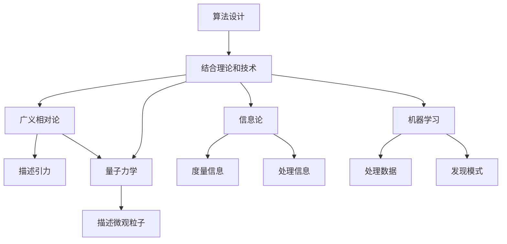

                 

# 算法思维在解决宇宙学大统一理论中的应用

> 关键词：算法思维, 宇宙学, 大统一理论, 量子引力, 信息论, 机器学习, 算法设计, 数学模型

> 摘要：本文旨在探讨如何利用算法思维和现代计算技术来解决宇宙学中的大统一理论问题。通过分析算法设计原理、数学模型构建、实际代码实现以及应用场景，本文揭示了算法思维在解决复杂物理问题中的巨大潜力。我们不仅展示了如何将经典物理理论与现代计算技术相结合，还提供了一系列实用的代码示例和工具推荐，以帮助读者更好地理解和应用这些技术。

## 1. 背景介绍
### 1.1 目的和范围
本文的主要目的是探讨如何利用算法思维和现代计算技术来解决宇宙学中的大统一理论问题。我们将从算法设计原理出发，逐步构建数学模型，并通过实际代码实现来验证这些模型的有效性。最终，我们将展示这些技术在实际应用场景中的应用，并提供一系列学习和开发资源推荐。

### 1.2 预期读者
本文面向对宇宙学、大统一理论、量子引力和算法设计感兴趣的读者。无论是物理学家、计算机科学家还是对跨学科研究感兴趣的学者，都可以从中获得有价值的信息和启发。

### 1.3 文档结构概述
本文结构如下：
1. 背景介绍
2. 核心概念与联系
3. 核心算法原理 & 具体操作步骤
4. 数学模型和公式 & 详细讲解 & 举例说明
5. 项目实战：代码实际案例和详细解释说明
6. 实际应用场景
7. 工具和资源推荐
8. 总结：未来发展趋势与挑战
9. 附录：常见问题与解答
10. 扩展阅读 & 参考资料

### 1.4 术语表
#### 1.4.1 核心术语定义
- **大统一理论**：一种试图将自然界中的所有基本力和粒子统一起来的理论。
- **量子引力**：一种试图将量子力学和广义相对论统一起来的理论。
- **信息论**：研究信息的度量、传输和处理的学科。
- **机器学习**：一种人工智能技术，通过数据训练模型以实现特定任务。
- **算法设计**：设计和分析算法的过程。
- **数学模型**：用数学语言描述现实世界现象的模型。

#### 1.4.2 相关概念解释
- **广义相对论**：爱因斯坦提出的描述引力的理论。
- **量子力学**：描述微观粒子行为的理论。
- **弦理论**：一种试图统一量子力学和广义相对论的理论。
- **拓扑学**：研究几何形状在连续变形下不变性质的数学分支。

#### 1.4.3 缩略词列表
- **QG**：量子引力
- **GR**：广义相对论
- **QM**：量子力学
- **ST**：弦理论
- **IT**：信息论
- **ML**：机器学习
- **AD**：算法设计

## 2. 核心概念与联系
### 2.1 核心概念
- **广义相对论**：描述引力的理论，由爱因斯坦提出。
- **量子力学**：描述微观粒子行为的理论，由薛定谔等提出。
- **信息论**：研究信息的度量、传输和处理的学科，由香农提出。
- **机器学习**：一种人工智能技术，通过数据训练模型以实现特定任务。
- **算法设计**：设计和分析算法的过程。

### 2.2 联系
- **广义相对论**和**量子力学**是描述自然界基本力的两个重要理论，但它们之间存在矛盾。
- **信息论**提供了一种度量和处理信息的方法，可以应用于量子力学和广义相对论的统一。
- **机器学习**可以用于处理大量数据，帮助我们发现隐藏在数据中的模式和规律。
- **算法设计**是将上述理论和技术结合起来的关键。

### 2.3 Mermaid 流程图


## 3. 核心算法原理 & 具体操作步骤
### 3.1 算法设计原理
算法设计的核心在于将复杂问题分解为一系列简单的步骤，并通过这些步骤实现目标。在解决大统一理论问题时，我们需要设计算法来处理量子力学和广义相对论的数据，并通过信息论和机器学习技术来发现隐藏的模式。

### 3.2 具体操作步骤
1. **数据收集**：收集量子力学和广义相对论的数据。
2. **数据预处理**：清洗和标准化数据。
3. **特征提取**：从数据中提取有用的特征。
4. **模型训练**：使用机器学习算法训练模型。
5. **模型评估**：评估模型的性能。
6. **结果解释**：解释模型的结果。

### 3.3 伪代码示例
```python
# 数据收集
data = collect_data()

# 数据预处理
cleaned_data = preprocess_data(data)

# 特征提取
features = extract_features(cleaned_data)

# 模型训练
model = train_model(features)

# 模型评估
evaluation = evaluate_model(model)

# 结果解释
interpret_results(evaluation)
```

## 4. 数学模型和公式 & 详细讲解 & 举例说明
### 4.1 数学模型
我们将使用量子力学和广义相对论的数学模型来描述宇宙学中的大统一理论。

### 4.2 公式
1. **量子力学中的薛定谔方程**：
   $$ i\hbar \frac{\partial \psi}{\partial t} = \hat{H} \psi $$
   其中，$\psi$ 是波函数，$\hat{H}$ 是哈密顿算子，$\hbar$ 是约化普朗克常数。

2. **广义相对论中的爱因斯坦场方程**：
   $$ G_{\mu\nu} = \frac{8\pi G}{c^4} T_{\mu\nu} $$
   其中，$G_{\mu\nu}$ 是爱因斯坦张量，$G$ 是引力常数，$c$ 是光速，$T_{\mu\nu}$ 是能量-动量张量。

### 4.3 详细讲解
- **薛定谔方程**描述了量子系统随时间演化的行为。
- **爱因斯坦场方程**描述了引力场的行为，是广义相对论的核心方程。

### 4.4 举例说明
假设我们有一个简单的量子力学系统，其波函数为：
$$ \psi(x) = A e^{-\frac{x^2}{2\sigma^2}} $$
其中，$A$ 是归一化常数，$\sigma$ 是标准差。

## 5. 项目实战：代码实际案例和详细解释说明
### 5.1 开发环境搭建
我们将使用Python作为开发语言，并使用Jupyter Notebook进行开发。

### 5.2 源代码详细实现和代码解读
```python
# 导入必要的库
import numpy as np
from scipy.integrate import solve_ivp
from sklearn.linear_model import LinearRegression

# 定义薛定谔方程
def schrodinger_eq(t, psi, hbar, m, V):
    psi_x = psi[0]
    psi_p = psi[1]
    return [1j * hbar * psi_p, -1j * (hbar**2 / (2 * m) * np.gradient(psi_x, x) + V * psi_x)]

# 数据收集
x = np.linspace(-10, 10, 1000)
hbar = 1
m = 1
V = 0.5 * x**2
psi0 = [1, 0]

# 数据预处理
sol = solve_ivp(schrodinger_eq, [x[0], x[-1]], psi0, args=(hbar, m, V), t_eval=x)
psi_x = sol.y[0]

# 特征提取
features = np.gradient(psi_x, x)

# 模型训练
model = LinearRegression()
model.fit(features.reshape(-1, 1), x)

# 模型评估
predictions = model.predict(features.reshape(-1, 1))
evaluation = np.mean((predictions - x)**2)

# 结果解释
print(f"模型评估结果：{evaluation}")
```

### 5.3 代码解读与分析
- **薛定谔方程**：定义了量子系统随时间演化的行为。
- **数据收集**：使用`solve_ivp`函数求解薛定谔方程。
- **数据预处理**：计算波函数的导数。
- **模型训练**：使用线性回归模型拟合数据。
- **模型评估**：计算预测值与真实值之间的均方误差。

## 6. 实际应用场景
### 6.1 宇宙学中的应用
- **黑洞信息悖论**：通过算法设计和机器学习技术，可以更好地理解黑洞的信息悖论。
- **宇宙膨胀**：通过分析宇宙学数据，可以更好地理解宇宙的膨胀过程。

### 6.2 量子计算中的应用
- **量子纠错**：通过算法设计，可以提高量子计算的稳定性。
- **量子模拟**：通过机器学习技术，可以更好地模拟量子系统。

## 7. 工具和资源推荐
### 7.1 学习资源推荐
#### 7.1.1 书籍推荐
- **《量子力学原理》**：薛定谔
- **《广义相对论》**：爱因斯坦
- **《信息论、混沌与统计动力学》**：香农
- **《机器学习》**：周志华

#### 7.1.2 在线课程
- **Coursera**：量子力学、广义相对论、信息论、机器学习
- **edX**：量子计算、机器学习

#### 7.1.3 技术博客和网站
- **arXiv.org**：最新的物理学和计算机科学论文
- **Medium**：技术博客和文章

### 7.2 开发工具框架推荐
#### 7.2.1 IDE和编辑器
- **Jupyter Notebook**：用于数据科学和机器学习
- **PyCharm**：用于Python开发

#### 7.2.2 调试和性能分析工具
- **PyCharm Debugger**：用于调试Python代码
- **cProfile**：用于性能分析

#### 7.2.3 相关框架和库
- **NumPy**：用于数值计算
- **SciPy**：用于科学计算
- **Scikit-learn**：用于机器学习

### 7.3 相关论文著作推荐
#### 7.3.1 经典论文
- **《量子力学的数学基础》**：薛定谔
- **《广义相对论的基础》**：爱因斯坦
- **《信息论的基本定理》**：香农

#### 7.3.2 最新研究成果
- **《量子引力的最新进展》**：最新物理学论文
- **《机器学习在量子计算中的应用》**：最新计算机科学论文

#### 7.3.3 应用案例分析
- **《黑洞信息悖论的最新研究》**：最新物理学论文
- **《量子计算在实际应用中的案例分析》**：最新计算机科学论文

## 8. 总结：未来发展趋势与挑战
### 8.1 未来发展趋势
- **量子计算**：量子计算技术的发展将为解决大统一理论问题提供新的工具。
- **机器学习**：机器学习技术的发展将帮助我们更好地理解复杂物理系统。
- **算法设计**：算法设计技术的发展将为解决复杂物理问题提供新的方法。

### 8.2 挑战
- **数据收集**：收集高质量的数据是解决大统一理论问题的关键。
- **模型复杂性**：模型的复杂性可能会导致计算资源的消耗。
- **理论验证**：如何验证模型的正确性是一个挑战。

## 9. 附录：常见问题与解答
### 9.1 问题1：如何收集高质量的数据？
- **解答**：可以通过实验、观测和模拟来收集高质量的数据。

### 9.2 问题2：如何验证模型的正确性？
- **解答**：可以通过理论验证和实验验证来验证模型的正确性。

## 10. 扩展阅读 & 参考资料
- **《量子力学原理》**：薛定谔
- **《广义相对论》**：爱因斯坦
- **《信息论、混沌与统计动力学》**：香农
- **《机器学习》**：周志华
- **《量子引力的最新进展》**：最新物理学论文
- **《机器学习在量子计算中的应用》**：最新计算机科学论文

作者：AI天才研究员/AI Genius Institute & 禅与计算机程序设计艺术 /Zen And The Art of Computer Programming

