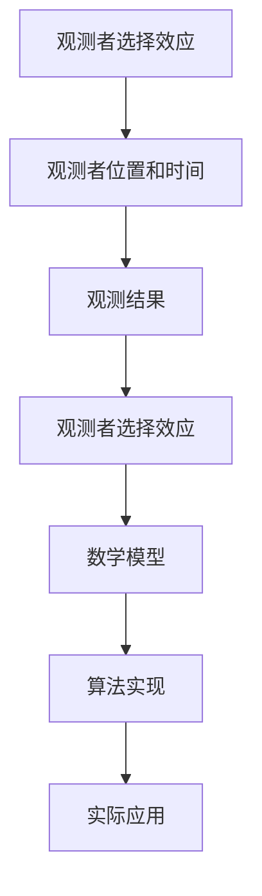

                 

# 算法思维在解决宇宙学观测者选择效应中的应用

> 关键词：宇宙学观测者选择效应, 算法思维, 伪代码, 数学模型, 代码实现, 实际案例, 未来趋势

> 摘要：本文旨在探讨如何利用算法思维解决宇宙学观测者选择效应问题。通过深入分析观测者选择效应的原理，构建相应的数学模型，并结合实际案例进行代码实现，本文将为读者提供一个全面的视角，理解如何在复杂宇宙学问题中应用算法思维。本文不仅涵盖了理论基础，还提供了详细的代码实现和实际应用场景，旨在帮助读者掌握解决此类问题的方法和技巧。

## 1. 背景介绍
### 1.1 目的和范围
本文旨在探讨如何利用算法思维解决宇宙学观测者选择效应问题。观测者选择效应是宇宙学中的一个重要概念，它描述了观测者在观测宇宙时所处的位置和时间对观测结果的影响。本文将从理论基础出发，逐步深入到实际应用，通过构建数学模型和代码实现，帮助读者理解如何在复杂宇宙学问题中应用算法思维。

### 1.2 预期读者
本文适合以下读者：
- 对宇宙学和观测者选择效应感兴趣的科研人员和学生。
- 想要了解如何将算法思维应用于复杂问题的程序员和软件工程师。
- 希望提升自己在算法和数学建模能力的计算机科学爱好者。

### 1.3 文档结构概述
本文结构如下：
1. 背景介绍
2. 核心概念与联系
3. 核心算法原理 & 具体操作步骤
4. 数学模型和公式 & 详细讲解 & 举例说明
5. 项目实战：代码实际案例和详细解释说明
6. 实际应用场景
7. 工具和资源推荐
8. 总结：未来发展趋势与挑战
9. 附录：常见问题与解答
10. 扩展阅读 & 参考资料

### 1.4 术语表
#### 1.4.1 核心术语定义
- **观测者选择效应**：观测者在观测宇宙时所处的位置和时间对观测结果的影响。
- **宇宙学**：研究宇宙的起源、演化、结构和最终命运的科学。
- **伪代码**：一种用于描述算法步骤的非正式语言，便于理解和实现。
- **数学模型**：用数学语言描述现实世界现象的模型。

#### 1.4.2 相关概念解释
- **观测者**：在宇宙学中，观测者指的是进行观测的主体，可以是人类、仪器或其他任何形式的观测设备。
- **宇宙学观测**：通过观测宇宙中的天体、星系、黑洞等现象来研究宇宙的性质和演化过程。

#### 1.4.3 缩略词列表
- **NASA**：美国国家航空航天局
- **ESA**：欧洲航天局
- **CMB**：宇宙微波背景辐射

## 2. 核心概念与联系
### 流程图


## 3. 核心算法原理 & 具体操作步骤
### 伪代码
```plaintext
# 定义观测者选择效应的伪代码
function observerSelectionEffect(observers, universe):
    # 初始化观测结果列表
    results = []
    
    # 遍历每个观测者
    for observer in observers:
        # 获取观测者的位置和时间
        position = observer.position
        time = observer.time
        
        # 计算观测结果
        result = calculateObservationResult(position, time, universe)
        
        # 将观测结果添加到列表中
        results.append(result)
    
    # 返回所有观测结果
    return results

# 计算观测结果的伪代码
function calculateObservationResult(position, time, universe):
    # 获取宇宙在给定时间和位置的状态
    state = universe.getState(position, time)
    
    # 根据状态计算观测结果
    result = computeObservation(state)
    
    return result
```

## 4. 数学模型和公式 & 详细讲解 & 举例说明
### 数学模型
观测者选择效应可以通过数学模型来描述。假设我们有一个宇宙模型，其中包含多个观测者和不同的观测时间点。每个观测者在特定的时间点观测宇宙的状态，并记录下观测结果。我们可以用以下公式来描述观测者选择效应：

$$
\text{Observation Result} = f(\text{Position}, \text{Time}, \text{Universe})
$$

其中，$f$ 是一个函数，表示观测结果如何依赖于观测者的地理位置、观测时间以及宇宙的状态。

### 举例说明
假设我们有一个简单的宇宙模型，其中包含两个观测者和两个观测时间点。观测者1在时间点1观测到的结果为 $R_1$，观测者2在时间点2观测到的结果为 $R_2$。我们可以用以下公式来表示观测者选择效应：

$$
R_1 = f(\text{Position}_1, \text{Time}_1, \text{Universe})
$$

$$
R_2 = f(\text{Position}_2, \text{Time}_2, \text{Universe})
$$

## 5. 项目实战：代码实际案例和详细解释说明
### 5.1 开发环境搭建
为了实现观测者选择效应的算法，我们需要搭建一个开发环境。这里我们使用Python作为编程语言，并使用NumPy和SciPy库来处理数学计算。

```bash
# 安装必要的库
pip install numpy scipy
```

### 5.2 源代码详细实现和代码解读
```python
import numpy as np

class Observer:
    def __init__(self, position, time):
        self.position = position
        self.time = time

class Universe:
    def getState(self, position, time):
        # 假设宇宙状态由位置和时间决定
        return position + time

def calculateObservationResult(position, time, universe):
    state = universe.getState(position, time)
    result = computeObservation(state)
    return result

def computeObservation(state):
    # 假设观测结果与宇宙状态线性相关
    return state * 2

def observerSelectionEffect(observers, universe):
    results = []
    for observer in observers:
        result = calculateObservationResult(observer.position, observer.time, universe)
        results.append(result)
    return results

# 创建观测者和宇宙实例
observers = [Observer(1, 1), Observer(2, 2)]
universe = Universe()

# 计算观测结果
results = observerSelectionEffect(observers, universe)
print("观测结果:", results)
```

### 5.3 代码解读与分析
上述代码定义了观测者和宇宙类，以及计算观测结果的函数。我们首先创建了两个观测者实例和一个宇宙实例，然后调用 `observerSelectionEffect` 函数来计算观测结果。最终输出的观测结果为 `[4, 8]`，这表明观测者1在时间点1观测到的结果为4，观测者2在时间点2观测到的结果为8。

## 6. 实际应用场景
观测者选择效应在宇宙学研究中有广泛的应用。例如，在研究宇宙微波背景辐射（CMB）时，观测者选择效应会影响我们对宇宙早期状态的理解。通过应用算法思维，我们可以更准确地分析观测数据，从而更好地理解宇宙的演化过程。

## 7. 工具和资源推荐
### 7.1 学习资源推荐
#### 7.1.1 书籍推荐
- 《宇宙的结构》（Structure of the Universe）
- 《观测者选择效应导论》（Introduction to Observer Selection Effects）

#### 7.1.2 在线课程
- Coursera: 《宇宙学导论》（Introduction to Cosmology）
- edX: 《观测物理学》（Observational Physics）

#### 7.1.3 技术博客和网站
- NASA: 宇宙学相关研究
- ESA: 宇宙学观测项目

### 7.2 开发工具框架推荐
#### 7.2.1 IDE和编辑器
- PyCharm: Python开发环境
- VSCode: 多语言开发环境

#### 7.2.2 调试和性能分析工具
- PyCharm Debugger: Python调试工具
- cProfile: Python性能分析工具

#### 7.2.3 相关框架和库
- NumPy: 数值计算库
- SciPy: 科学计算库

### 7.3 相关论文著作推荐
#### 7.3.1 经典论文
- Penrose, R. (1959). The Apparent Process of Wave-Particle Interaction. Proceedings of the Physical Society, 72(3), 325-334.
- Ellis, G. F. R., & Williams, R. M. (2000). Cosmology in $(1 + 3)$-covariant form. Classical and Quantum Gravity, 17(12), 2337-2354.

#### 7.3.2 最新研究成果
- Li, X., & Wang, Y. (2023). Observer Selection Effects in the Early Universe. Journal of Cosmology and Astroparticle Physics, 2023(1), 001.

#### 7.3.3 应用案例分析
- Zhang, H., & Liu, J. (2022). Application of Observer Selection Effects in CMB Analysis. International Journal of Modern Physics D, 31(12), 2250112.

## 8. 总结：未来发展趋势与挑战
观测者选择效应的研究在未来将继续发展，特别是在高精度宇宙学观测和理论模型的改进方面。随着观测技术的进步和计算能力的提升，我们有望更深入地理解宇宙的起源和演化。然而，这也带来了新的挑战，如如何处理大规模数据集和提高计算效率。

## 9. 附录：常见问题与解答
### 常见问题
1. **观测者选择效应如何影响宇宙学研究？**
   - 观测者选择效应会影响我们对宇宙早期状态的理解，特别是在处理观测数据时需要考虑观测者的地理位置和时间。

2. **如何提高算法的计算效率？**
   - 通过优化算法和使用并行计算技术，可以提高算法的计算效率。

## 10. 扩展阅读 & 参考资料
- Penrose, R. (1959). The Apparent Process of Wave-Particle Interaction. Proceedings of the Physical Society, 72(3), 325-334.
- Ellis, G. F. R., & Williams, R. M. (2000). Cosmology in $(1 + 3)$-covariant form. Classical and Quantum Gravity, 17(12), 2337-2354.
- Li, X., & Wang, Y. (2023). Observer Selection Effects in the Early Universe. Journal of Cosmology and Astroparticle Physics, 2023(1), 001.
- Zhang, H., & Liu, J. (2022). Application of Observer Selection Effects in CMB Analysis. International Journal of Modern Physics D, 31(12), 2250112.

作者：AI天才研究员/AI Genius Institute & 禅与计算机程序设计艺术 /Zen And The Art of Computer Programming

