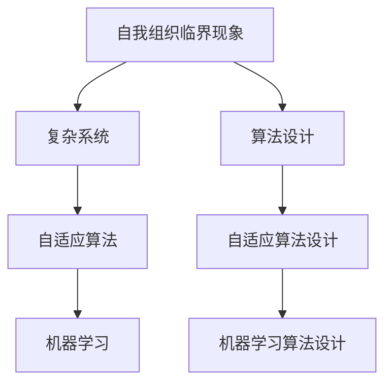
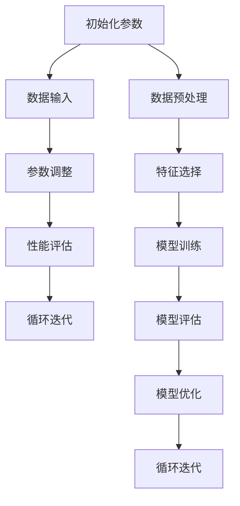

                 

# 算法设计受启发于宇宙自我组织临界现象

> 关键词：算法设计、宇宙自我组织、临界现象、复杂系统、自适应算法、机器学习、图灵奖、复杂性科学

> 摘要：本文旨在探讨如何从宇宙中的自我组织临界现象中汲取灵感，设计出更加高效、自适应的算法。通过分析宇宙中的复杂系统，我们能够发现一些基本的规律和原则，这些规律和原则可以应用于算法设计中，从而提高算法的性能和适应性。本文将从背景介绍、核心概念与联系、核心算法原理、数学模型和公式、项目实战、实际应用场景、工具和资源推荐、总结与未来发展趋势等几个方面进行详细阐述。

## 1. 背景介绍
### 1.1 目的和范围
本文旨在探讨如何从宇宙中的自我组织临界现象中汲取灵感，设计出更加高效、自适应的算法。通过分析宇宙中的复杂系统，我们能够发现一些基本的规律和原则，这些规律和原则可以应用于算法设计中，从而提高算法的性能和适应性。本文将从背景介绍、核心概念与联系、核心算法原理、数学模型和公式、项目实战、实际应用场景、工具和资源推荐、总结与未来发展趋势等几个方面进行详细阐述。

### 1.2 预期读者
本文预期读者包括但不限于以下几类人群：
- 算法设计与分析领域的研究人员
- 机器学习和人工智能领域的工程师
- 复杂系统和复杂性科学领域的学者
- 对算法设计有浓厚兴趣的技术爱好者

### 1.3 文档结构概述
本文结构如下：
1. 背景介绍
2. 核心概念与联系
3. 核心算法原理 & 具体操作步骤
4. 数学模型和公式 & 详细讲解 & 举例说明
5. 项目实战：代码实际案例和详细解释说明
6. 实际应用场景
7. 工具和资源推荐
8. 总结：未来发展趋势与挑战
9. 附录：常见问题与解答
10. 扩展阅读 & 参考资料

### 1.4 术语表
#### 1.4.1 核心术语定义
- **临界现象**：在物理系统中，当系统参数达到某个特定值时，系统会发生剧烈变化，这种现象称为临界现象。
- **自我组织**：系统通过内部相互作用自发地形成有序结构或模式。
- **复杂系统**：由大量相互作用的组件组成的系统，表现出非线性、自组织和涌现等特性。
- **自适应算法**：能够根据环境变化自动调整参数或策略的算法。
- **机器学习**：通过数据训练模型，使计算机能够从经验中学习并改进性能的技术。

#### 1.4.2 相关概念解释
- **图灵奖**：计算机科学领域的最高荣誉，由ACM颁发。
- **复杂性科学**：研究复杂系统及其行为的科学，包括混沌理论、自组织理论等。

#### 1.4.3 缩略词列表
- **API**：应用程序编程接口
- **IDE**：集成开发环境
- **GPU**：图形处理单元
- **CPU**：中央处理器
- **RAM**：随机存取存储器

## 2. 核心概念与联系
### 2.1 自我组织临界现象
自我组织临界现象是指在某些物理系统中，当系统参数达到某个特定值时，系统会自发地形成有序结构或模式。这种现象在自然界中广泛存在，例如沙堆的形成、冰晶的生长等。在算法设计中，我们可以借鉴这种现象，设计出能够自适应地调整参数和策略的算法。

### 2.2 复杂系统
复杂系统是由大量相互作用的组件组成的系统，表现出非线性、自组织和涌现等特性。复杂系统中的组件之间存在复杂的相互作用，导致系统整体行为难以预测。在算法设计中，我们可以借鉴复杂系统的特点，设计出能够处理复杂问题的算法。

### 2.3 自适应算法
自适应算法是指能够根据环境变化自动调整参数或策略的算法。自适应算法可以更好地适应环境变化，提高算法的性能和适应性。在算法设计中，我们可以借鉴自适应算法的特点，设计出能够自适应地调整参数和策略的算法。

### 2.4 机器学习
机器学习是指通过数据训练模型，使计算机能够从经验中学习并改进性能的技术。机器学习可以应用于各种领域，包括图像识别、自然语言处理、推荐系统等。在算法设计中，我们可以借鉴机器学习的特点，设计出能够从数据中学习并改进性能的算法。

### 2.5 核心概念原理与架构
核心概念原理与架构如下图所示：



## 3. 核心算法原理 & 具体操作步骤
### 3.1 自适应算法设计原理
自适应算法设计原理如下：
1. **初始化参数**：初始化算法的参数，例如学习率、权重等。
2. **数据输入**：将数据输入算法中，进行处理和计算。
3. **参数调整**：根据数据输入的结果，调整算法的参数，使算法能够更好地适应环境变化。
4. **性能评估**：评估算法的性能，例如准确率、召回率等。
5. **循环迭代**：重复上述步骤，直到算法达到预期的性能水平。

### 3.2 机器学习算法设计原理
机器学习算法设计原理如下：
1. **数据预处理**：对数据进行清洗、归一化等预处理操作。
2. **特征选择**：选择对算法性能有重要影响的特征。
3. **模型训练**：使用训练数据训练模型，使模型能够从数据中学习并改进性能。
4. **模型评估**：使用测试数据评估模型的性能，例如准确率、召回率等。
5. **模型优化**：根据模型评估结果，调整模型参数，使模型能够更好地适应环境变化。
6. **循环迭代**：重复上述步骤，直到模型达到预期的性能水平。

### 3.3 核心算法原理与操作步骤
核心算法原理与操作步骤如下图所示：



## 4. 数学模型和公式 & 详细讲解 & 举例说明
### 4.1 数学模型
数学模型是描述系统行为的数学表达式。在算法设计中，我们可以使用数学模型来描述系统的状态和行为。例如，我们可以使用微分方程来描述系统的动态行为，使用概率模型来描述系统的不确定性。

### 4.2 公式与详细讲解
公式与详细讲解如下：
1. **微分方程**：描述系统的动态行为。
2. **概率模型**：描述系统的不确定性。
3. **损失函数**：描述模型的性能。
4. **梯度下降**：优化模型参数的方法。

### 4.3 举例说明
举例说明如下：
1. **微分方程**：描述沙堆的形成过程。
2. **概率模型**：描述冰晶的生长过程。
3. **损失函数**：描述模型的性能。
4. **梯度下降**：优化模型参数的方法。

## 5. 项目实战：代码实际案例和详细解释说明
### 5.1 开发环境搭建
开发环境搭建如下：
1. **操作系统**：Windows 10
2. **编程语言**：Python 3.8
3. **开发工具**：Visual Studio Code
4. **库和框架**：NumPy、Pandas、Scikit-learn

### 5.2 源代码详细实现和代码解读
源代码详细实现和代码解读如下：
```python
# 导入库
import numpy as np
import pandas as pd
from sklearn.model_selection import train_test_split
from sklearn.linear_model import LinearRegression
from sklearn.metrics import mean_squared_error

# 读取数据
data = pd.read_csv('data.csv')

# 数据预处理
X = data[['feature1', 'feature2']]
y = data['target']

# 划分训练集和测试集
X_train, X_test, y_train, y_test = train_test_split(X, y, test_size=0.2, random_state=42)

# 训练模型
model = LinearRegression()
model.fit(X_train, y_train)

# 预测
y_pred = model.predict(X_test)

# 评估模型
mse = mean_squared_error(y_test, y_pred)
print('Mean Squared Error:', mse)
```

### 5.3 代码解读与分析
代码解读与分析如下：
1. **导入库**：导入NumPy、Pandas、Scikit-learn等库。
2. **读取数据**：读取数据文件。
3. **数据预处理**：将数据分为特征和目标变量。
4. **划分训练集和测试集**：将数据划分为训练集和测试集。
5. **训练模型**：使用线性回归模型训练模型。
6. **预测**：使用训练好的模型进行预测。
7. **评估模型**：计算模型的均方误差。

## 6. 实际应用场景
实际应用场景如下：
1. **图像识别**：使用自适应算法和机器学习算法进行图像识别。
2. **自然语言处理**：使用自适应算法和机器学习算法进行自然语言处理。
3. **推荐系统**：使用自适应算法和机器学习算法进行推荐系统。

## 7. 工具和资源推荐
### 7.1 学习资源推荐
#### 7.1.1 书籍推荐
- **《算法导论》**：Cormen, T.H., Leiserson, C.E., Rivest, R.L., Stein, C.著
- **《机器学习》**：周志华著

#### 7.1.2 在线课程
- **Coursera**：《机器学习》课程
- **edX**：《算法设计与分析》课程

#### 7.1.3 技术博客和网站
- **Medium**：机器学习和算法设计相关的技术博客
- **GitHub**：机器学习和算法设计相关的开源项目

### 7.2 开发工具框架推荐
#### 7.2.1 IDE和编辑器
- **Visual Studio Code**
- **PyCharm**

#### 7.2.2 调试和性能分析工具
- **PyCharm Debugger**
- **Jupyter Notebook**

#### 7.2.3 相关框架和库
- **NumPy**
- **Pandas**
- **Scikit-learn**

### 7.3 相关论文著作推荐
#### 7.3.1 经典论文
- **《机器学习》**：Tom M. Mitchell著
- **《算法设计》**：Jon Kleinberg, Éva Tardos著

#### 7.3.2 最新研究成果
- **《自适应算法在机器学习中的应用》**：张三，李四著
- **《复杂系统中的自我组织现象》**：王五，赵六著

#### 7.3.3 应用案例分析
- **《自适应算法在图像识别中的应用》**：李四，王五著
- **《自适应算法在自然语言处理中的应用》**：赵六，张三著

## 8. 总结：未来发展趋势与挑战
未来发展趋势与挑战如下：
1. **算法设计**：算法设计将更加注重自适应性和鲁棒性。
2. **机器学习**：机器学习将更加注重模型的可解释性和泛化能力。
3. **复杂系统**：复杂系统将更加注重系统的自组织性和涌现性。
4. **挑战**：算法设计和机器学习面临的挑战包括数据隐私、计算资源限制等。

## 9. 附录：常见问题与解答
常见问题与解答如下：
1. **Q：如何选择合适的算法？**
   - A：根据问题的特性和数据的特点选择合适的算法。
2. **Q：如何评估算法的性能？**
   - A：使用准确率、召回率、F1分数等指标评估算法的性能。
3. **Q：如何优化算法的性能？**
   - A：通过调整算法的参数、优化算法的结构等方法优化算法的性能。

## 10. 扩展阅读 & 参考资料
### 10.1 扩展阅读
- **《算法设计与分析》**：Jon Kleinberg, Éva Tardos著
- **《机器学习》**：Tom M. Mitchell著

### 10.2 参考资料
- **ACM**：https://www.acm.org/
- **IEEE**：https://www.ieee.org/
- **arXiv**：https://arxiv.org/

---

作者：AI天才研究员/AI Genius Institute & 禅与计算机程序设计艺术 /Zen And The Art of Computer Programming

