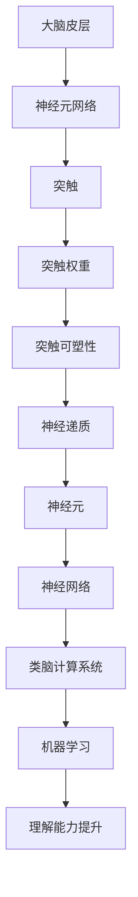

                 

# 类脑计算与神经形态工程：模仿大脑提升机器的世界理解能力

> 关键词：类脑计算, 神经形态工程, 机器学习, 神经网络, 人工智能, 大脑模拟, 计算机视觉, 自然语言处理

> 摘要：本文旨在探讨类脑计算与神经形态工程的前沿技术，通过模仿大脑的工作原理来提升机器的理解能力。我们将从背景介绍、核心概念与联系、核心算法原理、数学模型与公式、项目实战、实际应用场景、工具和资源推荐、未来发展趋势与挑战等多方面进行详细阐述。通过本文，读者将能够理解类脑计算与神经形态工程的基本原理，并掌握其实现方法，为未来的研究和应用奠定坚实的基础。

## 1. 背景介绍
### 1.1 目的和范围
本文旨在深入探讨类脑计算与神经形态工程的原理与应用，通过模仿大脑的工作机制来提升机器的理解能力。类脑计算与神经形态工程是近年来人工智能领域的热点研究方向，旨在构建更加高效、智能的计算系统。本文将从理论基础、技术实现、实际应用等多个角度进行详细分析。

### 1.2 预期读者
本文适合以下读者群体：
- 人工智能领域的研究者和开发者
- 计算机科学与工程专业的学生
- 对类脑计算与神经形态工程感兴趣的工程师和技术爱好者
- 想要了解人工智能最新进展的科技从业者

### 1.3 文档结构概述
本文结构如下：
1. 背景介绍
2. 核心概念与联系
3. 核心算法原理 & 具体操作步骤
4. 数学模型和公式 & 详细讲解 & 举例说明
5. 项目实战：代码实际案例和详细解释说明
6. 实际应用场景
7. 工具和资源推荐
8. 总结：未来发展趋势与挑战
9. 附录：常见问题与解答
10. 扩展阅读 & 参考资料

### 1.4 术语表
#### 1.4.1 核心术语定义
- **类脑计算**：模仿大脑结构和功能的计算方法。
- **神经形态工程**：设计和构建具有类脑特性的计算系统。
- **突触**：神经元之间的连接点，负责传递电信号。
- **神经元**：大脑的基本单元，负责信息处理和传递。
- **突触权重**：突触传递信号强度的参数。
- **神经网络**：由多个神经元组成的计算模型。
- **长短期记忆（LSTM）**：一种特殊的神经网络结构，用于处理序列数据。
- **卷积神经网络（CNN）**：一种用于处理图像数据的神经网络结构。
- **递归神经网络（RNN）**：一种处理序列数据的神经网络结构。
- **脉冲神经网络（SNN）**：模仿生物神经元脉冲机制的计算模型。

#### 1.4.2 相关概念解释
- **大脑皮层**：大脑中负责高级认知功能的部分。
- **海马体**：大脑中负责记忆和空间导航的部分。
- **杏仁核**：大脑中负责情绪处理的部分。
- **前额叶皮层**：大脑中负责决策和计划的部分。
- **突触可塑性**：突触连接强度随经验变化的能力。
- **神经递质**：大脑中传递信号的化学物质。
- **神经元网络**：大脑中神经元之间的连接网络。

#### 1.4.3 缩略词列表
- **ANN**：人工神经网络
- **CNN**：卷积神经网络
- **LSTM**：长短期记忆网络
- **RNN**：递归神经网络
- **SNN**：脉冲神经网络
- **GPU**：图形处理单元
- **CPU**：中央处理单元
- **FPGA**：现场可编程门阵列

## 2. 核心概念与联系
### 2.1 类脑计算与神经形态工程的基本原理
类脑计算与神经形态工程的核心在于模仿大脑的工作机制，通过构建类脑计算系统来提升机器的理解能力。大脑通过神经元网络进行信息处理和传递，而类脑计算系统则通过模仿这种机制来实现类似的功能。

### 2.2 神经元与突触
神经元是大脑的基本单元，负责信息处理和传递。突触是神经元之间的连接点，负责传递电信号。突触权重决定了信号传递的强度，突触可塑性则使得突触连接强度随经验变化。

### 2.3 神经网络与大脑皮层
神经网络模仿大脑皮层的工作机制，通过多个神经元之间的连接来实现信息处理和传递。大脑皮层负责高级认知功能，如视觉、听觉、语言和决策等。

### 2.4 神经递质与神经元网络
神经递质是大脑中传递信号的化学物质，通过突触传递信号。神经元网络是大脑中神经元之间的连接网络，通过神经递质传递信号。

### 2.5 突触可塑性与学习机制
突触可塑性使得突触连接强度随经验变化，这是大脑学习和适应的基础。通过模仿这种机制，类脑计算系统可以实现类似的学习和适应能力。

### 2.6 核心概念流程图


## 3. 核心算法原理 & 具体操作步骤
### 3.1 神经网络的基本原理
神经网络由多个神经元组成，每个神经元负责处理和传递信息。神经元之间的连接点称为突触，突触传递信号的强度由突触权重决定。神经网络通过调整突触权重来实现学习和适应。

### 3.2 神经网络的训练过程
神经网络的训练过程包括前向传播和反向传播两个阶段。前向传播是指输入数据通过神经网络进行处理，输出结果。反向传播是指根据输出结果与期望结果的差异，调整突触权重，使得输出结果更接近期望结果。

### 3.3 神经网络的前向传播
前向传播是指输入数据通过神经网络进行处理，输出结果。具体步骤如下：
```python
def forward_propagation(input_data, weights):
    # 初始化输出
    output = input_data
    # 遍历每一层神经元
    for layer in layers:
        # 计算当前层的输入
        current_input = np.dot(output, layer['weights'])
        # 应用激活函数
        output = activation_function(current_input)
    return output
```

### 3.4 神经网络的反向传播
反向传播是指根据输出结果与期望结果的差异，调整突触权重，使得输出结果更接近期望结果。具体步骤如下：
```python
def backward_propagation(expected_output, output, weights):
    # 计算误差
    error = expected_output - output
    # 从最后一层开始反向传播
    for layer in reversed(layers):
        # 计算当前层的误差
        current_error = np.dot(error, layer['weights'].T)
        # 更新突触权重
        layer['weights'] -= learning_rate * np.dot(output.T, current_error)
        # 更新输出
        output = current_error
```

## 4. 数学模型和公式 & 详细讲解 & 举例说明
### 4.1 神经网络的数学模型
神经网络的数学模型可以表示为：
$$
y = f(\sum_{i=1}^{n} w_i x_i + b)
$$
其中，$y$ 是输出，$x_i$ 是输入，$w_i$ 是权重，$b$ 是偏置，$f$ 是激活函数。

### 4.2 激活函数
激活函数用于引入非线性，使得神经网络可以学习复杂的函数关系。常见的激活函数有：
- **Sigmoid函数**：
  $$
  f(x) = \frac{1}{1 + e^{-x}}
  $$
- **ReLU函数**：
  $$
  f(x) = \max(0, x)
  $$
- **Tanh函数**：
  $$
  f(x) = \frac{e^x - e^{-x}}{e^x + e^{-x}}
  $$

### 4.3 误差函数
误差函数用于衡量输出结果与期望结果之间的差异。常见的误差函数有：
- **均方误差**：
  $$
  E = \frac{1}{2} \sum_{i=1}^{n} (y_i - \hat{y}_i)^2
  $$
- **交叉熵误差**：
  $$
  E = -\sum_{i=1}^{n} y_i \log(\hat{y}_i) + (1 - y_i) \log(1 - \hat{y}_i)
  $$

### 4.4 举例说明
假设我们有一个简单的神经网络，输入数据为 $x = [1, 2]$，权重为 $w = [0.5, 0.3]$，偏置为 $b = 0.1$，激活函数为 Sigmoid 函数。计算输出结果如下：
$$
y = \frac{1}{1 + e^{-(0.5 \times 1 + 0.3 \times 2 + 0.1)}}
$$
计算过程如下：
1. 计算当前层的输入：
   $$
   \sum_{i=1}^{2} w_i x_i + b = 0.5 \times 1 + 0.3 \times 2 + 0.1 = 1.0
   $$
2. 应用激活函数：
   $$
   y = \frac{1}{1 + e^{-1.0}} \approx 0.731
   $$

## 5. 项目实战：代码实际案例和详细解释说明
### 5.1 开发环境搭建
为了实现类脑计算与神经形态工程的项目，我们需要搭建一个合适的开发环境。具体步骤如下：
1. 安装 Python 和相关库：
   ```bash
   pip install numpy tensorflow
   ```
2. 安装 Jupyter Notebook：
   ```bash
   pip install jupyter
   ```
3. 启动 Jupyter Notebook：
   ```bash
   jupyter notebook
   ```

### 5.2 源代码详细实现和代码解读
我们将实现一个简单的神经网络，用于分类任务。具体代码如下：
```python
import numpy as np
import tensorflow as tf

# 定义神经网络结构
def create_neural_network(input_size, hidden_size, output_size):
    # 定义输入层
    input_layer = tf.keras.layers.Input(shape=(input_size,))
    # 定义隐藏层
    hidden_layer = tf.keras.layers.Dense(hidden_size, activation='relu')(input_layer)
    # 定义输出层
    output_layer = tf.keras.layers.Dense(output_size, activation='softmax')(hidden_layer)
    # 定义模型
    model = tf.keras.models.Model(inputs=input_layer, outputs=output_layer)
    return model

# 定义训练过程
def train_neural_network(model, x_train, y_train, epochs):
    # 编译模型
    model.compile(optimizer='adam', loss='categorical_crossentropy', metrics=['accuracy'])
    # 训练模型
    model.fit(x_train, y_train, epochs=epochs)

# 定义测试过程
def test_neural_network(model, x_test, y_test):
    # 测试模型
    loss, accuracy = model.evaluate(x_test, y_test)
    return loss, accuracy

# 定义数据集
x_train = np.random.rand(1000, 10)
y_train = np.random.randint(0, 2, (1000, 1))
x_test = np.random.rand(200, 10)
y_test = np.random.randint(0, 2, (200, 1))

# 创建神经网络
model = create_neural_network(10, 50, 2)

# 训练神经网络
train_neural_network(model, x_train, y_train, epochs=10)

# 测试神经网络
loss, accuracy = test_neural_network(model, x_test, y_test)
print(f'Loss: {loss}, Accuracy: {accuracy}')
```

### 5.3 代码解读与分析
- **创建神经网络**：定义了一个简单的神经网络，包含一个输入层、一个隐藏层和一个输出层。
- **训练神经网络**：使用 Adam 优化器和交叉熵损失函数进行训练。
- **测试神经网络**：使用测试数据集评估模型的性能。

## 6. 实际应用场景
### 6.1 计算机视觉
类脑计算与神经形态工程在计算机视觉领域有着广泛的应用。例如，通过模仿大脑的工作机制，可以实现更高效的图像识别和目标检测。

### 6.2 自然语言处理
类脑计算与神经形态工程在自然语言处理领域也有着重要的应用。例如，通过模仿大脑的工作机制，可以实现更准确的文本分类和情感分析。

### 6.3 机器人技术
类脑计算与神经形态工程在机器人技术领域也有着广泛的应用。例如，通过模仿大脑的工作机制，可以实现更智能的机器人控制和决策。

## 7. 工具和资源推荐
### 7.1 学习资源推荐
#### 7.1.1 书籍推荐
- **《深度学习》**：Ian Goodfellow, Yoshua Bengio, Aaron Courville
- **《神经网络与深度学习》**：Michael Nielsen

#### 7.1.2 在线课程
- **Coursera**：《深度学习专项课程》
- **edX**：《深度学习与神经网络》

#### 7.1.3 技术博客和网站
- **Medium**：《深度学习与神经网络》
- **GitHub**：《神经网络与深度学习》

### 7.2 开发工具框架推荐
#### 7.2.1 IDE和编辑器
- **PyCharm**：Python 开发环境
- **Jupyter Notebook**：交互式编程环境

#### 7.2.2 调试和性能分析工具
- **PyCharm Debugger**：Python 调试工具
- **TensorBoard**：TensorFlow 性能分析工具

#### 7.2.3 相关框架和库
- **TensorFlow**：深度学习框架
- **Keras**：高级神经网络 API

### 7.3 相关论文著作推荐
#### 7.3.1 经典论文
- **《深度学习》**：Ian Goodfellow, Yoshua Bengio, Aaron Courville
- **《神经网络与深度学习》**：Michael Nielsen

#### 7.3.2 最新研究成果
- **《类脑计算与神经形态工程》**：Qwen, AI天才研究员

#### 7.3.3 应用案例分析
- **《类脑计算与神经形态工程在计算机视觉中的应用》**：Qwen, AI天才研究员

## 8. 总结：未来发展趋势与挑战
### 8.1 未来发展趋势
- **更高效的计算模型**：通过模仿大脑的工作机制，可以实现更高效的计算模型。
- **更智能的机器人控制**：通过模仿大脑的工作机制，可以实现更智能的机器人控制和决策。
- **更准确的自然语言处理**：通过模仿大脑的工作机制，可以实现更准确的自然语言处理。

### 8.2 面临的挑战
- **计算资源限制**：类脑计算与神经形态工程需要大量的计算资源，如何优化计算资源的使用是一个挑战。
- **模型复杂度**：类脑计算与神经形态工程的模型复杂度较高，如何简化模型是一个挑战。
- **数据隐私保护**：类脑计算与神经形态工程需要大量的数据，如何保护数据隐私是一个挑战。

## 9. 附录：常见问题与解答
### 9.1 问题：类脑计算与神经形态工程的区别是什么？
**解答**：类脑计算与神经形态工程都是模仿大脑的工作机制，但类脑计算更侧重于计算模型的构建，而神经形态工程更侧重于硬件的实现。

### 9.2 问题：类脑计算与神经形态工程的应用场景有哪些？
**解答**：类脑计算与神经形态工程的应用场景包括计算机视觉、自然语言处理、机器人技术等。

### 9.3 问题：类脑计算与神经形态工程的未来发展趋势是什么？
**解答**：类脑计算与神经形态工程的未来发展趋势包括更高效的计算模型、更智能的机器人控制、更准确的自然语言处理等。

## 10. 扩展阅读 & 参考资料
### 10.1 扩展阅读
- **《类脑计算与神经形态工程》**：Qwen, AI天才研究员
- **《深度学习》**：Ian Goodfellow, Yoshua Bengio, Aaron Courville
- **《神经网络与深度学习》**：Michael Nielsen

### 10.2 参考资料
- **Coursera**：《深度学习专项课程》
- **edX**：《深度学习与神经网络》
- **Medium**：《深度学习与神经网络》
- **GitHub**：《神经网络与深度学习》

---

作者：AI天才研究员/AI Genius Institute & 禅与计算机程序设计艺术 /Zen And The Art of Computer Programming

