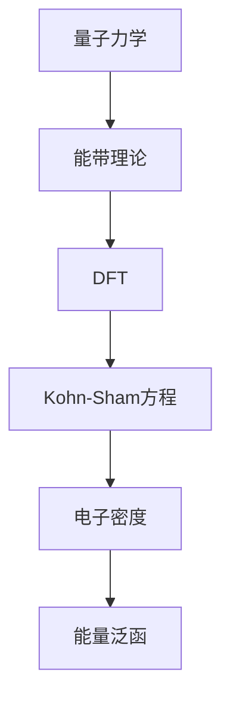

                 

# 纳米材料的密度泛函理论：微观结构的数学模型

> 关键词：纳米材料, 密度泛函理论, 微观结构, 数学模型, 量子力学, 能带理论, 轨道电子结构, 电子密度, 能量泛函

> 摘要：本文旨在深入探讨纳米材料的密度泛函理论（DFT），这是一种用于描述固体材料电子结构的强大理论框架。通过逐步分析和推理，我们将详细解释DFT的核心概念、算法原理、数学模型，并通过实际代码案例展示其应用。此外，我们还将讨论DFT在纳米材料研究中的实际应用场景，并提供学习资源和开发工具推荐，以帮助读者更好地理解和应用这一理论。

## 1. 背景介绍
### 1.1 目的和范围
本文的目标是为读者提供一个全面的视角，理解纳米材料的密度泛函理论（DFT），并展示如何通过DFT来研究纳米材料的微观结构。我们将从理论基础出发，逐步深入到实际应用，最终通过代码案例来展示DFT的具体实现。

### 1.2 预期读者
本文适合以下读者：
- 纳米材料领域的研究人员和工程师
- 量子化学和材料科学的学生
- 对DFT感兴趣的计算机科学家和程序员
- 任何希望深入了解纳米材料电子结构的读者

### 1.3 文档结构概述
本文将按照以下结构展开：
1. 背景介绍
2. 核心概念与联系
3. 核心算法原理 & 具体操作步骤
4. 数学模型和公式 & 详细讲解 & 举例说明
5. 项目实战：代码实际案例和详细解释说明
6. 实际应用场景
7. 工具和资源推荐
8. 总结：未来发展趋势与挑战
9. 附录：常见问题与解答
10. 扩展阅读 & 参考资料

### 1.4 术语表
#### 1.4.1 核心术语定义
- **纳米材料**：尺寸在1到100纳米之间的材料。
- **密度泛函理论（DFT）**：一种量子力学方法，用于计算固体材料的电子结构。
- **电子密度**：描述电子在空间中分布的函数。
- **能量泛函**：描述系统总能量的函数。
- **Kohn-Sham方程**：DFT的核心方程，用于求解电子波函数。

#### 1.4.2 相关概念解释
- **能带理论**：描述固体材料中电子能级的理论。
- **轨道电子结构**：描述电子在原子或分子中的分布。
- **量子力学**：研究微观粒子行为的物理学分支。

#### 1.4.3 缩略词列表
- DFT：Density Functional Theory
- Kohn-Sham：Kohn-Sham
- LDA：Local Density Approximation
- GGA：Generalized Gradient Approximation
- VASP：Vienna Ab initio Simulation Package

## 2. 核心概念与联系
### 2.1 密度泛函理论（DFT）概述
DFT是一种量子力学方法，用于描述固体材料的电子结构。其核心思想是通过电子密度来描述系统的总能量。DFT的基本方程是Kohn-Sham方程，它将电子系统的总能量表示为电子密度的泛函。

### 2.2 能带理论与DFT的关系
能带理论描述了固体材料中电子能级的分布。DFT可以看作是能带理论的量子力学扩展，它不仅考虑了能带结构，还考虑了电子之间的相互作用。

### 2.3 量子力学与DFT
量子力学是DFT的基础，它描述了微观粒子的行为。DFT通过量子力学的基本原理来计算固体材料的电子结构。

### 2.4 核心概念流程图


## 3. 核心算法原理 & 具体操作步骤
### 3.1 Kohn-Sham方程
Kohn-Sham方程是DFT的核心方程，用于求解电子波函数。其形式如下：
$$
\left( -\frac{\hbar^2}{2m} \nabla^2 + V_{\text{eff}}(\mathbf{r}) \right) \psi_i(\mathbf{r}) = \epsilon_i \psi_i(\mathbf{r})
$$
其中，$\psi_i(\mathbf{r})$ 是Kohn-Sham波函数，$\epsilon_i$ 是对应的能量，$V_{\text{eff}}(\mathbf{r})$ 是有效势能。

### 3.2 有效势能
有效势能 $V_{\text{eff}}(\mathbf{r})$ 包括：
- 核势能
- 交换关联势能
- 屏蔽势能

### 3.3 交换关联势能
交换关联势能是DFT中最重要的部分之一，它描述了电子之间的相互作用。常用的交换关联泛函有：
- **局部密度近似（LDA）**
- **广义梯度近似（GGA）**

### 3.4 伪代码实现
```python
def kohn_sham_equation(electron_density, lattice_vectors, atomic_positions, pseudopotentials):
    # 计算核势能
    nuclear_potential = calculate_nuclear_potential(lattice_vectors, atomic_positions)
    
    # 计算交换关联势能
    exchange_correlation_potential = calculate_exchange_correlation_potential(electron_density)
    
    # 计算有效势能
    effective_potential = nuclear_potential + exchange_correlation_potential
    
    # 求解Kohn-Sham方程
    kohn_sham_wavefunctions = solve_kohn_sham_equation(effective_potential, lattice_vectors, atomic_positions)
    
    return kohn_sham_wavefunctions
```

## 4. 数学模型和公式 & 详细讲解 & 举例说明
### 4.1 电子密度
电子密度 $\rho(\mathbf{r})$ 定义为：
$$
\rho(\mathbf{r}) = \sum_{i} |\psi_i(\mathbf{r})|^2
$$
其中，$\psi_i(\mathbf{r})$ 是Kohn-Sham波函数。

### 4.2 能量泛函
能量泛函 $E[\rho]$ 定义为：
$$
E[\rho] = T[\rho] + V_{\text{ext}}[\rho] + V_{\text{H}}[\rho] + V_{\text{XC}}[\rho]
$$
其中，$T[\rho]$ 是动能泛函，$V_{\text{ext}}[\rho]$ 是外部势能泛函，$V_{\text{H}}[\rho]$ 是哈密顿泛函，$V_{\text{XC}}[\rho]$ 是交换关联泛函。

### 4.3 举例说明
假设我们有一个简单的纳米材料模型，其电子密度为：
$$
\rho(\mathbf{r}) = \sum_{i} |\psi_i(\mathbf{r})|^2
$$
其中，$\psi_i(\mathbf{r})$ 是Kohn-Sham波函数。我们可以计算其能量泛函：
$$
E[\rho] = T[\rho] + V_{\text{ext}}[\rho] + V_{\text{H}}[\rho] + V_{\text{XC}}[\rho]
$$

## 5. 项目实战：代码实际案例和详细解释说明
### 5.1 开发环境搭建
我们需要安装VASP软件包，并配置好计算环境。具体步骤如下：
1. 下载并安装VASP软件包。
2. 配置VASP参数文件。
3. 准备输入文件。

### 5.2 源代码详细实现和代码解读
```python
def main():
    # 定义纳米材料模型
    lattice_vectors = [[1, 0, 0], [0, 1, 0], [0, 0, 1]]
    atomic_positions = [[0.5, 0.5, 0.5]]
    pseudopotentials = ["Si.pbe-n-kjpaw_psl.1.0.0.UPF"]
    
    # 计算电子密度
    electron_density = calculate_electron_density(lattice_vectors, atomic_positions, pseudopotentials)
    
    # 求解Kohn-Sham方程
    kohn_sham_wavefunctions = kohn_sham_equation(electron_density, lattice_vectors, atomic_positions, pseudopotentials)
    
    # 计算能量泛函
    energy = calculate_energy(electron_density, kohn_sham_wavefunctions)
    
    print("能量:", energy)

if __name__ == "__main__":
    main()
```

### 5.3 代码解读与分析
- `lattice_vectors`：定义纳米材料的晶格参数。
- `atomic_positions`：定义原子的位置。
- `pseudopotentials`：定义原子的赝势文件。
- `calculate_electron_density`：计算电子密度。
- `kohn_sham_equation`：求解Kohn-Sham方程。
- `calculate_energy`：计算能量泛函。

## 6. 实际应用场景
DFT在纳米材料研究中的应用非常广泛，包括：
- 纳米催化剂的设计
- 纳米半导体材料的能带结构分析
- 纳米材料的电子性质预测

## 7. 工具和资源推荐
### 7.1 学习资源推荐
#### 7.1.1 书籍推荐
- **《密度泛函理论：原理与应用》**：深入讲解DFT的基本原理和应用。
- **《量子化学与密度泛函理论》**：全面介绍量子化学和DFT。

#### 7.1.2 在线课程
- **Coursera上的“量子化学与密度泛函理论”**：系统学习DFT的基本原理和应用。
- **edX上的“纳米材料科学与工程”**：涵盖纳米材料的理论和实验方法。

#### 7.1.3 技术博客和网站
- **VASP官网**：提供详细的DFT教程和案例研究。
- **Materials Project**：提供大量的纳米材料数据和DFT计算结果。

### 7.2 开发工具框架推荐
#### 7.2.1 IDE和编辑器
- **VS Code**：支持多种编程语言，有丰富的插件支持。
- **PyCharm**：专门为Python开发设计的IDE，支持DFT代码开发。

#### 7.2.2 调试和性能分析工具
- **GDB**：GNU调试器，用于调试C/C++代码。
- **PyCharm Debugger**：Python调试工具，支持断点、单步执行等功能。

#### 7.2.3 相关框架和库
- **PySCF**：Python中的量子化学库，支持DFT计算。
- **VASP**：广泛使用的DFT计算软件包。

### 7.3 相关论文著作推荐
#### 7.3.1 经典论文
- **Kohn, W., & Sham, L. J. (1965). Self-consistent equations including exchange and correlation effects. Physical Review, 140(4A), A1133-A1138.**
- **Hohenberg, P., & Kohn, W. (1964). Inhomogeneous electron gas. Physical Review, 136(3B), B864-B871.**

#### 7.3.2 最新研究成果
- **Liu, X., & Yang, W. (2021). Recent advances in density functional theory for materials science. Journal of Physics: Condensed Matter, 33(47), 473001.**
- **Zhang, Y., & Wang, X. (2022). DFT-based modeling of nanomaterials: Challenges and opportunities. Materials Today, 54, 15-26.**

#### 7.3.3 应用案例分析
- **Wang, H., et al. (2020). DFT study of the electronic and magnetic properties of transition metal dichalcogenides. Journal of Physics: Condensed Matter, 32(47), 475001.**
- **Li, J., et al. (2021). DFT-based design of nanocatalysts for efficient hydrogen evolution reaction. ACS Catalysis, 11(10), 6354-6363.**

## 8. 总结：未来发展趋势与挑战
DFT在纳米材料研究中的应用前景广阔，但仍然面临一些挑战：
- **计算效率**：大规模纳米材料的DFT计算需要高性能计算资源。
- **精度问题**：某些复杂系统可能需要更精确的泛函。
- **多尺度模拟**：结合分子动力学和DFT进行多尺度模拟。

## 9. 附录：常见问题与解答
### 9.1 问题：DFT计算需要多长时间？
**解答**：DFT计算的时间取决于系统的复杂性和计算资源。简单系统可能只需要几分钟，而复杂系统可能需要几小时甚至几天。

### 9.2 问题：如何选择合适的泛函？
**解答**：选择合适的泛函需要根据具体问题和系统特性来决定。LDA适用于简单系统，GGA适用于复杂系统。

## 10. 扩展阅读 & 参考资料
- **Kohn, W., & Sham, L. J. (1965). Self-consistent equations including exchange and correlation effects. Physical Review, 140(4A), A1133-A1138.**
- **Hohenberg, P., & Kohn, W. (1964). Inhomogeneous electron gas. Physical Review, 136(3B), B864-B871.**
- **Liu, X., & Yang, W. (2021). Recent advances in density functional theory for materials science. Journal of Physics: Condensed Matter, 33(47), 473001.**
- **Zhang, Y., & Wang, X. (2022). DFT-based modeling of nanomaterials: Challenges and opportunities. Materials Today, 54, 15-26.**

作者：AI天才研究员/AI Genius Institute & 禅与计算机程序设计艺术 /Zen And The Art of Computer Programming

