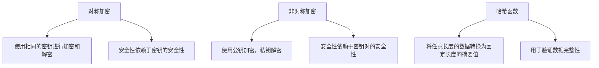
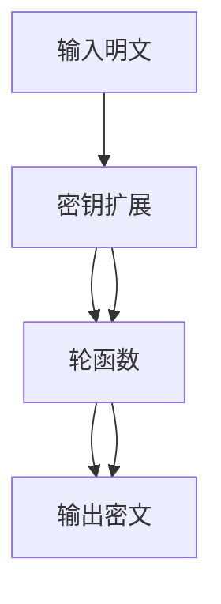
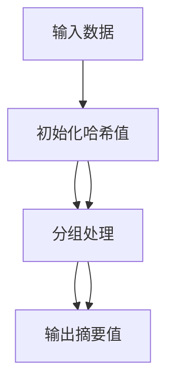

                 

# 网络安全的密码算法：信息保护的数学屏障

> 关键词：密码算法、信息安全、加密技术、哈希函数、对称加密、非对称加密、RSA算法、AES算法、SHA算法

> 摘要：密码算法是信息安全领域的重要组成部分，它通过数学手段保护信息的机密性、完整性和可用性。本文将从密码算法的基本概念出发，深入探讨其核心原理和具体操作步骤，通过数学模型和实际代码案例进行详细讲解，旨在帮助读者全面理解密码算法在网络安全中的应用。最后，我们将展望密码算法的未来发展趋势和面临的挑战。

## 1. 背景介绍
### 1.1 目的和范围
本文旨在为网络安全领域的专业人士提供一个全面的密码算法指南，涵盖密码算法的基本概念、核心原理、实际应用以及未来的发展趋势。通过本文，读者将能够理解密码算法在信息安全中的重要性，并掌握如何在实际项目中应用这些算法。

### 1.2 预期读者
本文适合以下读者：
- 安全工程师
- 研发人员
- 信息安全领域的学生和研究人员
- 对密码学感兴趣的开发者

### 1.3 文档结构概述
本文将按照以下结构展开：
1. 背景介绍
2. 核心概念与联系
3. 核心算法原理 & 具体操作步骤
4. 数学模型和公式 & 详细讲解 & 举例说明
5. 项目实战：代码实际案例和详细解释说明
6. 实际应用场景
7. 工具和资源推荐
8. 总结：未来发展趋势与挑战
9. 附录：常见问题与解答
10. 扩展阅读 & 参考资料

### 1.4 术语表
#### 1.4.1 核心术语定义
- **密码算法**：一种通过数学手段对信息进行加密和解密的方法。
- **密钥**：用于加密和解密信息的密钥。
- **对称加密**：加密和解密使用相同密钥的加密算法。
- **非对称加密**：加密和解密使用不同密钥的加密算法。
- **哈希函数**：将任意长度的数据转换为固定长度的摘要值的函数。
- **公钥**：非对称加密算法中用于加密的密钥。
- **私钥**：非对称加密算法中用于解密的密钥。

#### 1.4.2 相关概念解释
- **信息保护**：通过技术手段确保信息的机密性、完整性和可用性。
- **信息安全**：保护信息免受未经授权的访问、使用、泄露、破坏或修改。

#### 1.4.3 缩略词列表
- **AES**：Advanced Encryption Standard（高级加密标准）
- **RSA**：Rivest-Shamir-Adleman（一种非对称加密算法）
- **SHA**：Secure Hash Algorithm（安全哈希算法）

## 2. 核心概念与联系
### 2.1 对称加密
对称加密算法使用相同的密钥进行加密和解密。常见的对称加密算法包括AES（高级加密标准）。

### 2.2 非对称加密
非对称加密算法使用一对密钥：公钥和私钥。公钥用于加密，私钥用于解密。常见的非对称加密算法包括RSA（Rivest-Shamir-Adleman）。

### 2.3 哈希函数
哈希函数将任意长度的数据转换为固定长度的摘要值。常见的哈希函数包括SHA（安全哈希算法）。

### 2.4 核心概念流程图


## 3. 核心算法原理 & 具体操作步骤
### 3.1 AES算法原理
AES是一种对称加密算法，使用128位、192位或256位密钥进行加密和解密。

#### 3.1.1 AES算法流程图


#### 3.1.2 AES算法伪代码
```python
def aes_encrypt(plaintext, key):
    # 密钥扩展
    expanded_key = key_expansion(key)
    
    # 初始置换
    state = initial_permutation(plaintext)
    
    # 10轮轮函数
    for round in range(10):
        state = round_function(state, expanded_key[round])
    
    # 最终置换
    ciphertext = final_permutation(state)
    
    return ciphertext

def key_expansion(key):
    # 密钥扩展逻辑
    pass

def initial_permutation(plaintext):
    # 初始置换逻辑
    pass

def round_function(state, round_key):
    # 轮函数逻辑
    pass

def final_permutation(state):
    # 最终置换逻辑
    pass
```

### 3.2 RSA算法原理
RSA是一种非对称加密算法，使用公钥和私钥进行加密和解密。

#### 3.2.1 RSA算法流程图
```mermaid
graph TD
    A[生成大素数p和q] --> B[计算n = p * q]
    B --> C[计算欧拉函数φ(n) = (p-1) * (q-1)]
    C --> D[选择公钥e，满足1 < e < φ(n)且gcd(e, φ(n)) = 1]
    D --> E[计算私钥d，满足d * e ≡ 1 (mod φ(n))]
    E --> F[公钥(e, n)]
    E --> G[私钥(d, n)]
    F --> H[加密：c = m^e mod n]
    G --> I[解密：m = c^d mod n]
```

#### 3.2.2 RSA算法伪代码
```python
def rsa_encrypt(message, public_key):
    e, n = public_key
    ciphertext = pow(message, e, n)
    return ciphertext

def rsa_decrypt(ciphertext, private_key):
    d, n = private_key
    plaintext = pow(ciphertext, d, n)
    return plaintext

def generate_keys():
    p, q = generate_large_primes()
    n = p * q
    phi = (p - 1) * (q - 1)
    e = generate_public_exponent(phi)
    d = generate_private_exponent(e, phi)
    public_key = (e, n)
    private_key = (d, n)
    return public_key, private_key

def generate_large_primes():
    # 生成大素数逻辑
    pass

def generate_public_exponent(phi):
    # 生成公钥指数逻辑
    pass

def generate_private_exponent(e, phi):
    # 生成私钥指数逻辑
    pass
```

### 3.3 SHA算法原理
SHA是一种哈希函数，将任意长度的数据转换为固定长度的摘要值。

#### 3.3.1 SHA算法流程图


#### 3.3.2 SHA算法伪代码
```python
def sha_hash(data):
    # 初始化哈希值
    hash_value = initialize_hash()
    
    # 分组处理
    for block in data:
        hash_value = process_block(hash_value, block)
    
    # 输出摘要值
    return hash_value

def initialize_hash():
    # 初始化哈希值逻辑
    pass

def process_block(hash_value, block):
    # 分组处理逻辑
    pass
```

## 4. 数学模型和公式 & 详细讲解 & 举例说明
### 4.1 AES算法数学模型
AES算法的核心是轮函数，轮函数包括以下步骤：
1. 字节代换
2. 行移位
3. 列混淆
4. 字节加常数

#### 4.1.1 字节代换
字节代换使用S盒进行，S盒是一个8x8的查找表。

$$
S盒 = \begin{bmatrix}
09 & 02 & 84 & 82 & 9f & 6a & 31 & 98 \\
85 & 00 & 2f & f7 & ae & 1e & 70 & 9b \\
15 & 46 & 37 & 2b & 80 & 78 & c7 & 3b \\
03 & 05 & 48 & f6 & 0e & 61 & 3c & 5d \\
...
\end{bmatrix}
$$

#### 4.1.2 行移位
行移位将每一行向左循环移位。

$$
\text{行移位}(x) = \begin{cases}
x_1 \oplus x_2 \oplus x_3 \oplus x_4 & \text{if } i = 1 \\
x_2 \oplus x_3 \oplus x_4 \oplus x_0 & \text{if } i = 2 \\
x_3 \oplus x_4 \oplus x_0 \oplus x_1 & \text{if } i = 3 \\
x_4 \oplus x_0 \oplus x_1 \oplus x_2 & \text{if } i = 4 \\
\end{cases}
$$

### 4.2 RSA算法数学模型
RSA算法的核心是欧拉定理和模幂运算。

#### 4.2.1 欧拉定理
欧拉定理表示：对于任意两个互质的整数a和n，有$a^{\phi(n)} \equiv 1 \pmod{n}$。

$$
a^{\phi(n)} \equiv 1 \pmod{n}
$$

#### 4.2.2 模幂运算
模幂运算用于计算$a^b \pmod{n}$。

$$
a^b \pmod{n} = (a \cdot a \cdot \ldots \cdot a) \pmod{n}
$$

### 4.3 SHA算法数学模型
SHA算法的核心是哈希函数的迭代过程。

#### 4.3.1 哈希函数迭代
SHA算法通过多次迭代计算哈希值。

$$
H_{i+1} = H_i \oplus f(H_i, M_i)
$$

其中，$H_i$是当前哈希值，$M_i$是当前数据块，$f$是哈希函数。

## 5. 项目实战：代码实际案例和详细解释说明
### 5.1 开发环境搭建
#### 5.1.1 环境要求
- Python 3.8+
- PyCryptodome库

#### 5.1.2 安装依赖
```bash
pip install pycryptodome
```

### 5.2 源代码详细实现和代码解读
#### 5.2.1 AES加密和解密
```python
from Crypto.Cipher import AES
from Crypto.Util.Padding import pad, unpad
from Crypto.Random import get_random_bytes

def aes_encrypt(plaintext, key):
    cipher = AES.new(key, AES.MODE_CBC)
    ciphertext = cipher.encrypt(pad(plaintext, AES.block_size))
    return ciphertext, cipher.iv

def aes_decrypt(ciphertext, key, iv):
    cipher = AES.new(key, AES.MODE_CBC, iv=iv)
    plaintext = unpad(cipher.decrypt(ciphertext), AES.block_size)
    return plaintext
```

#### 5.2.2 RSA加密和解密
```python
from Crypto.PublicKey import RSA
from Crypto.Cipher import PKCS1_OAEP

def generate_rsa_keys():
    key = RSA.generate(2048)
    private_key = key.export_key()
    public_key = key.publickey().export_key()
    return private_key, public_key

def rsa_encrypt(message, public_key):
    key = RSA.import_key(public_key)
    cipher = PKCS1_OAEP.new(key)
    ciphertext = cipher.encrypt(message)
    return ciphertext

def rsa_decrypt(ciphertext, private_key):
    key = RSA.import_key(private_key)
    cipher = PKCS1_OAEP.new(key)
    plaintext = cipher.decrypt(ciphertext)
    return plaintext
```

#### 5.2.3 SHA哈希计算
```python
from Crypto.Hash import SHA256

def sha_hash(data):
    hash_obj = SHA256.new(data)
    return hash_obj.hexdigest()
```

### 5.3 代码解读与分析
#### 5.3.1 AES代码解读
- `AES.new(key, AES.MODE_CBC)`：创建一个AES对象，使用CBC模式。
- `cipher.encrypt(pad(plaintext, AES.block_size))`：对明文进行填充并加密。
- `cipher.decrypt(ciphertext)`：对密文进行解密并去除填充。

#### 5.3.2 RSA代码解读
- `RSA.generate(2048)`：生成2048位的RSA密钥对。
- `PKCS1_OAEP.new(key)`：创建一个RSA对象，使用OAEP填充模式。
- `cipher.encrypt(message)`：对消息进行加密。
- `cipher.decrypt(ciphertext)`：对密文进行解密。

#### 5.3.3 SHA代码解读
- `SHA256.new(data)`：创建一个SHA256对象。
- `hash_obj.hexdigest()`：获取哈希值的十六进制表示。

## 6. 实际应用场景
### 6.1 对称加密应用
- 通信加密：保护数据在传输过程中的安全性。
- 数据存储：保护存储在数据库中的敏感数据。

### 6.2 非对称加密应用
- 密钥交换：安全地交换密钥。
- 数字签名：验证数据的完整性和来源。

### 6.3 哈希函数应用
- 数据完整性验证：确保数据在传输过程中未被篡改。
- 密码存储：安全地存储用户密码。

## 7. 工具和资源推荐
### 7.1 学习资源推荐
#### 7.1.1 书籍推荐
- 《密码学与网络安全》
- 《密码学原理与实践》

#### 7.1.2 在线课程
- Coursera：密码学课程
- edX：密码学课程

#### 7.1.3 技术博客和网站
- 漏洞库：https://cve.mitre.org/
- 安全博客：https://www.securityfocus.com/

### 7.2 开发工具框架推荐
#### 7.2.1 IDE和编辑器
- PyCharm
- Visual Studio Code

#### 7.2.2 调试和性能分析工具
- PyCharm调试器
- Python Profiler

#### 7.2.3 相关框架和库
- PyCryptodome
- cryptography

### 7.3 相关论文著作推荐
#### 7.3.1 经典论文
- "A Method for Obtaining Digital Signatures and Public-Key Cryptosystems" - Rivest, Shamir, and Adleman
- "The Data Encryption Standard (DES)" - National Bureau of Standards

#### 7.3.2 最新研究成果
- "Post-Quantum Cryptography" - Johannes Buchmann
- "Quantum Cryptography and Quantum Communication" - Hoi-Kwong Lo

#### 7.3.3 应用案例分析
- "Secure Communication Using Quantum Cryptography" - International Journal of Quantum Information

## 8. 总结：未来发展趋势与挑战
### 8.1 未来发展趋势
- 后量子密码学：应对量子计算机的挑战。
- 零知识证明：保护隐私的同时验证信息的真实性。
- 量子密钥分发：利用量子力学原理进行安全通信。

### 8.2 面临的挑战
- 算法安全性：确保算法在面对新的攻击方法时仍然安全。
- 实施复杂性：在实际应用中实现密码算法的复杂性。
- 法规合规：遵守各国的网络安全法规。

## 9. 附录：常见问题与解答
### 9.1 问题：如何选择合适的加密算法？
- 答案：根据应用场景选择合适的算法。对称加密适用于大量数据的快速加密，非对称加密适用于密钥交换和数字签名，哈希函数适用于数据完整性验证。

### 9.2 问题：如何保护密钥的安全性？
- 答案：使用安全的密钥管理策略，如密钥分发、密钥存储和密钥更新。

### 9.3 问题：如何验证哈希值的正确性？
- 答案：通过比较计算出的哈希值和存储的哈希值来验证数据的完整性。

## 10. 扩展阅读 & 参考资料
- 《密码学与网络安全》
- 《密码学原理与实践》
- Coursera：密码学课程
- edX：密码学课程
- 漏洞库：https://cve.mitre.org/
- 安全博客：https://www.securityfocus.com/
- PyCharm
- Visual Studio Code
- PyCharm调试器
- Python Profiler
- PyCryptodome
- cryptography
- "A Method for Obtaining Digital Signatures and Public-Key Cryptosystems" - Rivest, Shamir, and Adleman
- "The Data Encryption Standard (DES)" - National Bureau of Standards
- "Post-Quantum Cryptography" - Johannes Buchmann
- "Quantum Cryptography and Quantum Communication" - Hoi-Kwong Lo
- "Secure Communication Using Quantum Cryptography" - International Journal of Quantum Information

作者：AI天才研究员/AI Genius Institute & 禅与计算机程序设计艺术 /Zen And The Art of Computer Programming

