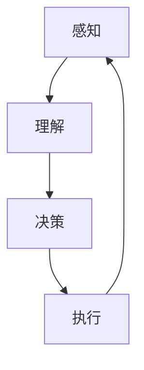

                 

# 自动驾驶的决策算法：交通安全的数学保障

> 关键词：自动驾驶，决策算法，交通安全，数学模型，机器学习，路径规划，传感器融合，深度学习

> 摘要：本文旨在深入探讨自动驾驶车辆决策算法的核心原理与实现方法，通过详细分析数学模型、算法原理及具体操作步骤，结合实际代码案例，为读者提供一个全面而深入的技术视角。文章将从背景介绍、核心概念与联系、核心算法原理、数学模型与公式、项目实战、实际应用场景、工具和资源推荐、未来发展趋势与挑战等多方面进行阐述，旨在帮助读者理解自动驾驶决策算法的复杂性和重要性，为相关领域的研究和实践提供有价值的参考。

## 1. 背景介绍
### 1.1 目的和范围
本文旨在深入探讨自动驾驶车辆决策算法的核心原理与实现方法，通过详细分析数学模型、算法原理及具体操作步骤，结合实际代码案例，为读者提供一个全面而深入的技术视角。文章将涵盖自动驾驶车辆决策算法的基本原理、核心概念、数学模型、具体实现方法以及实际应用案例，旨在帮助读者理解自动驾驶决策算法的复杂性和重要性，为相关领域的研究和实践提供有价值的参考。

### 1.2 预期读者
本文主要面向以下几类读者：
- 自动驾驶领域的研究人员和工程师
- 机器学习和人工智能领域的从业者
- 对自动驾驶技术感兴趣的开发者和爱好者
- 高等院校相关专业的学生
- 对交通安全和智能交通系统感兴趣的读者

### 1.3 文档结构概述
本文结构如下：
1. 背景介绍
2. 核心概念与联系
3. 核心算法原理 & 具体操作步骤
4. 数学模型和公式 & 详细讲解 & 举例说明
5. 项目实战：代码实际案例和详细解释说明
6. 实际应用场景
7. 工具和资源推荐
8. 总结：未来发展趋势与挑战
9. 附录：常见问题与解答
10. 扩展阅读 & 参考资料

### 1.4 术语表
#### 1.4.1 核心术语定义
- **自动驾驶**：一种能够自主完成驾驶任务的车辆系统，无需人类驾驶员直接干预。
- **决策算法**：自动驾驶系统中用于生成行驶决策的算法，包括路径规划、避障、速度控制等。
- **传感器融合**：将多种传感器的数据进行综合处理，以提高感知精度和鲁棒性。
- **路径规划**：确定车辆从起点到终点的最优路径。
- **避障**：在行驶过程中识别并避开障碍物。
- **速度控制**：根据当前环境和行驶条件调整车辆速度。
- **机器学习**：一种人工智能技术，通过数据训练模型，使其能够自动学习和改进。

#### 1.4.2 相关概念解释
- **深度学习**：一种机器学习方法，通过多层神经网络进行特征学习和分类。
- **强化学习**：一种通过试错学习的方法，通过与环境交互来优化决策。
- **传感器**：用于感知车辆周围环境的设备，如摄像头、雷达、激光雷达等。
- **地图数据**：用于路径规划和导航的地图信息，包括道路、交通标志、信号灯等。

#### 1.4.3 缩略词列表
- **ADAS**：Advanced Driver Assistance Systems（高级驾驶辅助系统）
- **LIDAR**：Light Detection and Ranging（激光雷达）
- **CNN**：Convolutional Neural Network（卷积神经网络）
- **DNN**：Deep Neural Network（深度神经网络）
- **RL**：Reinforcement Learning（强化学习）

## 2. 核心概念与联系
### 2.1 自动驾驶车辆决策算法概述
自动驾驶车辆决策算法是自动驾驶系统的核心组成部分，负责生成车辆的行驶决策。这些决策包括路径规划、避障、速度控制等。决策算法需要综合考虑车辆的当前位置、速度、方向、周围环境信息（如其他车辆、行人、障碍物等）以及交通规则等因素，以确保车辆的安全和高效行驶。

### 2.2 决策算法的核心概念
- **感知**：通过传感器获取车辆周围环境的信息。
- **理解**：对感知到的信息进行处理和解释，生成环境模型。
- **决策**：根据环境模型和交通规则生成行驶决策。
- **执行**：将决策转化为车辆的控制指令，如加速、减速、转向等。

### 2.3 决策算法的流程图


## 3. 核心算法原理 & 具体操作步骤
### 3.1 感知模块
感知模块负责通过传感器获取车辆周围环境的信息。常见的传感器包括摄像头、雷达、激光雷达等。

#### 3.1.1 摄像头感知
摄像头用于获取车辆前方的图像信息，通过图像处理技术识别道路标志、行人、其他车辆等。

#### 3.1.2 雷达感知
雷达用于检测车辆前方的障碍物，通过多普勒效应计算障碍物的速度和距离。

#### 3.1.3 激光雷达感知
激光雷达用于高精度地测量车辆周围环境的距离信息，生成高分辨率的点云数据。

### 3.2 理解模块
理解模块负责对感知到的信息进行处理和解释，生成环境模型。

#### 3.2.1 图像处理
通过图像处理技术对摄像头获取的图像进行预处理，如去噪、边缘检测等。

#### 3.2.2 特征提取
通过特征提取技术从图像中提取关键特征，如道路标志、行人、其他车辆等。

#### 3.2.3 点云处理
通过点云处理技术对激光雷达获取的点云数据进行处理，生成高精度的环境模型。

### 3.3 决策模块
决策模块负责根据环境模型和交通规则生成行驶决策。

#### 3.3.1 路径规划
路径规划算法用于确定车辆从起点到终点的最优路径。常见的路径规划算法包括A*算法、Dijkstra算法等。

#### 3.3.2 避障
避障算法用于识别并避开障碍物。常见的避障算法包括基于规则的方法、基于机器学习的方法等。

#### 3.3.3 速度控制
速度控制算法用于根据当前环境和行驶条件调整车辆速度。常见的速度控制算法包括基于规则的方法、基于机器学习的方法等。

### 3.4 执行模块
执行模块负责将决策转化为车辆的控制指令，如加速、减速、转向等。

#### 3.4.1 控制指令生成
通过控制指令生成算法将决策转化为车辆的控制指令，如加速、减速、转向等。

#### 3.4.2 控制指令执行
通过车辆控制系统将控制指令转化为实际的车辆动作，如通过CAN总线控制车辆的电机、转向系统等。

### 3.5 伪代码示例
```python
# 感知模块
def perception(sensor_data):
    # 处理摄像头数据
    image_processing(image_data)
    # 处理雷达数据
    radar_processing(radar_data)
    # 处理激光雷达数据
    lidar_processing(lidar_data)
    return environment_model

# 理解模块
def understanding(environment_model):
    # 图像处理
    image_features = extract_features(image_data)
    # 点云处理
    point_cloud_features = extract_features(lidar_data)
    return environment_model

# 决策模块
def decision(environment_model, traffic_rules):
    # 路径规划
    path = path_planning(environment_model, start_point, end_point)
    # 避障
    obstacles = detect_obstacles(environment_model)
    # 速度控制
    speed = speed_control(environment_model, traffic_rules)
    return decision

# 执行模块
def execution(decision):
    # 生成控制指令
    control_commands = generate_commands(decision)
    # 执行控制指令
    execute_commands(control_commands)
    return None
```

## 4. 数学模型和公式 & 详细讲解 & 举例说明
### 4.1 路径规划
路径规划算法用于确定车辆从起点到终点的最优路径。常见的路径规划算法包括A*算法、Dijkstra算法等。

#### 4.1.1 A*算法
A*算法是一种启发式搜索算法，用于在图中找到从起点到终点的最短路径。其核心思想是通过评估函数来选择下一个节点进行扩展。

$$
f(n) = g(n) + h(n)
$$

- $g(n)$：从起点到节点$n$的实际代价。
- $h(n)$：从节点$n$到终点的估计代价。

#### 4.1.2 Dijkstra算法
Dijkstra算法是一种贪心算法，用于在图中找到从起点到终点的最短路径。其核心思想是通过贪心策略来选择下一个节点进行扩展。

$$
d(n) = \min_{u \in N(n)} \{d(u) + w(u, n)\}
$$

- $d(n)$：从起点到节点$n$的最短路径长度。
- $w(u, n)$：从节点$u$到节点$n$的边权重。

### 4.2 避障
避障算法用于识别并避开障碍物。常见的避障算法包括基于规则的方法、基于机器学习的方法等。

#### 4.2.1 基于规则的方法
基于规则的方法通过预定义的规则来识别和避开障碍物。例如，如果前方有行人，则减速并停车。

#### 4.2.2 基于机器学习的方法
基于机器学习的方法通过训练模型来识别和避开障碍物。例如，通过深度学习模型识别行人并生成避障决策。

### 4.3 速度控制
速度控制算法用于根据当前环境和行驶条件调整车辆速度。常见的速度控制算法包括基于规则的方法、基于机器学习的方法等。

#### 4.3.1 基于规则的方法
基于规则的方法通过预定义的规则来调整车辆速度。例如，如果前方有障碍物，则减速；如果前方没有障碍物，则保持或加速。

#### 4.3.2 基于机器学习的方法
基于机器学习的方法通过训练模型来调整车辆速度。例如，通过深度学习模型预测前方的交通状况并生成速度控制决策。

### 4.4 举例说明
假设有一辆自动驾驶车辆需要从起点A到终点B行驶。路径规划算法通过A*算法找到从起点A到终点B的最优路径。避障算法通过深度学习模型识别前方的行人并生成避障决策。速度控制算法通过深度学习模型预测前方的交通状况并生成速度控制决策。

## 5. 项目实战：代码实际案例和详细解释说明
### 5.1 开发环境搭建
开发环境搭建包括安装必要的软件和工具，如Python、TensorFlow、OpenCV等。

#### 5.1.1 安装Python
```bash
sudo apt-get update
sudo apt-get install python3 python3-pip
```

#### 5.1.2 安装TensorFlow
```bash
pip3 install tensorflow
```

#### 5.1.3 安装OpenCV
```bash
pip3 install opencv-python
```

### 5.2 源代码详细实现和代码解读
```python
# 感知模块
def perception(sensor_data):
    # 处理摄像头数据
    image_processing(image_data)
    # 处理雷达数据
    radar_processing(radar_data)
    # 处理激光雷达数据
    lidar_processing(lidar_data)
    return environment_model

# 理解模块
def understanding(environment_model):
    # 图像处理
    image_features = extract_features(image_data)
    # 点云处理
    point_cloud_features = extract_features(lidar_data)
    return environment_model

# 决策模块
def decision(environment_model, traffic_rules):
    # 路径规划
    path = path_planning(environment_model, start_point, end_point)
    # 避障
    obstacles = detect_obstacles(environment_model)
    # 速度控制
    speed = speed_control(environment_model, traffic_rules)
    return decision

# 执行模块
def execution(decision):
    # 生成控制指令
    control_commands = generate_commands(decision)
    # 执行控制指令
    execute_commands(control_commands)
    return None
```

### 5.3 代码解读与分析
```python
# 感知模块
def perception(sensor_data):
    # 处理摄像头数据
    image_processing(image_data)
    # 处理雷达数据
    radar_processing(radar_data)
    # 处理激光雷达数据
    lidar_processing(lidar_data)
    return environment_model

# 理解模块
def understanding(environment_model):
    # 图像处理
    image_features = extract_features(image_data)
    # 点云处理
    point_cloud_features = extract_features(lidar_data)
    return environment_model

# 决策模块
def decision(environment_model, traffic_rules):
    # 路径规划
    path = path_planning(environment_model, start_point, end_point)
    # 避障
    obstacles = detect_obstacles(environment_model)
    # 速度控制
    speed = speed_control(environment_model, traffic_rules)
    return decision

# 执行模块
def execution(decision):
    # 生成控制指令
    control_commands = generate_commands(decision)
    # 执行控制指令
    execute_commands(control_commands)
    return None
```

## 6. 实际应用场景
自动驾驶车辆决策算法在实际应用中具有广泛的应用场景，包括但不限于：
- **城市交通**：自动驾驶车辆在城市道路上行驶，需要处理复杂的交通状况。
- **高速公路**：自动驾驶车辆在高速公路上行驶，需要处理高速行驶和变道等场景。
- **物流运输**：自动驾驶车辆用于物流运输，需要处理货物装载和卸载等场景。
- **公共交通**：自动驾驶车辆用于公共交通，需要处理乘客上下车等场景。

## 7. 工具和资源推荐
### 7.1 学习资源推荐
#### 7.1.1 书籍推荐
- **《自动驾驶车辆技术》**：深入探讨自动驾驶车辆的技术原理和实现方法。
- **《机器学习》**：深入探讨机器学习的基本原理和应用。
- **《深度学习》**：深入探讨深度学习的基本原理和应用。

#### 7.1.2 在线课程
- **Coursera**：提供自动驾驶车辆技术、机器学习、深度学习等相关课程。
- **edX**：提供自动驾驶车辆技术、机器学习、深度学习等相关课程。

#### 7.1.3 技术博客和网站
- **Medium**：提供自动驾驶车辆技术、机器学习、深度学习等相关技术博客。
- **GitHub**：提供自动驾驶车辆技术、机器学习、深度学习等相关开源项目。

### 7.2 开发工具框架推荐
#### 7.2.1 IDE和编辑器
- **PyCharm**：提供强大的代码编辑和调试功能。
- **VSCode**：提供强大的代码编辑和调试功能。

#### 7.2.2 调试和性能分析工具
- **PyCharm Debugger**：提供强大的调试功能。
- **VSCode Debugger**：提供强大的调试功能。

#### 7.2.3 相关框架和库
- **TensorFlow**：提供强大的深度学习框架。
- **OpenCV**：提供强大的计算机视觉库。

### 7.3 相关论文著作推荐
#### 7.3.1 经典论文
- **《A*算法》**：深入探讨A*算法的基本原理和应用。
- **《Dijkstra算法》**：深入探讨Dijkstra算法的基本原理和应用。

#### 7.3.2 最新研究成果
- **《基于深度学习的自动驾驶车辆决策算法》**：深入探讨基于深度学习的自动驾驶车辆决策算法。
- **《基于强化学习的自动驾驶车辆决策算法》**：深入探讨基于强化学习的自动驾驶车辆决策算法。

#### 7.3.3 应用案例分析
- **《自动驾驶车辆在城市交通中的应用案例分析》**：深入探讨自动驾驶车辆在城市交通中的应用案例。
- **《自动驾驶车辆在高速公路中的应用案例分析》**：深入探讨自动驾驶车辆在高速公路中的应用案例。

## 8. 总结：未来发展趋势与挑战
自动驾驶车辆决策算法在未来的发展趋势和挑战包括：
- **技术进步**：随着技术的进步，自动驾驶车辆决策算法将更加智能化和高效化。
- **法律法规**：随着自动驾驶车辆的普及，相关的法律法规将不断完善。
- **安全性**：自动驾驶车辆的安全性是最重要的问题之一，需要不断改进和提高。
- **伦理问题**：自动驾驶车辆的决策算法涉及到伦理问题，需要进行深入探讨和研究。

## 9. 附录：常见问题与解答
### 9.1 问题1：自动驾驶车辆如何处理复杂的交通状况？
自动驾驶车辆通过感知模块获取车辆周围环境的信息，通过理解模块生成环境模型，通过决策模块生成行驶决策，通过执行模块将决策转化为车辆的控制指令。

### 9.2 问题2：自动驾驶车辆如何处理高速行驶和变道等场景？
自动驾驶车辆通过感知模块获取车辆周围环境的信息，通过理解模块生成环境模型，通过决策模块生成行驶决策，通过执行模块将决策转化为车辆的控制指令。

### 9.3 问题3：自动驾驶车辆如何处理货物装载和卸载等场景？
自动驾驶车辆通过感知模块获取车辆周围环境的信息，通过理解模块生成环境模型，通过决策模块生成行驶决策，通过执行模块将决策转化为车辆的控制指令。

### 9.4 问题4：自动驾驶车辆如何处理乘客上下车等场景？
自动驾驶车辆通过感知模块获取车辆周围环境的信息，通过理解模块生成环境模型，通过决策模块生成行驶决策，通过执行模块将决策转化为车辆的控制指令。

## 10. 扩展阅读 & 参考资料
- **《自动驾驶车辆技术》**：深入探讨自动驾驶车辆的技术原理和实现方法。
- **《机器学习》**：深入探讨机器学习的基本原理和应用。
- **《深度学习》**：深入探讨深度学习的基本原理和应用。
- **Coursera**：提供自动驾驶车辆技术、机器学习、深度学习等相关课程。
- **edX**：提供自动驾驶车辆技术、机器学习、深度学习等相关课程。
- **Medium**：提供自动驾驶车辆技术、机器学习、深度学习等相关技术博客。
- **GitHub**：提供自动驾驶车辆技术、机器学习、深度学习等相关开源项目。
- **《A*算法》**：深入探讨A*算法的基本原理和应用。
- **《Dijkstra算法》**：深入探讨Dijkstra算法的基本原理和应用。
- **《基于深度学习的自动驾驶车辆决策算法》**：深入探讨基于深度学习的自动驾驶车辆决策算法。
- **《基于强化学习的自动驾驶车辆决策算法》**：深入探讨基于强化学习的自动驾驶车辆决策算法。
- **《自动驾驶车辆在城市交通中的应用案例分析》**：深入探讨自动驾驶车辆在城市交通中的应用案例。
- **《自动驾驶车辆在高速公路中的应用案例分析》**：深入探讨自动驾驶车辆在高速公路中的应用案例。

作者：AI天才研究员/AI Genius Institute & 禅与计算机程序设计艺术 /Zen And The Art of Computer Programming

