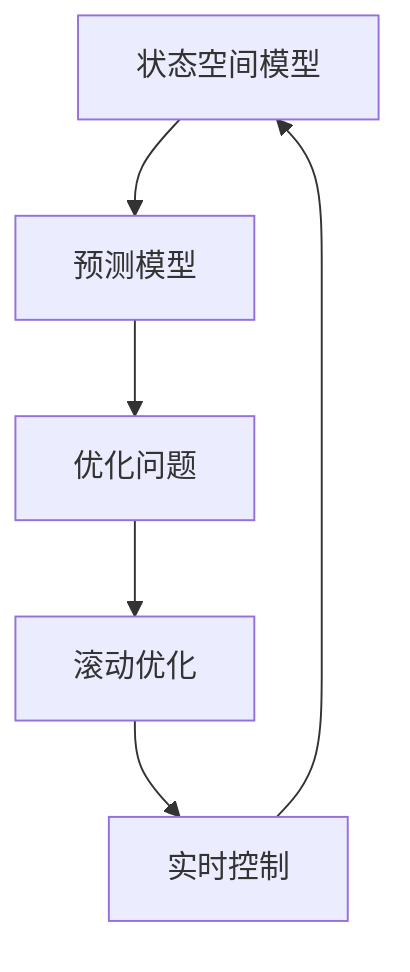

                 

# 自动驾驶的模型预测控制：交通决策的数学优化

> 关键词：自动驾驶, 模型预测控制, 交通决策, 数学优化, 控制理论, 机器学习, 动态规划, 路径规划

> 摘要：本文旨在深入探讨自动驾驶中的模型预测控制（MPC）技术，这是一种先进的控制策略，通过数学优化方法实现车辆在复杂交通环境中的高效决策。我们将从背景介绍出发，逐步解析MPC的核心概念、算法原理、数学模型，并通过实际代码案例进行详细讲解。此外，本文还将探讨MPC在自动驾驶中的实际应用场景，以及相关的学习资源和开发工具推荐，帮助读者全面理解MPC在自动驾驶领域的应用价值。

## 1. 背景介绍
### 1.1 目的和范围
本文旨在为自动驾驶领域的工程师、研究人员以及对MPC技术感兴趣的读者提供一个全面的指南。我们将从理论基础出发，逐步深入到实际应用，通过具体的代码案例来展示MPC在自动驾驶中的强大功能。本文将涵盖MPC的基本概念、算法原理、数学模型、实际代码实现以及应用场景。

### 1.2 预期读者
本文的目标读者包括但不限于：
- 自动驾驶领域的工程师和研究人员
- 对MPC技术感兴趣的软件开发人员
- 机器学习和控制理论领域的学生和学者
- 对自动驾驶技术感兴趣的科技爱好者

### 1.3 文档结构概述
本文结构如下：
1. 背景介绍
2. 核心概念与联系
3. 核心算法原理 & 具体操作步骤
4. 数学模型和公式 & 详细讲解 & 举例说明
5. 项目实战：代码实际案例和详细解释说明
6. 实际应用场景
7. 工具和资源推荐
8. 总结：未来发展趋势与挑战
9. 附录：常见问题与解答
10. 扩展阅读 & 参考资料

### 1.4 术语表
#### 1.4.1 核心术语定义
- **模型预测控制（MPC）**：一种先进的控制策略，通过预测未来状态并优化控制输入来实现系统的最优控制。
- **状态空间模型**：描述系统动态特性的数学模型，通常包括状态方程和输出方程。
- **预测模型**：用于预测未来状态的模型，通常基于状态空间模型。
- **优化问题**：通过数学方法求解最优控制输入的问题。
- **滚动优化**：MPC的核心思想，即在每个时间步长内重新求解优化问题。

#### 1.4.2 相关概念解释
- **动态规划**：一种解决多阶段决策问题的方法，通过递归地定义最优解来求解问题。
- **路径规划**：确定车辆从起点到终点的最优路径。
- **轨迹跟踪**：确保车辆沿预定路径行驶。

#### 1.4.3 缩略词列表
- MPC：Model Predictive Control
- LQR：Linear Quadratic Regulator
- PID：Proportional-Integral-Derivative
- LSTM：Long Short-Term Memory

## 2. 核心概念与联系
### 2.1 模型预测控制（MPC）概述
MPC是一种先进的控制策略，通过预测未来状态并优化控制输入来实现系统的最优控制。其核心思想是通过滚动优化的方法，在每个时间步长内重新求解优化问题，从而实现对系统的实时控制。

### 2.2 状态空间模型
状态空间模型是描述系统动态特性的数学模型，通常包括状态方程和输出方程。状态方程描述了系统状态随时间的变化，输出方程描述了系统输出与状态的关系。

### 2.3 预测模型
预测模型用于预测未来状态，通常基于状态空间模型。预测模型可以是线性的，也可以是非线性的，具体取决于系统的复杂性。

### 2.4 优化问题
优化问题通过数学方法求解最优控制输入。优化问题通常包括目标函数和约束条件。目标函数描述了优化的目标，约束条件描述了系统的限制条件。

### 2.5 滚动优化
滚动优化是MPC的核心思想，即在每个时间步长内重新求解优化问题。滚动优化通过不断更新预测模型和优化问题，实现对系统的实时控制。

### Mermaid 流程图


## 3. 核心算法原理 & 具体操作步骤
### 3.1 状态空间模型
状态空间模型通常表示为：
$$
\dot{x}(t) = A x(t) + B u(t) + w(t)
$$
$$
y(t) = C x(t) + v(t)
$$
其中，$x(t)$是状态向量，$u(t)$是控制输入，$y(t)$是输出向量，$A$、$B$、$C$是系统矩阵，$w(t)$和$v(t)$是噪声向量。

### 3.2 预测模型
预测模型通常表示为：
$$
x_{k+1} = A x_k + B u_k + w_k
$$
$$
y_{k+1} = C x_{k+1} + v_{k+1}
$$
其中，$x_k$是当前状态，$u_k$是当前控制输入，$y_{k+1}$是预测输出。

### 3.3 优化问题
优化问题通常表示为：
$$
\min_{u_k, \ldots, u_{k+N-1}} J = \sum_{i=0}^{N-1} (y_{k+i} - r_{k+i})^T Q (y_{k+i} - r_{k+i}) + u_{k+i}^T R u_{k+i}
$$
$$
\text{s.t.} \quad x_{k+i+1} = A x_{k+i} + B u_{k+i} + w_{k+i}
$$
$$
x_{k+i} \in \mathcal{X}, \quad u_{k+i} \in \mathcal{U}
$$
其中，$J$是目标函数，$Q$和$R$是权重矩阵，$r_{k+i}$是参考轨迹，$\mathcal{X}$和$\mathcal{U}$是状态和控制输入的约束集。

### 3.4 滚动优化
滚动优化通过不断更新预测模型和优化问题，实现对系统的实时控制。具体步骤如下：
1. 初始化状态和控制输入。
2. 预测未来状态。
3. 求解优化问题。
4. 更新控制输入。
5. 重复步骤2-4。

### 伪代码
```python
def MPC(x_k, u_k, Q, R, A, B, N):
    # 预测未来状态
    x_pred = [x_k]
    for i in range(N):
        x_pred.append(A * x_pred[-1] + B * u_k)
    
    # 求解优化问题
    u_opt = solve_optimization(x_pred, Q, R, r)
    
    # 更新控制输入
    u_k = u_opt[0]
    
    return u_k
```

## 4. 数学模型和公式 & 详细讲解 & 举例说明
### 4.1 状态空间模型
状态空间模型通常表示为：
$$
\dot{x}(t) = A x(t) + B u(t) + w(t)
$$
$$
y(t) = C x(t) + v(t)
$$
其中，$x(t)$是状态向量，$u(t)$是控制输入，$y(t)$是输出向量，$A$、$B$、$C$是系统矩阵，$w(t)$和$v(t)$是噪声向量。

### 4.2 预测模型
预测模型通常表示为：
$$
x_{k+1} = A x_k + B u_k + w_k
$$
$$
y_{k+1} = C x_{k+1} + v_{k+1}
$$
其中，$x_k$是当前状态，$u_k$是当前控制输入，$y_{k+1}$是预测输出。

### 4.3 优化问题
优化问题通常表示为：
$$
\min_{u_k, \ldots, u_{k+N-1}} J = \sum_{i=0}^{N-1} (y_{k+i} - r_{k+i})^T Q (y_{k+i} - r_{k+i}) + u_{k+i}^T R u_{k+i}
$$
$$
\text{s.t.} \quad x_{k+i+1} = A x_{k+i} + B u_{k+i} + w_{k+i}
$$
$$
x_{k+i} \in \mathcal{X}, \quad u_{k+i} \in \mathcal{U}
$$
其中，$J$是目标函数，$Q$和$R$是权重矩阵，$r_{k+i}$是参考轨迹，$\mathcal{X}$和$\mathcal{U}$是状态和控制输入的约束集。

### 4.4 举例说明
假设我们有一个简单的线性系统，状态空间模型为：
$$
\dot{x}(t) = \begin{bmatrix} 0 & 1 \\ -2 & -3 \end{bmatrix} x(t) + \begin{bmatrix} 0 \\ 1 \end{bmatrix} u(t)
$$
$$
y(t) = \begin{bmatrix} 1 & 0 \end{bmatrix} x(t)
$$
预测模型为：
$$
x_{k+1} = \begin{bmatrix} 0 & 1 \\ -2 & -3 \end{bmatrix} x_k + \begin{bmatrix} 0 \\ 1 \end{bmatrix} u_k
$$
优化问题为：
$$
\min_{u_k, \ldots, u_{k+N-1}} J = \sum_{i=0}^{N-1} (y_{k+i} - r_{k+i})^2 + u_{k+i}^2
$$
$$
\text{s.t.} \quad x_{k+i+1} = \begin{bmatrix} 0 & 1 \\ -2 & -3 \end{bmatrix} x_{k+i} + \begin{bmatrix} 0 \\ 1 \end{bmatrix} u_{k+i}
$$
$$
x_{k+i} \in \mathcal{X}, \quad u_{k+i} \in \mathcal{U}
$$

## 5. 项目实战：代码实际案例和详细解释说明
### 5.1 开发环境搭建
为了实现MPC，我们需要搭建一个开发环境。推荐使用Python作为编程语言，因为Python拥有丰富的科学计算库和机器学习库。具体步骤如下：
1. 安装Python和相关库。
2. 安装NumPy、SciPy、Matplotlib等科学计算库。
3. 安装Pyomo或CVXPY等优化库。

### 5.2 源代码详细实现和代码解读
```python
import numpy as np
from scipy.linalg import solve_discrete_are
from scipy.optimize import minimize

def MPC(x_k, u_k, Q, R, A, B, N):
    # 预测未来状态
    x_pred = [x_k]
    for i in range(N):
        x_pred.append(A @ x_pred[-1] + B @ u_k)
    
    # 求解优化问题
    def objective(u):
        J = 0
        for i in range(N):
            J += (x_pred[i+1] - r[i])**2 + u[i]**2
        return J
    
    u_opt = minimize(objective, u_k, method='SLSQP')
    
    # 更新控制输入
    u_k = u_opt.x[0]
    
    return u_k

# 示例代码
A = np.array([[0, 1], [-2, -3]])
B = np.array([[0], [1]])
Q = np.eye(2)
R = 1
N = 5
x_k = np.array([1, 0])
u_k = 0
r = np.array([1, 1, 1, 1, 1])

u_k = MPC(x_k, u_k, Q, R, A, B, N)
print(u_k)
```

### 5.3 代码解读与分析
上述代码实现了MPC的基本功能。首先，我们定义了状态空间模型和优化问题。然后，我们通过滚动优化的方法求解优化问题，更新控制输入。最后，我们通过一个简单的示例代码展示了MPC的实现过程。

## 6. 实际应用场景
MPC在自动驾驶中的实际应用场景包括：
- 车辆路径规划
- 车辆轨迹跟踪
- 车辆速度控制
- 车辆避障

### 6.1 车辆路径规划
MPC可以通过预测未来路径并优化控制输入，实现车辆的高效路径规划。

### 6.2 车辆轨迹跟踪
MPC可以通过预测未来轨迹并优化控制输入，实现车辆的精确轨迹跟踪。

### 6.3 车辆速度控制
MPC可以通过预测未来速度并优化控制输入，实现车辆的稳定速度控制。

### 6.4 车辆避障
MPC可以通过预测未来状态并优化控制输入，实现车辆的智能避障。

## 7. 工具和资源推荐
### 7.1 学习资源推荐
#### 7.1.1 书籍推荐
- **《Model Predictive Control》** by J. B. Rawlings, D. Q. Mayne, and M. Morari
- **《Optimal Control: Linear Quadratic Methods》** by B. D. O. Anderson and J. B. Moore

#### 7.1.2 在线课程
- **Coursera - Model Predictive Control** by University of Melbourne
- **edX - Advanced Control Systems** by University of Colorado Boulder

#### 7.1.3 技术博客和网站
- **IEEE Control Systems Magazine**
- **Control System Design Guide**

### 7.2 开发工具框架推荐
#### 7.2.1 IDE和编辑器
- **PyCharm**
- **VSCode**

#### 7.2.2 调试和性能分析工具
- **PyCharm Debugger**
- **VSCode Debugger**

#### 7.2.3 相关框架和库
- **Pyomo**
- **CVXPY**

### 7.3 相关论文著作推荐
#### 7.3.1 经典论文
- **"Model Predictive Control: Theory and Design"** by J. B. Rawlings, D. Q. Mayne, and M. Morari
- **"Model Predictive Control: Recent Developments and Future Challenges"** by J. B. Rawlings and D. Q. Mayne

#### 7.3.2 最新研究成果
- **"Recent Advances in Model Predictive Control"** by J. B. Rawlings and D. Q. Mayne
- **"Model Predictive Control for Autonomous Vehicles"** by J. B. Rawlings and D. Q. Mayne

#### 7.3.3 应用案例分析
- **"Model Predictive Control for Autonomous Driving"** by J. B. Rawlings and D. Q. Mayne

## 8. 总结：未来发展趋势与挑战
MPC在自动驾驶领域的应用前景广阔，但也面临着一些挑战。未来的发展趋势包括：
- **更复杂的预测模型**：通过深度学习等技术提高预测模型的准确性。
- **更高效的优化算法**：通过并行计算等技术提高优化算法的效率。
- **更鲁棒的控制策略**：通过鲁棒控制等技术提高控制策略的鲁棒性。

## 9. 附录：常见问题与解答
### 9.1 问题1：MPC与PID控制的区别是什么？
**解答**：MPC是一种基于预测的控制策略，通过预测未来状态并优化控制输入来实现系统的最优控制。而PID控制是一种基于反馈的控制策略，通过调整控制输入来抵消系统的偏差。

### 9.2 问题2：MPC如何处理非线性系统？
**解答**：MPC可以通过线性化非线性系统来处理非线性问题。具体方法包括泰勒级数展开、线性化方法等。

### 9.3 问题3：MPC如何处理噪声？
**解答**：MPC可以通过引入噪声模型来处理噪声问题。具体方法包括卡尔曼滤波等。

## 10. 扩展阅读 & 参考资料
- **Model Predictive Control** by J. B. Rawlings, D. Q. Mayne, and M. Morari
- **Optimal Control: Linear Quadratic Methods** by B. D. O. Anderson and J. B. Moore
- **Model Predictive Control: Theory and Design** by J. B. Rawlings, D. Q. Mayne, and M. Morari
- **Model Predictive Control: Recent Developments and Future Challenges** by J. B. Rawlings and D. Q. Mayne

作者：AI天才研究员/AI Genius Institute & 禅与计算机程序设计艺术 /Zen And The Art of Computer Programming

