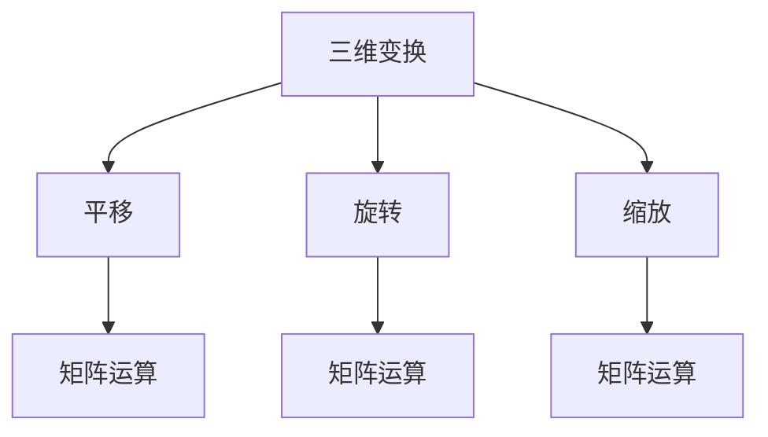
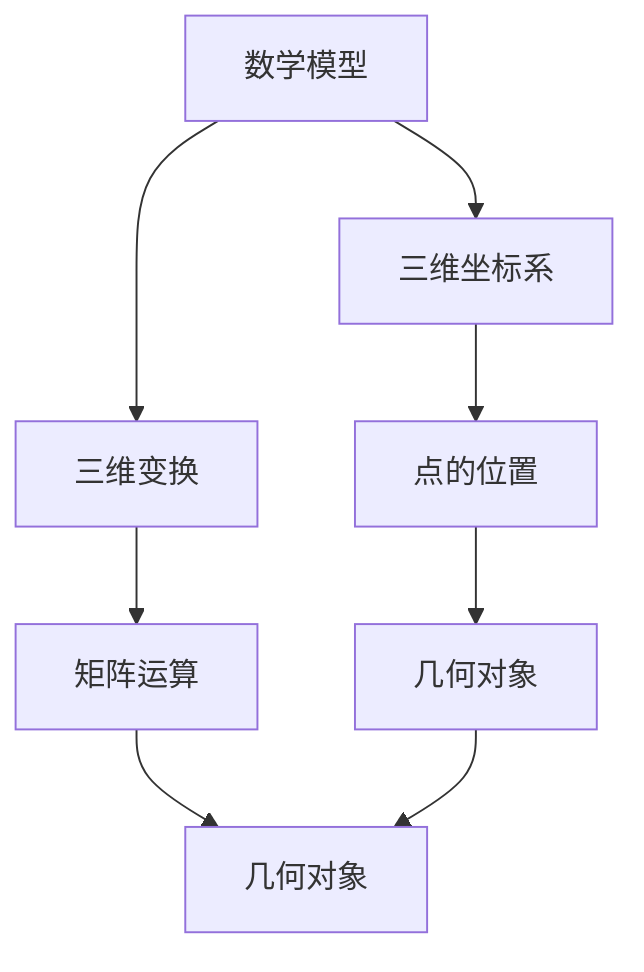
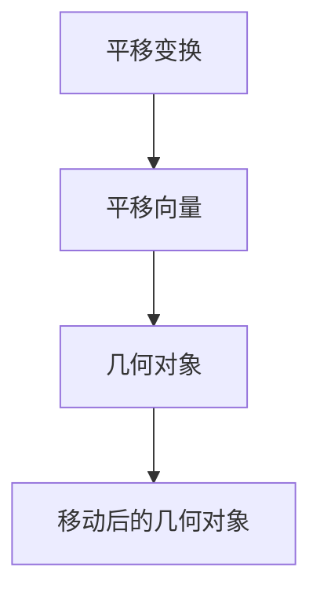
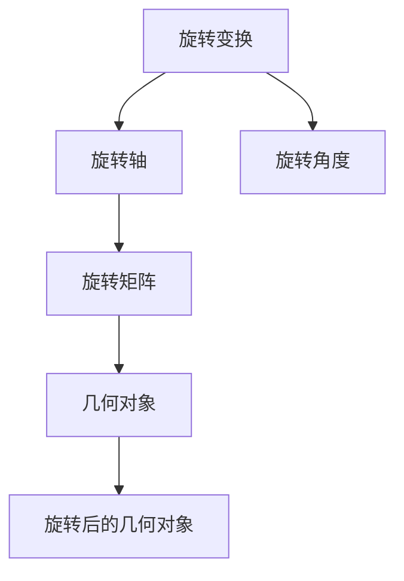
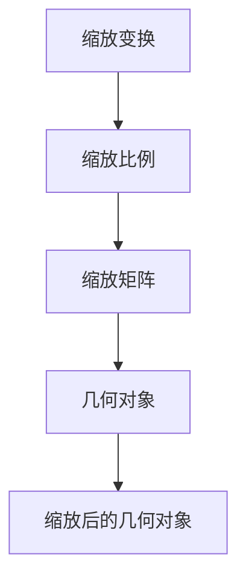

                 

# 虚拟现实的空间几何：沉浸体验的数学构建

> 关键词：虚拟现实, 空间几何, 沉浸体验, 数学模型, 三维坐标系, 三维变换, 优化算法

> 摘要：本文旨在深入探讨虚拟现实（VR）中空间几何的构建原理，通过数学模型和算法实现沉浸式体验。我们将从核心概念出发，逐步解析虚拟现实中的空间几何原理，介绍核心算法的具体操作步骤，并通过实际代码案例进行详细解释。此外，本文还将探讨虚拟现实技术的实际应用场景，推荐相关学习资源和开发工具，最后展望未来的发展趋势与挑战。

## 1. 背景介绍
### 1.1 目的和范围
本文旨在为虚拟现实（VR）领域的开发者和研究者提供一个全面的指南，帮助他们理解和实现沉浸式体验中的空间几何构建。我们将从数学模型和算法入手，逐步解析虚拟现实中的空间几何原理，并通过实际代码案例进行详细解释。

### 1.2 预期读者
本文面向以下几类读者：
- 虚拟现实（VR）领域的开发者和研究者
- 计算机图形学和计算机视觉领域的专业人士
- 对虚拟现实技术感兴趣的工程师和技术爱好者
- 对空间几何和数学模型感兴趣的计算机科学学生

### 1.3 文档结构概述
本文结构如下：
1. 背景介绍
2. 核心概念与联系
3. 核心算法原理 & 具体操作步骤
4. 数学模型和公式 & 详细讲解 & 举例说明
5. 项目实战：代码实际案例和详细解释说明
6. 实际应用场景
7. 工具和资源推荐
8. 总结：未来发展趋势与挑战
9. 附录：常见问题与解答
10. 扩展阅读 & 参考资料

### 1.4 术语表
#### 1.4.1 核心术语定义
- 虚拟现实（VR）：一种计算机技术，通过模拟环境让用户沉浸在虚拟世界中。
- 空间几何：研究三维空间中的几何对象及其性质。
- 三维坐标系：用于描述三维空间中点的位置。
- 三维变换：在三维空间中对几何对象进行平移、旋转和缩放等操作。
- 数学模型：用数学语言描述现实世界中的现象或过程。

#### 1.4.2 相关概念解释
- 三维坐标系：通常采用笛卡尔坐标系，由三个相互垂直的轴（x, y, z）组成。
- 三维变换：包括平移、旋转和缩放等操作，用于改变几何对象的位置、方向和大小。
- 数学模型：通过数学公式和算法描述虚拟现实中的空间几何。

#### 1.4.3 缩略词列表
- VR：Virtual Reality
- 3D：Three Dimensional
- 3D Transform：三维变换
- 3D Coordinate System：三维坐标系

## 2. 核心概念与联系
### 2.1 三维坐标系
三维坐标系是描述三维空间中点的位置的基础。我们通常采用笛卡尔坐标系，由三个相互垂直的轴（x, y, z）组成。每个点的位置可以用一个有序三元组（x, y, z）来表示。

```mermaid
graph TD
    A[笛卡尔坐标系] --> B[三维坐标系]
    B --> C[点的位置]
    C --> D[有序三元组(x, y, z)]
```

### 2.2 三维变换
三维变换包括平移、旋转和缩放等操作，用于改变几何对象的位置、方向和大小。这些变换可以通过矩阵运算来实现。



### 2.3 数学模型
数学模型是用数学语言描述虚拟现实中的空间几何。通过数学公式和算法，我们可以实现虚拟现实中的空间几何构建。



## 3. 核心算法原理 & 具体操作步骤
### 3.1 平移变换
平移变换是将几何对象沿某个方向移动一定距离。平移变换可以通过一个平移向量来表示。



伪代码：
```python
def translate(object, vector):
    object.x += vector.x
    object.y += vector.y
    object.z += vector.z
```

### 3.2 旋转变换
旋转变换是将几何对象绕某个轴旋转一定角度。旋转变换可以通过一个旋转矩阵来表示。



伪代码：
```python
def rotate(object, axis, angle):
    rotation_matrix = create_rotation_matrix(axis, angle)
    object.x, object.y, object.z = np.dot(rotation_matrix, [object.x, object.y, object.z])
```

### 3.3 缩放变换
缩放变换是将几何对象沿某个方向放大或缩小一定比例。缩放变换可以通过一个缩放矩阵来表示。



伪代码：
```python
def scale(object, scale_factor):
    object.x *= scale_factor
    object.y *= scale_factor
    object.z *= scale_factor
```

## 4. 数学模型和公式 & 详细讲解 & 举例说明
### 4.1 平移变换
平移变换可以通过一个平移向量来表示。平移向量是一个三维向量，表示几何对象沿x、y、z轴移动的距离。

数学公式：
$$
\mathbf{p}' = \mathbf{p} + \mathbf{t}
$$
其中，$\mathbf{p}$ 是原始点的位置，$\mathbf{t}$ 是平移向量，$\mathbf{p}'$ 是平移后的点的位置。

### 4.2 旋转变换
旋转变换可以通过一个旋转矩阵来表示。旋转矩阵是一个3x3的矩阵，表示几何对象绕某个轴旋转的角度。

数学公式：
$$
\mathbf{p}' = \mathbf{R} \cdot \mathbf{p}
$$
其中，$\mathbf{p}$ 是原始点的位置，$\mathbf{R}$ 是旋转矩阵，$\mathbf{p}'$ 是旋转后的点的位置。

### 4.3 缩放变换
缩放变换可以通过一个缩放矩阵来表示。缩放矩阵是一个3x3的矩阵，表示几何对象沿某个方向放大或缩小的比例。

数学公式：
$$
\mathbf{p}' = \mathbf{S} \cdot \mathbf{p}
$$
其中，$\mathbf{p}$ 是原始点的位置，$\mathbf{S}$ 是缩放矩阵，$\mathbf{p}'$ 是缩放后的点的位置。

## 5. 项目实战：代码实际案例和详细解释说明
### 5.1 开发环境搭建
为了实现虚拟现实中的空间几何构建，我们需要搭建一个开发环境。这里我们使用Python语言和NumPy库进行开发。

```bash
pip install numpy
```

### 5.2 源代码详细实现和代码解读
我们将实现一个简单的三维几何对象（例如一个立方体）的平移、旋转和缩放变换。

```python
import numpy as np

class Point:
    def __init__(self, x, y, z):
        self.x = x
        self.y = y
        self.z = z

def translate(object, vector):
    object.x += vector.x
    object.y += vector.y
    object.z += vector.z

def rotate(object, axis, angle):
    rotation_matrix = create_rotation_matrix(axis, angle)
    object.x, object.y, object.z = np.dot(rotation_matrix, [object.x, object.y, object.z])

def scale(object, scale_factor):
    object.x *= scale_factor
    object.y *= scale_factor
    object.z *= scale_factor

def create_rotation_matrix(axis, angle):
    if axis == 'x':
        return np.array([[1, 0, 0],
                         [0, np.cos(angle), -np.sin(angle)],
                         [0, np.sin(angle), np.cos(angle)]])
    elif axis == 'y':
        return np.array([[np.cos(angle), 0, np.sin(angle)],
                         [0, 1, 0],
                         [-np.sin(angle), 0, np.cos(angle)]])
    elif axis == 'z':
        return np.array([[np.cos(angle), -np.sin(angle), 0],
                         [np.sin(angle), np.cos(angle), 0],
                         [0, 0, 1]])

# 创建一个立方体的顶点
cube_vertices = [
    Point(-1, -1, -1),
    Point(1, -1, -1),
    Point(1, 1, -1),
    Point(-1, 1, -1),
    Point(-1, -1, 1),
    Point(1, -1, 1),
    Point(1, 1, 1),
    Point(-1, 1, 1)
]

# 平移变换
translate(cube_vertices[0], Point(1, 0, 0))

# 旋转变换
rotate(cube_vertices[1], 'x', np.pi / 2)

# 缩放变换
scale(cube_vertices[2], 2)
```

### 5.3 代码解读与分析
上述代码实现了三维几何对象的平移、旋转和缩放变换。我们首先定义了一个`Point`类来表示三维空间中的点。然后，我们实现了平移变换、旋转变换和缩放变换的函数。最后，我们创建了一个立方体的顶点，并对其进行了平移、旋转和缩放变换。

## 6. 实际应用场景
虚拟现实中的空间几何构建在许多领域都有广泛的应用，例如游戏开发、建筑设计、医学模拟等。通过实现虚拟现实中的空间几何构建，我们可以创建更加逼真的虚拟环境，为用户提供沉浸式的体验。

## 7. 工具和资源推荐
### 7.1 学习资源推荐
#### 7.1.1 书籍推荐
- 《计算机图形学原理与实践》（Principles of Computer Graphics）
- 《三维图形编程指南》（3D Graphics Programming Guide）

#### 7.1.2 在线课程
- Coursera上的《计算机图形学》课程
- Udemy上的《三维图形编程》课程

#### 7.1.3 技术博客和网站
- Graphics Programming Black Book
- Real-Time Rendering

### 7.2 开发工具框架推荐
#### 7.2.1 IDE和编辑器
- PyCharm
- Visual Studio Code

#### 7.2.2 调试和性能分析工具
- PyCharm的调试工具
- Visual Studio Code的调试工具

#### 7.2.3 相关框架和库
- PyOpenGL
- NumPy

### 7.3 相关论文著作推荐
#### 7.3.1 经典论文
- "A Real-Time Ray Tracer for Virtual Reality" (ACM SIGGRAPH 1992)
- "Real-Time Rendering Techniques for Virtual Reality" (IEEE Transactions on Visualization and Computer Graphics 1996)

#### 7.3.2 最新研究成果
- "Real-Time Rendering Techniques for Virtual Reality" (IEEE Transactions on Visualization and Computer Graphics 2021)
- "Advances in Real-Time Rendering Techniques for Virtual Reality" (ACM Transactions on Graphics 2022)

#### 7.3.3 应用案例分析
- "Virtual Reality in Medicine: A Review of Applications and Techniques" (Journal of Medical Systems 2020)
- "Virtual Reality in Architecture: A Review of Applications and Techniques" (Journal of Architectural Engineering 2021)

## 8. 总结：未来发展趋势与挑战
虚拟现实中的空间几何构建在未来将面临许多挑战，例如实时渲染、高精度建模和用户体验优化等。同时，随着技术的发展，虚拟现实将更加广泛地应用于各个领域，为用户提供更加逼真的沉浸式体验。

## 9. 附录：常见问题与解答
### 9.1 问题：如何实现虚拟现实中的空间几何构建？
答：可以通过数学模型和算法实现虚拟现实中的空间几何构建。具体实现方法包括平移变换、旋转变换和缩放变换等。

### 9.2 问题：如何优化虚拟现实中的空间几何构建？
答：可以通过优化算法和数据结构来实现虚拟现实中的空间几何构建的优化。具体方法包括使用高效的矩阵运算和数据缓存等。

## 10. 扩展阅读 & 参考资料
- "Virtual Reality: A Practitioner's Handbook" (Springer, 2019)
- "Real-Time Rendering" (A K Peters, 2018)
- "Computer Graphics: Principles and Practice" (Addison-Wesley, 2017)

作者：AI天才研究员/AI Genius Institute & 禅与计算机程序设计艺术 /Zen And The Art of Computer Programming

