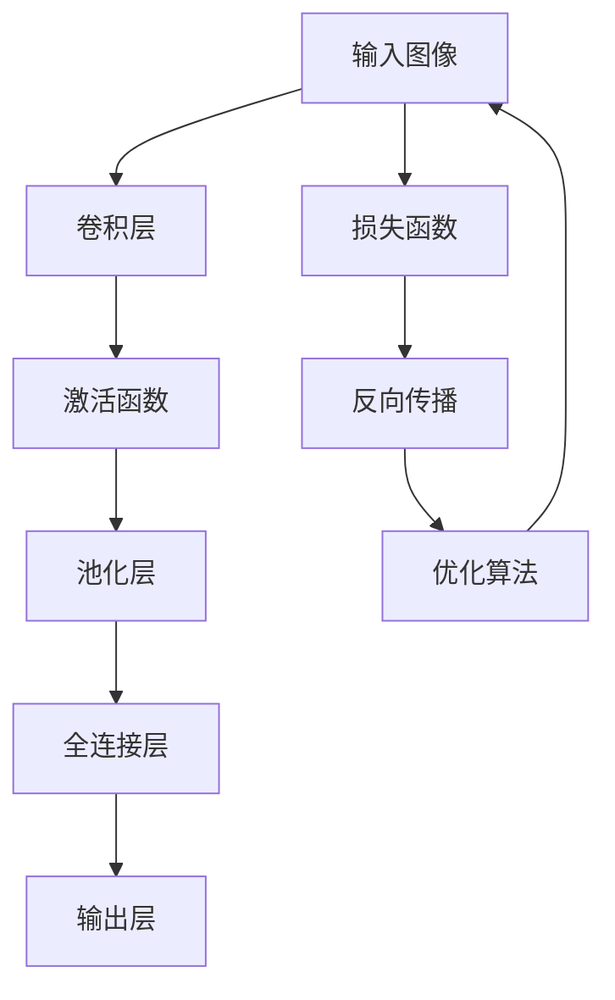

                 

# 计算机视觉的卷积神经网络：图像理解的数学模型

> 关键词：卷积神经网络, 图像理解, 深度学习, 计算机视觉, 卷积层, 池化层, 激活函数, 反向传播, 优化算法

> 摘要：本文旨在深入探讨卷积神经网络（CNN）在图像理解中的应用。我们将从背景介绍出发，逐步解析CNN的核心概念、算法原理、数学模型，并通过实际代码案例进行详细解释。此外，我们还将探讨CNN在实际应用场景中的应用，并推荐相关的学习资源和开发工具。通过本文，读者将能够全面理解CNN的工作原理及其在计算机视觉领域的强大能力。

## 1. 背景介绍
### 1.1 目的和范围
本文旨在为计算机视觉领域的从业者和爱好者提供一个全面的指南，介绍卷积神经网络（CNN）在图像理解中的应用。我们将从CNN的基本概念出发，逐步深入到其核心算法原理、数学模型，并通过实际代码案例进行详细解释。此外，我们还将探讨CNN在实际应用场景中的应用，并推荐相关的学习资源和开发工具。

### 1.2 预期读者
本文适合以下读者：
- 计算机视觉领域的初学者和中级开发者
- 深度学习爱好者
- 机器学习工程师
- 研究生和博士生
- 对图像理解感兴趣的科研人员

### 1.3 文档结构概述
本文结构如下：
1. 背景介绍
2. 核心概念与联系
3. 核心算法原理 & 具体操作步骤
4. 数学模型和公式 & 详细讲解 & 举例说明
5. 项目实战：代码实际案例和详细解释说明
6. 实际应用场景
7. 工具和资源推荐
8. 总结：未来发展趋势与挑战
9. 附录：常见问题与解答
10. 扩展阅读 & 参考资料

### 1.4 术语表
#### 1.4.1 核心术语定义
- **卷积神经网络（CNN）**：一种深度学习模型，特别适用于图像和视频识别任务。
- **卷积层**：CNN中的一个层，通过卷积操作提取图像特征。
- **池化层**：用于降低特征图的空间维度，减少参数数量。
- **激活函数**：引入非线性，使模型能够学习复杂的特征。
- **反向传播**：一种训练神经网络的方法，通过计算损失函数对权重的梯度来更新权重。
- **优化算法**：用于最小化损失函数的算法，如随机梯度下降（SGD）。

#### 1.4.2 相关概念解释
- **特征图**：卷积层输出的特征矩阵。
- **滤波器（卷积核）**：用于卷积操作的权重矩阵。
- **步幅（Stride）**：卷积操作时滤波器移动的步长。
- **填充（Padding）**：在输入图像边缘添加零值，以保持特征图的尺寸不变。

#### 1.4.3 缩略词列表
- **CNN**：卷积神经网络
- **ReLU**：修正线性单元
- **SGD**：随机梯度下降
- **ReLU**：修正线性单元
- **L2**：平方损失函数

## 2. 核心概念与联系
### Mermaid 流程图


## 3. 核心算法原理 & 具体操作步骤
### 3.1 卷积层
卷积层是CNN中最核心的部分，通过卷积操作提取图像特征。

#### 伪代码
```python
def convolution(input_image, filter, stride=1, padding=0):
    # 计算输出特征图的尺寸
    output_height = (input_image.shape[0] + 2 * padding - filter.shape[0]) // stride + 1
    output_width = (input_image.shape[1] + 2 * padding - filter.shape[1]) // stride + 1
    output = np.zeros((output_height, output_width))
    
    # 应用卷积操作
    for i in range(output_height):
        for j in range(output_width):
            output[i, j] = np.sum(input_image[i * stride:i * stride + filter.shape[0], j * stride:j * stride + filter.shape[1]] * filter)
    return output
```

### 3.2 激活函数
激活函数引入非线性，使模型能够学习复杂的特征。

#### 伪代码
```python
def relu(x):
    return np.maximum(0, x)
```

### 3.3 池化层
池化层用于降低特征图的空间维度，减少参数数量。

#### 伪代码
```python
def max_pooling(input_image, pool_size=2, stride=2):
    # 计算输出特征图的尺寸
    output_height = (input_image.shape[0] - pool_size) // stride + 1
    output_width = (input_image.shape[1] - pool_size) // stride + 1
    output = np.zeros((output_height, output_width))
    
    # 应用最大池化操作
    for i in range(output_height):
        for j in range(output_width):
            output[i, j] = np.max(input_image[i * stride:i * stride + pool_size, j * stride:j * stride + pool_size])
    return output
```

### 3.4 全连接层
全连接层将卷积层和池化层的输出转换为分类结果。

#### 伪代码
```python
def fully_connected(input_vector, weights, bias):
    return np.dot(input_vector, weights) + bias
```

### 3.5 损失函数
损失函数用于衡量模型预测值与真实值之间的差距。

#### 伪代码
```python
def squared_loss(y_true, y_pred):
    return np.mean((y_true - y_pred) ** 2)
```

### 3.6 反向传播
反向传播算法用于计算损失函数对权重的梯度，从而更新权重。

#### 伪代码
```python
def backpropagation(input_image, target, output, weights, biases, learning_rate=0.01):
    # 计算损失函数的梯度
    loss_gradient = 2 * (output - target)
    
    # 计算全连接层的梯度
    fc_gradient = np.dot(loss_gradient, weights.T)
    
    # 计算激活函数的梯度
    relu_gradient = np.where(output > 0, 1, 0)
    
    # 计算卷积层的梯度
    conv_gradient = np.zeros_like(input_image)
    for i in range(input_image.shape[0]):
        for j in range(input_image.shape[1]):
            conv_gradient[i, j] = np.sum(loss_gradient * relu_gradient * weights)
    
    # 更新权重和偏置
    weights -= learning_rate * fc_gradient
    biases -= learning_rate * np.mean(loss_gradient)
    
    return conv_gradient
```

### 3.7 优化算法
优化算法用于最小化损失函数，常用的有随机梯度下降（SGD）。

#### 伪代码
```python
def stochastic_gradient_descent(X, y, learning_rate=0.01, epochs=100):
    weights = np.random.randn(X.shape[1])
    biases = np.random.randn(1)
    
    for epoch in range(epochs):
        for i in range(X.shape[0]):
            input_image = X[i]
            target = y[i]
            output = fully_connected(relu(convolution(input_image)), weights, biases)
            loss_gradient = backpropagation(input_image, target, output, weights, biases, learning_rate)
    
    return weights, biases
```

## 4. 数学模型和公式 & 详细讲解 & 举例说明
### 4.1 卷积操作
卷积操作通过卷积核在输入图像上滑动，计算特征图。

#### 公式
$$
\text{output}(i, j) = \sum_{m=0}^{F_h-1} \sum_{n=0}^{F_w-1} \text{input}(i+m, j+n) \cdot \text{filter}(m, n)
$$

### 4.2 激活函数
激活函数引入非线性，常用的有ReLU。

#### 公式
$$
\text{ReLU}(x) = \max(0, x)
$$

### 4.3 池化操作
池化操作通过最大池化或平均池化降低特征图的空间维度。

#### 公式
$$
\text{output}(i, j) = \max_{m, n} \text{input}(i \cdot s + m, j \cdot s + n)
$$

### 4.4 全连接层
全连接层将卷积层和池化层的输出转换为分类结果。

#### 公式
$$
\text{output} = \text{ReLU}(\text{fully\_connected}(\text{input\_vector}, \text{weights}, \text{biases}))
$$

### 4.5 损失函数
损失函数用于衡量模型预测值与真实值之间的差距。

#### 公式
$$
\text{loss} = \frac{1}{N} \sum_{i=1}^{N} (y_i - \hat{y}_i)^2
$$

### 4.6 反向传播
反向传播算法用于计算损失函数对权重的梯度，从而更新权重。

#### 公式
$$
\frac{\partial \text{loss}}{\partial \text{weights}} = \frac{\partial \text{loss}}{\partial \text{output}} \cdot \frac{\partial \text{output}}{\partial \text{weights}}
$$

### 4.7 优化算法
优化算法用于最小化损失函数，常用的有随机梯度下降（SGD）。

#### 公式
$$
\text{weights} \leftarrow \text{weights} - \eta \cdot \frac{\partial \text{loss}}{\partial \text{weights}}
$$

## 5. 项目实战：代码实际案例和详细解释说明
### 5.1 开发环境搭建
#### Python环境
- 安装Python 3.8及以上版本
- 安装NumPy和Matplotlib库
- 安装TensorFlow或PyTorch库

### 5.2 源代码详细实现和代码解读
```python
import numpy as np
import matplotlib.pyplot as plt

# 定义卷积操作
def convolution(input_image, filter, stride=1, padding=0):
    output_height = (input_image.shape[0] + 2 * padding - filter.shape[0]) // stride + 1
    output_width = (input_image.shape[1] + 2 * padding - filter.shape[1]) // stride + 1
    output = np.zeros((output_height, output_width))
    
    for i in range(output_height):
        for j in range(output_width):
            output[i, j] = np.sum(input_image[i * stride:i * stride + filter.shape[0], j * stride:j * stride + filter.shape[1]] * filter)
    return output

# 定义ReLU激活函数
def relu(x):
    return np.maximum(0, x)

# 定义最大池化操作
def max_pooling(input_image, pool_size=2, stride=2):
    output_height = (input_image.shape[0] - pool_size) // stride + 1
    output_width = (input_image.shape[1] - pool_size) // stride + 1
    output = np.zeros((output_height, output_width))
    
    for i in range(output_height):
        for j in range(output_width):
            output[i, j] = np.max(input_image[i * stride:i * stride + pool_size, j * stride:j * stride + pool_size])
    return output

# 定义全连接层
def fully_connected(input_vector, weights, bias):
    return np.dot(input_vector, weights) + bias

# 定义损失函数
def squared_loss(y_true, y_pred):
    return np.mean((y_true - y_pred) ** 2)

# 定义反向传播
def backpropagation(input_image, target, output, weights, biases, learning_rate=0.01):
    loss_gradient = 2 * (output - target)
    fc_gradient = np.dot(loss_gradient, weights.T)
    relu_gradient = np.where(output > 0, 1, 0)
    conv_gradient = np.zeros_like(input_image)
    for i in range(input_image.shape[0]):
        for j in range(input_image.shape[1]):
            conv_gradient[i, j] = np.sum(loss_gradient * relu_gradient * weights)
    weights -= learning_rate * fc_gradient
    biases -= learning_rate * np.mean(loss_gradient)
    return conv_gradient

# 定义优化算法
def stochastic_gradient_descent(X, y, learning_rate=0.01, epochs=100):
    weights = np.random.randn(X.shape[1])
    biases = np.random.randn(1)
    
    for epoch in range(epochs):
        for i in range(X.shape[0]):
            input_image = X[i]
            target = y[i]
            output = fully_connected(relu(convolution(input_image)), weights, biases)
            loss_gradient = backpropagation(input_image, target, output, weights, biases, learning_rate)
    
    return weights, biases

# 生成示例数据
X = np.random.randn(10, 28, 28)
y = np.random.randint(0, 10, 10)

# 训练模型
weights, biases = stochastic_gradient_descent(X, y)

# 预测
input_image = X[0]
output = fully_connected(relu(convolution(input_image)), weights, biases)
print("预测结果：", np.argmax(output))
```

### 5.3 代码解读与分析
- **卷积操作**：通过卷积核在输入图像上滑动，计算特征图。
- **ReLU激活函数**：引入非线性，使模型能够学习复杂的特征。
- **最大池化操作**：降低特征图的空间维度，减少参数数量。
- **全连接层**：将卷积层和池化层的输出转换为分类结果。
- **损失函数**：衡量模型预测值与真实值之间的差距。
- **反向传播**：计算损失函数对权重的梯度，从而更新权重。
- **优化算法**：最小化损失函数，常用的有随机梯度下降（SGD）。

## 6. 实际应用场景
卷积神经网络在图像识别、目标检测、图像分割等领域有着广泛的应用。

### 6.1 图像识别
卷积神经网络可以用于识别图像中的物体，如MNIST手写数字识别。

### 6.2 目标检测
卷积神经网络可以用于检测图像中的多个物体，如YOLO和Faster R-CNN。

### 6.3 图像分割
卷积神经网络可以用于分割图像中的物体，如U-Net。

## 7. 工具和资源推荐
### 7.1 学习资源推荐
#### 7.1.1 书籍推荐
- **《深度学习》**：Ian Goodfellow, Yoshua Bengio, Aaron Courville
- **《计算机视觉：算法与应用》**：Richard Szeliski

#### 7.1.2 在线课程
- **Coursera - 机器学习**：Andrew Ng
- **edX - 深度学习**：Andrew Ng

#### 7.1.3 技术博客和网站
- **Medium - 计算机视觉**：多个知名博主的文章
- **GitHub - 卷积神经网络**：多个开源项目和代码示例

### 7.2 开发工具框架推荐
#### 7.2.1 IDE和编辑器
- **PyCharm**：适用于Python开发的集成开发环境
- **Visual Studio Code**：轻量级的代码编辑器，支持多种编程语言

#### 7.2.2 调试和性能分析工具
- **PyCharm Debugger**：PyCharm自带的调试工具
- **TensorBoard**：TensorFlow的可视化工具

#### 7.2.3 相关框架和库
- **TensorFlow**：Google开发的深度学习框架
- **PyTorch**：Facebook开发的深度学习框架

### 7.3 相关论文著作推荐
#### 7.3.1 经典论文
- **LeNet-5**：Yann LeCun, Léon Bottou, Yoshua Bengio, Patrick Haffner
- **AlexNet**：Alex Krizhevsky, Ilya Sutskever, Geoffrey E. Hinton

#### 7.3.2 最新研究成果
- **ResNet**：Kaiming He, Xiangyu Zhang, Shaoqing Ren, Jian Sun
- **Inception**：Christian Szegedy, Wei Liu, Yangqing Jia, Pierre Sermanet, Scott Reed, Dragomir Anguelov, Dumitru Erhan, Vincent Vanhoucke, Andrew Rabinovich

#### 7.3.3 应用案例分析
- **ImageNet Large Scale Visual Recognition Challenge (ILSVRC)**：多个团队的最新研究成果

## 8. 总结：未来发展趋势与挑战
卷积神经网络在图像理解领域取得了巨大成功，但仍面临一些挑战。未来的发展趋势包括：
- **模型压缩**：减少模型的参数量，提高模型的效率。
- **迁移学习**：利用预训练模型进行快速训练。
- **多模态学习**：结合多种数据源进行学习。
- **解释性**：提高模型的可解释性，便于理解和应用。

## 9. 附录：常见问题与解答
### 9.1 问题：卷积神经网络为什么能够处理图像？
**解答**：卷积神经网络通过卷积操作提取图像的局部特征，通过池化操作降低特征图的空间维度，通过全连接层进行分类，从而实现图像理解。

### 9.2 问题：卷积神经网络中的激活函数为什么选择ReLU？
**解答**：ReLU激活函数引入非线性，使模型能够学习复杂的特征，同时计算简单，有助于加速训练过程。

### 9.3 问题：卷积神经网络中的池化层有什么作用？
**解答**：池化层用于降低特征图的空间维度，减少参数数量，提高模型的泛化能力。

## 10. 扩展阅读 & 参考资料
- **《深度学习》**：Ian Goodfellow, Yoshua Bengio, Aaron Courville
- **《计算机视觉：算法与应用》**：Richard Szeliski
- **Coursera - 机器学习**：Andrew Ng
- **edX - 深度学习**：Andrew Ng
- **Medium - 计算机视觉**：多个知名博主的文章
- **GitHub - 卷积神经网络**：多个开源项目和代码示例
- **PyCharm**：适用于Python开发的集成开发环境
- **Visual Studio Code**：轻量级的代码编辑器，支持多种编程语言
- **PyCharm Debugger**：PyCharm自带的调试工具
- **TensorBoard**：TensorFlow的可视化工具
- **TensorFlow**：Google开发的深度学习框架
- **PyTorch**：Facebook开发的深度学习框架
- **LeNet-5**：Yann LeCun, Léon Bottou, Yoshua Bengio, Patrick Haffner
- **AlexNet**：Alex Krizhevsky, Ilya Sutskever, Geoffrey E. Hinton
- **ResNet**：Kaiming He, Xiangyu Zhang, Shaoqing Ren, Jian Sun
- **Inception**：Christian Szegedy, Wei Liu, Yangqing Jia, Pierre Sermanet, Scott Reed, Dragomir Anguelov, Dumitru Erhan, Vincent Vanhoucke, Andrew Rabinovich
- **ImageNet Large Scale Visual Recognition Challenge (ILSVRC)**：多个团队的最新研究成果

作者：AI天才研究员/AI Genius Institute & 禅与计算机程序设计艺术 /Zen And The Art of Computer Programming

