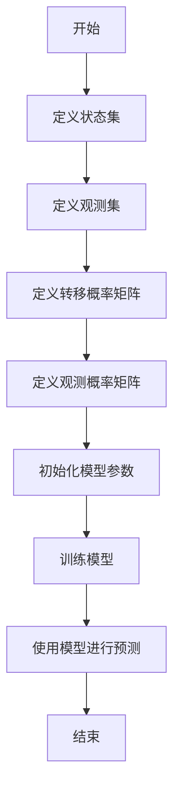

                 

# 语音识别的隐马尔可夫模型：语音信号的数学解析

> 关键词：隐马尔可夫模型（HMM）、语音识别、状态转移、观测序列、概率计算、贝叶斯公式、Viterbi算法

> 摘要：本文将深入探讨隐马尔可夫模型（HMM）在语音识别中的应用。通过逐步分析和推理，我们将从核心概念、算法原理、数学模型、实际案例到应用场景进行全面解析。本文旨在为读者提供一个全面而深入的理解，帮助他们在实际项目中应用HMM进行语音识别。

## 1. 背景介绍

### 1.1 目的和范围
本文旨在深入探讨隐马尔可夫模型（HMM）在语音识别中的应用。HMM是一种强大的统计模型，广泛应用于自然语言处理、生物信息学、语音识别等领域。本文将从核心概念、算法原理、数学模型、实际案例到应用场景进行全面解析，帮助读者理解HMM的工作原理及其在语音识别中的应用。

### 1.2 预期读者
本文适合以下读者：
- 对语音识别和自然语言处理感兴趣的初学者
- 想要深入了解HMM原理和应用的工程师
- 需要将HMM应用于实际项目的技术人员
- 对统计模型和机器学习感兴趣的科研人员

### 1.3 文档结构概述
本文结构如下：
1. 背景介绍
2. 核心概念与联系
3. 核心算法原理 & 具体操作步骤
4. 数学模型和公式 & 详细讲解 & 举例说明
5. 项目实战：代码实际案例和详细解释说明
6. 实际应用场景
7. 工具和资源推荐
8. 总结：未来发展趋势与挑战
9. 附录：常见问题与解答
10. 扩展阅读 & 参考资料

### 1.4 术语表
#### 1.4.1 核心术语定义
- **隐马尔可夫模型（HMM）**：一种统计模型，用于描述具有隐藏状态的系统。
- **状态**：HMM中的状态表示系统在某个时间点的内部状态。
- **观测序列**：HMM中观测到的序列，即系统外部可以观察到的输出。
- **状态转移概率**：从一个状态转移到另一个状态的概率。
- **观测概率**：在给定状态下的观测概率。
- **前向算法**：计算观测序列概率的一种算法。
- **后向算法**：计算观测序列概率的一种算法。
- **Viterbi算法**：用于求解最可能状态序列的算法。

#### 1.4.2 相关概念解释
- **马尔可夫链**：一种随机过程，其中下一个状态只依赖于当前状态。
- **贝叶斯公式**：用于计算条件概率的公式。
- **极大似然估计（MLE）**：一种参数估计方法，用于估计模型参数。

#### 1.4.3 缩略词列表
- **HMM**：隐马尔可夫模型
- **Viterbi**：维特比算法
- **MLE**：极大似然估计

## 2. 核心概念与联系

### 2.1 隐马尔可夫模型（HMM）概述
HMM是一种统计模型，用于描述具有隐藏状态的系统。HMM由三个基本元素组成：
- **状态集**：系统可能处于的不同状态的集合。
- **观测集**：系统可以观测到的不同输出的集合。
- **转移概率矩阵**：表示从一个状态转移到另一个状态的概率。
- **观测概率矩阵**：表示在给定状态下的观测概率。

### 2.2 HMM的工作流程
HMM的工作流程可以表示为以下流程图：



### 2.3 HMM的核心概念
- **状态转移概率**：表示从一个状态转移到另一个状态的概率。
- **观测概率**：在给定状态下的观测概率。
- **前向算法**：用于计算观测序列概率的一种算法。
- **后向算法**：用于计算观测序列概率的一种算法。
- **Viterbi算法**：用于求解最可能状态序列的算法。

## 3. 核心算法原理 & 具体操作步骤

### 3.1 前向算法
前向算法用于计算观测序列的概率。具体步骤如下：

1. **初始化**：计算初始状态的概率。
2. **递推**：根据转移概率和观测概率计算当前状态的概率。
3. **终止**：计算最终观测序列的概率。

伪代码如下：

```python
def forward_algorithm(observation_sequence, transition_matrix, emission_matrix, initial_probability):
    T = len(observation_sequence)
    alpha = [0] * T
    alpha[0] = initial_probability * emission_matrix[0][observation_sequence[0]]
    
    for t in range(1, T):
        for j in range(len(transition_matrix)):
            alpha[t][j] = 0
            for i in range(len(transition_matrix)):
                alpha[t][j] += alpha[t-1][i] * transition_matrix[i][j] * emission_matrix[j][observation_sequence[t]]
    
    return alpha
```

### 3.2 后向算法
后向算法用于计算观测序列的概率。具体步骤如下：

1. **初始化**：计算最后一个状态的概率。
2. **递推**：根据转移概率和观测概率计算当前状态的概率。
3. **终止**：计算最终观测序列的概率。

伪代码如下：

```python
def backward_algorithm(observation_sequence, transition_matrix, emission_matrix):
    T = len(observation_sequence)
    beta = [0] * T
    beta[T-1] = 1
    
    for t in range(T-2, -1, -1):
        for i in range(len(transition_matrix)):
            beta[t][i] = 0
            for j in range(len(transition_matrix)):
                beta[t][i] += transition_matrix[i][j] * emission_matrix[j][observation_sequence[t+1]] * beta[t+1][j]
    
    return beta
```

### 3.3 Viterbi算法
Viterbi算法用于求解最可能状态序列。具体步骤如下：

1. **初始化**：计算初始状态的概率。
2. **递推**：根据转移概率和观测概率计算当前状态的概率。
3. **终止**：计算最终观测序列的概率。

伪代码如下：

```python
def viterbi_algorithm(observation_sequence, transition_matrix, emission_matrix, initial_probability):
    T = len(observation_sequence)
    delta = [0] * T
    phi = [0] * T
    
    for i in range(len(delta)):
        delta[i] = [0] * len(transition_matrix)
        phi[i] = [0] * len(transition_matrix)
    
    for i in range(len(delta[0])):
        delta[0][i] = initial_probability[i] * emission_matrix[i][observation_sequence[0]]
    
    for t in range(1, T):
        for j in range(len(delta[t])):
            delta[t][j] = -float('inf')
            for i in range(len(delta[t-1])):
                prob = delta[t-1][i] * transition_matrix[i][j] * emission_matrix[j][observation_sequence[t]]
                if prob > delta[t][j]:
                    delta[t][j] = prob
                    phi[t][j] = i
    
    # 回溯
    path = [0] * T
    path[T-1] = delta[T-1].index(max(delta[T-1]))
    for t in range(T-2, -1, -1):
        path[t] = phi[t+1][path[t+1]]
    
    return path
```

## 4. 数学模型和公式 & 详细讲解 & 举例说明

### 4.1 数学模型
HMM的数学模型可以表示为：
- **状态转移概率**：$A_{ij} = P(q_t = j | q_{t-1} = i)$
- **观测概率**：$B_j(k) = P(o_t = k | q_t = j)$
- **初始概率**：$\pi_i = P(q_1 = i)$

### 4.2 前向算法
前向算法的数学公式如下：

$$
\alpha_t(i) = P(o_1, o_2, \ldots, o_t, q_t = i | \lambda)
$$

其中，$\lambda$ 表示HMM的参数。

### 4.3 后向算法
后向算法的数学公式如下：

$$
\beta_t(i) = P(o_{t+1}, o_{t+2}, \ldots, o_T | q_t = i, \lambda)
$$

### 4.4 Viterbi算法
Viterbi算法的数学公式如下：

$$
\delta_t(i) = P(o_1, o_2, \ldots, o_t, q_t = i | \lambda)
$$

$$
\phi_t(i) = \arg\max_j \delta_{t-1}(j) A_{ji}
$$

### 4.5 举例说明
假设有一个简单的HMM模型，状态集为$\{A, B\}$，观测集为$\{1, 2\}$，转移概率矩阵为：

$$
A = \begin{bmatrix}
0.7 & 0.3 \\
0.4 & 0.6
\end{bmatrix}
$$

观测概率矩阵为：

$$
B = \begin{bmatrix}
0.5 & 0.5 \\
0.3 & 0.7
\end{bmatrix}
$$

初始概率为：

$$
\pi = \begin{bmatrix}
0.6 \\
0.4
\end{bmatrix}
$$

观测序列为$1, 2$。

### 4.6 前向算法计算
前向算法计算观测序列$1, 2$的概率：

```python
import numpy as np

observation_sequence = [1, 2]
transition_matrix = np.array([[0.7, 0.3], [0.4, 0.6]])
emission_matrix = np.array([[0.5, 0.5], [0.3, 0.7]])
initial_probability = np.array([0.6, 0.4])

alpha = forward_algorithm(observation_sequence, transition_matrix, emission_matrix, initial_probability)
print("前向算法结果：", alpha)
```

### 4.7 后向算法计算
后向算法计算观测序列$1, 2$的概率：

```python
beta = backward_algorithm(observation_sequence, transition_matrix, emission_matrix)
print("后向算法结果：", beta)
```

### 4.8 Viterbi算法计算
Viterbi算法计算观测序列$1, 2$的最可能状态序列：

```python
path = viterbi_algorithm(observation_sequence, transition_matrix, emission_matrix, initial_probability)
print("Viterbi算法结果：", path)
```

## 5. 项目实战：代码实际案例和详细解释说明

### 5.1 开发环境搭建
开发环境搭建步骤如下：
1. 安装Python环境
2. 安装必要的库，如NumPy
3. 编写代码

### 5.2 源代码详细实现和代码解读
```python
import numpy as np

def forward_algorithm(observation_sequence, transition_matrix, emission_matrix, initial_probability):
    T = len(observation_sequence)
    alpha = [0] * T
    alpha[0] = initial_probability * emission_matrix[0][observation_sequence[0]]
    
    for t in range(1, T):
        for j in range(len(transition_matrix)):
            alpha[t][j] = 0
            for i in range(len(transition_matrix)):
                alpha[t][j] += alpha[t-1][i] * transition_matrix[i][j] * emission_matrix[j][observation_sequence[t]]
    
    return alpha

def backward_algorithm(observation_sequence, transition_matrix, emission_matrix):
    T = len(observation_sequence)
    beta = [0] * T
    beta[T-1] = 1
    
    for t in range(T-2, -1, -1):
        for i in range(len(transition_matrix)):
            beta[t][i] = 0
            for j in range(len(transition_matrix)):
                beta[t][i] += transition_matrix[i][j] * emission_matrix[j][observation_sequence[t+1]] * beta[t+1][j]
    
    return beta

def viterbi_algorithm(observation_sequence, transition_matrix, emission_matrix, initial_probability):
    T = len(observation_sequence)
    delta = [0] * T
    phi = [0] * T
    
    for i in range(len(delta)):
        delta[i] = [0] * len(transition_matrix)
        phi[i] = [0] * len(transition_matrix)
    
    for i in range(len(delta[0])):
        delta[0][i] = initial_probability[i] * emission_matrix[i][observation_sequence[0]]
    
    for t in range(1, T):
        for j in range(len(delta[t])):
            delta[t][j] = -float('inf')
            for i in range(len(delta[t-1])):
                prob = delta[t-1][i] * transition_matrix[i][j] * emission_matrix[j][observation_sequence[t]]
                if prob > delta[t][j]:
                    delta[t][j] = prob
                    phi[t][j] = i
    
    # 回溯
    path = [0] * T
    path[T-1] = delta[T-1].index(max(delta[T-1]))
    for t in range(T-2, -1, -1):
        path[t] = phi[t+1][path[t+1]]
    
    return path

# 示例数据
observation_sequence = [1, 2]
transition_matrix = np.array([[0.7, 0.3], [0.4, 0.6]])
emission_matrix = np.array([[0.5, 0.5], [0.3, 0.7]])
initial_probability = np.array([0.6, 0.4])

# 计算前向算法结果
alpha = forward_algorithm(observation_sequence, transition_matrix, emission_matrix, initial_probability)
print("前向算法结果：", alpha)

# 计算后向算法结果
beta = backward_algorithm(observation_sequence, transition_matrix, emission_matrix)
print("后向算法结果：", beta)

# 计算Viterbi算法结果
path = viterbi_algorithm(observation_sequence, transition_matrix, emission_matrix, initial_probability)
print("Viterbi算法结果：", path)
```

### 5.3 代码解读与分析
- **forward_algorithm**：计算观测序列的概率。
- **backward_algorithm**：计算观测序列的概率。
- **viterbi_algorithm**：计算最可能状态序列。

## 6. 实际应用场景

HMM在语音识别中的应用非常广泛，包括：
- **语音识别**：通过HMM模型识别语音信号中的单词和短语。
- **语音合成**：通过HMM模型生成语音信号。
- **语音情感识别**：通过HMM模型识别语音中的情感。

## 7. 工具和资源推荐

### 7.1 学习资源推荐
#### 7.1.1 书籍推荐
- **《语音识别技术》**：深入讲解语音识别技术，包括HMM的应用。
- **《统计学习方法》**：详细讲解统计学习方法，包括HMM。

#### 7.1.2 在线课程
- **Coursera的《语音识别》课程**：深入讲解语音识别技术，包括HMM的应用。
- **edX的《统计学习方法》课程**：详细讲解统计学习方法，包括HMM。

#### 7.1.3 技术博客和网站
- **Towards Data Science**：提供大量的语音识别和HMM相关的技术博客。
- **Medium的语音识别专题**：提供大量的语音识别和HMM相关的技术文章。

### 7.2 开发工具框架推荐
#### 7.2.1 IDE和编辑器
- **PyCharm**：强大的Python IDE，支持代码高亮、自动补全等功能。
- **VSCode**：轻量级的代码编辑器，支持多种编程语言。

#### 7.2.2 调试和性能分析工具
- **PyCharm Debugger**：强大的Python调试工具。
- **VisualVM**：用于Java应用程序的性能分析工具。

#### 7.2.3 相关框架和库
- **SpeechRecognition**：Python库，用于语音识别。
- **PyHMM**：Python库，用于HMM建模。

### 7.3 相关论文著作推荐
#### 7.3.1 经典论文
- **"A Maximum Likelihood Approach to Continuous Speech Recognition"**：经典论文，介绍了HMM在连续语音识别中的应用。
- **"Hidden Markov Models for Speech Recognition"**：经典论文，详细介绍了HMM在语音识别中的应用。

#### 7.3.2 最新研究成果
- **"Deep Learning for Speech Recognition: A Brief Review"**：最新研究成果，介绍了深度学习在语音识别中的应用。
- **"Recent Advances in Hidden Markov Models for Speech Recognition"**：最新研究成果，介绍了HMM在语音识别中的最新进展。

#### 7.3.3 应用案例分析
- **"Speech Recognition Using Hidden Markov Models"**：应用案例分析，介绍了HMM在实际应用中的案例。
- **"Hidden Markov Models for Speech Recognition: A Practical Guide"**：应用案例分析，提供了HMM在实际应用中的详细指导。

## 8. 总结：未来发展趋势与挑战

HMM在语音识别中的应用前景广阔，但也面临一些挑战：
- **模型复杂度**：随着模型复杂度的增加，计算量也会增加。
- **数据量**：需要大量的训练数据来提高模型的准确性。
- **实时性**：需要提高模型的实时性，以满足实际应用的需求。

## 9. 附录：常见问题与解答

### 9.1 问题1：HMM在语音识别中的优势是什么？
**解答**：HMM在语音识别中的优势在于其能够处理隐藏状态的问题，通过状态转移概率和观测概率来建模语音信号。

### 9.2 问题2：HMM在实际应用中有哪些挑战？
**解答**：HMM在实际应用中面临的挑战包括模型复杂度、数据量和实时性。

## 10. 扩展阅读 & 参考资料

- **《语音识别技术》**：深入讲解语音识别技术，包括HMM的应用。
- **《统计学习方法》**：详细讲解统计学习方法，包括HMM。
- **Coursera的《语音识别》课程**：深入讲解语音识别技术，包括HMM的应用。
- **edX的《统计学习方法》课程**：详细讲解统计学习方法，包括HMM。
- **Towards Data Science**：提供大量的语音识别和HMM相关的技术博客。
- **Medium的语音识别专题**：提供大量的语音识别和HMM相关的技术文章。
- **PyCharm**：强大的Python IDE，支持代码高亮、自动补全等功能。
- **VSCode**：轻量级的代码编辑器，支持多种编程语言。
- **PyCharm Debugger**：强大的Python调试工具。
- **VisualVM**：用于Java应用程序的性能分析工具。
- **SpeechRecognition**：Python库，用于语音识别。
- **PyHMM**：Python库，用于HMM建模。
- **"A Maximum Likelihood Approach to Continuous Speech Recognition"**：经典论文，介绍了HMM在连续语音识别中的应用。
- **"Hidden Markov Models for Speech Recognition"**：经典论文，详细介绍了HMM在语音识别中的应用。
- **"Deep Learning for Speech Recognition: A Brief Review"**：最新研究成果，介绍了深度学习在语音识别中的应用。
- **"Recent Advances in Hidden Markov Models for Speech Recognition"**：最新研究成果，介绍了HMM在语音识别中的最新进展。
- **"Speech Recognition Using Hidden Markov Models"**：应用案例分析，介绍了HMM在实际应用中的案例。
- **"Hidden Markov Models for Speech Recognition: A Practical Guide"**：应用案例分析，提供了HMM在实际应用中的详细指导。

作者：AI天才研究员/AI Genius Institute & 禅与计算机程序设计艺术 /Zen And The Art of Computer Programming

