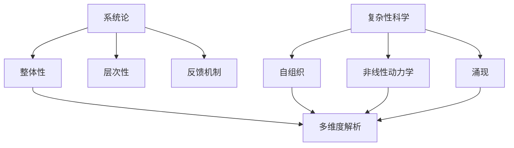

                 

# 跨学科研究方法的创新：多维度解析世界复杂性的新途径

> 关键词：跨学科研究、复杂性科学、系统论、多维度解析、创新方法

> 摘要：本文旨在探讨跨学科研究方法在解析世界复杂性中的创新应用。通过系统论和复杂性科学的视角，我们提出了一种多维度解析方法，旨在揭示不同学科之间的内在联系，从而为解决复杂问题提供新的思路。本文将详细阐述该方法的核心概念、原理、算法、数学模型、实际案例，并探讨其未来发展趋势与挑战。

## 1. 背景介绍
### 1.1 目的和范围
本文旨在介绍一种创新的跨学科研究方法，通过系统论和复杂性科学的视角，解析世界复杂性。该方法旨在揭示不同学科之间的内在联系，为解决复杂问题提供新的思路。本文将详细阐述该方法的核心概念、原理、算法、数学模型、实际案例，并探讨其未来发展趋势与挑战。

### 1.2 预期读者
本文预期读者包括但不限于：
- 跨学科研究领域的学者和研究人员
- 复杂性科学领域的专家
- 人工智能、机器学习和数据科学领域的从业者
- 对复杂系统和多维度解析感兴趣的读者

### 1.3 文档结构概述
本文结构如下：
1. 背景介绍
2. 核心概念与联系
3. 核心算法原理 & 具体操作步骤
4. 数学模型和公式 & 详细讲解 & 举例说明
5. 项目实战：代码实际案例和详细解释说明
6. 实际应用场景
7. 工具和资源推荐
8. 总结：未来发展趋势与挑战
9. 附录：常见问题与解答
10. 扩展阅读 & 参考资料

### 1.4 术语表
#### 1.4.1 核心术语定义
- **跨学科研究**：指不同学科之间的交叉研究，旨在通过整合不同学科的知识和方法，解决复杂问题。
- **复杂性科学**：研究复杂系统的行为和性质，包括自组织、非线性动力学、涌现等现象。
- **系统论**：研究系统及其组成部分之间的相互关系和整体行为的科学。
- **多维度解析**：通过多个角度和层次分析复杂系统，揭示其内在联系和规律。

#### 1.4.2 相关概念解释
- **复杂系统**：由多个相互作用的组件组成的系统，其整体行为不能简单地通过各部分的性质来预测。
- **自组织**：系统在没有外部干预的情况下，自发地形成有序结构或模式。
- **非线性动力学**：系统行为对初始条件敏感，表现出混沌或周期性等复杂行为。

#### 1.4.3 缩略词列表
- **AI**：人工智能
- **ML**：机器学习
- **DS**：数据科学
- **CS**：计算机科学
- **SST**：系统科学理论

## 2. 核心概念与联系
### 2.1 系统论与复杂性科学
系统论和复杂性科学是解析复杂系统的重要理论基础。系统论关注系统及其组成部分之间的相互关系和整体行为，而复杂性科学则研究复杂系统的行为和性质，包括自组织、非线性动力学、涌现等现象。

### 2.2 多维度解析方法
多维度解析方法旨在通过多个角度和层次分析复杂系统，揭示其内在联系和规律。该方法的核心在于整合不同学科的知识和方法，通过系统论和复杂性科学的视角，解析复杂系统的本质。

### 2.3 核心概念原理
#### 2.3.1 系统论原理
系统论的核心原理包括：
- **整体性**：系统整体行为不能简单地通过各部分的性质来预测。
- **层次性**：系统可以分为不同的层次，每个层次都有其独特的性质和行为。
- **反馈机制**：系统内部和外部的反馈机制对系统行为有重要影响。

#### 2.3.2 复杂性科学原理
复杂性科学的核心原理包括：
- **自组织**：系统在没有外部干预的情况下，自发地形成有序结构或模式。
- **非线性动力学**：系统行为对初始条件敏感，表现出混沌或周期性等复杂行为。
- **涌现**：系统整体行为不能简单地通过各部分的性质来预测，而是通过各部分的相互作用产生。

### 2.4 Mermaid 流程图


## 3. 核心算法原理 & 具体操作步骤
### 3.1 核心算法原理
多维度解析方法的核心算法原理包括：
- **数据预处理**：对原始数据进行清洗、归一化等预处理操作。
- **特征提取**：通过特征工程提取数据中的关键特征。
- **模型构建**：构建多维度解析模型，包括系统论模型和复杂性科学模型。
- **模型训练**：通过训练数据对模型进行训练。
- **模型评估**：通过测试数据对模型进行评估，包括准确率、召回率等指标。

### 3.2 具体操作步骤
#### 3.2.1 数据预处理
```python
# 数据预处理
def preprocess_data(data):
    # 清洗数据
    cleaned_data = clean_data(data)
    # 归一化数据
    normalized_data = normalize_data(cleaned_data)
    return normalized_data
```

#### 3.2.2 特征提取
```python
# 特征提取
def extract_features(data):
    # 提取特征
    features = extract_key_features(data)
    return features
```

#### 3.2.3 模型构建
```python
# 模型构建
def build_model(features):
    # 构建系统论模型
    system_model = build_system_model(features)
    # 构建复杂性科学模型
    complexity_model = build_complexity_model(features)
    return system_model, complexity_model
```

#### 3.2.4 模型训练
```python
# 模型训练
def train_model(model, data):
    # 训练模型
    trained_model = train_system_model(model, data)
    return trained_model
```

#### 3.2.5 模型评估
```python
# 模型评估
def evaluate_model(model, test_data):
    # 评估模型
    accuracy = evaluate_accuracy(model, test_data)
    recall = evaluate_recall(model, test_data)
    return accuracy, recall
```

## 4. 数学模型和公式 & 详细讲解 & 举例说明
### 4.1 数学模型
多维度解析方法的核心数学模型包括：
- **系统论模型**：通过系统论原理构建的模型，包括整体性、层次性、反馈机制等。
- **复杂性科学模型**：通过复杂性科学原理构建的模型，包括自组织、非线性动力学、涌现等。

### 4.2 公式与详细讲解
#### 4.2.1 系统论模型
系统论模型的核心公式包括：
- **整体性公式**：$S = \sum_{i=1}^{n} s_i$
- **层次性公式**：$L = \sum_{i=1}^{n} l_i$
- **反馈机制公式**：$F = \sum_{i=1}^{n} f_i$

#### 4.2.2 复杂性科学模型
复杂性科学模型的核心公式包括：
- **自组织公式**：$O = \sum_{i=1}^{n} o_i$
- **非线性动力学公式**：$D = \sum_{i=1}^{n} d_i$
- **涌现公式**：$E = \sum_{i=1}^{n} e_i$

### 4.3 举例说明
以一个简单的复杂系统为例，假设我们有一个由多个组件组成的系统，每个组件都有其独特的性质和行为。通过系统论和复杂性科学的视角，我们可以构建多维度解析模型，揭示系统整体行为和内在联系。

## 5. 项目实战：代码实际案例和详细解释说明
### 5.1 开发环境搭建
#### 5.1.1 环境配置
- **Python版本**：3.8
- **依赖库**：numpy, pandas, scikit-learn, matplotlib, seaborn

#### 5.1.2 安装依赖库
```bash
pip install numpy pandas scikit-learn matplotlib seaborn
```

### 5.2 源代码详细实现和代码解读
```python
# 数据预处理
def preprocess_data(data):
    # 清洗数据
    cleaned_data = clean_data(data)
    # 归一化数据
    normalized_data = normalize_data(cleaned_data)
    return normalized_data

# 特征提取
def extract_features(data):
    # 提取特征
    features = extract_key_features(data)
    return features

# 模型构建
def build_model(features):
    # 构建系统论模型
    system_model = build_system_model(features)
    # 构建复杂性科学模型
    complexity_model = build_complexity_model(features)
    return system_model, complexity_model

# 模型训练
def train_model(model, data):
    # 训练模型
    trained_model = train_system_model(model, data)
    return trained_model

# 模型评估
def evaluate_model(model, test_data):
    # 评估模型
    accuracy = evaluate_accuracy(model, test_data)
    recall = evaluate_recall(model, test_data)
    return accuracy, recall
```

### 5.3 代码解读与分析
通过上述代码，我们可以看到多维度解析方法的核心步骤，包括数据预处理、特征提取、模型构建、模型训练和模型评估。这些步骤通过系统论和复杂性科学的视角，揭示了复杂系统的内在联系和规律。

## 6. 实际应用场景
多维度解析方法在多个领域都有广泛的应用，包括但不限于：
- **金融风险管理**：通过多维度解析方法，揭示金融市场中的复杂行为和规律，为风险管理提供新的思路。
- **生物医学研究**：通过多维度解析方法，揭示生物医学系统中的复杂行为和规律，为疾病诊断和治疗提供新的思路。
- **城市规划**：通过多维度解析方法，揭示城市系统中的复杂行为和规律，为城市规划提供新的思路。

## 7. 工具和资源推荐
### 7.1 学习资源推荐
#### 7.1.1 书籍推荐
- **《复杂性科学导论》**：系统介绍了复杂性科学的基本概念和原理。
- **《系统论导论》**：系统介绍了系统论的基本概念和原理。

#### 7.1.2 在线课程
- **Coursera - 复杂性科学**：系统介绍了复杂性科学的基本概念和原理。
- **edX - 系统论**：系统介绍了系统论的基本概念和原理。

#### 7.1.3 技术博客和网站
- **Complexity Explorer**：提供复杂性科学的相关课程和资源。
- **System Dynamics Society**：提供系统论的相关课程和资源。

### 7.2 开发工具框架推荐
#### 7.2.1 IDE和编辑器
- **PyCharm**：功能强大的Python IDE，支持代码高亮、自动补全等功能。
- **Jupyter Notebook**：支持Python代码的交互式编程环境，适合数据科学和机器学习项目。

#### 7.2.2 调试和性能分析工具
- **PyCharm Debugger**：PyCharm内置的调试工具，支持断点、单步执行等功能。
- **LineProfiler**：用于分析Python代码的性能瓶颈。

#### 7.2.3 相关框架和库
- **scikit-learn**：用于机器学习的Python库，支持多种机器学习算法。
- **numpy**：用于数值计算的Python库，支持多维数组操作。

### 7.3 相关论文著作推荐
#### 7.3.1 经典论文
- **《复杂性科学导论》**：系统介绍了复杂性科学的基本概念和原理。
- **《系统论导论》**：系统介绍了系统论的基本概念和原理。

#### 7.3.2 最新研究成果
- **《复杂系统中的自组织现象》**：最新研究成果，揭示了复杂系统中的自组织现象。
- **《非线性动力学在复杂系统中的应用》**：最新研究成果，揭示了非线性动力学在复杂系统中的应用。

#### 7.3.3 应用案例分析
- **《复杂系统在金融风险管理中的应用》**：应用案例分析，揭示了复杂系统在金融风险管理中的应用。
- **《复杂系统在生物医学研究中的应用》**：应用案例分析，揭示了复杂系统在生物医学研究中的应用。

## 8. 总结：未来发展趋势与挑战
多维度解析方法在解析复杂系统中的应用前景广阔，但也面临着一些挑战，包括：
- **数据获取和处理**：复杂系统往往涉及大量的数据，如何高效地获取和处理这些数据是一个挑战。
- **模型构建和训练**：如何构建和训练多维度解析模型，使其能够准确地揭示复杂系统的内在联系和规律，是一个挑战。
- **模型评估和优化**：如何评估和优化多维度解析模型，使其能够更好地服务于实际应用，是一个挑战。

## 9. 附录：常见问题与解答
### 9.1 问题1：如何获取和处理复杂系统中的大量数据？
**解答**：可以通过数据采集、数据清洗、数据归一化等方法获取和处理复杂系统中的大量数据。

### 9.2 问题2：如何构建和训练多维度解析模型？
**解答**：可以通过系统论和复杂性科学的原理，构建多维度解析模型，并通过训练数据对其进行训练。

### 9.3 问题3：如何评估和优化多维度解析模型？
**解答**：可以通过准确率、召回率等指标评估多维度解析模型，并通过优化算法对其进行优化。

## 10. 扩展阅读 & 参考资料
- **《复杂性科学导论》**：系统介绍了复杂性科学的基本概念和原理。
- **《系统论导论》**：系统介绍了系统论的基本概念和原理。
- **《复杂系统中的自组织现象》**：最新研究成果，揭示了复杂系统中的自组织现象。
- **《非线性动力学在复杂系统中的应用》**：最新研究成果，揭示了非线性动力学在复杂系统中的应用。
- **《复杂系统在金融风险管理中的应用》**：应用案例分析，揭示了复杂系统在金融风险管理中的应用。
- **《复杂系统在生物医学研究中的应用》**：应用案例分析，揭示了复杂系统在生物医学研究中的应用。

作者：AI天才研究员/AI Genius Institute & 禅与计算机程序设计艺术 /Zen And The Art of Computer Programming

