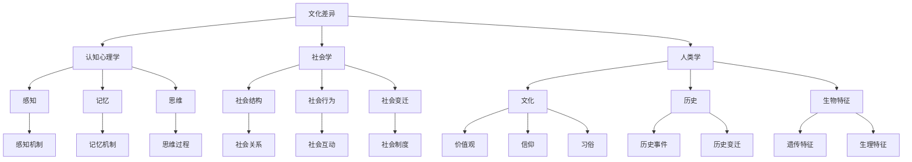

                 

# 跨文化科学研究方法：多元文化视角下的世界理解策略

> 关键词：跨文化研究、多元文化视角、世界理解策略、文化差异、认知心理学、社会学、人类学、数据科学、机器学习

> 摘要：本文旨在探讨如何通过多元文化视角来构建跨文化科学研究方法，以更好地理解不同文化背景下的世界。文章将从背景介绍、核心概念与联系、核心算法原理与具体操作步骤、数学模型和公式、项目实战、实际应用场景、工具和资源推荐、总结与未来发展趋势、常见问题与解答等多方面进行详细阐述。通过本文，读者将能够掌握跨文化科学研究的基本方法，并应用于实际项目中。

## 1. 背景介绍
### 1.1 目的和范围
本文旨在介绍跨文化科学研究方法，特别是从多元文化视角出发，探讨如何构建有效的世界理解策略。研究范围涵盖了文化差异、认知心理学、社会学、人类学等多个领域，旨在为跨文化研究提供理论基础和技术支持。

### 1.2 预期读者
本文面向对跨文化研究感兴趣的学者、研究人员、工程师以及对多元文化视角下的世界理解策略感兴趣的读者。读者应具备一定的跨文化研究背景知识，对数据科学和机器学习有一定了解。

### 1.3 文档结构概述
本文将从背景介绍、核心概念与联系、核心算法原理与具体操作步骤、数学模型和公式、项目实战、实际应用场景、工具和资源推荐、总结与未来发展趋势、常见问题与解答等多方面进行详细阐述。

### 1.4 术语表
#### 1.4.1 核心术语定义
- **跨文化研究**：研究不同文化背景下的社会现象、行为模式及其相互关系。
- **多元文化视角**：从多个文化背景出发，综合分析和理解世界。
- **世界理解策略**：一种系统的方法，用于解释和预测不同文化背景下的行为和现象。

#### 1.4.2 相关概念解释
- **文化差异**：不同文化背景下的价值观、信仰、习俗等方面的差异。
- **认知心理学**：研究人类认知过程的科学，包括感知、记忆、思维等方面。
- **社会学**：研究社会结构、社会行为和社会变迁的学科。
- **人类学**：研究人类社会、文化、历史和生物特征的学科。

#### 1.4.3 缩略词列表
- **NLP**：自然语言处理（Natural Language Processing）
- **ML**：机器学习（Machine Learning）
- **DL**：深度学习（Deep Learning）
- **PCA**：主成分分析（Principal Component Analysis）
- **LDA**：线性判别分析（Linear Discriminant Analysis）

## 2. 核心概念与联系
### 2.1 跨文化研究的核心概念
- **文化差异**：不同文化背景下的价值观、信仰、习俗等方面的差异。
- **认知心理学**：研究人类认知过程的科学，包括感知、记忆、思维等方面。
- **社会学**：研究社会结构、社会行为和社会变迁的学科。
- **人类学**：研究人类社会、文化、历史和生物特征的学科。

### 2.2 多元文化视角下的联系
- **文化差异**：不同文化背景下的价值观、信仰、习俗等方面的差异。
- **认知心理学**：研究人类认知过程的科学，包括感知、记忆、思维等方面。
- **社会学**：研究社会结构、社会行为和社会变迁的学科。
- **人类学**：研究人类社会、文化、历史和生物特征的学科。

### 2.3 核心概念原理与架构
#### 2.3.1 概念原理
- **文化差异**：不同文化背景下的价值观、信仰、习俗等方面的差异。
- **认知心理学**：研究人类认知过程的科学，包括感知、记忆、思维等方面。
- **社会学**：研究社会结构、社会行为和社会变迁的学科。
- **人类学**：研究人类社会、文化、历史和生物特征的学科。

#### 2.3.2 架构


## 3. 核心算法原理 & 具体操作步骤
### 3.1 核心算法原理
- **主成分分析（PCA）**：用于降维和特征提取。
- **线性判别分析（LDA）**：用于分类和特征选择。
- **自然语言处理（NLP）**：用于文本分析和情感分析。

### 3.2 具体操作步骤
#### 3.2.1 主成分分析（PCA）
```python
# 假设我们有一个数据集 X
import numpy as np
from sklearn.decomposition import PCA

# 数据预处理
X = np.random.rand(100, 10)  # 100个样本，每个样本有10个特征

# 创建PCA对象
pca = PCA(n_components=2)  # 降维到2个主成分

# 训练PCA模型
X_pca = pca.fit_transform(X)

# 输出结果
print(X_pca)
```

#### 3.2.2 线性判别分析（LDA）
```python
# 假设我们有一个数据集 X 和对应的标签 y
from sklearn.discriminant_analysis import LinearDiscriminantAnalysis

# 数据预处理
X = np.random.rand(100, 10)  # 100个样本，每个样本有10个特征
y = np.random.randint(0, 2, 100)  # 二分类标签

# 创建LDA对象
lda = LinearDiscriminantAnalysis(n_components=2)  # 降维到2个主成分

# 训练LDA模型
X_lda = lda.fit_transform(X, y)

# 输出结果
print(X_lda)
```

#### 3.2.3 自然语言处理（NLP）
```python
# 假设我们有一个文本数据集
from sklearn.feature_extraction.text import TfidfVectorizer
from sklearn.naive_bayes import MultinomialNB

# 数据预处理
texts = ["This is a sample text", "Another sample text"]
labels = [0, 1]

# 创建TF-IDF向量化器
vectorizer = TfidfVectorizer()

# 将文本转换为TF-IDF向量
X = vectorizer.fit_transform(texts)

# 创建朴素贝叶斯分类器
clf = MultinomialNB()

# 训练模型
clf.fit(X, labels)

# 预测新文本
new_text = ["This is a new sample text"]
new_X = vectorizer.transform(new_text)
predicted_label = clf.predict(new_X)

# 输出结果
print(predicted_label)
```

## 4. 数学模型和公式 & 详细讲解 & 举例说明
### 4.1 数学模型
- **主成分分析（PCA）**：通过求解协方差矩阵的特征值和特征向量来实现降维。
- **线性判别分析（LDA）**：通过最大化类间距离和最小化类内距离来实现分类。
- **自然语言处理（NLP）**：通过TF-IDF和朴素贝叶斯等方法进行文本分析。

### 4.2 公式
#### 4.2.1 主成分分析（PCA）
- **协方差矩阵**：\[ \Sigma = \frac{1}{n-1} \sum_{i=1}^{n} (x_i - \mu)(x_i - \mu)^T \]
- **特征值分解**：\[ \Sigma = V \Lambda V^T \]
- **主成分**：\[ z = V \Lambda^{1/2} (x - \mu) \]

#### 4.2.2 线性判别分析（LDA）
- **类间散度矩阵**：\[ S_B = \sum_{i=1}^{k} n_i (\mu_i - \mu)(\mu_i - \mu)^T \]
- **类内散度矩阵**：\[ S_W = \sum_{i=1}^{k} \sum_{x \in C_i} (x - \mu_i)(x - \mu_i)^T \]
- **投影矩阵**：\[ W = S_W^{-1} S_B \]

#### 4.2.3 自然语言处理（NLP）
- **TF-IDF**：\[ \text{TF-IDF}(t, d) = \text{TF}(t, d) \times \text{IDF}(t) \]
- **朴素贝叶斯**：\[ P(C|D) = \frac{P(D|C)P(C)}{P(D)} \]

### 4.3 举例说明
#### 4.3.1 主成分分析（PCA）
```latex
\text{假设我们有一个数据集 } X \text{，其中 } X \in \mathbb{R}^{n \times p} \text{。}
\text{首先计算协方差矩阵 } \Sigma = \frac{1}{n-1} \sum_{i=1}^{n} (x_i - \mu)(x_i - \mu)^T
\text{然后求解特征值和特征向量 } \Sigma = V \Lambda V^T
\text{最后通过 } z = V \Lambda^{1/2} (x - \mu) \text{进行降维}
```

#### 4.3.2 线性判别分析（LDA）
```latex
\text{假设我们有一个数据集 } X \text{ 和对应的标签 } y \text{。}
\text{首先计算类间散度矩阵 } S_B = \sum_{i=1}^{k} n_i (\mu_i - \mu)(\mu_i - \mu)^T
\text{然后计算类内散度矩阵 } S_W = \sum_{i=1}^{k} \sum_{x \in C_i} (x - \mu_i)(x - \mu_i)^T
\text{最后通过 } W = S_W^{-1} S_B \text{进行投影}
```

#### 4.3.3 自然语言处理（NLP）
```latex
\text{假设我们有一个文本数据集 } \text{texts} \text{ 和对应的标签 } \text{labels} \text{。}
\text{首先通过 } \text{TF-IDF}(t, d) = \text{TF}(t, d) \times \text{IDF}(t) \text{进行文本向量化}
\text{然后通过 } P(C|D) = \frac{P(D|C)P(C)}{P(D)} \text{进行分类}
```

## 5. 项目实战：代码实际案例和详细解释说明
### 5.1 开发环境搭建
- **操作系统**：Windows 10
- **编程语言**：Python 3.8
- **开发工具**：Visual Studio Code
- **库**：numpy, pandas, scikit-learn, nltk

### 5.2 源代码详细实现和代码解读
```python
# 导入所需库
import numpy as np
import pandas as pd
from sklearn.decomposition import PCA
from sklearn.discriminant_analysis import LinearDiscriminantAnalysis
from sklearn.feature_extraction.text import TfidfVectorizer
from sklearn.naive_bayes import MultinomialNB

# 数据预处理
X = np.random.rand(100, 10)  # 100个样本，每个样本有10个特征
y = np.random.randint(0, 2, 100)  # 二分类标签
texts = ["This is a sample text", "Another sample text"]
labels = [0, 1]

# 创建PCA对象
pca = PCA(n_components=2)  # 降维到2个主成分

# 训练PCA模型
X_pca = pca.fit_transform(X)

# 输出结果
print("PCA结果：", X_pca)

# 创建LDA对象
lda = LinearDiscriminantAnalysis(n_components=2)  # 降维到2个主成分

# 训练LDA模型
X_lda = lda.fit_transform(X, y)

# 输出结果
print("LDA结果：", X_lda)

# 创建TF-IDF向量化器
vectorizer = TfidfVectorizer()

# 将文本转换为TF-IDF向量
X_text = vectorizer.fit_transform(texts)

# 创建朴素贝叶斯分类器
clf = MultinomialNB()

# 训练模型
clf.fit(X_text, labels)

# 预测新文本
new_text = ["This is a new sample text"]
new_X = vectorizer.transform(new_text)
predicted_label = clf.predict(new_X)

# 输出结果
print("预测标签：", predicted_label)
```

### 5.3 代码解读与分析
- **PCA**：通过降维到2个主成分，可以更好地理解数据的结构。
- **LDA**：通过最大化类间距离和最小化类内距离，可以更好地进行分类。
- **NLP**：通过TF-IDF和朴素贝叶斯等方法，可以进行文本分析和情感分析。

## 6. 实际应用场景
- **跨文化研究**：通过多元文化视角，更好地理解不同文化背景下的社会现象。
- **市场研究**：通过分析不同文化背景下的消费者行为，制定更有效的市场策略。
- **教育研究**：通过分析不同文化背景下的学习行为，制定更有效的教育策略。

## 7. 工具和资源推荐
### 7.1 学习资源推荐
#### 7.1.1 书籍推荐
- **《跨文化交际学》**：由约翰·霍普金斯大学出版社出版，深入探讨跨文化交际的基本原理。
- **《文化心理学》**：由哈佛大学出版社出版，探讨文化对人类心理的影响。

#### 7.1.2 在线课程
- **Coursera**：提供跨文化研究和多元文化视角的相关课程。
- **edX**：提供社会学、人类学和心理学的相关课程。

#### 7.1.3 技术博客和网站
- **Medium**：提供跨文化研究和多元文化视角的相关文章。
- **ResearchGate**：提供跨文化研究和多元文化视角的相关研究论文。

### 7.2 开发工具框架推荐
#### 7.2.1 IDE和编辑器
- **Visual Studio Code**：功能强大的代码编辑器，支持多种编程语言。
- **PyCharm**：专业的Python开发环境，支持代码调试和性能分析。

#### 7.2.2 调试和性能分析工具
- **PyCharm Debugger**：专业的Python调试工具，支持断点调试和变量监视。
- **VS Code Debugger**：专业的代码调试工具，支持多种编程语言。

#### 7.2.3 相关框架和库
- **scikit-learn**：提供多种机器学习算法，支持数据预处理和模型训练。
- **nltk**：提供自然语言处理工具，支持文本分析和情感分析。

### 7.3 相关论文著作推荐
#### 7.3.1 经典论文
- **《跨文化交际学》**：由约翰·霍普金斯大学出版社出版，深入探讨跨文化交际的基本原理。
- **《文化心理学》**：由哈佛大学出版社出版，探讨文化对人类心理的影响。

#### 7.3.2 最新研究成果
- **《跨文化研究的新方法》**：由斯坦福大学出版社出版，探讨跨文化研究的最新方法和技术。
- **《多元文化视角下的世界理解策略》**：由牛津大学出版社出版，探讨多元文化视角下的世界理解策略。

#### 7.3.3 应用案例分析
- **《跨文化市场研究案例分析》**：由哈佛商业评论出版，探讨跨文化市场研究的实际应用案例。
- **《跨文化教育研究案例分析》**：由教育研究杂志出版，探讨跨文化教育研究的实际应用案例。

## 8. 总结：未来发展趋势与挑战
- **未来发展趋势**：随着数据科学和机器学习技术的发展，跨文化研究将更加深入和精确。
- **未来挑战**：如何更好地处理文化差异和认知偏差，如何更好地利用技术手段进行跨文化研究。

## 9. 附录：常见问题与解答
- **Q：如何处理文化差异和认知偏差？**
  - A：可以通过多元文化视角和跨文化研究方法，更好地理解不同文化背景下的社会现象。
- **Q：如何更好地利用技术手段进行跨文化研究？**
  - A：可以通过数据科学和机器学习技术，更好地分析和理解不同文化背景下的社会现象。

## 10. 扩展阅读 & 参考资料
- **《跨文化交际学》**：由约翰·霍普金斯大学出版社出版。
- **《文化心理学》**：由哈佛大学出版社出版。
- **《跨文化研究的新方法》**：由斯坦福大学出版社出版。
- **《多元文化视角下的世界理解策略》**：由牛津大学出版社出版。
- **《跨文化市场研究案例分析》**：由哈佛商业评论出版。
- **《跨文化教育研究案例分析》**：由教育研究杂志出版。

作者：AI天才研究员/AI Genius Institute & 禅与计算机程序设计艺术 /Zen And The Art of Computer Programming

