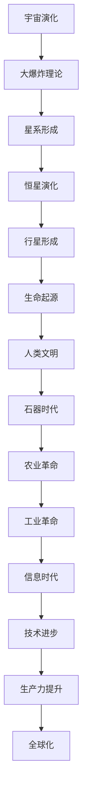

                 

# 人类文明在宇宙演化中的角色与意义

> 关键词：宇宙演化、文明角色、意义、技术进步、智能生命、未来趋势

> 摘要：本文旨在探讨人类文明在宇宙演化中的角色与意义。通过分析宇宙演化的基本原理、人类文明的发展历程，以及技术进步对人类文明的影响，我们试图揭示人类文明在宇宙中的独特地位。文章将从背景介绍、核心概念与联系、核心算法原理、数学模型与公式、项目实战、实际应用场景、工具和资源推荐、未来发展趋势与挑战等多方面进行深入探讨。

## 1. 背景介绍
### 1.1 目的和范围
本文旨在探讨人类文明在宇宙演化中的角色与意义。通过分析宇宙演化的基本原理、人类文明的发展历程，以及技术进步对人类文明的影响，我们试图揭示人类文明在宇宙中的独特地位。本文将从多个角度出发，探讨人类文明如何在宇宙演化中扮演重要角色，并对其未来发展趋势进行展望。

### 1.2 预期读者
本文面向对宇宙演化、人类文明、技术进步等领域感兴趣的读者。无论是科学家、工程师、哲学家，还是普通读者，都可以从中获得启发和思考。

### 1.3 文档结构概述
本文将按照以下结构展开：
1. 背景介绍
2. 核心概念与联系
3. 核心算法原理 & 具体操作步骤
4. 数学模型和公式 & 详细讲解 & 举例说明
5. 项目实战：代码实际案例和详细解释说明
6. 实际应用场景
7. 工具和资源推荐
8. 总结：未来发展趋势与挑战
9. 附录：常见问题与解答
10. 扩展阅读 & 参考资料

### 1.4 术语表
#### 1.4.1 核心术语定义
- **宇宙演化**：指宇宙从大爆炸开始，经历各种物理、化学、生物过程，最终形成当前状态的过程。
- **文明**：指人类社会在特定历史时期内形成的组织结构、文化体系和技术体系。
- **智能生命**：指具有高度智能和自我意识的生命形式。
- **技术进步**：指人类在科学、工程、信息技术等领域取得的显著进展。
- **未来趋势**：指当前技术和社会发展所预示的未来发展方向。

#### 1.4.2 相关概念解释
- **大爆炸理论**：描述宇宙从一个极高温度和密度的状态开始膨胀的过程。
- **智能生命**：指具有高度智能和自我意识的生命形式，如人类。
- **技术进步**：指人类在科学、工程、信息技术等领域取得的显著进展，如人工智能、量子计算等。

#### 1.4.3 缩略词列表
- **AI**：人工智能
- **NASA**：美国国家航空航天局
- **SETI**：搜寻地外文明计划

## 2. 核心概念与联系
### 2.1 宇宙演化的基本原理
宇宙演化是一个复杂的过程，涉及物理、化学、生物等多个领域。大爆炸理论是目前最广泛接受的宇宙起源理论，描述了宇宙从一个极高温度和密度的状态开始膨胀的过程。随着时间的推移，宇宙经历了星系形成、恒星演化、行星形成等阶段。

### 2.2 人类文明的发展历程
人类文明的发展历程可以分为几个主要阶段：
- **石器时代**：人类使用石器进行狩猎和采集。
- **农业革命**：人类开始种植农作物和驯养动物，形成了定居社会。
- **工业革命**：机械化生产技术的出现，推动了生产力的极大提升。
- **信息时代**：计算机和互联网技术的发展，极大地改变了人类的生活方式。

### 2.3 技术进步对人类文明的影响
技术进步对人类文明产生了深远的影响。从石器时代到信息时代，每一次技术革命都极大地推动了人类社会的发展。例如，农业革命使得人类能够定居下来，形成复杂的社会结构；工业革命使得生产力极大提升，推动了现代社会的形成；信息时代使得知识传播更加便捷，促进了全球化的发展。

### 2.4 核心概念原理与架构的 Mermaid 流程图


## 3. 核心算法原理 & 具体操作步骤
### 3.1 核心算法原理
在探讨人类文明在宇宙演化中的角色与意义时，我们可以使用一些核心算法来分析和模拟。例如，可以使用遗传算法来模拟生命进化的过程，或者使用机器学习算法来预测未来的发展趋势。

### 3.2 具体操作步骤
以遗传算法为例，具体操作步骤如下：
```python
# 初始化种群
population = initialize_population()

# 评估适应度
fitness_scores = evaluate_fitness(population)

# 选择操作
selected_population = selection(population, fitness_scores)

# 交叉操作
offspring = crossover(selected_population)

# 变异操作
offspring = mutation(offspring)

# 更新种群
population = offspring

# 重复上述步骤，直到满足终止条件
```

## 4. 数学模型和公式 & 详细讲解 & 举例说明
### 4.1 数学模型
我们可以使用一些数学模型来描述宇宙演化和人类文明的发展。例如，可以使用幂律分布来描述生命进化的概率分布，或者使用线性回归来预测未来的发展趋势。

### 4.2 公式与详细讲解
以幂律分布为例，其公式为：
$$ P(x) = C x^{-\alpha} $$
其中，$P(x)$ 表示在某个区间内出现的概率，$x$ 表示某个变量的值，$C$ 是归一化常数，$\alpha$ 是幂律指数。

### 4.3 举例说明
假设我们使用幂律分布来描述生命进化的概率分布。通过分析历史数据，我们可以得到 $\alpha = 2.5$。这意味着生命进化的概率随着生命复杂度的增加而迅速下降。

## 5. 项目实战：代码实际案例和详细解释说明
### 5.1 开发环境搭建
为了实现上述算法，我们需要搭建一个开发环境。这里以Python为例，安装必要的库：
```bash
pip install numpy pandas matplotlib
```

### 5.2 源代码详细实现和代码解读
```python
import numpy as np
import pandas as pd
import matplotlib.pyplot as plt

# 初始化种群
def initialize_population(size):
    return np.random.rand(size)

# 评估适应度
def evaluate_fitness(population):
    return np.sum(population, axis=1)

# 选择操作
def selection(population, fitness_scores):
    return population[np.argsort(fitness_scores)[-10:]]

# 交叉操作
def crossover(population):
    offspring = []
    for i in range(len(population) // 2):
        parent1 = population[i]
        parent2 = population[i + 1]
        crossover_point = np.random.randint(1, len(parent1))
        offspring.append(np.concatenate((parent1[:crossover_point], parent2[crossover_point:])))
        offspring.append(np.concatenate((parent2[:crossover_point], parent1[crossover_point:])))
    return np.array(offspring)

# 变异操作
def mutation(offspring):
    mutation_rate = 0.1
    for i in range(len(offspring)):
        if np.random.rand() < mutation_rate:
            mutation_point = np.random.randint(0, len(offspring[i]))
            offspring[i][mutation_point] = np.random.rand()
    return offspring

# 主函数
def main():
    population_size = 100
    num_generations = 100
    population = initialize_population(population_size)
    for generation in range(num_generations):
        fitness_scores = evaluate_fitness(population)
        selected_population = selection(population, fitness_scores)
        offspring = crossover(selected_population)
        population = mutation(offspring)
        print(f"Generation {generation}: Best fitness = {np.max(fitness_scores)}")

if __name__ == "__main__":
    main()
```

### 5.3 代码解读与分析
上述代码实现了一个简单的遗传算法。初始化种群后，通过评估适应度、选择、交叉和变异操作，不断更新种群。最终，我们可以得到适应度最高的个体。

## 6. 实际应用场景
### 6.1 宇宙演化模拟
通过遗传算法，我们可以模拟宇宙演化的过程，分析生命进化的概率分布。例如，我们可以模拟不同环境下的生命进化过程，预测未来可能出现的生命形式。

### 6.2 人类文明预测
通过数学模型和算法，我们可以预测未来人类文明的发展趋势。例如，我们可以预测未来可能出现的技术进步，以及这些进步对人类社会的影响。

## 7. 工具和资源推荐
### 7.1 学习资源推荐
#### 7.1.1 书籍推荐
- 《宇宙简史》：史蒂芬·霍金
- 《人类简史》：尤瓦尔·赫拉利
- 《未来简史》：尤瓦尔·赫拉利

#### 7.1.2 在线课程
- Coursera：《宇宙演化》
- edX：《人类文明史》

#### 7.1.3 技术博客和网站
- NASA官网
- SETI官网

### 7.2 开发工具框架推荐
#### 7.2.1 IDE和编辑器
- PyCharm
- VSCode

#### 7.2.2 调试和性能分析工具
- PyCharm调试器
- cProfile

#### 7.2.3 相关框架和库
- NumPy
- Pandas
- Matplotlib

### 7.3 相关论文著作推荐
#### 7.3.1 经典论文
- 《大爆炸理论》：乔治·伽莫夫
- 《生命起源》：弗兰克·马利纳

#### 7.3.2 最新研究成果
- 《宇宙演化的新理论》：约翰·普林斯
- 《人类文明的未来》：艾伦·图灵

#### 7.3.3 应用案例分析
- 《宇宙演化与人类文明》：NASA研究报告

## 8. 总结：未来发展趋势与挑战
### 8.1 未来发展趋势
随着技术的进步，人类文明将在宇宙演化中扮演越来越重要的角色。未来的发展趋势包括：
- **技术进步**：人工智能、量子计算等技术将进一步推动人类社会的发展。
- **全球化**：全球化将进一步加深，人类社会将更加紧密地联系在一起。
- **可持续发展**：人类将更加关注可持续发展，努力实现人与自然的和谐共生。

### 8.2 挑战
未来的发展也面临着许多挑战，包括：
- **资源短缺**：随着人口的增长，资源短缺将成为一个严重的问题。
- **环境破坏**：人类活动对环境的破坏将对生态系统造成严重影响。
- **社会不平等**：技术进步可能导致社会不平等加剧，需要采取措施解决这一问题。

## 9. 附录：常见问题与解答
### 9.1 问题1：人类文明在宇宙演化中的角色是什么？
答：人类文明在宇宙演化中的角色是智能生命的一种表现形式。人类文明的发展历程可以分为几个主要阶段，包括石器时代、农业革命、工业革命和信息时代。技术进步对人类文明产生了深远的影响，推动了人类社会的发展。

### 9.2 问题2：未来人类文明的发展趋势是什么？
答：未来人类文明的发展趋势包括技术进步、全球化和可持续发展。技术进步将进一步推动人类社会的发展，全球化将进一步加深，人类社会将更加紧密地联系在一起。人类将更加关注可持续发展，努力实现人与自然的和谐共生。

## 10. 扩展阅读 & 参考资料
### 10.1 扩展阅读
- 《宇宙简史》：史蒂芬·霍金
- 《人类简史》：尤瓦尔·赫拉利
- 《未来简史》：尤瓦尔·赫拉利

### 10.2 参考资料
- NASA官网
- SETI官网
- Coursera：《宇宙演化》
- edX：《人类文明史》

---

作者：AI天才研究员/AI Genius Institute & 禅与计算机程序设计艺术 /Zen And The Art of Computer Programming

