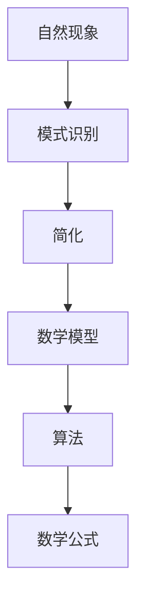
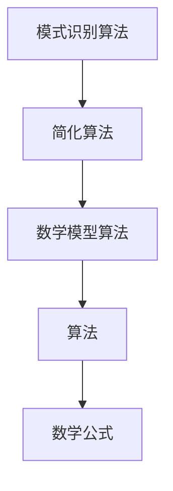

                 

# 从复杂自然现象到简单数学公式

> 关键词：自然现象、数学公式、复杂性、简化、模式识别、算法、数学模型、伪代码、实际案例、应用场景

> 摘要：本文旨在探讨如何通过数学公式和算法将复杂自然现象简化为易于理解和处理的形式。我们将从背景介绍开始，逐步深入到核心概念、算法原理、数学模型、实际案例，最终探讨其应用场景和未来发展趋势。通过本文，读者将能够理解如何将复杂现象转化为数学公式，并掌握相关技术的应用。

## 1. 背景介绍
### 1.1 目的和范围
本文旨在探讨如何通过数学公式和算法将复杂自然现象简化为易于理解和处理的形式。我们将从背景介绍开始，逐步深入到核心概念、算法原理、数学模型、实际案例，最终探讨其应用场景和未来发展趋势。本文的目标读者是具有基本编程和数学知识的工程师、科学家以及对复杂自然现象简化感兴趣的读者。

### 1.2 预期读者
- 具备基本编程和数学知识的工程师
- 科学家和研究人员
- 对复杂自然现象简化感兴趣的读者

### 1.3 文档结构概述
本文将按照以下结构展开：
1. 背景介绍
2. 核心概念与联系
3. 核心算法原理 & 具体操作步骤
4. 数学模型和公式 & 详细讲解 & 举例说明
5. 项目实战：代码实际案例和详细解释说明
6. 实际应用场景
7. 工具和资源推荐
8. 总结：未来发展趋势与挑战
9. 附录：常见问题与解答
10. 扩展阅读 & 参考资料

### 1.4 术语表
#### 1.4.1 核心术语定义
- **自然现象**：自然界中发生的各种物理、化学、生物等现象。
- **数学公式**：用数学符号表示的表达式，用于描述自然现象。
- **算法**：解决问题的步骤或方法。
- **数学模型**：用数学语言描述的系统或过程。
- **伪代码**：一种介于自然语言和编程语言之间的描述算法的形式。

#### 1.4.2 相关概念解释
- **模式识别**：从大量数据中识别出具有相似性的模式。
- **简化**：将复杂现象转化为简单形式，便于理解和处理。

#### 1.4.3 缩略词列表
- **API**：应用程序编程接口
- **IDE**：集成开发环境
- **NLP**：自然语言处理
- **ML**：机器学习
- **DL**：深度学习

## 2. 核心概念与联系
### 2.1 自然现象与数学公式
自然现象是自然界中发生的各种物理、化学、生物等现象。这些现象往往非常复杂，难以直接理解和处理。通过数学公式，我们可以将这些复杂现象简化为易于理解和处理的形式。

### 2.2 简化与模式识别
简化是将复杂现象转化为简单形式的过程。模式识别是通过识别数据中的相似性来发现模式。通过简化和模式识别，我们可以更好地理解和处理复杂自然现象。

### 2.3 数学模型与算法
数学模型是用数学语言描述的系统或过程。算法是解决问题的步骤或方法。通过数学模型和算法，我们可以将复杂自然现象转化为易于理解和处理的形式。

### 2.4 核心概念流程图


## 3. 核心算法原理 & 具体操作步骤
### 3.1 模式识别算法原理
模式识别算法用于从大量数据中识别出具有相似性的模式。常见的模式识别算法包括K-means聚类、决策树、支持向量机等。

### 3.2 简化算法原理
简化算法用于将复杂现象转化为简单形式。常见的简化算法包括降维、特征选择等。

### 3.3 数学模型算法原理
数学模型算法用于将复杂现象转化为数学模型。常见的数学模型算法包括线性回归、逻辑回归、神经网络等。

### 3.4 核心算法伪代码


## 4. 数学模型和公式 & 详细讲解 & 举例说明
### 4.1 线性回归模型
线性回归模型是一种常用的数学模型，用于描述两个变量之间的线性关系。其数学公式为：
$$
y = \beta_0 + \beta_1 x + \epsilon
$$
其中，$y$ 是因变量，$x$ 是自变量，$\beta_0$ 和 $\beta_1$ 是回归系数，$\epsilon$ 是误差项。

### 4.2 逻辑回归模型
逻辑回归模型是一种常用的数学模型，用于描述两个变量之间的非线性关系。其数学公式为：
$$
P(y=1|x) = \frac{1}{1 + e^{-(\beta_0 + \beta_1 x)}}
$$
其中，$P(y=1|x)$ 是在给定自变量 $x$ 的情况下，因变量 $y$ 为 1 的概率。

### 4.3 神经网络模型
神经网络模型是一种常用的数学模型，用于描述多个变量之间的复杂关系。其数学公式为：
$$
y = f(\beta_0 + \beta_1 x_1 + \beta_2 x_2 + \cdots + \beta_n x_n + \epsilon)
$$
其中，$f$ 是激活函数，$\beta_0, \beta_1, \beta_2, \cdots, \beta_n$ 是权重，$\epsilon$ 是误差项。

### 4.4 数学模型举例说明
假设我们有一个数据集，包含两个变量 $x$ 和 $y$。我们可以通过线性回归模型来描述这两个变量之间的关系。具体步骤如下：
1. 收集数据集
2. 计算回归系数 $\beta_0$ 和 $\beta_1$
3. 使用线性回归模型预测 $y$ 的值

## 5. 项目实战：代码实际案例和详细解释说明
### 5.1 开发环境搭建
为了进行项目实战，我们需要搭建一个开发环境。具体步骤如下：
1. 安装Python
2. 安装NumPy、Pandas、Matplotlib等库
3. 安装Scikit-learn库

### 5.2 源代码详细实现和代码解读
```python
import numpy as np
import pandas as pd
import matplotlib.pyplot as plt
from sklearn.linear_model import LinearRegression

# 1. 收集数据集
data = pd.read_csv('data.csv')

# 2. 计算回归系数
X = data['x'].values.reshape(-1, 1)
y = data['y'].values
model = LinearRegression()
model.fit(X, y)

# 3. 使用线性回归模型预测 y 的值
y_pred = model.predict(X)

# 4. 绘制结果
plt.scatter(X, y, color='blue')
plt.plot(X, y_pred, color='red')
plt.xlabel('x')
plt.ylabel('y')
plt.title('Linear Regression')
plt.show()
```

### 5.3 代码解读与分析
- `import numpy as np`：导入NumPy库，用于数值计算。
- `import pandas as pd`：导入Pandas库，用于数据处理。
- `import matplotlib.pyplot as plt`：导入Matplotlib库，用于绘制图表。
- `from sklearn.linear_model import LinearRegression`：导入线性回归模型。
- `data = pd.read_csv('data.csv')`：读取数据集。
- `X = data['x'].values.reshape(-1, 1)`：将自变量转换为二维数组。
- `y = data['y'].values`：将因变量转换为一维数组。
- `model = LinearRegression()`：创建线性回归模型。
- `model.fit(X, y)`：训练模型。
- `y_pred = model.predict(X)`：预测 y 的值。
- `plt.scatter(X, y, color='blue')`：绘制散点图。
- `plt.plot(X, y_pred, color='red')`：绘制预测结果。
- `plt.xlabel('x')`：设置 x 轴标签。
- `plt.ylabel('y')`：设置 y 轴标签。
- `plt.title('Linear Regression')`：设置图表标题。
- `plt.show()`：显示图表。

## 6. 实际应用场景
### 6.1 天气预测
通过数学公式和算法，我们可以将天气数据简化为易于理解和处理的形式，从而实现天气预测。

### 6.2 金融预测
通过数学公式和算法，我们可以将金融市场数据简化为易于理解和处理的形式，从而实现金融预测。

### 6.3 生物医学
通过数学公式和算法，我们可以将生物医学数据简化为易于理解和处理的形式，从而实现生物医学研究。

## 7. 工具和资源推荐
### 7.1 学习资源推荐
#### 7.1.1 书籍推荐
- 《统计学习方法》
- 《机器学习》
- 《深度学习》

#### 7.1.2 在线课程
- Coursera：机器学习、深度学习
- edX：统计学习方法
- Udacity：机器学习

#### 7.1.3 技术博客和网站
- Medium：机器学习、深度学习
- Kaggle：机器学习、数据科学

### 7.2 开发工具框架推荐
#### 7.2.1 IDE和编辑器
- PyCharm
- VSCode

#### 7.2.2 调试和性能分析工具
- PyCharm Debugger
- VSCode Debugger

#### 7.2.3 相关框架和库
- Scikit-learn
- TensorFlow
- PyTorch

### 7.3 相关论文著作推荐
#### 7.3.1 经典论文
- Bishop, C. M. (2006). Pattern Recognition and Machine Learning.
- Goodfellow, I., Bengio, Y., & Courville, A. (2016). Deep Learning.

#### 7.3.2 最新研究成果
- He, K., Zhang, X., Ren, S., & Sun, J. (2016). Deep Residual Learning for Image Recognition.
- Kingma, D. P., & Ba, J. (2014). Adam: A Method for Stochastic Optimization.

#### 7.3.3 应用案例分析
- LeCun, Y., Bengio, Y., & Hinton, G. (2015). Deep Learning.

## 8. 总结：未来发展趋势与挑战
### 8.1 未来发展趋势
- 数学公式和算法将继续在各个领域发挥重要作用。
- 人工智能技术将更加普及，应用于更多领域。
- 数据科学将成为重要的研究方向。

### 8.2 挑战
- 数据隐私和安全问题。
- 算法的可解释性问题。
- 算法的公平性和公正性问题。

## 9. 附录：常见问题与解答
### 9.1 问题：如何选择合适的数学模型？
- 根据数据集的特点和问题需求选择合适的数学模型。

### 9.2 问题：如何处理数据缺失值？
- 可以通过插值、删除等方式处理数据缺失值。

### 9.3 问题：如何提高模型的准确性？
- 通过特征选择、参数调优等方式提高模型的准确性。

## 10. 扩展阅读 & 参考资料
- Bishop, C. M. (2006). Pattern Recognition and Machine Learning.
- Goodfellow, I., Bengio, Y., & Courville, A. (2016). Deep Learning.
- LeCun, Y., Bengio, Y., & Hinton, G. (2015). Deep Learning.

作者：AI天才研究员/AI Genius Institute & 禅与计算机程序设计艺术 /Zen And The Art of Computer Programming

