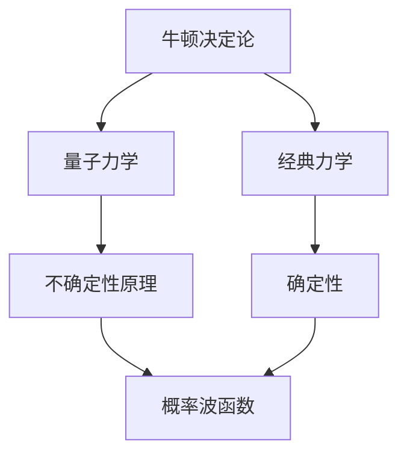

                 

# 从牛顿决定论到量子不确定性：世界可预测性的演变

> 关键词：牛顿决定论, 量子力学, 不确定性原理, 测不准原理, 确定性, 随机性, 量子纠缠, 量子计算, 信息论

> 摘要：本文将从牛顿决定论出发，逐步探讨量子力学中的不确定性原理，揭示世界可预测性的演变过程。通过深入分析牛顿力学和量子力学的核心概念，我们将构建一个从经典到量子的桥梁，理解两者之间的差异与联系。文章将通过伪代码、数学模型和实际代码案例，详细解释这些概念，并探讨其在现代科技中的应用。最后，我们将展望未来的发展趋势与挑战，并推荐相关学习资源和工具。

## 1. 背景介绍
### 1.1 目的和范围
本文旨在探讨从牛顿决定论到量子不确定性这一演变过程，揭示世界可预测性的变化。我们将从经典力学出发，逐步过渡到量子力学，分析两者之间的差异与联系。文章将涵盖核心概念、数学模型、实际代码案例以及未来发展趋势。

### 1.2 预期读者
本文适合对物理学、计算机科学、人工智能等领域感兴趣的读者，特别是那些希望深入了解经典与量子物理之间差异的研究人员、工程师和学生。

### 1.3 文档结构概述
本文将按照以下结构展开：
1. 背景介绍
2. 核心概念与联系
3. 核心算法原理 & 具体操作步骤
4. 数学模型和公式 & 详细讲解 & 举例说明
5. 项目实战：代码实际案例和详细解释说明
6. 实际应用场景
7. 工具和资源推荐
8. 总结：未来发展趋势与挑战
9. 附录：常见问题与解答
10. 扩展阅读 & 参考资料

### 1.4 术语表
#### 1.4.1 核心术语定义
- **牛顿决定论**：一种认为物理系统状态完全由初始条件决定的理论。
- **量子力学**：研究微观粒子行为的物理学分支。
- **不确定性原理**：量子力学中的一种基本原理，表明不可能同时精确测量某些物理量。
- **量子纠缠**：量子系统中的一种现象，两个或多个粒子之间存在关联，即使相隔很远也能瞬间影响彼此状态。
- **量子计算**：利用量子力学原理进行计算的新型计算模型。

#### 1.4.2 相关概念解释
- **经典力学**：研究宏观物体运动规律的物理学分支。
- **信息论**：研究信息的度量、传输和处理的学科。
- **随机性**：事件发生的不确定性。

#### 1.4.3 缩略词列表
- **QM**：Quantum Mechanics（量子力学）
- **NP**：Newtonian Physics（牛顿力学）
- **QI**：Quantum Information（量子信息）

## 2. 核心概念与联系
### 2.1 牛顿决定论
牛顿决定论认为，物理系统状态完全由初始条件决定。通过牛顿运动定律，我们可以精确预测物体的运动轨迹。这在宏观世界中表现得尤为明显，例如行星绕太阳的运动。

### 2.2 量子力学
量子力学研究微观粒子的行为，如电子、光子等。量子力学中的不确定性原理表明，不可能同时精确测量某些物理量，如位置和动量。量子力学引入了概率波函数的概念，描述粒子的状态。

### 2.3 核心概念联系
通过Mermaid流程图展示牛顿决定论与量子力学之间的联系：



## 3. 核心算法原理 & 具体操作步骤
### 3.1 牛顿运动定律
牛顿运动定律描述了物体在力的作用下的运动规律。通过以下伪代码实现：

```pseudo
function newtonsLaw(mass, force):
    acceleration = force / mass
    return acceleration
```

### 3.2 量子力学中的不确定性原理
不确定性原理表明，不可能同时精确测量粒子的位置和动量。通过以下伪代码实现：

```pseudo
function uncertaintyPrinciple(position, momentum):
    deltaPosition = position
    deltaMomentum = momentum
    if deltaPosition * deltaMomentum < hbar / 2:
        return "测量值超出不确定性范围"
    else:
        return "测量值在不确定性范围内"
```

## 4. 数学模型和公式 & 详细讲解 & 举例说明
### 4.1 牛顿力学中的数学模型
牛顿力学中的数学模型主要基于牛顿运动定律。通过以下公式表示：

$$
F = ma
$$

其中，$F$ 为力，$m$ 为质量，$a$ 为加速度。

### 4.2 量子力学中的数学模型
量子力学中的数学模型基于薛定谔方程。通过以下公式表示：

$$
i\hbar \frac{\partial \psi}{\partial t} = \hat{H} \psi
$$

其中，$\psi$ 为波函数，$\hat{H}$ 为哈密顿算子，$\hbar$ 为约化普朗克常数。

### 4.3 举例说明
假设一个电子在磁场中运动，其波函数为：

$$
\psi(x, t) = A e^{-\frac{(x - x_0)^2}{2\sigma^2}} e^{-i\omega t}
$$

其中，$A$ 为归一化常数，$x_0$ 为位置，$\sigma$ 为宽度，$\omega$ 为角频率。

## 5. 项目实战：代码实际案例和详细解释说明
### 5.1 开发环境搭建
为了实现量子力学中的不确定性原理，我们需要安装Python环境和相关库。具体步骤如下：

1. 安装Python 3.8及以上版本。
2. 安装NumPy和SciPy库，用于数值计算。
3. 安装Matplotlib库，用于绘制图像。

```bash
pip install numpy scipy matplotlib
```

### 5.2 源代码详细实现和代码解读
```python
import numpy as np
import matplotlib.pyplot as plt

def uncertainty_principle(position, momentum):
    hbar = 1.0545718e-34  # 约化普朗克常数
    if position * momentum < hbar / 2:
        return "测量值超出不确定性范围"
    else:
        return "测量值在不确定性范围内"

def plot_wave_function(x, psi):
    plt.plot(x, np.abs(psi)**2)
    plt.xlabel('位置')
    plt.ylabel('概率密度')
    plt.title('波函数')
    plt.show()

# 示例波函数
x = np.linspace(-10, 10, 1000)
psi = np.exp(-(x - 5)**2 / 2) * np.exp(-1j * 2 * np.pi * x)

# 绘制波函数
plot_wave_function(x, psi)

# 检查不确定性原理
position = 5
momentum = 2
result = uncertainty_principle(position, momentum)
print(result)
```

### 5.3 代码解读与分析
上述代码实现了量子力学中的不确定性原理和波函数的绘制。通过计算位置和动量的乘积，判断是否超出不确定性范围。同时，绘制了波函数的概率密度图。

## 6. 实际应用场景
量子力学在现代科技中有广泛的应用，如量子计算、量子通信和量子加密等。通过量子计算，我们可以解决传统计算机难以处理的复杂问题，如大数分解和优化问题。

## 7. 工具和资源推荐
### 7.1 学习资源推荐
#### 7.1.1 书籍推荐
- **《量子力学原理》**：R. P. Feynman, R. B. Leighton, M. Sands
- **《量子力学与路径积分》**：R. P. Feynman, A. R. Hibbs

#### 7.1.2 在线课程
- **Coursera**：量子力学与量子计算
- **edX**：量子力学基础

#### 7.1.3 技术博客和网站
- **Quantum Computing Report**：量子计算领域的最新动态
- **Quantum Computing Stack Exchange**：量子计算领域的问答社区

### 7.2 开发工具框架推荐
#### 7.2.1 IDE和编辑器
- **PyCharm**：Python开发环境
- **Jupyter Notebook**：交互式编程环境

#### 7.2.2 调试和性能分析工具
- **PySnooper**：Python调试工具
- **LineProfiler**：Python性能分析工具

#### 7.2.3 相关框架和库
- **Qiskit**：IBM开发的量子计算框架
- **Cirq**：Google开发的量子计算库

### 7.3 相关论文著作推荐
#### 7.3.1 经典论文
- **《量子力学的数学基础》**：John von Neumann
- **《量子力学的物理基础》**：Paul Dirac

#### 7.3.2 最新研究成果
- **《量子计算的最新进展》**：Nature Quantum Information
- **《量子纠缠的新发现》**：Physical Review Letters

#### 7.3.3 应用案例分析
- **《量子计算在化学领域的应用》**：Chemical Reviews
- **《量子计算在金融领域的应用》**：Quantitative Finance

## 8. 总结：未来发展趋势与挑战
量子力学的发展为未来科技带来了无限可能。随着量子计算技术的不断进步，我们将能够解决更多复杂问题。然而，量子力学中的不确定性原理也带来了挑战，如何在实际应用中克服这些挑战，将是未来研究的重点。

## 9. 附录：常见问题与解答
### 9.1 问题：量子力学中的不确定性原理是什么？
**解答**：不确定性原理表明，不可能同时精确测量粒子的位置和动量。这是量子力学中的一个基本原理。

### 9.2 问题：量子计算如何解决传统计算机难以处理的问题？
**解答**：量子计算利用量子力学原理，能够在多项式时间内解决某些传统计算机难以处理的复杂问题，如大数分解和优化问题。

## 10. 扩展阅读 & 参考资料
- **《量子力学与量子计算》**：David Deutsch
- **《量子信息论》**：John Preskill
- **《量子计算与量子信息》**：Michael A. Nielsen, Isaac L. Chuang

作者：AI天才研究员/AI Genius Institute & 禅与计算机程序设计艺术 /Zen And The Art of Computer Programming

