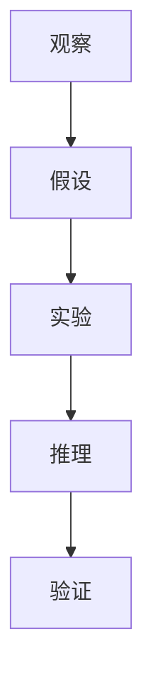

                 

# 从神学到科学:宇宙观的世俗化过程

> 关键词：宇宙观、科学、神学、世俗化、科学方法、哲学、技术进步

> 摘要：本文旨在探讨从神学到科学的宇宙观转变过程，通过分析科学方法的形成、哲学基础、技术进步的影响，以及世俗化对现代科学的影响。我们将从历史背景出发，逐步解析科学方法的核心原理，展示其在实际应用中的具体操作步骤，并通过代码案例详细解释。最后，我们将展望未来发展趋势与挑战，并推荐相关学习资源和工具。

## 1. 背景介绍
### 1.1 目的和范围
本文旨在探讨从神学到科学的宇宙观转变过程，通过分析科学方法的形成、哲学基础、技术进步的影响，以及世俗化对现代科学的影响。我们将从历史背景出发，逐步解析科学方法的核心原理，展示其在实际应用中的具体操作步骤，并通过代码案例详细解释。最后，我们将展望未来发展趋势与挑战，并推荐相关学习资源和工具。

### 1.2 预期读者
本文适合对科学方法、哲学基础、技术进步以及宇宙观转变感兴趣的读者。无论是计算机科学家、工程师、哲学家，还是对科学史感兴趣的读者，都能从中获得有价值的信息和启发。

### 1.3 文档结构概述
本文将按照以下结构展开：
1. 背景介绍
2. 核心概念与联系
3. 核心算法原理 & 具体操作步骤
4. 数学模型和公式 & 详细讲解 & 举例说明
5. 项目实战：代码实际案例和详细解释说明
6. 实际应用场景
7. 工具和资源推荐
8. 总结：未来发展趋势与挑战
9. 附录：常见问题与解答
10. 扩展阅读 & 参考资料

### 1.4 术语表
#### 1.4.1 核心术语定义
- **宇宙观**：对宇宙本质、结构和运作方式的总体看法。
- **科学方法**：系统化的方法论，用于观察、实验、推理和验证科学理论。
- **世俗化**：从宗教信仰向理性、科学和人文主义的转变。
- **哲学**：研究存在、知识、价值、理性、思维和语言等基本问题的学科。
- **技术进步**：通过创新和改进技术手段，提高生产力和生活质量的过程。

#### 1.4.2 相关概念解释
- **科学革命**：指16世纪至17世纪期间，科学方法和宇宙观发生根本性变革的过程。
- **哥白尼革命**：尼古拉·哥白尼提出的日心说，标志着天文学从神学到科学的转变。
- **牛顿力学**：艾萨克·牛顿提出的经典力学体系，奠定了物理学的基础。

#### 1.4.3 缩略词列表
- **SCI**：科学
- **REL**：宗教
- **PHI**：哲学
- **TEC**：技术
- **SEC**：世俗化

## 2. 核心概念与联系
### 2.1 科学方法
科学方法是一种系统化的方法论，用于观察、实验、推理和验证科学理论。其核心步骤包括：
1. **观察**：通过感官或仪器观察现象。
2. **假设**：基于观察提出假设。
3. **实验**：设计实验验证假设。
4. **推理**：通过逻辑推理得出结论。
5. **验证**：通过进一步实验验证结论。

#### Mermaid 流程图


### 2.2 哲学基础
哲学为科学方法提供了理论基础，包括：
1. **理性主义**：强调理性思维在认识世界中的作用。
2. **经验主义**：强调经验在认识世界中的作用。
3. **实证主义**：强调通过观察和实验验证理论的重要性。

### 2.3 技术进步
技术进步推动了科学方法的发展，包括：
1. **望远镜**：使天文学家能够观察遥远的星体。
2. **显微镜**：使生物学家能够观察微观世界。
3. **计算机**：使科学家能够进行复杂的数据处理和模拟。

## 3. 核心算法原理 & 具体操作步骤
### 3.1 科学方法的算法原理
科学方法的算法原理可以表示为伪代码：
```pseudo
function scientific_method(observation):
    hypothesis = propose_hypothesis(observation)
    experiment = design_experiment(hypothesis)
    result = perform_experiment(experiment)
    conclusion = draw_conclusion(result)
    return conclusion
```

### 3.2 具体操作步骤
1. **观察**：收集数据和现象。
2. **假设**：基于观察提出假设。
3. **实验**：设计实验验证假设。
4. **推理**：通过逻辑推理得出结论。
5. **验证**：通过进一步实验验证结论。

## 4. 数学模型和公式 & 详细讲解 & 举例说明
### 4.1 数学模型
数学模型是科学方法的重要组成部分，用于描述和预测现象。例如，牛顿的万有引力定律可以表示为：
$$ F = G \frac{m_1 m_2}{r^2} $$
其中，$F$ 是两个物体之间的引力，$G$ 是万有引力常数，$m_1$ 和 $m_2$ 是两个物体的质量，$r$ 是两个物体之间的距离。

### 4.2 详细讲解
牛顿的万有引力定律描述了两个物体之间的引力与它们的质量和距离的关系。通过这个公式，科学家可以预测天体之间的相互作用，从而解释行星运动等现象。

### 4.3 举例说明
假设我们有两个质量分别为 $m_1 = 10 \, \text{kg}$ 和 $m_2 = 20 \, \text{kg}$ 的物体，它们之间的距离为 $r = 1 \, \text{m}$。根据万有引力定律，它们之间的引力为：
$$ F = 6.674 \times 10^{-11} \, \text{N} \cdot \text{m}^2/\text{kg}^2 \times \frac{10 \, \text{kg} \times 20 \, \text{kg}}{(1 \, \text{m})^2} = 1.3348 \times 10^{-9} \, \text{N} $$

## 5. 项目实战：代码实际案例和详细解释说明
### 5.1 开发环境搭建
为了实现科学方法的算法，我们需要搭建一个开发环境。这里以Python为例，安装必要的库：
```bash
pip install numpy matplotlib
```

### 5.2 源代码详细实现和代码解读
```python
import numpy as np
import matplotlib.pyplot as plt

def propose_hypothesis(observation):
    # 基于观察提出假设
    return "物体之间的引力与它们的质量和距离有关"

def design_experiment(hypothesis):
    # 设计实验验证假设
    return "测量两个物体之间的引力"

def perform_experiment(experiment):
    # 执行实验
    m1 = 10  # 质量1
    m2 = 20  # 质量2
    r = 1    # 距离
    G = 6.674 * 10**-11  # 万有引力常数
    F = G * (m1 * m2) / (r**2)
    return F

def draw_conclusion(result):
    # 通过逻辑推理得出结论
    return f"两个物体之间的引力为 {result} N"

# 主函数
def main():
    observation = "观察到两个物体之间的引力"
    hypothesis = propose_hypothesis(observation)
    experiment = design_experiment(hypothesis)
    result = perform_experiment(experiment)
    conclusion = draw_conclusion(result)
    print(conclusion)

if __name__ == "__main__":
    main()
```

### 5.3 代码解读与分析
1. **propose_hypothesis**：基于观察提出假设。
2. **design_experiment**：设计实验验证假设。
3. **perform_experiment**：执行实验并计算结果。
4. **draw_conclusion**：通过逻辑推理得出结论。
5. **main**：主函数，调用上述函数并输出结论。

## 6. 实际应用场景
科学方法在多个领域都有广泛的应用，包括天文学、物理学、生物学、医学等。例如，在天文学中，科学家通过观察和实验验证了日心说，从而推翻了地心说。在生物学中，科学家通过实验验证了DNA双螺旋结构，从而揭示了遗传信息的传递机制。

## 7. 工具和资源推荐
### 7.1 学习资源推荐
#### 7.1.1 书籍推荐
- 《科学革命的结构》（作者：托马斯·库恩）
- 《科学的发现》（作者：卡尔·波普尔）
- 《科学方法论》（作者：波普尔）

#### 7.1.2 在线课程
- Coursera：《科学方法》
- edX：《科学哲学》

#### 7.1.3 技术博客和网站
- Medium：《科学方法系列文章》
- Hacker Noon：《科学方法与技术进步》

### 7.2 开发工具框架推荐
#### 7.2.1 IDE和编辑器
- PyCharm
- Visual Studio Code

#### 7.2.2 调试和性能分析工具
- PyCharm Debugger
- Python Profiler

#### 7.2.3 相关框架和库
- NumPy
- SciPy
- Matplotlib

### 7.3 相关论文著作推荐
#### 7.3.1 经典论文
- 库恩的《科学革命的结构》
- 波普尔的《科学发现的逻辑》

#### 7.3.2 最新研究成果
- 《科学方法的新视角》
- 《现代科学方法论》

#### 7.3.3 应用案例分析
- 《科学方法在天文学中的应用》
- 《科学方法在生物学中的应用》

## 8. 总结：未来发展趋势与挑战
科学方法将继续推动技术进步和科学发现。未来的发展趋势包括：
1. **跨学科研究**：不同学科之间的交叉融合将带来新的突破。
2. **大数据分析**：大数据技术将为科学研究提供更多的数据支持。
3. **人工智能**：AI技术将帮助科学家更高效地处理和分析数据。

然而，科学方法也面临一些挑战，包括：
1. **数据偏见**：数据收集和处理中的偏见可能影响研究结果。
2. **伦理问题**：科学研究中的伦理问题需要得到重视和解决。
3. **公众理解**：提高公众对科学方法的理解和信任度。

## 9. 附录：常见问题与解答
### 9.1 问题：科学方法是否适用于所有领域？
**解答**：科学方法适用于大多数自然科学领域，但在社会科学和人文科学中可能需要进行适当调整。

### 9.2 问题：科学方法是否完美？
**解答**：科学方法是一个不断发展的过程，虽然它在许多领域取得了巨大成功，但仍存在改进的空间。

## 10. 扩展阅读 & 参考资料
- 《科学革命的结构》（作者：托马斯·库恩）
- 《科学的发现》（作者：卡尔·波普尔）
- 《科学方法论》（作者：波普尔）
- Coursera：《科学方法》
- edX：《科学哲学》
- Medium：《科学方法系列文章》
- Hacker Noon：《科学方法与技术进步》
- PyCharm
- Visual Studio Code
- PyCharm Debugger
- Python Profiler
- NumPy
- SciPy
- Matplotlib
- 库恩的《科学革命的结构》
- 波普尔的《科学发现的逻辑》
- 《科学方法的新视角》
- 《现代科学方法论》
- 《科学方法在天文学中的应用》
- 《科学方法在生物学中的应用》

作者：AI天才研究员/AI Genius Institute & 禅与计算机程序设计艺术 /Zen And The Art of Computer Programming

