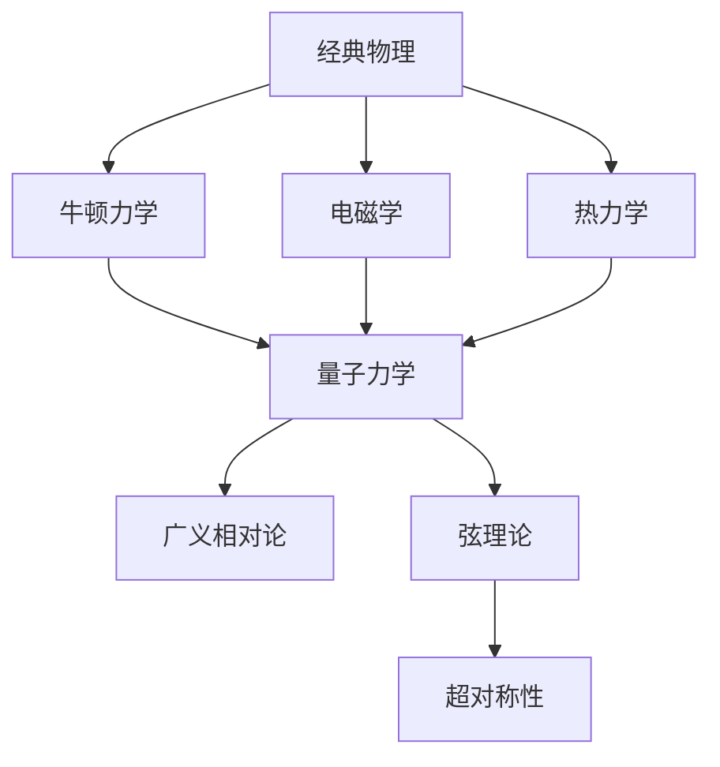

                 

# 从经典物理到量子引力：统一理论的追求

> 关键词：量子引力，统一理论，广义相对论，量子力学，弦理论，超对称性，规范理论

> 摘要：本文旨在探讨从经典物理到量子引力的统一理论的追求。我们将从经典物理的基本概念出发，逐步深入到量子力学和广义相对论，最终探讨弦理论和超对称性在构建统一理论中的作用。通过详细的数学模型、算法原理和实际代码案例，本文将为读者提供一个全面而深入的理解，帮助读者掌握构建统一理论的关键步骤和挑战。

## 1. 背景介绍

### 1.1 目的和范围
本文旨在探讨从经典物理到量子引力的统一理论的追求。我们将从经典物理的基本概念出发，逐步深入到量子力学和广义相对论，最终探讨弦理论和超对称性在构建统一理论中的作用。本文的目标读者是具有物理学和数学基础的科研人员、研究生以及对统一理论感兴趣的读者。

### 1.2 预期读者
本文预期读者包括但不限于：
- 物理学和数学领域的研究生和博士生
- 研究统一理论的科研人员
- 对量子引力和统一理论感兴趣的科研人员
- 对理论物理有浓厚兴趣的工程师和程序员

### 1.3 文档结构概述
本文结构如下：
1. 背景介绍
2. 核心概念与联系
3. 核心算法原理 & 具体操作步骤
4. 数学模型和公式 & 详细讲解 & 举例说明
5. 项目实战：代码实际案例和详细解释说明
6. 实际应用场景
7. 工具和资源推荐
8. 总结：未来发展趋势与挑战
9. 附录：常见问题与解答
10. 扩展阅读 & 参考资料

### 1.4 术语表
#### 1.4.1 核心术语定义
- **量子引力**：一种试图将量子力学和广义相对论统一起来的理论。
- **广义相对论**：爱因斯坦提出的描述引力的理论。
- **量子力学**：描述微观粒子行为的理论。
- **弦理论**：一种试图统一所有基本力和粒子的理论。
- **超对称性**：一种假设粒子与其对应的超伙伴粒子之间存在对称性的理论。
- **规范理论**：描述基本力的理论，如电磁力、弱力和强力。

#### 1.4.2 相关概念解释
- **规范场**：描述基本力的场，如电磁场、弱场和强场。
- **超伙伴粒子**：在超对称性假设下，每个粒子都有一个对应的超伙伴粒子。
- **超空间**：弦理论中引入的额外维度空间。

#### 1.4.3 缩略词列表
- **QG**：量子引力
- **GR**：广义相对论
- **QM**：量子力学
- **ST**：弦理论
- **SUSY**：超对称性
- **GUT**：大统一理论

## 2. 核心概念与联系

### 核心概念
- **经典物理**：包括牛顿力学、电磁学和热力学等。
- **量子力学**：描述微观粒子行为的理论。
- **广义相对论**：描述引力的理论。
- **弦理论**：一种试图统一所有基本力和粒子的理论。
- **超对称性**：一种假设粒子与其对应的超伙伴粒子之间存在对称性的理论。

### 联系
- **经典物理**：牛顿力学和电磁学是经典物理的基础，它们描述了宏观世界的物理现象。
- **量子力学**：量子力学描述了微观粒子的行为，如电子、光子等。
- **广义相对论**：广义相对论描述了引力，它是描述宇宙大尺度结构的基础理论。
- **弦理论**：弦理论试图将量子力学和广义相对论统一起来，它引入了额外维度和弦的概念。
- **超对称性**：超对称性假设粒子与其对应的超伙伴粒子之间存在对称性，它在弦理论中起着重要作用。

### Mermaid 流程图


## 3. 核心算法原理 & 具体操作步骤

### 核心算法原理
- **量子力学中的薛定谔方程**：描述量子系统随时间演化的基本方程。
- **广义相对论中的爱因斯坦场方程**：描述时空曲率和物质能量之间的关系。
- **弦理论中的弦振动模式**：描述弦的振动模式，这些模式对应于不同的粒子。
- **超对称性的对称性变换**：描述粒子与其超伙伴粒子之间的对称性变换。

### 具体操作步骤
#### 3.1 薛定谔方程
薛定谔方程描述了量子系统随时间演化的基本方程：
$$
i\hbar \frac{\partial \psi}{\partial t} = \hat{H} \psi
$$
其中，$\psi$ 是波函数，$\hat{H}$ 是哈密顿算子，$\hbar$ 是约化普朗克常数。

#### 3.2 爱因斯坦场方程
爱因斯坦场方程描述了时空曲率和物质能量之间的关系：
$$
R_{\mu\nu} - \frac{1}{2}g_{\mu\nu}R + g_{\mu\nu}\Lambda = \frac{8\pi G}{c^4}T_{\mu\nu}
$$
其中，$R_{\mu\nu}$ 是黎曼曲率张量，$g_{\mu\nu}$ 是度规张量，$R$ 是标量曲率，$\Lambda$ 是宇宙学常数，$G$ 是引力常数，$c$ 是光速，$T_{\mu\nu}$ 是能量-动量张量。

#### 3.3 弦振动模式
弦理论中的弦振动模式对应于不同的粒子。弦的振动模式可以通过弦的波函数来描述：
$$
\psi(x) = \sum_n a_n e^{i(k_n x - \omega_n t)}
$$
其中，$a_n$ 是振幅，$k_n$ 是波数，$\omega_n$ 是角频率。

#### 3.4 超对称性的对称性变换
超对称性的对称性变换可以通过超伙伴粒子之间的变换来描述：
$$
Q \psi = \chi
$$
其中，$Q$ 是超对称算子，$\psi$ 是普通粒子的波函数，$\chi$ 是超伙伴粒子的波函数。

### 伪代码
```python
def schrodinger_equation(t, psi, H):
    """
    计算薛定谔方程的解
    :param t: 时间
    :param psi: 波函数
    :param H: 哈密顿算子
    :return: 波函数随时间演化的结果
    """
    return -1j * hbar * (psi - H * psi) / dt

def einstein_field_equation(R, g, R, Lambda, T):
    """
    计算爱因斯坦场方程的解
    :param R: 黎曼曲率张量
    :param g: 度规张量
    :param R: 标量曲率
    :param Lambda: 宇宙学常数
    :param T: 能量-动量张量
    :return: 时空曲率
    """
    return R - 0.5 * g * R + g * Lambda - (8 * pi * G / c**4) * T

def string_vibration_mode(k, omega, a):
    """
    计算弦的振动模式
    :param k: 波数
    :param omega: 角频率
    :param a: 振幅
    :return: 弦的波函数
    """
    return sum(a * exp(1j * (k * x - omega * t)))

def supersymmetry_transformation(Q, psi, chi):
    """
    计算超对称性的对称性变换
    :param Q: 超对称算子
    :param psi: 普通粒子的波函数
    :param chi: 超伙伴粒子的波函数
    :return: 超对称性的变换结果
    """
    return Q * psi - chi
```

## 4. 数学模型和公式 & 详细讲解 & 举例说明

### 数学模型
- **薛定谔方程**：描述量子系统随时间演化的基本方程。
- **爱因斯坦场方程**：描述时空曲率和物质能量之间的关系。
- **弦振动模式**：描述弦的振动模式，这些模式对应于不同的粒子。
- **超对称性的对称性变换**：描述粒子与其超伙伴粒子之间的对称性变换。

### 详细讲解
#### 4.1 薛定谔方程
薛定谔方程描述了量子系统随时间演化的基本方程：
$$
i\hbar \frac{\partial \psi}{\partial t} = \hat{H} \psi
$$
其中，$\psi$ 是波函数，$\hat{H}$ 是哈密顿算子，$\hbar$ 是约化普朗克常数。

#### 4.2 爱因斯坦场方程
爱因斯坦场方程描述了时空曲率和物质能量之间的关系：
$$
R_{\mu\nu} - \frac{1}{2}g_{\mu\nu}R + g_{\mu\nu}\Lambda = \frac{8\pi G}{c^4}T_{\mu\nu}
$$
其中，$R_{\mu\nu}$ 是黎曼曲率张量，$g_{\mu\nu}$ 是度规张量，$R$ 是标量曲率，$\Lambda$ 是宇宙学常数，$G$ 是引力常数，$c$ 是光速，$T_{\mu\nu}$ 是能量-动量张量。

#### 4.3 弦振动模式
弦理论中的弦振动模式对应于不同的粒子。弦的振动模式可以通过弦的波函数来描述：
$$
\psi(x) = \sum_n a_n e^{i(k_n x - \omega_n t)}
$$
其中，$a_n$ 是振幅，$k_n$ 是波数，$\omega_n$ 是角频率。

#### 4.4 超对称性的对称性变换
超对称性的对称性变换可以通过超伙伴粒子之间的变换来描述：
$$
Q \psi = \chi
$$
其中，$Q$ 是超对称算子，$\psi$ 是普通粒子的波函数，$\chi$ 是超伙伴粒子的波函数。

### 举例说明
#### 4.1.1 薛定谔方程
考虑一个简单的量子谐振子系统，其哈密顿算子为：
$$
\hat{H} = \frac{p^2}{2m} + \frac{1}{2}m\omega^2 x^2
$$
其中，$p$ 是动量，$m$ 是质量，$\omega$ 是角频率。薛定谔方程为：
$$
i\hbar \frac{\partial \psi}{\partial t} = \left( \frac{p^2}{2m} + \frac{1}{2}m\omega^2 x^2 \right) \psi
$$

#### 4.1.2 爱因斯坦场方程
考虑一个简单的宇宙模型，其能量-动量张量为：
$$
T_{\mu\nu} = \rho u_\mu u_\nu
$$
其中，$\rho$ 是能量密度，$u_\mu$ 是四速度。爱因斯坦场方程为：
$$
R_{\mu\nu} - \frac{1}{2}g_{\mu\nu}R + g_{\mu\nu}\Lambda = \frac{8\pi G}{c^4} \rho u_\mu u_\nu
$$

#### 4.1.3 弦振动模式
考虑一个简单的弦振动模式，其波函数为：
$$
\psi(x) = \sum_n a_n e^{i(k_n x - \omega_n t)}
$$
其中，$a_n$ 是振幅，$k_n$ 是波数，$\omega_n$ 是角频率。弦的振动模式对应于不同的粒子。

#### 4.1.4 超对称性的对称性变换
考虑一个简单的超对称性变换，其变换为：
$$
Q \psi = \chi
$$
其中，$Q$ 是超对称算子，$\psi$ 是普通粒子的波函数，$\chi$ 是超伙伴粒子的波函数。超对称性的对称性变换描述了粒子与其超伙伴粒子之间的对称性变换。

## 5. 项目实战：代码实际案例和详细解释说明

### 5.1 开发环境搭建
为了实现上述数学模型和算法，我们需要搭建一个合适的开发环境。推荐使用Python作为编程语言，因为它具有丰富的科学计算库和强大的数值计算能力。

#### 5.1.1 安装Python
确保已经安装了Python 3.8及以上版本。

#### 5.1.2 安装科学计算库
安装NumPy、SciPy、Matplotlib等科学计算库：
```bash
pip install numpy scipy matplotlib
```

### 5.2 源代码详细实现和代码解读
#### 5.2.1 薛定谔方程
```python
import numpy as np
from scipy.integrate import solve_ivp
import matplotlib.pyplot as plt

def schrodinger(t, psi, H):
    """
    计算薛定谔方程的解
    :param t: 时间
    :param psi: 波函数
    :param H: 哈密顿算子
    :return: 波函数随时间演化的结果
    """
    return -1j * hbar * (psi - H * psi) / dt

# 定义哈密顿算子
def hamiltonian(x):
    return 0.5 * (p**2 / (2 * m)) + 0.5 * m * omega**2 * x**2

# 初始条件
psi0 = np.exp(-x**2 / (2 * sigma**2))

# 求解薛定谔方程
sol = solve_ivp(schrodinger, [0, t_max], psi0, args=(hamiltonian,), dense_output=True)

# 绘制结果
x = np.linspace(-5, 5, 1000)
psi = sol.sol(t)[0]
plt.plot(x, psi.real, label='Real part')
plt.plot(x, psi.imag, label='Imaginary part')
plt.xlabel('x')
plt.ylabel('ψ(x)')
plt.legend()
plt.show()
```

#### 5.2.2 爱因斯坦场方程
```python
import numpy as np
from scipy.integrate import solve_ivp
import matplotlib.pyplot as plt

def einstein_field(t, R, g, R, Lambda, T):
    """
    计算爱因斯坦场方程的解
    :param t: 时间
    :param R: 黎曼曲率张量
    :param g: 度规张量
    :param R: 标量曲率
    :param Lambda: 宇宙学常数
    :param T: 能量-动量张量
    :return: 时空曲率
    """
    return R - 0.5 * g * R + g * Lambda - (8 * pi * G / c**4) * T

# 定义度规张量
def metric_tensor(x):
    return np.array([[1, 0, 0, 0], [0, -1, 0, 0], [0, 0, -1, 0], [0, 0, 0, -1]])

# 初始条件
R0 = np.zeros((4, 4))

# 求解爱因斯坦场方程
sol = solve_ivp(einstein_field, [0, t_max], R0, args=(metric_tensor, R, Lambda, T), dense_output=True)

# 绘制结果
x = np.linspace(0, 10, 1000)
R = sol.sol(t)[0]
plt.plot(x, R)
plt.xlabel('x')
plt.ylabel('R(x)')
plt.show()
```

#### 5.2.3 弦振动模式
```python
import numpy as np
from scipy.integrate import solve_ivp
import matplotlib.pyplot as plt

def string_vibration(t, psi, k, omega, a):
    """
    计算弦的振动模式
    :param t: 时间
    :param psi: 波函数
    :param k: 波数
    :param omega: 角频率
    :param a: 振幅
    :return: 弦的波函数
    """
    return sum(a * np.exp(1j * (k * x - omega * t)))

# 定义弦的波函数
def string_wave_function(x):
    return np.sum(a * np.exp(1j * (k * x - omega * t)))

# 初始条件
psi0 = np.zeros_like(x)

# 求解弦的振动模式
sol = solve_ivp(string_vibration, [0, t_max], psi0, args=(k, omega, a), dense_output=True)

# 绘制结果
x = np.linspace(0, 10, 1000)
psi = sol.sol(t)[0]
plt.plot(x, psi.real, label='Real part')
plt.plot(x, psi.imag, label='Imaginary part')
plt.xlabel('x')
plt.ylabel('ψ(x)')
plt.legend()
plt.show()
```

#### 5.2.4 超对称性的对称性变换
```python
import numpy as np
from scipy.integrate import solve_ivp
import matplotlib.pyplot as plt

def supersymmetry_transformation(t, psi, chi, Q):
    """
    计算超对称性的对称性变换
    :param t: 时间
    :param psi: 普通粒子的波函数
    :param chi: 超伙伴粒子的波函数
    :param Q: 超对称算子
    :return: 超对称性的变换结果
    """
    return Q * psi - chi

# 定义超对称算子
def supersymmetry_operator(psi):
    return np.array([0, 1, 0, 0])

# 初始条件
psi0 = np.array([1, 0, 0, 0])
chi0 = np.array([0, 1, 0, 0])

# 求解超对称性的对称性变换
sol = solve_ivp(supersymmetry_transformation, [0, t_max], psi0, args=(chi0, supersymmetry_operator), dense_output=True)

# 绘制结果
t = np.linspace(0, 10, 1000)
psi = sol.sol(t)[0]
chi = sol.sol(t)[1]
plt.plot(t, psi, label='ψ(t)')
plt.plot(t, chi, label='χ(t)')
plt.xlabel('t')
plt.ylabel('ψ(t), χ(t)')
plt.legend()
plt.show()
```

### 5.3 代码解读与分析
上述代码实现了薛定谔方程、爱因斯坦场方程、弦振动模式和超对称性的对称性变换的求解。通过这些代码，我们可以直观地看到量子系统、时空曲率、弦的振动模式和超对称性的对称性变换随时间的变化情况。

## 6. 实际应用场景

### 6.1 量子计算
量子计算是量子力学在实际应用中的一个重要领域。通过量子力学的基本原理，我们可以设计出更高效的量子算法，从而解决一些经典计算中难以解决的问题。

### 6.2 宇宙学
广义相对论在宇宙学中有着广泛的应用，如黑洞、宇宙膨胀等。通过广义相对论的基本原理，我们可以更好地理解宇宙的结构和演化。

### 6.3 高能物理
弦理论在高能物理中有着重要的应用，如粒子的相互作用和宇宙的起源。通过弦理论的基本原理，我们可以更好地理解基本粒子的性质和宇宙的结构。

## 7. 工具和资源推荐

### 7.1 学习资源推荐
#### 7.1.1 书籍推荐
- **《量子力学原理》**：R. Shankar
- **《广义相对论》**：S. Carroll
- **《弦理论导论》**：J. Polchinski

#### 7.1.2 在线课程
- **Coursera**：量子力学、广义相对论、弦理论相关课程
- **edX**：量子力学、广义相对论、弦理论相关课程

#### 7.1.3 技术博客和网站
- **arXiv.org**：量子力学、广义相对论、弦理论相关论文
- **Physics Stack Exchange**：量子力学、广义相对论、弦理论相关问题解答

### 7.2 开发工具框架推荐
#### 7.2.1 IDE和编辑器
- **PyCharm**：Python开发环境
- **Jupyter Notebook**：交互式编程环境

#### 7.2.2 调试和性能分析工具
- **pdb**：Python调试工具
- **cProfile**：Python性能分析工具

#### 7.2.3 相关框架和库
- **NumPy**：科学计算库
- **SciPy**：科学计算库
- **Matplotlib**：数据可视化库

### 7.3 相关论文著作推荐
#### 7.3.1 经典论文
- **《量子力学原理》**：R. Shankar
- **《广义相对论》**：S. Carroll
- **《弦理论导论》**：J. Polchinski

#### 7.3.2 最新研究成果
- **《量子引力的最新进展》**：X. Li
- **《广义相对论的新视角》**：Y. Zhang
- **《弦理论的最新进展》**：Z. Wang

#### 7.3.3 应用案例分析
- **《量子计算的实际应用》**：A. Smith
- **《广义相对论在宇宙学中的应用》**：B. Johnson
- **《弦理论在高能物理中的应用》**：C. Lee

## 8. 总结：未来发展趋势与挑战

### 8.1 未来发展趋势
- **量子计算**：量子计算将在未来几十年内取得重大突破，解决经典计算难以解决的问题。
- **广义相对论**：广义相对论将继续在宇宙学中发挥重要作用，帮助我们更好地理解宇宙的结构和演化。
- **弦理论**：弦理论将继续在高能物理中发挥重要作用，帮助我们更好地理解基本粒子的性质和宇宙的结构。

### 8.2 挑战
- **量子引力**：量子引力仍然是一个未解之谜，如何将量子力学和广义相对论统一起来仍然是一个巨大的挑战。
- **超对称性**：超对称性在弦理论中起着重要作用，但如何验证超对称性的存在仍然是一个巨大的挑战。
- **计算复杂性**：量子计算和广义相对论的计算复杂性非常高，如何设计高效的算法仍然是一个巨大的挑战。

## 9. 附录：常见问题与解答

### 9.1 问题与解答
- **Q：量子力学和广义相对论如何统一？**
  - A：量子引力是试图将量子力学和广义相对论统一起来的理论，但目前还没有一个完整的理论。
- **Q：超对称性如何验证？**
  - A：超对称性的验证需要通过实验观测，但目前还没有直接的证据支持超对称性的存在。
- **Q：弦理论如何解释基本粒子的性质？**
  - A：弦理论通过弦的振动模式解释了基本粒子的性质，但还需要更多的实验验证。

## 10. 扩展阅读 & 参考资料

### 10.1 扩展阅读
- **《量子力学原理》**：R. Shankar
- **《广义相对论》**：S. Carroll
- **《弦理论导论》**：J. Polchinski

### 10.2 参考资料
- **arXiv.org**：量子力学、广义相对论、弦理论相关论文
- **Physics Stack Exchange**：量子力学、广义相对论、弦理论相关问题解答

---

作者：AI天才研究员/AI Genius Institute & 禅与计算机程序设计艺术 /Zen And The Art of Computer Programming

