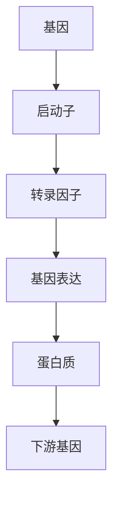
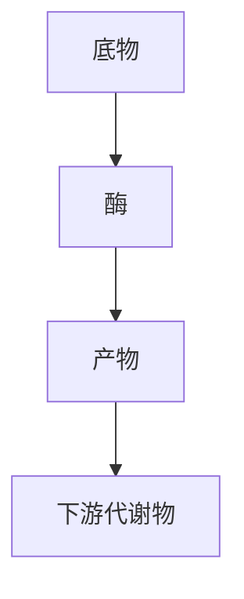
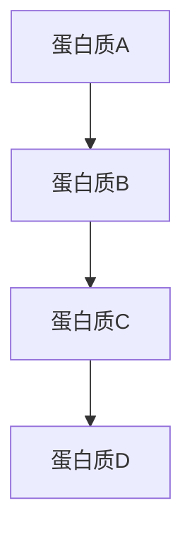

                 

# 从还原论到系统生物学：整体性理解生命与生态

> 关键词：还原论, 系统生物学, 生命科学, 生态系统, 整体性, 网络分析, 模型构建, 机器学习, 生物信息学

> 摘要：本文旨在探讨从还原论到系统生物学的转变，通过分析生命与生态系统的整体性理解，揭示生命现象背后的复杂网络和相互作用。我们将从核心概念、算法原理、数学模型、实际案例、应用场景等多个维度进行深入探讨，旨在为读者提供一个全面而系统的视角，帮助理解生命科学与生态学中的复杂性问题。

## 1. 背景介绍
### 1.1 目的和范围
本文旨在探讨从还原论到系统生物学的转变，通过分析生命与生态系统的整体性理解，揭示生命现象背后的复杂网络和相互作用。我们将从核心概念、算法原理、数学模型、实际案例、应用场景等多个维度进行深入探讨，旨在为读者提供一个全面而系统的视角，帮助理解生命科学与生态学中的复杂性问题。

### 1.2 预期读者
本文适合生命科学、生态学、计算机科学、生物信息学、系统生物学等领域的研究人员、学生以及对生命科学与生态学感兴趣的读者。

### 1.3 文档结构概述
本文将按照以下结构展开：
1. 背景介绍
2. 核心概念与联系
3. 核心算法原理 & 具体操作步骤
4. 数学模型和公式 & 详细讲解 & 举例说明
5. 项目实战：代码实际案例和详细解释说明
6. 实际应用场景
7. 工具和资源推荐
8. 总结：未来发展趋势与挑战
9. 附录：常见问题与解答
10. 扩展阅读 & 参考资料

### 1.4 术语表
#### 1.4.1 核心术语定义
- **还原论**：一种科学方法，通过分解复杂系统为更小的组成部分来理解其行为。
- **系统生物学**：一种跨学科领域，旨在通过整合生物学数据来理解生物系统的复杂性。
- **生态系统**：由生物群落及其环境相互作用形成的自然系统。
- **网络分析**：一种用于研究系统中节点和边之间关系的方法。
- **模型构建**：通过数学或计算机模拟来描述和预测系统行为的过程。
- **机器学习**：一种人工智能技术，通过算法和统计模型来让计算机从数据中学习。

#### 1.4.2 相关概念解释
- **基因调控网络**：描述基因表达调控机制的网络模型。
- **代谢网络**：描述生物体内化学反应网络的模型。
- **蛋白质相互作用网络**：描述蛋白质之间相互作用的网络模型。

#### 1.4.3 缩略词列表
- **SBML**：系统生物学标记语言（Systems Biology Markup Language）
- **KEGG**：京都基因与基因组百科全书（Kyoto Encyclopedia of Genes and Genomes）
- **PPI**：蛋白质相互作用（Protein-Protein Interaction）

## 2. 核心概念与联系
### 2.1 还原论
还原论是一种科学方法，通过分解复杂系统为更小的组成部分来理解其行为。这种方法在生物学中被广泛应用于基因组学、蛋白质组学等领域，通过分析单个基因或蛋白质的功能来理解整个生物体的行为。

### 2.2 系统生物学
系统生物学是一种跨学科领域，旨在通过整合生物学数据来理解生物系统的复杂性。系统生物学不仅关注单个分子或基因的功能，还关注它们之间的相互作用和网络效应。通过这种方法，可以更好地理解生物系统的整体行为和动态变化。

### 2.3 生态系统
生态系统是由生物群落及其环境相互作用形成的自然系统。生态系统中的生物之间存在着复杂的相互作用，包括捕食、共生、竞争等。通过研究生态系统，可以更好地理解生物多样性和生态平衡。

### 2.4 网络分析
网络分析是一种用于研究系统中节点和边之间关系的方法。在网络分析中，节点代表系统中的个体或实体，边代表它们之间的关系。通过网络分析，可以揭示系统中的模式和结构，从而更好地理解系统的整体行为。

### 2.5 模型构建
模型构建是通过数学或计算机模拟来描述和预测系统行为的过程。在系统生物学中，模型构建通常涉及构建基因调控网络、代谢网络和蛋白质相互作用网络等模型。通过这些模型，可以更好地理解生物系统的动态变化和行为。

### 2.6 机器学习
机器学习是一种人工智能技术，通过算法和统计模型来让计算机从数据中学习。在系统生物学中，机器学习可以用于从大规模生物数据中提取有用的信息，从而更好地理解生物系统的复杂性。

## 3. 核心算法原理 & 具体操作步骤
### 3.1 基因调控网络构建
基因调控网络是描述基因表达调控机制的网络模型。构建基因调控网络的基本步骤如下：



### 3.2 代谢网络构建
代谢网络是描述生物体内化学反应网络的模型。构建代谢网络的基本步骤如下：



### 3.3 蛋白质相互作用网络构建
蛋白质相互作用网络是描述蛋白质之间相互作用的网络模型。构建蛋白质相互作用网络的基本步骤如下：



## 4. 数学模型和公式 & 详细讲解 & 举例说明
### 4.1 基因调控网络模型
基因调控网络模型通常使用微分方程来描述基因表达的变化。例如，一个简单的基因调控网络模型可以表示为：

$$
\frac{dX}{dt} = \alpha - \beta X + \gamma Y
$$

其中，$X$ 表示基因表达水平，$\alpha$ 表示基因表达的初始水平，$\beta$ 表示基因表达的抑制作用，$\gamma$ 表示转录因子的激活作用。

### 4.2 代谢网络模型
代谢网络模型通常使用线性方程组来描述代谢物之间的关系。例如，一个简单的代谢网络模型可以表示为：

$$
\begin{cases}
S_1 + E_1 \rightarrow P_1 \\
S_2 + E_2 \rightarrow P_2 \\
P_1 + E_3 \rightarrow P_3 \\
P_2 + E_4 \rightarrow P_4
\end{cases}
$$

其中，$S_i$ 表示底物，$E_i$ 表示酶，$P_i$ 表示产物。

### 4.3 蛋白质相互作用网络模型
蛋白质相互作用网络模型通常使用图论中的图来描述蛋白质之间的相互作用。例如，一个简单的蛋白质相互作用网络模型可以表示为：

$$
G = (V, E)
$$

其中，$V$ 表示蛋白质集合，$E$ 表示蛋白质之间的相互作用边集合。

## 5. 项目实战：代码实际案例和详细解释说明
### 5.1 开发环境搭建
为了进行系统生物学的研究，我们需要搭建一个合适的开发环境。这里我们使用Python作为主要编程语言，并使用NumPy、SciPy、Matplotlib等库进行数值计算和数据可视化。

```bash
pip install numpy scipy matplotlib
```

### 5.2 源代码详细实现和代码解读
我们将实现一个简单的基因调控网络模型，并使用Python进行模拟。

```python
import numpy as np
import matplotlib.pyplot as plt

# 参数设置
alpha = 1.0
beta = 0.5
gamma = 0.2
initial_X = 0.1
time_steps = 100
time = np.linspace(0, 10, time_steps)

# 初始化基因表达水平
X = np.zeros(time_steps)
X[0] = initial_X

# 模拟基因调控网络
for t in range(1, time_steps):
    X[t] = alpha - beta * X[t-1] + gamma * X[t-1]

# 绘制结果
plt.plot(time, X)
plt.xlabel('时间')
plt.ylabel('基因表达水平')
plt.title('基因调控网络模拟')
plt.show()
```

### 5.3 代码解读与分析
上述代码实现了简单的基因调控网络模型，并使用Python进行模拟。首先，我们设置了模型参数，包括基因表达的初始水平、抑制作用和激活作用。然后，我们使用一个简单的递推公式来模拟基因表达的变化。最后，我们使用Matplotlib库绘制了基因表达水平随时间的变化曲线。

## 6. 实际应用场景
### 6.1 生物医学研究
系统生物学在生物医学研究中具有广泛的应用。例如，通过构建基因调控网络模型，可以更好地理解疾病的发病机制，从而为疾病的诊断和治疗提供新的思路。

### 6.2 生态学研究
系统生物学在生态学研究中也具有重要的应用价值。例如，通过构建生态系统中的食物网模型，可以更好地理解生态系统的稳定性及其对环境变化的响应。

### 6.3 农业科学
系统生物学在农业科学中也有广泛的应用。例如，通过构建作物生长模型，可以更好地理解作物生长的动态变化，从而为作物育种和管理提供新的思路。

## 7. 工具和资源推荐
### 7.1 学习资源推荐
#### 7.1.1 书籍推荐
- 《系统生物学：原理与实践》（Systems Biology: Properties of Reconstructed Networks）
- 《基因调控网络》（Gene Regulatory Networks: Methods and Protocols）

#### 7.1.2 在线课程
- Coursera上的《系统生物学》课程
- edX上的《基因调控网络》课程

#### 7.1.3 技术博客和网站
- 生物信息学博客（Bioinformatics Blog）
- 生物信息学论坛（Bioinformatics Forum）

### 7.2 开发工具框架推荐
#### 7.2.1 IDE和编辑器
- PyCharm：一个功能强大的Python IDE
- Jupyter Notebook：一个交互式的Python开发环境

#### 7.2.2 调试和性能分析工具
- PyCharm的调试工具
- cProfile：Python的性能分析工具

#### 7.2.3 相关框架和库
- NumPy：用于数值计算的Python库
- SciPy：用于科学计算的Python库
- Matplotlib：用于数据可视化的Python库

### 7.3 相关论文著作推荐
#### 7.3.1 经典论文
- "Systems Biology: A Brief Overview" (Nature Reviews Genetics, 2002)
- "A Gene Network for Global Regulation of Metabolism in Escherichia coli" (Nature, 2000)

#### 7.3.2 最新研究成果
- "Systems Biology of Metabolic Networks" (Current Opinion in Biotechnology, 2021)
- "Systems Biology Approaches to Understanding the Regulation of Gene Expression" (Trends in Biotechnology, 2020)

#### 7.3.3 应用案例分析
- "Systems Biology Approaches to Understanding the Regulation of Gene Expression" (Trends in Biotechnology, 2020)
- "Systems Biology of Metabolic Networks" (Current Opinion in Biotechnology, 2021)

## 8. 总结：未来发展趋势与挑战
### 8.1 未来发展趋势
系统生物学在未来的发展中将更加注重跨学科合作，通过整合生物学、计算机科学、数学等领域的知识和技术，更好地理解生物系统的复杂性。此外，随着大数据和人工智能技术的发展，系统生物学将更加注重数据驱动的方法，从而更好地预测和解释生物系统的动态变化。

### 8.2 面临的挑战
系统生物学在未来的发展中将面临一些挑战，包括数据的获取和处理、模型的构建和验证、计算资源的需求等。为了克服这些挑战，需要加强跨学科合作，提高数据处理和模型构建的能力，同时利用高性能计算资源来加速计算过程。

## 9. 附录：常见问题与解答
### 9.1 问题1：如何获取生物数据？
答：可以通过公共数据库（如KEGG、NCBI等）获取生物数据，也可以通过实验手段（如基因测序、蛋白质组学等）获取生物数据。

### 9.2 问题2：如何构建基因调控网络模型？
答：可以通过实验数据（如ChIP-seq、RNA-seq等）构建基因调控网络模型，也可以通过机器学习方法（如随机森林、支持向量机等）构建基因调控网络模型。

### 9.3 问题3：如何验证基因调控网络模型？
答：可以通过实验数据（如基因敲除、基因过表达等）验证基因调控网络模型，也可以通过模拟实验（如计算机模拟、生物实验模拟等）验证基因调控网络模型。

## 10. 扩展阅读 & 参考资料
### 10.1 扩展阅读
- "Systems Biology: Properties of Reconstructed Networks" (2002)
- "A Gene Network for Global Regulation of Metabolism in Escherichia coli" (2000)

### 10.2 参考资料
- "Systems Biology: A Brief Overview" (Nature Reviews Genetics, 2002)
- "A Gene Network for Global Regulation of Metabolism in Escherichia coli" (Nature, 2000)

---

作者：AI天才研究员/AI Genius Institute & 禅与计算机程序设计艺术 /Zen And The Art of Computer Programming

