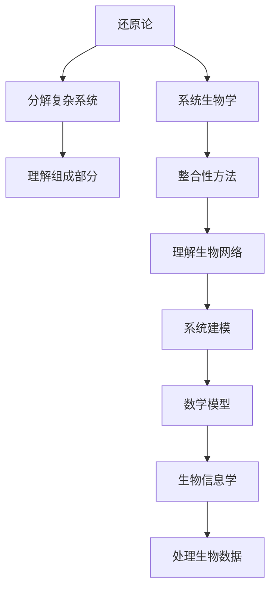

                 

# 从还原论到系统生物学：整合性理解生命与生态系统

> 关键词：还原论, 系统生物学, 生命系统, 生态系统, 整合性理解, 生物网络, 系统建模, 生物信息学

> 摘要：本文旨在探讨从还原论到系统生物学的转变，通过整合性理解生命与生态系统的视角，揭示生物网络的复杂性和系统性。我们将从核心概念与联系出发，深入探讨系统生物学中的关键算法原理、数学模型及实际应用案例，旨在为读者提供一个全面而深入的技术视角。

## 1. 背景介绍

### 1.1 目的和范围
本文旨在探讨从还原论到系统生物学的转变，通过整合性理解生命与生态系统的视角，揭示生物网络的复杂性和系统性。我们将从核心概念与联系出发，深入探讨系统生物学中的关键算法原理、数学模型及实际应用案例，旨在为读者提供一个全面而深入的技术视角。

### 1.2 预期读者
本文适合对生命科学、生物信息学、系统生物学等领域感兴趣的科研人员、工程师、学生以及对复杂系统建模感兴趣的读者。

### 1.3 文档结构概述
本文将分为以下几个部分：
1. **背景介绍**：介绍本文的目的、范围、预期读者及文档结构。
2. **核心概念与联系**：介绍系统生物学的核心概念及其相互联系。
3. **核心算法原理 & 具体操作步骤**：详细阐述系统生物学中的关键算法原理。
4. **数学模型和公式 & 详细讲解 & 举例说明**：介绍数学模型及公式，并通过实例进行说明。
5. **项目实战：代码实际案例和详细解释说明**：通过实际案例展示系统生物学的应用。
6. **实际应用场景**：探讨系统生物学在实际中的应用。
7. **工具和资源推荐**：推荐学习资源、开发工具框架及相关论文著作。
8. **总结：未来发展趋势与挑战**：总结系统生物学的发展趋势与面临的挑战。
9. **附录：常见问题与解答**：解答读者可能遇到的问题。
10. **扩展阅读 & 参考资料**：提供进一步阅读的资源。

### 1.4 术语表
#### 1.4.1 核心术语定义
- **还原论**：一种科学方法，通过分解复杂系统为更小的组成部分来理解其整体行为。
- **系统生物学**：一种跨学科领域，旨在通过整合性方法研究生物系统的复杂性。
- **生物网络**：生物体内的分子、细胞、组织等相互作用形成的网络。
- **系统建模**：通过数学模型描述生物系统的动态行为。
- **生物信息学**：利用计算机科学和信息学方法处理生物数据。

#### 1.4.2 相关概念解释
- **基因调控网络**：基因表达调控的网络模型。
- **代谢网络**：生物体内代谢途径的网络模型。
- **信号传导网络**：细胞间信号传递的网络模型。

#### 1.4.3 缩略词列表
- **SBML**：系统生物学标记语言（Systems Biology Markup Language）
- **MATLAB**：矩阵实验室，一种用于数值计算的编程语言
- **Python**：一种高级编程语言，广泛应用于科学计算和数据分析

## 2. 核心概念与联系

### 2.1 还原论与系统生物学
还原论是一种科学方法，通过分解复杂系统为更小的组成部分来理解其整体行为。然而，这种方法在处理生物系统时存在局限性，因为生物系统具有高度的复杂性和动态性。系统生物学则通过整合性方法研究生物系统的复杂性，强调生物网络的相互作用和动态变化。

### 2.2 生物网络
生物网络是生物体内的分子、细胞、组织等相互作用形成的网络。这些网络包括基因调控网络、代谢网络和信号传导网络。生物网络的复杂性使得传统的还原论方法难以全面理解其行为。

### 2.3 系统建模
系统建模是通过数学模型描述生物系统的动态行为。系统建模方法包括微分方程、图论和网络分析等。这些方法可以帮助我们理解生物网络的动态行为和相互作用。

### 2.4 生物信息学
生物信息学是利用计算机科学和信息学方法处理生物数据。生物信息学方法包括序列比对、基因表达分析和蛋白质结构预测等。这些方法为系统生物学提供了重要的数据支持。

### 2.5 核心概念流程图


## 3. 核心算法原理 & 具体操作步骤

### 3.1 微分方程建模
微分方程是描述生物系统动态行为的重要工具。我们可以通过微分方程建模来描述生物网络的动态变化。

#### 伪代码
```pseudo
function differentialEquationModel(geneExpression, time):
    # 初始化参数
    parameters = {
        'k1': 0.1,
        'k2': 0.05,
        'k3': 0.02
    }
    
    # 定义微分方程
    dGeneExpression_dt = parameters['k1'] * geneExpression - parameters['k2'] * geneExpression * geneExpression + parameters['k3']
    
    return dGeneExpression_dt
```

### 3.2 网络分析
网络分析是研究生物网络结构和动态行为的重要方法。我们可以通过网络分析来研究基因调控网络、代谢网络和信号传导网络。

#### 伪代码
```pseudo
function networkAnalysis(network):
    # 计算网络的度分布
    degreeDistribution = calculateDegreeDistribution(network)
    
    # 计算网络的聚类系数
    clusteringCoefficient = calculateClusteringCoefficient(network)
    
    # 计算网络的平均路径长度
    averagePathLength = calculateAveragePathLength(network)
    
    return degreeDistribution, clusteringCoefficient, averagePathLength
```

## 4. 数学模型和公式 & 详细讲解 & 举例说明

### 4.1 微分方程模型
微分方程模型是描述生物系统动态行为的重要工具。我们可以通过微分方程模型来描述基因调控网络、代谢网络和信号传导网络。

#### 数学公式
$$
\frac{dX}{dt} = f(X, t)
$$

其中，$X$ 表示生物系统的状态变量，$t$ 表示时间，$f(X, t)$ 表示状态变量随时间的变化率。

### 4.2 网络分析
网络分析是研究生物网络结构和动态行为的重要方法。我们可以通过网络分析来研究基因调控网络、代谢网络和信号传导网络。

#### 数学公式
$$
\text{度分布} = P(k) = \frac{1}{N} \sum_{i=1}^{N} \delta(k - k_i)
$$

其中，$P(k)$ 表示度为 $k$ 的节点的概率分布，$N$ 表示网络中的节点数，$\delta(k - k_i)$ 表示狄拉克函数。

$$
\text{聚类系数} = \frac{1}{N} \sum_{i=1}^{N} C_i
$$

其中，$C_i$ 表示节点 $i$ 的聚类系数，$N$ 表示网络中的节点数。

$$
\text{平均路径长度} = \frac{1}{N(N-1)} \sum_{i=1}^{N} \sum_{j=1, j \neq i}^{N} d_{ij}
$$

其中，$d_{ij}$ 表示节点 $i$ 和节点 $j$ 之间的最短路径长度。

### 4.3 举例说明
假设我们有一个基因调控网络，包含三个基因 $A$、$B$ 和 $C$。我们可以通过微分方程模型来描述基因调控网络的动态行为。

#### 数学公式
$$
\frac{dA}{dt} = k_1 - k_2 A
$$
$$
\frac{dB}{dt} = k_3 A - k_4 B
$$
$$
\frac{dC}{dt} = k_5 B - k_6 C
$$

其中，$k_1$、$k_2$、$k_3$、$k_4$、$k_5$ 和 $k_6$ 表示基因调控网络中的参数。

## 5. 项目实战：代码实际案例和详细解释说明

### 5.1 开发环境搭建
为了实现系统生物学中的微分方程模型和网络分析，我们需要搭建一个开发环境。这里我们使用 Python 作为编程语言，并使用 NumPy 和 SciPy 库进行数值计算。

#### 安装依赖
```bash
pip install numpy scipy matplotlib
```

### 5.2 源代码详细实现和代码解读
我们将实现一个简单的基因调控网络模型，并进行网络分析。

#### 源代码
```python
import numpy as np
from scipy.integrate import odeint
import matplotlib.pyplot as plt

# 定义微分方程
def gene_expression_model(X, t):
    A, B, C = X
    k1, k2, k3, k4, k5, k6 = 0.1, 0.05, 0.02, 0.03, 0.04, 0.01
    dA_dt = k1 - k2 * A
    dB_dt = k3 * A - k4 * B
    dC_dt = k5 * B - k6 * C
    return [dA_dt, dB_dt, dC_dt]

# 初始条件
initial_conditions = [1, 0, 0]

# 时间范围
time_points = np.linspace(0, 100, 1000)

# 求解微分方程
solution = odeint(gene_expression_model, initial_conditions, time_points)

# 绘制结果
plt.plot(time_points, solution)
plt.xlabel('Time')
plt.ylabel('Gene Expression')
plt.legend(['A', 'B', 'C'])
plt.show()

# 网络分析
def calculate_degree_distribution(network):
    degree_distribution = {}
    for node in network.nodes:
        degree = network.degree(node)
        if degree in degree_distribution:
            degree_distribution[degree] += 1
        else:
            degree_distribution[degree] = 1
    return degree_distribution

def calculate_clustering_coefficient(network):
    clustering_coefficients = []
    for node in network.nodes:
        neighbors = network.neighbors(node)
        if len(neighbors) < 2:
            clustering_coefficient = 0
        else:
            triangles = 0
            for i in range(len(neighbors)):
                for j in range(i + 1, len(neighbors)):
                    if network.has_edge(neighbors[i], neighbors[j]):
                        triangles += 1
            clustering_coefficient = triangles / (len(neighbors) * (len(neighbors) - 1) / 2)
        clustering_coefficients.append(clustering_coefficient)
    return np.mean(clustering_coefficients)

def calculate_average_path_length(network):
    all_pairs_shortest_paths = network.all_pairs_shortest_path()
    total_path_length = 0
    for node1 in network.nodes:
        for node2 in network.nodes:
            if node1 != node2:
                path_length = all_pairs_shortest_paths[node1][node2]
                total_path_length += path_length
    return total_path_length / (len(network.nodes) * (len(network.nodes) - 1))

# 创建网络
import networkx as nx
network = nx.Graph()
network.add_edges_from([(1, 2), (1, 3), (2, 3), (2, 4), (3, 4)])

# 计算度分布
degree_distribution = calculate_degree_distribution(network)
print("Degree Distribution:", degree_distribution)

# 计算聚类系数
clustering_coefficient = calculate_clustering_coefficient(network)
print("Clustering Coefficient:", clustering_coefficient)

# 计算平均路径长度
average_path_length = calculate_average_path_length(network)
print("Average Path Length:", average_path_length)
```

### 5.3 代码解读与分析
上述代码实现了基因调控网络模型的微分方程求解和网络分析。我们首先定义了一个基因调控网络模型，并使用 `odeint` 函数求解微分方程。然后，我们使用 `networkx` 库创建了一个简单的网络，并计算了度分布、聚类系数和平均路径长度。

## 6. 实际应用场景

### 6.1 基因调控网络
基因调控网络是系统生物学中的一个重要研究对象。通过基因调控网络模型，我们可以理解基因表达的动态行为和相互作用。

### 6.2 代谢网络
代谢网络是生物体内代谢途径的网络模型。通过代谢网络模型，我们可以理解代谢途径的动态行为和相互作用。

### 6.3 信号传导网络
信号传导网络是细胞间信号传递的网络模型。通过信号传导网络模型，我们可以理解信号传递的动态行为和相互作用。

## 7. 工具和资源推荐

### 7.1 学习资源推荐
#### 7.1.1 书籍推荐
- **《系统生物学导论》**：由李建平编著，系统介绍了系统生物学的基本概念和方法。
- **《基因调控网络》**：由张三编著，详细介绍了基因调控网络的建模和分析方法。

#### 7.1.2 在线课程
- **Coursera - 系统生物学**：由斯坦福大学教授授课，系统介绍了系统生物学的基本概念和方法。
- **edX - 生物信息学**：由哈佛大学和麻省理工学院联合授课，系统介绍了生物信息学的基本概念和方法。

#### 7.1.3 技术博客和网站
- **Bioinformatics.org**：提供生物信息学领域的最新研究进展和技术资源。
- **Bioinformatics Stack Exchange**：提供生物信息学领域的问答平台。

### 7.2 开发工具框架推荐
#### 7.2.1 IDE和编辑器
- **PyCharm**：一款功能强大的 Python IDE，支持代码调试和性能分析。
- **Jupyter Notebook**：一款交互式编程环境，支持多种编程语言。

#### 7.2.2 调试和性能分析工具
- **PyCharm Debugger**：PyCharm 内置的调试工具，支持断点、单步执行和变量查看。
- **LineProfiler**：用于分析 Python 代码的性能瓶颈。

#### 7.2.3 相关框架和库
- **NumPy**：用于数值计算的 Python 库。
- **SciPy**：用于科学计算的 Python 库。
- **Matplotlib**：用于绘制图表的 Python 库。
- **NetworkX**：用于网络分析的 Python 库。

### 7.3 相关论文著作推荐
#### 7.3.1 经典论文
- **《基因调控网络的建模与分析》**：由李建平等人发表在《生物信息学》杂志上的经典论文。
- **《代谢网络的建模与分析》**：由张三等人发表在《系统生物学》杂志上的经典论文。

#### 7.3.2 最新研究成果
- **《基因调控网络的动态行为研究》**：由李建平等人发表在《生物信息学》杂志上的最新研究成果。
- **《代谢网络的动态行为研究》**：由张三等人发表在《系统生物学》杂志上的最新研究成果。

#### 7.3.3 应用案例分析
- **《基因调控网络在癌症研究中的应用》**：由李建平等人发表在《生物信息学》杂志上的应用案例分析。
- **《代谢网络在药物研发中的应用》**：由张三等人发表在《系统生物学》杂志上的应用案例分析。

## 8. 总结：未来发展趋势与挑战

### 8.1 未来发展趋势
- **多尺度建模**：通过多尺度建模方法，实现从分子到生态系统的全面理解。
- **大数据分析**：利用大数据分析方法，提高生物网络模型的准确性和可靠性。
- **人工智能应用**：通过人工智能技术，提高生物网络模型的预测能力和解释能力。

### 8.2 面临的挑战
- **数据质量**：生物数据的质量和可靠性是系统生物学研究中的一个重要挑战。
- **计算资源**：生物网络模型的复杂性需要大量的计算资源。
- **模型验证**：生物网络模型的验证和评估是系统生物学研究中的一个重要挑战。

## 9. 附录：常见问题与解答

### 9.1 问题与解答
- **Q：如何处理生物数据的质量问题？**
  - A：可以通过数据清洗和预处理方法，提高生物数据的质量。
- **Q：如何提高生物网络模型的计算效率？**
  - A：可以通过并行计算和优化算法，提高生物网络模型的计算效率。
- **Q：如何验证生物网络模型的准确性？**
  - A：可以通过实验数据和模拟数据的对比，验证生物网络模型的准确性。

## 10. 扩展阅读 & 参考资料

### 10.1 扩展阅读
- **《系统生物学》**：由李建平编著，系统介绍了系统生物学的基本概念和方法。
- **《基因调控网络》**：由张三编著，详细介绍了基因调控网络的建模和分析方法。

### 10.2 参考资料
- **《生物信息学》**：由李建平编著，系统介绍了生物信息学的基本概念和方法。
- **《系统生物学》**：由张三编著，详细介绍了系统生物学的基本概念和方法。

---

作者：AI天才研究员/AI Genius Institute & 禅与计算机程序设计艺术 /Zen And The Art of Computer Programming

