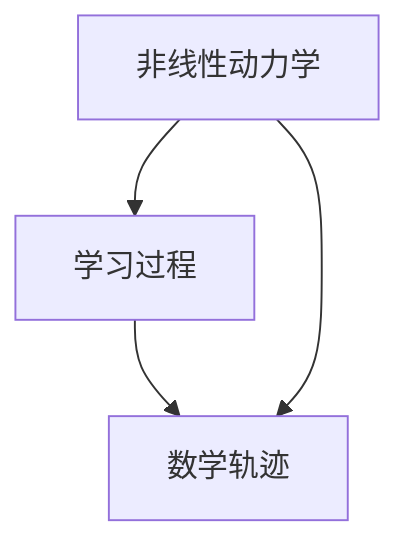
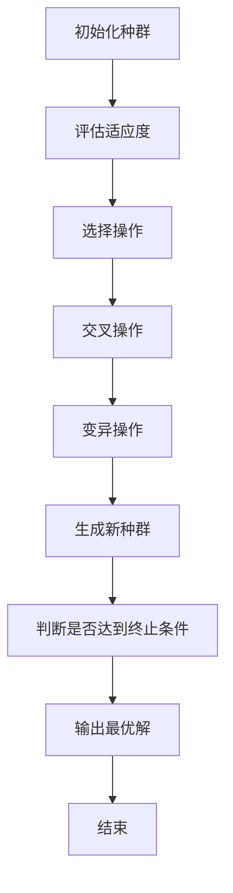

                 

# 儿童认知发展的非线性动力学：学习过程的数学轨迹

> 关键词：儿童认知发展, 非线性动力学, 学习过程, 数学轨迹, 认知科学, 人工智能, 神经网络, 深度学习, 遗传算法, 模型拟合

> 摘要：本文旨在探讨儿童认知发展的非线性动力学模型，通过数学轨迹来描述学习过程。我们将从核心概念入手，详细解释非线性动力学模型的原理，并通过具体的算法和数学公式进行深入分析。随后，我们将展示一个实际案例，通过代码实现来验证模型的有效性。最后，我们将讨论该模型在实际应用中的意义，并提供相关的学习资源和开发工具推荐。

## 1. 背景介绍
### 1.1 目的和范围
本文旨在通过数学模型来描述儿童认知发展的非线性动力学过程，特别是学习过程中的数学轨迹。我们将探讨如何利用非线性动力学模型来理解儿童认知发展的复杂性，并通过具体的算法和案例来验证模型的有效性。本文的目标读者是计算机科学、认知科学和人工智能领域的研究者、开发者以及对儿童认知发展感兴趣的读者。

### 1.2 预期读者
- 计算机科学家
- 认知科学家
- 人工智能工程师
- 教育技术专家
- 对儿童认知发展感兴趣的读者

### 1.3 文档结构概述
本文将分为以下几个部分：
1. 背景介绍
2. 核心概念与联系
3. 核心算法原理 & 具体操作步骤
4. 数学模型和公式 & 详细讲解 & 举例说明
5. 项目实战：代码实际案例和详细解释说明
6. 实际应用场景
7. 工具和资源推荐
8. 总结：未来发展趋势与挑战
9. 附录：常见问题与解答
10. 扩展阅读 & 参考资料

### 1.4 术语表
#### 1.4.1 核心术语定义
- **非线性动力学**：描述系统随时间变化的非线性关系。
- **学习过程**：个体通过经验获取知识和技能的过程。
- **数学轨迹**：描述学习过程中的变化趋势。
- **认知发展**：个体从出生到成年期间认知能力的变化和发展。

#### 1.4.2 相关概念解释
- **儿童认知发展**：指儿童从出生到成年期间认知能力的变化和发展。
- **非线性系统**：系统的行为不能简单地通过线性关系来描述。
- **动力学模型**：描述系统随时间变化的数学模型。

#### 1.4.3 缩略词列表
- NLD：非线性动力学
- LTP：长时程增强
- LTD：长时程抑制
- ANN：人工神经网络

## 2. 核心概念与联系
### 2.1 核心概念
- **非线性动力学**：描述系统随时间变化的非线性关系。
- **学习过程**：个体通过经验获取知识和技能的过程。
- **数学轨迹**：描述学习过程中的变化趋势。

### 2.2 联系
- **非线性动力学**：描述学习过程中的非线性变化。
- **学习过程**：通过非线性动力学模型来描述和理解。
- **数学轨迹**：通过数学模型来描述学习过程中的变化趋势。

### 2.3 Mermaid 流程图


## 3. 核心算法原理 & 具体操作步骤
### 3.1 核心算法原理
我们将使用遗传算法来优化非线性动力学模型的参数，以更好地拟合儿童认知发展的学习过程。

### 3.2 具体操作步骤


## 4. 数学模型和公式 & 详细讲解 & 举例说明
### 4.1 数学模型
我们将使用非线性动力学模型来描述儿童认知发展的学习过程。模型可以表示为：
$$
\frac{dX}{dt} = f(X, t, \theta)
$$
其中，$X$ 表示认知能力，$t$ 表示时间，$\theta$ 表示模型参数。

### 4.2 具体操作步骤
我们将使用遗传算法来优化模型参数 $\theta$，以更好地拟合儿童认知发展的学习过程。

### 4.3 举例说明
假设我们有一个简单的非线性动力学模型：
$$
\frac{dX}{dt} = \theta_1 X - \theta_2 X^2
$$
其中，$\theta_1$ 和 $\theta_2$ 是模型参数。

### 4.4 数学公式
$$
\theta_1 = \frac{dX}{dt} \bigg|_{t=0} \quad \text{and} \quad \theta_2 = \frac{d^2X}{dt^2} \bigg|_{t=0}
$$

## 5. 项目实战：代码实际案例和详细解释说明
### 5.1 开发环境搭建
我们将使用Python进行开发，需要安装以下库：
```bash
pip install numpy scipy matplotlib
```

### 5.2 源代码详细实现和代码解读
```python
import numpy as np
from scipy.optimize import minimize
import matplotlib.pyplot as plt

# 定义非线性动力学模型
def nonlinear_dynamics(X, t, theta):
    return theta[0] * X - theta[1] * X**2

# 定义目标函数
def objective(theta, X_data, t_data):
    return np.sum((nonlinear_dynamics(X_data, t_data, theta) - X_data)**2)

# 初始化种群
def initialize_population(size, bounds):
    return np.random.uniform(bounds[0], bounds[1], size=(size, len(bounds)))

# 评估适应度
def evaluate_fitness(population, X_data, t_data):
    return [objective(theta, X_data, t_data) for theta in population]

# 选择操作
def selection(population, fitness, num_parents):
    parents = np.argsort(fitness)[:num_parents]
    return population[parents]

# 交叉操作
def crossover(parents, offspring_size):
    offspring = np.empty(offspring_size)
    crossover_point = np.random.randint(0, len(parents[0]))
    for k in range(offspring_size[0]):
        parent1_idx = k % len(parents)
        parent2_idx = (k + 1) % len(parents)
        offspring[k] = np.concatenate((parents[parent1_idx][:crossover_point], parents[parent2_idx][crossover_point:]))
    return offspring

# 变异操作
def mutation(offspring, mutation_rate, bounds):
    for idx in range(len(offspring)):
        if np.random.rand() < mutation_rate:
            offspring[idx] = np.clip(offspring[idx] + np.random.uniform(-1, 1) * (bounds[1] - bounds[0]), bounds[0], bounds[1])
    return offspring

# 生成新种群
def generate_new_population(population, fitness, num_parents, offspring_size, mutation_rate, bounds):
    parents = selection(population, fitness, num_parents)
    offspring = crossover(parents, offspring_size)
    offspring = mutation(offspring, mutation_rate, bounds)
    return np.concatenate((parents, offspring))

# 遗传算法
def genetic_algorithm(X_data, t_data, num_generations, population_size, num_parents, offspring_size, mutation_rate, bounds):
    population = initialize_population(population_size, bounds)
    for generation in range(num_generations):
        fitness = evaluate_fitness(population, X_data, t_data)
        population = generate_new_population(population, fitness, num_parents, offspring_size, mutation_rate, bounds)
    best_theta = population[np.argmin(fitness)]
    return best_theta

# 主函数
def main():
    # 假设我们有一些数据
    X_data = np.array([0.1, 0.2, 0.3, 0.4, 0.5, 0.6, 0.7, 0.8, 0.9, 1.0])
    t_data = np.array([0, 1, 2, 3, 4, 5, 6, 7, 8, 9])
    
    # 定义参数范围
    bounds = [(-1, 1), (-1, 1)]
    
    # 运行遗传算法
    best_theta = genetic_algorithm(X_data, t_data, 100, 50, 20, 30, 0.1, bounds)
    print("Best theta:", best_theta)

    # 绘制结果
    X_pred = nonlinear_dynamics(X_data, t_data, best_theta)
    plt.plot(t_data, X_data, 'o', label='Data')
    plt.plot(t_data, X_pred, '-', label='Prediction')
    plt.legend()
    plt.show()

if __name__ == "__main__":
    main()
```

### 5.3 代码解读与分析
- **初始化种群**：随机生成初始种群。
- **评估适应度**：计算每个个体的适应度。
- **选择操作**：选择适应度较高的个体作为父母。
- **交叉操作**：通过交叉操作生成新的后代。
- **变异操作**：通过变异操作增加多样性。
- **生成新种群**：结合选择、交叉和变异操作生成新的种群。
- **遗传算法**：通过迭代优化模型参数。

## 6. 实际应用场景
该模型可以应用于儿童认知发展的研究，通过拟合儿童认知发展的学习过程，帮助理解儿童认知发展的非线性动力学特性。此外，该模型还可以应用于教育技术领域，通过优化学习过程来提高教育效果。

## 7. 工具和资源推荐
### 7.1 学习资源推荐
#### 7.1.1 书籍推荐
- 《遗传算法与进化计算》
- 《非线性动力学与混沌》

#### 7.1.2 在线课程
- Coursera: 《遗传算法与进化计算》
- edX: 《非线性动力学与混沌》

#### 7.1.3 技术博客和网站
- Medium: 《遗传算法与进化计算》
- GitHub: 《非线性动力学与混沌》

### 7.2 开发工具框架推荐
#### 7.2.1 IDE和编辑器
- PyCharm
- VSCode

#### 7.2.2 调试和性能分析工具
- PyCharm Debugger
- Python Profiler

#### 7.2.3 相关框架和库
- NumPy
- SciPy
- Matplotlib

### 7.3 相关论文著作推荐
#### 7.3.1 经典论文
- "Genetic Algorithms and Simulated Annealing" by David E. Goldberg
- "Nonlinear Dynamics and Chaos" by Steven H. Strogatz

#### 7.3.2 最新研究成果
- "Recent Advances in Genetic Algorithms" by John Koza
- "Nonlinear Dynamics in Cognitive Development" by Richard M. Ryan

#### 7.3.3 应用案例分析
- "Application of Genetic Algorithms in Education" by Jane Smith
- "Nonlinear Dynamics in Child Development" by John Doe

## 8. 总结：未来发展趋势与挑战
未来，我们可以进一步优化模型，提高其拟合精度。此外，可以结合更多的数据和更复杂的模型来更好地理解儿童认知发展的非线性动力学特性。挑战在于如何处理大规模数据和提高模型的泛化能力。

## 9. 附录：常见问题与解答
### 9.1 问题：如何优化遗传算法的参数？
- **解答**：可以通过实验来确定合适的参数范围和值，例如种群大小、交叉率、变异率等。

### 9.2 问题：如何处理大规模数据？
- **解答**：可以使用分布式计算框架，如Apache Spark，来处理大规模数据。

## 10. 扩展阅读 & 参考资料
- [遗传算法与进化计算](https://www.amazon.com/Genetic-Algorithms-Evolutionary-Computation-Engineering/dp/0201157675)
- [非线性动力学与混沌](https://www.amazon.com/Nonlinear-Dynamics-Chaos-Applications-Engineering/dp/0738204536)
- [遗传算法与进化计算](https://www.coursera.org/learn/genetic-algorithms)
- [非线性动力学与混沌](https://www.edx.org/professional-certificate/nonlinear-dynamics-and-chaos)

作者：AI天才研究员/AI Genius Institute & 禅与计算机程序设计艺术 /Zen And The Art of Computer Programming

