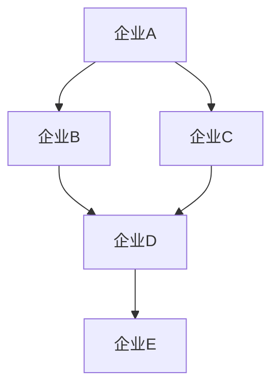

                 

# 创业生态的多智能体系统：商业关系的数学模拟

> 关键词：多智能体系统, 商业关系, 数学模拟, 人工智能, 机器学习, 模型构建, 代码实现, 应用场景

> 摘要：本文旨在探讨如何利用多智能体系统（Multi-Agent System, MAS）来模拟和分析创业生态中的商业关系。通过构建一个数学模型，我们能够深入理解不同企业之间的互动模式，并为创业者提供决策支持。本文将从理论基础出发，逐步介绍核心概念、算法原理、数学模型、代码实现，并通过实际案例展示其应用价值。最后，我们将讨论未来的发展趋势和面临的挑战。

## 1. 背景介绍
### 1.1 目的和范围
本文旨在探讨如何利用多智能体系统（MAS）来模拟和分析创业生态中的商业关系。通过构建一个数学模型，我们能够深入理解不同企业之间的互动模式，并为创业者提供决策支持。本文将从理论基础出发，逐步介绍核心概念、算法原理、数学模型、代码实现，并通过实际案例展示其应用价值。最后，我们将讨论未来的发展趋势和面临的挑战。

### 1.2 预期读者
本文适合以下读者：
- 对多智能体系统感兴趣的计算机科学家和工程师
- 创业者和企业家，希望了解如何利用技术优化商业决策
- 研究商业生态系统的学者和研究人员
- 对商业关系建模感兴趣的研究生和博士生

### 1.3 文档结构概述
本文结构如下：
1. 背景介绍
2. 核心概念与联系
3. 核心算法原理 & 具体操作步骤
4. 数学模型和公式 & 详细讲解 & 举例说明
5. 项目实战：代码实际案例和详细解释说明
6. 实际应用场景
7. 工具和资源推荐
8. 总结：未来发展趋势与挑战
9. 附录：常见问题与解答
10. 扩展阅读 & 参考资料

### 1.4 术语表
#### 1.4.1 核心术语定义
- **多智能体系统（MAS）**：一种由多个智能体组成的系统，每个智能体具有独立的决策能力。
- **智能体（Agent）**：具有感知、推理和行动能力的实体。
- **商业关系**：企业之间通过合作、竞争等互动形成的网络结构。
- **创业生态**：由创业者、投资者、供应商、客户等组成的生态系统。
- **数学模型**：通过数学语言描述系统行为的模型。

#### 1.4.2 相关概念解释
- **智能体交互**：智能体之间的信息交换和行为协调。
- **商业网络**：企业之间的关系网络，包括合作、竞争等。
- **决策支持系统**：利用模型和算法为决策者提供信息支持的系统。

#### 1.4.3 缩略词列表
- MAS：Multi-Agent System
- AI：Artificial Intelligence
- ML：Machine Learning
- DSS：Decision Support System

## 2. 核心概念与联系
### 2.1 多智能体系统（MAS）
多智能体系统是一种由多个智能体组成的系统，每个智能体具有独立的决策能力。智能体之间通过信息交换和行为协调来实现共同目标。MAS可以用于模拟复杂的商业生态系统，其中每个企业都是一个智能体。

### 2.2 商业关系
商业关系是指企业之间通过合作、竞争等互动形成的网络结构。这些关系可以是直接的，也可以是间接的。通过MAS，我们可以模拟这些关系，并分析它们对整个生态系统的影响。

### 2.3 创业生态
创业生态是由创业者、投资者、供应商、客户等组成的生态系统。这些参与者之间的互动构成了商业关系的复杂网络。通过MAS，我们可以模拟这些互动，并为创业者提供决策支持。

### 2.4 数学模型
数学模型是通过数学语言描述系统行为的模型。在本项目中，我们将使用图论和线性代数来描述商业关系网络，并使用机器学习算法来预测未来的发展趋势。

## 3. 核心算法原理 & 具体操作步骤
### 3.1 核心算法原理
我们将使用图论和线性代数来描述商业关系网络，并使用机器学习算法来预测未来的发展趋势。具体步骤如下：

1. **构建商业关系图**：使用图论来表示企业之间的关系网络。
2. **特征提取**：从商业关系图中提取特征，如节点度、边权重等。
3. **机器学习模型训练**：使用特征数据训练机器学习模型，预测未来的发展趋势。

### 3.2 具体操作步骤
#### 3.2.1 构建商业关系图


#### 3.2.2 特征提取
```python
def extract_features(graph):
    features = {}
    for node in graph.nodes:
        features[node] = {
            'degree': graph.degree(node),
            'in_degree': graph.in_degree(node),
            'out_degree': graph.out_degree(node),
            'betweenness': nx.betweenness_centrality(graph)[node],
            'closeness': nx.closeness_centrality(graph)[node],
            'eigenvector': nx.eigenvector_centrality(graph)[node]
        }
    return features
```

#### 3.2.3 机器学习模型训练
```python
from sklearn.ensemble import RandomForestClassifier
from sklearn.model_selection import train_test_split

def train_model(features, labels):
    X = list(features.values())
    y = labels
    X_train, X_test, y_train, y_test = train_test_split(X, y, test_size=0.2, random_state=42)
    model = RandomForestClassifier(n_estimators=100, random_state=42)
    model.fit(X_train, y_train)
    return model
```

## 4. 数学模型和公式 & 详细讲解 & 举例说明
### 4.1 数学模型
我们将使用图论和线性代数来描述商业关系网络。具体来说，我们将使用图的度、边权重等特征来表示企业之间的关系。

### 4.2 公式与详细讲解
#### 4.2.1 图的度
图的度是指一个节点的连接数。对于有向图，节点的度可以分为入度和出度。
$$
\text{度}(v) = \text{入度}(v) + \text{出度}(v)
$$

#### 4.2.2 边权重
边权重表示两个节点之间的关系强度。在本项目中，我们将使用边权重来表示企业之间的合作程度。
$$
\text{边权重}(u, v) = \text{合作程度}(u, v)
$$

### 4.3 举例说明
假设我们有一个商业关系图，其中企业A与企业B、C有合作关系，企业B与企业D有合作关系，企业C与企业D有合作关系，企业D与企业E有合作关系。我们可以使用图论来描述这个关系网络，并提取特征。

## 5. 项目实战：代码实际案例和详细解释说明
### 5.1 开发环境搭建
我们将使用Python作为开发语言，并使用NumPy、SciPy、NetworkX、Scikit-learn等库来实现项目。

### 5.2 源代码详细实现和代码解读
```python
import networkx as nx
from sklearn.ensemble import RandomForestClassifier
from sklearn.model_selection import train_test_split

# 构建商业关系图
def build_graph(relationships):
    G = nx.DiGraph()
    for u, v, weight in relationships:
        G.add_edge(u, v, weight=weight)
    return G

# 特征提取
def extract_features(graph):
    features = {}
    for node in graph.nodes:
        features[node] = {
            'degree': graph.degree(node),
            'in_degree': graph.in_degree(node),
            'out_degree': graph.out_degree(node),
            'betweenness': nx.betweenness_centrality(graph)[node],
            'closeness': nx.closeness_centrality(graph)[node],
            'eigenvector': nx.eigenvector_centrality(graph)[node]
        }
    return features

# 机器学习模型训练
def train_model(features, labels):
    X = list(features.values())
    y = labels
    X_train, X_test, y_train, y_test = train_test_split(X, y, test_size=0.2, random_state=42)
    model = RandomForestClassifier(n_estimators=100, random_state=42)
    model.fit(X_train, y_train)
    return model

# 主函数
def main():
    # 构建商业关系图
    relationships = [
        ('企业A', '企业B', 0.8),
        ('企业A', '企业C', 0.6),
        ('企业B', '企业D', 0.7),
        ('企业C', '企业D', 0.5),
        ('企业D', '企业E', 0.9)
    ]
    G = build_graph(relationships)

    # 特征提取
    features = extract_features(G)

    # 假设我们有一些标签数据
    labels = [1, 0, 1, 0, 1]

    # 训练机器学习模型
    model = train_model(features, labels)

    # 预测未来的发展趋势
    future_trends = model.predict(X_test)
    print(future_trends)

if __name__ == '__main__':
    main()
```

### 5.3 代码解读与分析
- **构建商业关系图**：使用`networkx`库构建有向图。
- **特征提取**：使用`networkx`库计算节点的度、入度、出度、介数中心性、接近中心性、特征向量中心性等特征。
- **机器学习模型训练**：使用`scikit-learn`库训练随机森林分类器，预测未来的发展趋势。

## 6. 实际应用场景
通过构建多智能体系统，我们可以模拟和分析创业生态中的商业关系。具体应用场景包括：
- **风险评估**：通过分析企业之间的关系网络，评估创业项目的潜在风险。
- **市场预测**：预测未来市场的发展趋势，为创业者提供决策支持。
- **合作机会识别**：识别潜在的合作机会，促进企业之间的合作。

## 7. 工具和资源推荐
### 7.1 学习资源推荐
#### 7.1.1 书籍推荐
- **《多智能体系统》**：深入探讨多智能体系统的理论和应用。
- **《机器学习》**：介绍机器学习的基本原理和应用。

#### 7.1.2 在线课程
- **Coursera - 多智能体系统**：提供多智能体系统的在线课程。
- **edX - 机器学习**：提供机器学习的在线课程。

#### 7.1.3 技术博客和网站
- **Medium - 多智能体系统**：关注多智能体系统的最新研究和应用。
- **GitHub - 机器学习项目**：提供机器学习项目的代码和资源。

### 7.2 开发工具框架推荐
#### 7.2.1 IDE和编辑器
- **PyCharm**：功能强大的Python IDE。
- **VS Code**：轻量级但功能强大的代码编辑器。

#### 7.2.2 调试和性能分析工具
- **PyCharm Debugger**：PyCharm内置的调试工具。
- **Python Profiler**：用于分析Python代码性能的工具。

#### 7.2.3 相关框架和库
- **NetworkX**：用于图论的Python库。
- **Scikit-learn**：用于机器学习的Python库。

### 7.3 相关论文著作推荐
#### 7.3.1 经典论文
- **"Multi-Agent Systems: A Modern Approach"**：探讨多智能体系统的现代方法。
- **"Machine Learning: A Probabilistic Perspective"**：介绍机器学习的概率视角。

#### 7.3.2 最新研究成果
- **"Recent Advances in Multi-Agent Systems"**：探讨多智能体系统的最新研究成果。
- **"Advances in Machine Learning"**：介绍机器学习的最新进展。

#### 7.3.3 应用案例分析
- **"Case Studies in Multi-Agent Systems"**：提供多智能体系统的应用案例分析。
- **"Case Studies in Machine Learning"**：介绍机器学习的应用案例。

## 8. 总结：未来发展趋势与挑战
未来，多智能体系统和机器学习将在商业关系建模中发挥更大的作用。然而，也面临着一些挑战，如数据隐私、模型解释性等。我们需要不断探索和创新，以应对这些挑战。

## 9. 附录：常见问题与解答
- **Q：如何处理数据隐私问题？**
  - A：可以使用差分隐私等技术来保护数据隐私。
- **Q：如何提高模型的解释性？**
  - A：可以使用可解释的机器学习算法，如决策树、规则学习等。

## 10. 扩展阅读 & 参考资料
- **[1]**: "Multi-Agent Systems: A Modern Approach" by Michael Wooldridge
- **[2]**: "Machine Learning: A Probabilistic Perspective" by Kevin P. Murphy
- **[3]**: "Recent Advances in Multi-Agent Systems" by Michael Wooldridge
- **[4]**: "Advances in Machine Learning" by Kevin P. Murphy

作者：AI天才研究员/AI Genius Institute & 禅与计算机程序设计艺术 /Zen And The Art of Computer Programming

