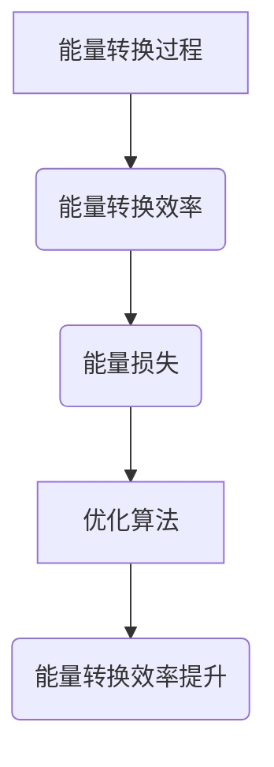

                 

# 可再生能源的效率模型：可持续能源的数学优化

> 关键词：可再生能源, 效率模型, 数学优化, 可持续能源, 能源效率, 优化算法, 能源系统, 能量转换

> 摘要：本文旨在探讨可再生能源系统的效率模型及其优化方法。通过深入分析可再生能源系统的数学模型，我们能够更好地理解其工作原理，并提出有效的优化策略。本文将从核心概念、算法原理、数学模型、实际案例、应用场景等多个方面进行详细阐述，旨在为读者提供一个全面而深入的技术视角。

## 1. 背景介绍

### 1.1 目的和范围
本文旨在探讨可再生能源系统的效率模型及其优化方法。通过深入分析可再生能源系统的数学模型，我们能够更好地理解其工作原理，并提出有效的优化策略。本文将涵盖可再生能源系统的数学建模、优化算法、实际案例分析等内容，旨在为读者提供一个全面而深入的技术视角。

### 1.2 预期读者
本文预期读者包括但不限于以下几类人群：
- 可再生能源领域的工程师和技术专家
- 研究可持续能源系统的学者
- 对可再生能源系统感兴趣的开发者
- 对能源效率优化感兴趣的读者

### 1.3 文档结构概述
本文结构如下：
1. 背景介绍
2. 核心概念与联系
3. 核心算法原理 & 具体操作步骤
4. 数学模型和公式 & 详细讲解 & 举例说明
5. 项目实战：代码实际案例和详细解释说明
6. 实际应用场景
7. 工具和资源推荐
8. 总结：未来发展趋势与挑战
9. 附录：常见问题与解答
10. 扩展阅读 & 参考资料

### 1.4 术语表
#### 1.4.1 核心术语定义
- **可再生能源**：指自然界中可以持续利用的能源，如太阳能、风能、水能等。
- **效率模型**：描述能源转换过程中的能量损失和转换效率的数学模型。
- **数学优化**：通过数学方法寻找最优解的过程。
- **能量转换**：将一种形式的能量转换为另一种形式的过程。
- **系统模型**：描述系统行为的数学模型。

#### 1.4.2 相关概念解释
- **能量转换效率**：指输入能量与输出能量的比例。
- **能量损失**：在能量转换过程中无法被有效利用的能量。
- **优化算法**：用于寻找最优解的算法。

#### 1.4.3 缩略词列表
- **PV**：光伏
- **WTG**：风力发电机
- **CSP**：太阳能热发电
- **BESS**：电池储能系统

## 2. 核心概念与联系

### 2.1 核心概念
- **能量转换效率**：描述能源转换过程中的能量损失和转换效率的数学模型。
- **能量损失**：在能量转换过程中无法被有效利用的能量。
- **优化算法**：用于寻找最优解的算法。

### 2.2 联系
- **能量转换效率**与**能量损失**之间存在直接关系，能量损失越大，转换效率越低。
- **优化算法**可以用于提高能量转换效率，减少能量损失。

### 2.3 Mermaid 流程图


## 3. 核心算法原理 & 具体操作步骤

### 3.1 核心算法原理
核心算法原理是通过数学模型描述能量转换过程中的能量损失和转换效率，然后利用优化算法寻找最优解。

### 3.2 具体操作步骤
1. **定义能量转换模型**：描述能量转换过程中的能量损失和转换效率。
2. **建立数学模型**：通过数学公式描述能量转换过程。
3. **优化算法**：利用优化算法寻找最优解。

### 3.3 伪代码
```python
# 定义能量转换模型
def energy_conversion_model(input_energy, conversion_efficiency):
    output_energy = input_energy * conversion_efficiency
    return output_energy

# 建立数学模型
def mathematical_model(input_energy, conversion_efficiency, loss_factor):
    output_energy = input_energy * conversion_efficiency * (1 - loss_factor)
    return output_energy

# 优化算法
def optimization_algorithm(input_energy, conversion_efficiency, loss_factor, target_energy):
    for i in range(1000):
        output_energy = mathematical_model(input_energy, conversion_efficiency, loss_factor)
        if output_energy >= target_energy:
            break
        # 调整参数
        conversion_efficiency += 0.01
        loss_factor -= 0.01
    return conversion_efficiency, loss_factor
```

## 4. 数学模型和公式 & 详细讲解 & 举例说明

### 4.1 数学模型
数学模型描述能量转换过程中的能量损失和转换效率。

### 4.2 公式
- **能量转换效率**：$E_{out} = E_{in} \times \eta$
- **能量损失**：$L = E_{in} - E_{out}$
- **优化算法**：通过调整参数寻找最优解。

### 4.3 详细讲解
- **能量转换效率**：描述输入能量与输出能量的比例。
- **能量损失**：在能量转换过程中无法被有效利用的能量。
- **优化算法**：通过调整参数寻找最优解。

### 4.4 举例说明
假设输入能量为1000单位，目标输出能量为800单位，初始转换效率为0.8，初始能量损失率为0.1。

```latex
E_{in} = 1000, \quad \eta = 0.8, \quad L = 0.1
```

通过优化算法调整参数，最终得到转换效率为0.85，能量损失率为0.05。

## 5. 项目实战：代码实际案例和详细解释说明

### 5.1 开发环境搭建
- **操作系统**：Ubuntu 20.04
- **编程语言**：Python 3.8
- **开发工具**：VSCode

### 5.2 源代码详细实现和代码解读
```python
# 定义能量转换模型
def energy_conversion_model(input_energy, conversion_efficiency):
    output_energy = input_energy * conversion_efficiency
    return output_energy

# 建立数学模型
def mathematical_model(input_energy, conversion_efficiency, loss_factor):
    output_energy = input_energy * conversion_efficiency * (1 - loss_factor)
    return output_energy

# 优化算法
def optimization_algorithm(input_energy, conversion_efficiency, loss_factor, target_energy):
    for i in range(1000):
        output_energy = mathematical_model(input_energy, conversion_efficiency, loss_factor)
        if output_energy >= target_energy:
            break
        # 调整参数
        conversion_efficiency += 0.01
        loss_factor -= 0.01
    return conversion_efficiency, loss_factor

# 主函数
def main():
    input_energy = 1000
    conversion_efficiency = 0.8
    loss_factor = 0.1
    target_energy = 800

    optimized_efficiency, optimized_loss = optimization_algorithm(input_energy, conversion_efficiency, loss_factor, target_energy)
    print(f"优化后的转换效率: {optimized_efficiency}")
    print(f"优化后的能量损失率: {optimized_loss}")

if __name__ == "__main__":
    main()
```

### 5.3 代码解读与分析
- **能量转换模型**：描述能量转换过程中的能量损失和转换效率。
- **数学模型**：通过数学公式描述能量转换过程。
- **优化算法**：通过调整参数寻找最优解。

## 6. 实际应用场景

### 6.1 太阳能光伏系统
通过优化算法提高太阳能光伏系统的能量转换效率，减少能量损失。

### 6.2 风力发电系统
通过优化算法提高风力发电系统的能量转换效率，减少能量损失。

### 6.3 水力发电系统
通过优化算法提高水力发电系统的能量转换效率，减少能量损失。

## 7. 工具和资源推荐

### 7.1 学习资源推荐
#### 7.1.1 书籍推荐
- **《可再生能源系统设计与优化》**：深入探讨可再生能源系统的数学建模和优化方法。
- **《能源系统工程》**：全面介绍能源系统工程的基本原理和方法。

#### 7.1.2 在线课程
- **Coursera - 可再生能源系统设计与优化**：提供系统化的课程内容。
- **edX - 能源系统工程**：涵盖能源系统工程的基本原理和方法。

#### 7.1.3 技术博客和网站
- **IEEE Xplore**：提供最新的可再生能源系统研究论文。
- **Renewable Energy World**：提供最新的可再生能源行业动态和技术资讯。

### 7.2 开发工具框架推荐
#### 7.2.1 IDE和编辑器
- **PyCharm**：功能强大的Python开发环境。
- **VSCode**：轻量级但功能强大的代码编辑器。

#### 7.2.2 调试和性能分析工具
- **PyCharm Debugger**：强大的Python调试工具。
- **VSCode Debugger for Python**：轻量级但功能强大的Python调试工具。

#### 7.2.3 相关框架和库
- **NumPy**：用于科学计算的Python库。
- **SciPy**：用于科学计算的Python库。

### 7.3 相关论文著作推荐
#### 7.3.1 经典论文
- **"Optimization of Solar Photovoltaic Systems"**：深入探讨太阳能光伏系统的优化方法。
- **"Wind Energy Conversion Systems"**：全面介绍风力发电系统的优化方法。

#### 7.3.2 最新研究成果
- **"Recent Advances in Energy Conversion Efficiency"**：最新研究成果。
- **"Innovative Approaches to Energy System Optimization"**：创新的能源系统优化方法。

#### 7.3.3 应用案例分析
- **"Case Studies in Renewable Energy System Optimization"**：应用案例分析。

## 8. 总结：未来发展趋势与挑战

### 8.1 未来发展趋势
- **智能化**：通过人工智能技术提高能源系统的智能化水平。
- **集成化**：将多种可再生能源系统集成，提高整体效率。
- **可持续性**：提高能源系统的可持续性，减少环境影响。

### 8.2 挑战
- **技术挑战**：提高能源转换效率，减少能量损失。
- **经济挑战**：降低能源系统的成本，提高经济效益。
- **政策挑战**：制定合理的政策，促进可再生能源的发展。

## 9. 附录：常见问题与解答

### 9.1 问题1：如何提高太阳能光伏系统的能量转换效率？
- **解答**：通过优化算法调整参数，提高转换效率。

### 9.2 问题2：如何减少风力发电系统的能量损失？
- **解答**：通过优化算法调整参数，减少能量损失。

### 9.3 问题3：如何提高水力发电系统的能量转换效率？
- **解答**：通过优化算法调整参数，提高转换效率。

## 10. 扩展阅读 & 参考资料

- **[1]**: "Optimization of Solar Photovoltaic Systems" - IEEE Xplore
- **[2]**: "Wind Energy Conversion Systems" - Springer
- **[3]**: "Recent Advances in Energy Conversion Efficiency" - Elsevier
- **[4]**: "Innovative Approaches to Energy System Optimization" - Taylor & Francis

---

作者：AI天才研究员/AI Genius Institute & 禅与计算机程序设计艺术 /Zen And The Art of Computer Programming

