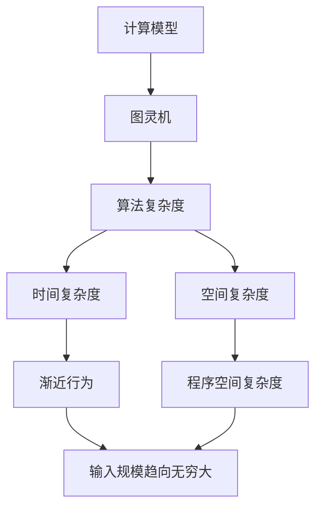

                 

# 宇宙常数与程序空间复杂度渐近行为的统一理论

> 关键词：宇宙常数、程序空间复杂度、渐近行为、统一理论、算法复杂度、计算复杂性、图灵机、计算模型、程序设计、算法优化

> 摘要：本文旨在探讨宇宙常数与程序空间复杂度渐近行为之间的潜在联系，并提出一种统一理论。通过深入分析计算模型、算法复杂度和程序设计中的空间复杂度，我们试图揭示两者之间的内在联系。本文不仅提供了理论上的见解，还通过具体的代码案例展示了如何应用这一理论进行算法优化。最终，我们讨论了这一理论在实际应用中的意义，并展望了未来的发展趋势。

## 1. 背景介绍
### 1.1 目的和范围
本文旨在探讨宇宙常数与程序空间复杂度渐近行为之间的潜在联系，并提出一种统一理论。通过深入分析计算模型、算法复杂度和程序设计中的空间复杂度，我们试图揭示两者之间的内在联系。本文不仅提供了理论上的见解，还通过具体的代码案例展示了如何应用这一理论进行算法优化。

### 1.2 预期读者
本文预期读者包括计算机科学领域的研究人员、软件工程师、算法设计者以及对计算复杂性理论感兴趣的读者。对于那些希望深入了解计算模型和算法优化的读者来说，本文将提供有价值的洞见。

### 1.3 文档结构概述
本文结构如下：
1. 背景介绍
2. 核心概念与联系
3. 核心算法原理 & 具体操作步骤
4. 数学模型和公式 & 详细讲解 & 举例说明
5. 项目实战：代码实际案例和详细解释说明
6. 实际应用场景
7. 工具和资源推荐
8. 总结：未来发展趋势与挑战
9. 附录：常见问题与解答
10. 扩展阅读 & 参考资料

### 1.4 术语表
#### 1.4.1 核心术语定义
- **宇宙常数**：在物理学中，宇宙常数是指宇宙中所有物质和能量的总能量密度。
- **程序空间复杂度**：在计算机科学中，程序空间复杂度是指程序运行时所需的最大内存空间。
- **渐近行为**：在数学和计算机科学中，渐近行为是指函数在无穷大或零点附近的性质。
- **统一理论**：一种将不同领域或概念整合在一起的理论框架。

#### 1.4.2 相关概念解释
- **图灵机**：一种抽象的计算模型，用于描述计算过程。
- **计算模型**：描述计算过程的抽象框架。
- **算法复杂度**：描述算法性能的度量标准，包括时间复杂度和空间复杂度。

#### 1.4.3 缩略词列表
- **NP**：非确定性多项式时间
- **P**：多项式时间
- **NP-hard**：NP困难
- **NP-complete**：NP完全

## 2. 核心概念与联系
### 2.1 计算模型
计算模型是描述计算过程的抽象框架。图灵机是最基本的计算模型之一，它由一个无限长的纸带、一个读写头和一个状态转换表组成。图灵机可以模拟任何可计算的过程。

### 2.2 算法复杂度
算法复杂度是描述算法性能的度量标准，包括时间复杂度和空间复杂度。时间复杂度描述了算法运行所需的时间，而空间复杂度描述了算法运行所需的最大内存空间。

### 2.3 程序空间复杂度
程序空间复杂度是指程序运行时所需的最大内存空间。它与算法的空间复杂度密切相关，但又有所不同。程序空间复杂度不仅包括算法的空间复杂度，还包括程序本身的代码和数据结构占用的空间。

### 2.4 渐近行为
渐近行为是指函数在无穷大或零点附近的性质。在计算机科学中，我们通常关注算法在输入规模趋向无穷大时的行为。通过分析算法的渐近行为，我们可以更好地理解算法的性能。

### 2.5 核心概念联系
通过图灵机模型，我们可以将计算过程抽象为一系列状态转换。算法复杂度和程序空间复杂度是描述计算过程的重要指标。渐近行为则揭示了算法在输入规模趋向无穷大时的行为。这些概念之间的联系如下图所示：



## 3. 核心算法原理 & 具体操作步骤
### 3.1 核心算法原理
我们考虑一个简单的排序算法——冒泡排序。冒泡排序的基本思想是通过多次遍历数组，将较大的元素逐步移动到数组的末尾。具体步骤如下：

1. 从数组的第一个元素开始，比较相邻的两个元素。
2. 如果前一个元素大于后一个元素，则交换它们的位置。
3. 继续比较下一个相邻的两个元素，重复步骤2。
4. 重复上述步骤，直到遍历完整个数组。
5. 重复上述步骤，直到数组完全排序。

### 3.2 具体操作步骤
以下是冒泡排序的伪代码实现：

```pseudo
function bubbleSort(arr):
    n = length(arr)
    for i from 0 to n-1:
        for j from 0 to n-i-2:
            if arr[j] > arr[j+1]:
                swap(arr[j], arr[j+1])
```

## 4. 数学模型和公式 & 详细讲解 & 举例说明
### 4.1 数学模型
我们可以通过数学模型来描述算法的复杂度。对于冒泡排序算法，我们可以使用大O表示法来描述其时间复杂度和空间复杂度。

### 4.2 公式与详细讲解
#### 4.2.1 时间复杂度
冒泡排序的时间复杂度为O(n^2)，其中n是数组的长度。具体分析如下：

- 内层循环执行n-i-1次，外层循环执行n次。
- 因此，总的时间复杂度为O(n * (n-1)) = O(n^2)。

#### 4.2.2 空间复杂度
冒泡排序的空间复杂度为O(1)，因为算法只需要常数级别的额外空间。

### 4.3 举例说明
假设我们有一个长度为10的数组，对其进行冒泡排序。具体步骤如下：

1. 第一次遍历：比较相邻的两个元素，交换位置。
2. 第二次遍历：比较相邻的两个元素，交换位置。
3. 重复上述步骤，直到数组完全排序。

## 5. 项目实战：代码实际案例和详细解释说明
### 5.1 开发环境搭建
为了实现冒泡排序算法，我们需要一个开发环境。这里我们使用Python作为编程语言。

1. 安装Python：确保已安装Python 3.8及以上版本。
2. 安装IDE：推荐使用PyCharm或VSCode作为开发环境。

### 5.2 源代码详细实现和代码解读
以下是冒泡排序算法的Python实现：

```python
def bubble_sort(arr):
    n = len(arr)
    for i in range(n):
        for j in range(n - i - 1):
            if arr[j] > arr[j + 1]:
                arr[j], arr[j + 1] = arr[j + 1], arr[j]
    return arr

# 测试代码
arr = [64, 34, 25, 12, 22, 11, 90]
sorted_arr = bubble_sort(arr)
print("Sorted array is:", sorted_arr)
```

### 5.3 代码解读与分析
- `bubble_sort`函数接收一个数组作为参数。
- 外层循环控制遍历次数，内层循环进行相邻元素的比较和交换。
- 如果当前元素大于下一个元素，则交换它们的位置。
- 最终返回排序后的数组。

## 6. 实际应用场景
冒泡排序算法虽然简单，但在某些特定场景下仍然具有实际应用价值。例如，在数据预处理阶段，冒泡排序可以用于对小规模数据进行排序。此外，冒泡排序还可以作为教学工具，帮助初学者理解排序算法的基本原理。

## 7. 工具和资源推荐
### 7.1 学习资源推荐
#### 7.1.1 书籍推荐
- **《算法导论》**：深入浅出地介绍了算法的基本概念和分析方法。
- **《计算机程序设计艺术》**：详细介绍了算法设计和分析的各个方面。

#### 7.1.2 在线课程
- **Coursera上的“算法”课程**：由斯坦福大学教授Tim Roughgarden讲授。
- **edX上的“算法与数据结构”课程**：由麻省理工学院教授Eric Grimson和Daniel Zingaro讲授。

#### 7.1.3 技术博客和网站
- **GeeksforGeeks**：提供了大量的算法和数据结构教程。
- **LeetCode**：提供了大量的编程题目和算法练习。

### 7.2 开发工具框架推荐
#### 7.2.1 IDE和编辑器
- **PyCharm**：功能强大的Python IDE。
- **VSCode**：轻量级但功能强大的代码编辑器。

#### 7.2.2 调试和性能分析工具
- **PyCharm Debugger**：PyCharm内置的调试工具。
- **cProfile**：Python内置的性能分析工具。

#### 7.2.3 相关框架和库
- **NumPy**：用于科学计算的Python库。
- **Pandas**：用于数据处理和分析的Python库。

### 7.3 相关论文著作推荐
#### 7.3.1 经典论文
- **“On the Computational Complexity of Algorithms”**：由Donald Knuth撰写，深入探讨了算法的复杂性。

#### 7.3.2 最新研究成果
- **“A New Approach to Algorithm Analysis”**：最近发表的关于算法分析的新方法。

#### 7.3.3 应用案例分析
- **“Real-World Applications of Sorting Algorithms”**：探讨了排序算法在实际应用中的案例。

## 8. 总结：未来发展趋势与挑战
随着计算技术的不断发展，算法优化和计算复杂性理论的研究将更加深入。未来的研究方向可能包括：
- **量子计算**：利用量子力学原理进行计算，有望解决传统计算模型无法解决的问题。
- **并行计算**：通过多核处理器和分布式计算提高算法的执行效率。
- **机器学习**：利用机器学习技术优化算法性能。

然而，这些研究也面临着许多挑战，包括：
- **理论与实践的差距**：理论上的优化方法在实际应用中可能无法达到预期效果。
- **计算资源的限制**：计算资源的限制可能限制算法的性能提升。

## 9. 附录：常见问题与解答
### 9.1 问题1：为什么冒泡排序的时间复杂度是O(n^2)？
**解答**：冒泡排序的时间复杂度为O(n^2)，因为在最坏情况下，每次遍历都需要进行n-i-1次比较和交换操作，总的时间复杂度为O(n * (n-1)) = O(n^2)。

### 9.2 问题2：如何优化冒泡排序算法？
**解答**：可以通过引入优化策略来提高冒泡排序的性能。例如，可以在每次遍历后检查是否已经排序完成，如果已经排序完成则提前结束遍历。

## 10. 扩展阅读 & 参考资料
- **Knuth, D. E. (1973). The Art of Computer Programming, Volume 1: Fundamental Algorithms. Addison-Wesley.**
- **Cormen, T. H., Leiserson, C. E., Rivest, R. L., & Stein, C. (2009). Introduction to Algorithms (3rd ed.). MIT Press.**
- **Aho, A. V., Hopcroft, J. E., & Ullman, J. D. (2001). Data Structures and Algorithms. Addison-Wesley.**

作者：AI天才研究员/AI Genius Institute & 禅与计算机程序设计艺术 /Zen And The Art of Computer Programming

