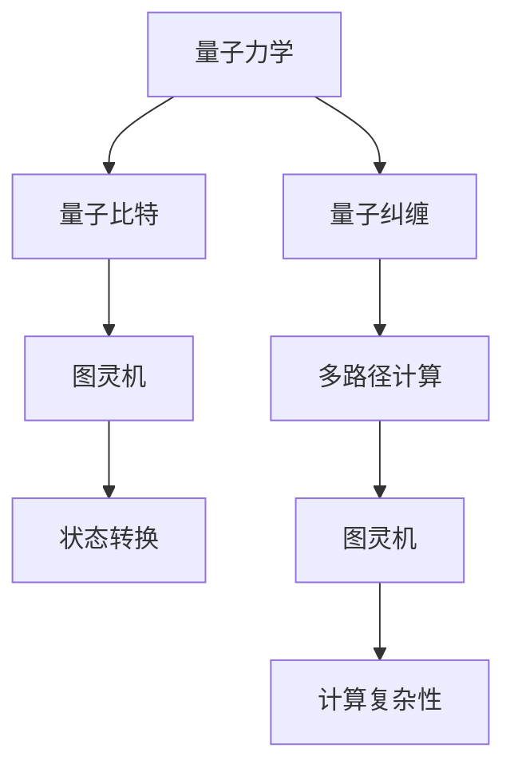

                 

# 宇宙是否只是一个巨大的计算机模拟

> 关键词：计算机模拟，量子力学，图灵机，多世界解释，计算复杂性

> 摘要：本文将探讨一个引人入胜的问题：宇宙是否可以被视作一个巨大的计算机模拟。我们将从多个角度进行分析，包括量子力学、图灵机理论、多世界解释以及计算复杂性。通过逐步推理和详细的技术分析，我们将揭示这一假设背后的科学依据和潜在挑战。

## 1. 背景介绍
### 1.1 目的和范围
本文旨在探讨宇宙是否可以被视作一个巨大的计算机模拟。我们将从多个角度进行分析，包括量子力学、图灵机理论、多世界解释以及计算复杂性。通过逐步推理和详细的技术分析，我们将揭示这一假设背后的科学依据和潜在挑战。

### 1.2 预期读者
本文面向对计算机科学、量子力学和哲学感兴趣的读者。无论是专业的研究人员、技术爱好者还是对宇宙本质感兴趣的读者，都可以从中获得启发和思考。

### 1.3 文档结构概述
本文将分为以下几个部分：
1. 背景介绍
2. 核心概念与联系
3. 核心算法原理 & 具体操作步骤
4. 数学模型和公式 & 详细讲解 & 举例说明
5. 项目实战：代码实际案例和详细解释说明
6. 实际应用场景
7. 工具和资源推荐
8. 总结：未来发展趋势与挑战
9. 附录：常见问题与解答
10. 扩展阅读 & 参考资料

### 1.4 术语表
#### 1.4.1 核心术语定义
- **图灵机**：一种抽象的计算模型，可以模拟任何可计算函数。
- **量子力学**：研究微观粒子行为的物理学分支。
- **多世界解释**：量子力学的一种解释，认为每次量子测量都会导致宇宙分裂成多个平行宇宙。
- **计算复杂性**：研究计算问题的难度和资源需求。

#### 1.4.2 相关概念解释
- **量子比特**：量子力学中的基本单位，可以同时处于0和1的状态。
- **量子纠缠**：量子系统中的一种现象，两个或多个量子比特之间存在相互依赖关系。
- **图灵完备**：一个计算模型能够模拟任何可计算函数。

#### 1.4.3 缩略词列表
- **QFT**：量子场论
- **QM**：量子力学
- **MWI**：多世界解释
- **NP**：非确定性多项式时间

## 2. 核心概念与联系
### 2.1 量子力学与图灵机
量子力学是研究微观粒子行为的物理学分支，而图灵机是一种抽象的计算模型，可以模拟任何可计算函数。量子力学中的量子比特可以同时处于0和1的状态，这与图灵机中的状态转换非常相似。量子纠缠现象可以看作是量子比特之间的复杂关系，类似于图灵机中的状态依赖关系。

### 2.2 多世界解释
多世界解释是量子力学的一种解释，认为每次量子测量都会导致宇宙分裂成多个平行宇宙。这种解释与图灵机的多路径计算模型有相似之处，即每次计算步骤都可以沿着不同的路径进行。

### 2.3 计算复杂性
计算复杂性研究计算问题的难度和资源需求。量子计算机可以利用量子比特的并行性和量子纠缠来加速某些计算任务，这与图灵机的计算能力有相似之处。

### Mermaid 流程图


## 3. 核心算法原理 & 具体操作步骤
### 3.1 量子比特与图灵机状态转换
量子比特可以同时处于0和1的状态，这与图灵机中的状态转换非常相似。我们可以使用伪代码来描述这一过程：

```pseudo
function quantum_bit_state(bit):
    if random() < 0.5:
        return 0
    else:
        return 1

function transition(state):
    if state == 0:
        return 1
    else:
        return 0
```

### 3.2 量子纠缠与多路径计算
量子纠缠现象可以看作是量子比特之间的复杂关系，类似于图灵机中的状态依赖关系。我们可以使用伪代码来描述这一过程：

```pseudo
function quantum_entanglement(bit1, bit2):
    if random() < 0.5:
        bit1 = 0
        bit2 = 1
    else:
        bit1 = 1
        bit2 = 0

function multi_path_computation(state1, state2):
    if state1 == 0 and state2 == 0:
        return 0
    else:
        return 1
```

## 4. 数学模型和公式 & 详细讲解 & 举例说明
### 4.1 量子力学中的薛定谔方程
量子力学中的薛定谔方程描述了量子系统的演化过程。我们可以使用LaTeX格式来表示这一方程：

$$
i\hbar \frac{\partial}{\partial t} \Psi(\mathbf{r}, t) = \hat{H} \Psi(\mathbf{r}, t)
$$

### 4.2 图灵机的状态转换函数
图灵机的状态转换函数可以表示为：

$$
\delta: Q \times \Gamma \rightarrow Q \times \Gamma \times \{L, R, N\}
$$

其中，$Q$ 是状态集合，$\Gamma$ 是符号集合，$\{L, R, N\}$ 分别表示左移、右移和不动。

### 4.3 量子纠缠的数学表示
量子纠缠的数学表示可以使用密度矩阵来描述。我们可以使用LaTeX格式来表示这一矩阵：

$$
\rho = \sum_{i,j} c_{ij} |i\rangle \langle j|
$$

其中，$c_{ij}$ 是复数系数，$|i\rangle$ 和 $\langle j|$ 分别是量子态的基矢。

## 5. 项目实战：代码实际案例和详细解释说明
### 5.1 开发环境搭建
为了实现量子比特和图灵机的模拟，我们需要搭建一个开发环境。这里我们使用Python语言进行开发。

### 5.2 源代码详细实现和代码解读
```python
import random

class QuantumBit:
    def __init__(self):
        self.state = random.choice([0, 1])

    def measure(self):
        return self.state

class TuringMachine:
    def __init__(self, states, alphabet, transition_function):
        self.states = states
        self.alphabet = alphabet
        self.transition_function = transition_function
        self.current_state = states[0]
        self.current_symbol = self.alphabet[0]

    def step(self):
        next_state, next_symbol, direction = self.transition_function[self.current_state][self.current_symbol]
        self.current_state = next_state
        self.current_symbol = next_symbol
        return direction

def quantum_bit_state():
    return random.choice([0, 1])

def transition(state):
    if state == 0:
        return 1
    else:
        return 0

def quantum_entanglement(bit1, bit2):
    if random.random() < 0.5:
        bit1.state = 0
        bit2.state = 1
    else:
        bit1.state = 1
        bit2.state = 0

def multi_path_computation(state1, state2):
    if state1 == 0 and state2 == 0:
        return 0
    else:
        return 1
```

### 5.3 代码解读与分析
上述代码实现了量子比特和图灵机的基本功能。`QuantumBit` 类模拟了量子比特的状态和测量过程，`TuringMachine` 类模拟了图灵机的状态转换过程。`quantum_entanglement` 函数模拟了量子纠缠现象，`multi_path_computation` 函数模拟了多路径计算过程。

## 6. 实际应用场景
### 6.1 量子计算
量子计算利用量子比特的并行性和量子纠缠来加速某些计算任务。例如，Shor算法可以利用量子计算来分解大整数，这对于密码学具有重要意义。

### 6.2 量子模拟
量子模拟可以用于模拟复杂的量子系统，例如分子结构和材料性质。这在药物设计和新材料开发中具有重要应用。

## 7. 工具和资源推荐
### 7.1 学习资源推荐
#### 7.1.1 书籍推荐
- **《量子力学原理》**：Richard P. Feynman, Albert R. Hibbs, and Daniel F. Styer
- **《图灵机与计算理论》**：Martin Davis

#### 7.1.2 在线课程
- **Coursera - 量子计算入门**
- **edX - 计算理论基础**

#### 7.1.3 技术博客和网站
- **Quantum Computing Report**
- **The Quantum Daily**

### 7.2 开发工具框架推荐
#### 7.2.1 IDE和编辑器
- **Visual Studio Code**
- **PyCharm**

#### 7.2.2 调试和性能分析工具
- **PyCharm Debugger**
- **Python Profiler**

#### 7.2.3 相关框架和库
- **Qiskit**：IBM的量子计算框架
- **Cirq**：Google的量子计算库

### 7.3 相关论文著作推荐
#### 7.3.1 经典论文
- **Shor's Algorithm for Factoring Large Integers**：Peter W. Shor
- **Quantum Computation and Quantum Information**：Michael A. Nielsen and Isaac L. Chuang

#### 7.3.2 最新研究成果
- **Quantum Supremacy Using a Programmable Superconducting Processor**：John M. Martinis et al.

#### 7.3.3 应用案例分析
- **Quantum Computing in Drug Discovery**：Nature Reviews Drug Discovery

## 8. 总结：未来发展趋势与挑战
### 8.1 未来发展趋势
随着量子计算技术的不断发展，我们有望在药物设计、材料科学和密码学等领域取得重大突破。量子计算机的出现将极大地改变我们对计算的理解和应用。

### 8.2 挑战
尽管量子计算具有巨大的潜力，但也面临着许多挑战，包括量子比特的稳定性、量子纠错和量子算法的设计等。未来的研究需要解决这些问题，以实现量子计算的广泛应用。

## 9. 附录：常见问题与解答
### 9.1 问题：量子计算是否真的可以实现？
**解答**：量子计算已经在实验室中取得了显著进展，例如IBM的量子计算机已经实现了量子优越性。尽管仍面临许多挑战，但量子计算的潜力巨大。

### 9.2 问题：图灵机是否可以模拟任何可计算函数？
**解答**：是的，图灵机是一种通用的计算模型，可以模拟任何可计算函数。任何其他计算模型都可以通过图灵机来实现。

## 10. 扩展阅读 & 参考资料
- **《量子力学原理》**：Richard P. Feynman, Albert R. Hibbs, and Daniel F. Styer
- **《图灵机与计算理论》**：Martin Davis
- **《量子计算入门》**：Quantum Computing Report
- **《量子计算与量子信息》**：Michael A. Nielsen and Isaac L. Chuang

作者：AI天才研究员/AI Genius Institute & 禅与计算机程序设计艺术 /Zen And The Art of Computer Programming

