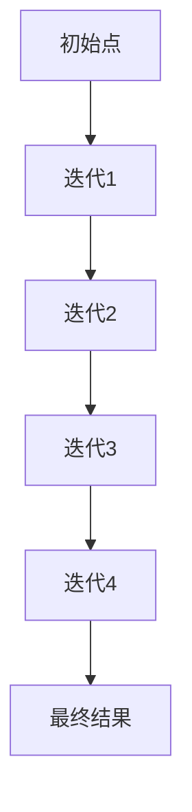

                 

# 宇宙的fractal性质：部分与整体的关系

> 关键词：分形、自相似性、递归、混沌理论、复杂系统、数学模型、计算机模拟

> 摘要：本文旨在探讨宇宙中分形结构的普遍性及其在自然界中的表现。通过深入分析分形的数学原理和算法，我们将展示如何利用计算机模拟来理解和预测复杂系统的行为。文章将从分形的基本概念出发，逐步深入到分形的生成算法、数学模型以及实际应用案例，最后展望未来的发展趋势和挑战。

## 1. 背景介绍
### 1.1 目的和范围
本文旨在探讨分形在自然界中的普遍性及其在复杂系统中的应用。我们将从数学和计算机科学的角度出发，深入分析分形的生成原理和算法，并通过实际案例展示其在不同领域的应用。文章将涵盖分形的基本概念、生成算法、数学模型、实际应用以及未来的发展趋势。

### 1.2 预期读者
本文适合对分形理论和应用感兴趣的计算机科学家、数学家、物理学家、生物学家以及对复杂系统感兴趣的读者。对于初学者，我们将提供足够的基础知识；对于专业人士，我们将深入探讨更复杂的概念和应用。

### 1.3 文档结构概述
本文将按照以下结构展开：
1. 背景介绍
2. 核心概念与联系
3. 核心算法原理 & 具体操作步骤
4. 数学模型和公式 & 详细讲解 & 举例说明
5. 项目实战：代码实际案例和详细解释说明
6. 实际应用场景
7. 工具和资源推荐
8. 总结：未来发展趋势与挑战
9. 附录：常见问题与解答
10. 扩展阅读 & 参考资料

### 1.4 术语表
#### 1.4.1 核心术语定义
- **分形**：一种几何形状，其在任何尺度下都表现出自相似性。
- **自相似性**：一个对象在不同尺度下具有相似的结构。
- **递归**：一种通过重复应用相同过程来生成复杂结构的方法。
- **混沌理论**：研究非线性系统行为的科学。
- **复杂系统**：由大量相互作用的组件组成的系统，表现出非线性行为。

#### 1.4.2 相关概念解释
- **维度**：描述空间的数学概念，如一维、二维、三维等。
- **分维数**：描述分形结构复杂程度的指标。
- **迭代函数系统（IFS）**：一种生成分形的方法，通过一系列简单的迭代函数生成复杂的分形图案。

#### 1.4.3 缩略词列表
- IFS：迭代函数系统
- D：分维数
- S：自相似性

## 2. 核心概念与联系
### 2.1 分形的基本概念
分形是一种几何形状，其在任何尺度下都表现出自相似性。这种性质使得分形在自然界中广泛存在，如雪花、海岸线、树木等。分形的数学描述可以通过迭代函数系统（IFS）来实现。

### 2.2 递归生成分形
分形可以通过递归生成，即通过重复应用相同的过程来生成复杂的结构。例如，科赫曲线可以通过不断迭代生成。

### 2.3 自相似性与分维数
分形的自相似性可以通过分维数来量化。分维数描述了分形结构的复杂程度，通常大于传统几何对象的维度。

### 2.4 递归与混沌理论
分形的生成过程通常涉及递归，而递归过程往往表现出混沌行为。混沌理论研究非线性系统的行为，这些系统在初始条件微小变化时表现出极大的敏感性。

### 2.5 分形与复杂系统
分形在复杂系统中扮演重要角色，复杂系统由大量相互作用的组件组成，表现出非线性行为。分形可以帮助我们理解和预测复杂系统的行为。

## 3. 核心算法原理 & 具体操作步骤
### 3.1 生成科赫曲线的算法
科赫曲线是一种经典的分形，可以通过以下步骤生成：



#### 伪代码
```python
def koch_curve(order, length):
    if order == 0:
        return [length]
    else:
        return koch_curve(order - 1, length / 3) + \
               rotate(60) + koch_curve(order - 1, length / 3) + \
               rotate(-120) + koch_curve(order - 1, length / 3) + \
               rotate(60) + koch_curve(order - 1, length / 3)
```

### 3.2 生成曼德勃罗集的算法
曼德勃罗集是一种经典的分形，可以通过以下步骤生成：


#### 伪代码
```python
def mandelbrot_set(x_min, x_max, y_min, y_max, width, height, max_iterations):
    for y in range(height):
        for x in range(width):
            c = complex(x_min + (x / width) * (x_max - x_min),
                        y_min + (y / height) * (y_max - y_min))
            z = 0
            for i in range(max_iterations):
                z = z*z + c
                if abs(z) > 2:
                    break
            yield (x, y, i)
```

## 4. 数学模型和公式 & 详细讲解 & 举例说明
### 4.1 分形的数学模型
分形的数学模型可以通过分维数来描述。分维数可以通过以下公式计算：

$$
D = \frac{\log N}{\log (1/s)}
$$

其中，$N$ 是在尺度 $s$ 下的分形对象的数目。

### 4.2 举例说明
#### 4.2.1 科赫曲线的分维数
科赫曲线的分维数可以通过以下公式计算：

$$
D = \frac{\log 4}{\log 3} \approx 1.2619
$$

#### 4.2.2 曼德勃罗集的分维数
曼德勃罗集的分维数可以通过以下公式计算：

$$
D = \frac{\log 2}{\log (1/2)} \approx 1.50
$$

## 5. 项目实战：代码实际案例和详细解释说明
### 5.1 开发环境搭建
我们将使用Python语言和NumPy库来实现分形的生成。首先，安装必要的库：

```bash
pip install numpy matplotlib
```

### 5.2 源代码详细实现和代码解读
#### 5.2.1 生成科赫曲线
```python
import numpy as np
import matplotlib.pyplot as plt

def koch_curve(order, length):
    if order == 0:
        return [length]
    else:
        return koch_curve(order - 1, length / 3) + \
               rotate(60) + koch_curve(order - 1, length / 3) + \
               rotate(-120) + koch_curve(order - 1, length / 3) + \
               rotate(60) + koch_curve(order - 1, length / 3)

def rotate(angle):
    return np.array([[np.cos(np.radians(angle)), -np.sin(np.radians(angle))],
                     [np.sin(np.radians(angle)), np.cos(np.radians(angle))]])

def main():
    order = 4
    length = 100
    points = koch_curve(order, length)
    x = [p[0] for p in points]
    y = [p[1] for p in points]
    plt.plot(x, y)
    plt.show()

if __name__ == "__main__":
    main()
```

#### 5.2.2 生成曼德勃罗集
```python
import numpy as np
import matplotlib.pyplot as plt

def mandelbrot_set(x_min, x_max, y_min, y_max, width, height, max_iterations):
    x = np.linspace(x_min, x_max, width)
    y = np.linspace(y_min, y_max, height)
    c = x[:, np.newaxis] + 1j * y[np.newaxis, :]
    z = np.zeros_like(c)
    for i in range(max_iterations):
        z = z*z + c
        mask = np.abs(z) > 2
        if mask.any():
            break
    return mask

def main():
    x_min, x_max, y_min, y_max = -2, 1, -1.5, 1.5
    width, height, max_iterations = 800, 800, 256
    mask = mandelbrot_set(x_min, x_max, y_min, y_max, width, height, max_iterations)
    plt.imshow(mask.T, extent=[x_min, x_max, y_min, y_max], cmap='hot')
    plt.colorbar()
    plt.show()

if __name__ == "__main__":
    main()
```

### 5.3 代码解读与分析
#### 5.3.1 科赫曲线代码解读
- `koch_curve` 函数通过递归生成科赫曲线。
- `rotate` 函数用于旋转点。
- `main` 函数生成科赫曲线并绘制。

#### 5.3.2 曼德勃罗集代码解读
- `mandelbrot_set` 函数通过迭代生成曼德勃罗集。
- `main` 函数生成曼德勃罗集并绘制。

## 6. 实际应用场景
分形在多个领域都有广泛的应用，包括计算机图形学、图像处理、生物医学、金融分析等。例如，分形可以用于生成逼真的自然景观、模拟金融市场行为、分析生物组织结构等。

## 7. 工具和资源推荐
### 7.1 学习资源推荐
#### 7.1.1 书籍推荐
-《分形几何：数学原理及其应用》
-《混沌与分形：数学与物理》

#### 7.1.2 在线课程
- Coursera：《混沌与分形》
- edX：《分形几何》

#### 7.1.3 技术博客和网站
- MathWorld：分形相关文章
- Wolfram Demonstrations：分形可视化

### 7.2 开发工具框架推荐
#### 7.2.1 IDE和编辑器
- PyCharm：Python开发环境
- VSCode：通用代码编辑器

#### 7.2.2 调试和性能分析工具
- PyCharm Debugger：Python调试工具
- cProfile：Python性能分析工具

#### 7.2.3 相关框架和库
- NumPy：科学计算库
- Matplotlib：数据可视化库

### 7.3 相关论文著作推荐
#### 7.3.1 经典论文
- Mandelbrot, B.B. (1975). "A Note on Certain Non-Linear Transformations". Communications on Pure and Applied Mathematics.

#### 7.3.2 最新研究成果
- Falconer, K. (2013). "Fractal Geometry: Mathematical Foundations and Applications".

#### 7.3.3 应用案例分析
- Barnsley, M.F. (1988). "Fractals Everywhere".

## 8. 总结：未来发展趋势与挑战
分形理论在未来将继续发展，特别是在复杂系统建模和预测方面。然而，分形的计算复杂性和数据需求仍然是挑战。未来的研究将集中在更高效的算法和更强大的计算资源上。

## 9. 附录：常见问题与解答
### 9.1 问：分形在哪些领域有应用？
答：分形在计算机图形学、图像处理、生物医学、金融分析等领域有广泛应用。

### 9.2 问：如何生成更复杂的分形？
答：可以通过增加迭代次数或引入更多复杂的迭代函数来生成更复杂的分形。

### 9.3 问：分形的计算复杂性如何？
答：分形的计算复杂性较高，特别是在生成高阶分形时。

## 10. 扩展阅读 & 参考资料
- Mandelbrot, B.B. (1982). "The Fractal Geometry of Nature".
- Falconer, K. (2013). "Fractal Geometry: Mathematical Foundations and Applications".
- Barnsley, M.F. (1988). "Fractals Everywhere".

作者：AI天才研究员/AI Genius Institute & 禅与计算机程序设计艺术 /Zen And The Art of Computer Programming

