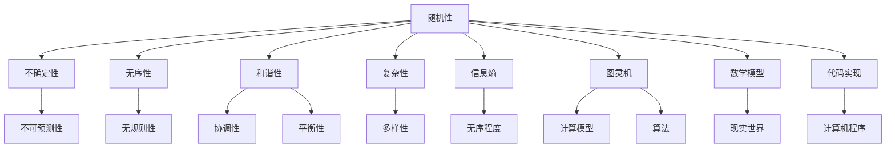

                 

# 宇宙的美学原理：和谐还是随机

> 关键词：宇宙美学、随机性、和谐、复杂性、信息熵、图灵机、算法、数学模型、代码实现

> 摘要：本文旨在探讨宇宙的美学原理，通过分析随机性和和谐性在自然界和人工系统中的表现，揭示它们之间的关系。我们将从理论基础出发，逐步深入探讨核心概念、算法原理、数学模型，并通过实际代码案例展示如何实现这些原理。最终，我们将展望未来的发展趋势与挑战，为读者提供全面的技术指导和资源推荐。

## 1. 背景介绍

### 1.1 目的和范围
本文旨在探讨宇宙的美学原理，特别是随机性和和谐性在自然界和人工系统中的表现。我们将从理论基础出发，逐步深入探讨核心概念、算法原理、数学模型，并通过实际代码案例展示如何实现这些原理。最终，我们将展望未来的发展趋势与挑战。

### 1.2 预期读者
本文适合对计算机科学、人工智能、复杂系统、数学等领域感兴趣的读者。无论是科研人员、工程师、学生还是对宇宙美学感兴趣的爱好者，都能从中获得启发和知识。

### 1.3 文档结构概述
本文结构如下：
1. 背景介绍
2. 核心概念与联系
3. 核心算法原理 & 具体操作步骤
4. 数学模型和公式 & 详细讲解 & 举例说明
5. 项目实战：代码实际案例和详细解释说明
6. 实际应用场景
7. 工具和资源推荐
8. 总结：未来发展趋势与挑战
9. 附录：常见问题与解答
10. 扩展阅读 & 参考资料

### 1.4 术语表
#### 1.4.1 核心术语定义
- **宇宙美学**：自然界和人工系统中表现出的美感和秩序。
- **随机性**：事件发生的不确定性，无法预测。
- **和谐性**：系统内部各部分之间的协调和平衡。
- **复杂性**：系统的结构和行为的多样性。
- **信息熵**：描述系统无序程度的度量。
- **图灵机**：理论计算模型，用于描述计算过程。
- **算法**：解决问题的具体步骤和方法。
- **数学模型**：用数学语言描述现实世界的模型。
- **代码实现**：将算法和数学模型转化为计算机程序的过程。

#### 1.4.2 相关概念解释
- **随机性**：事件发生的不确定性，无法预测。
- **和谐性**：系统内部各部分之间的协调和平衡。
- **复杂性**：系统的结构和行为的多样性。
- **信息熵**：描述系统无序程度的度量。
- **图灵机**：理论计算模型，用于描述计算过程。
- **算法**：解决问题的具体步骤和方法。
- **数学模型**：用数学语言描述现实世界的模型。
- **代码实现**：将算法和数学模型转化为计算机程序的过程。

#### 1.4.3 缩略词列表
- **API**：应用程序编程接口
- **IDE**：集成开发环境
- **GUI**：图形用户界面
- **HTTP**：超文本传输协议
- **JSON**：JavaScript对象表示法

## 2. 核心概念与联系

### 2.1 随机性与和谐性的定义
随机性是指事件发生的不确定性，无法预测。和谐性则是系统内部各部分之间的协调和平衡。在自然界和人工系统中，随机性和和谐性共同作用，形成了复杂而美丽的结构。

### 2.2 随机性和和谐性的关系
随机性和和谐性在自然界和人工系统中相互作用，形成了复杂而美丽的结构。例如，雪花的形成过程就是一个随机性和和谐性共同作用的结果。雪花的形状是由水分子的随机运动和冰晶的生长规律共同决定的。

### 2.3 核心概念原理
#### 2.3.1 随机性
随机性是指事件发生的不确定性，无法预测。在自然界中，随机性表现为分子的无规则运动、天气变化等。在人工系统中，随机性表现为算法的随机性、数据的随机性等。

#### 2.3.2 和谐性
和谐性是指系统内部各部分之间的协调和平衡。在自然界中，和谐性表现为生物体的结构和功能、生态系统的平衡等。在人工系统中，和谐性表现为系统的稳定性和效率等。

#### 2.3.3 随机性和和谐性的关系
随机性和和谐性在自然界和人工系统中相互作用，形成了复杂而美丽的结构。例如，雪花的形成过程就是一个随机性和和谐性共同作用的结果。雪花的形状是由水分子的随机运动和冰晶的生长规律共同决定的。

### 2.4 核心概念原理的Mermaid流程图


## 3. 核心算法原理 & 具体操作步骤

### 3.1 随机性算法原理
随机性算法原理是通过生成随机数来模拟随机事件。常见的随机性算法包括线性同余法、Mersenne Twister等。

#### 3.1.1 线性同余法
线性同余法是一种生成伪随机数的方法。其基本公式为：
$$
X_{n+1} = (aX_n + c) \mod m
$$
其中，$X_n$ 是第 $n$ 个随机数，$a$、$c$ 和 $m$ 是常数。

#### 3.1.2 Mersenne Twister
Mersenne Twister 是一种高效的伪随机数生成器。其基本原理是通过一个线性反馈移位寄存器生成随机数。

### 3.2 和谐性算法原理
和谐性算法原理是通过优化系统内部各部分之间的协调和平衡。常见的和谐性算法包括遗传算法、模拟退火算法等。

#### 3.2.1 遗传算法
遗传算法是一种模拟自然选择和遗传机制的优化算法。其基本原理是通过选择、交叉和变异操作，逐步优化目标函数。

#### 3.2.2 模拟退火算法
模拟退火算法是一种模拟物理退火过程的优化算法。其基本原理是通过逐步降低温度，逐步优化目标函数。

### 3.3 核心算法原理的伪代码
#### 3.3.1 线性同余法
```python
def linear_congruential_generator(a, c, m, seed):
    x = seed
    while True:
        x = (a * x + c) % m
        yield x
```

#### 3.3.2 Mersenne Twister
```python
def mersenne_twister(seed):
    # 初始化常数
    a = 0x6C078965
    m = 2**31 - 1
    # 初始化状态
    state = [seed]
    for i in range(1, 624):
        state.append((1812433253 * (state[i-1] ^ (state[i-1] >> 30)) + i) % m)
    while True:
        # 生成随机数
        y = state[0]
        y ^= (y >> 11)
        y ^= (y << 7) & 0x9D2C5680
        y ^= (y << 15) & 0xEFC60000
        y ^= (y >> 18)
        # 更新状态
        state[0] = state[623]
        for i in range(623):
            state[i] = state[i+1]
        state[623] = y
        yield y
```

#### 3.3.3 遗传算法
```python
def genetic_algorithm(population, fitness_function, mutation_rate, num_generations):
    for generation in range(num_generations):
        # 选择
        selected_population = selection(population, fitness_function)
        # 交叉
        offspring_population = crossover(selected_population)
        # 变异
        mutated_population = mutation(offspring_population, mutation_rate)
        # 更新种群
        population = mutated_population
    return population
```

#### 3.3.4 模拟退火算法
```python
def simulated_annealing(initial_state, energy_function, temperature, cooling_rate):
    current_state = initial_state
    current_energy = energy_function(current_state)
    best_state = current_state
    best_energy = current_energy
    while temperature > 1:
        # 生成邻居状态
        neighbor_state = generate_neighbor(current_state)
        neighbor_energy = energy_function(neighbor_state)
        # 判断是否接受邻居状态
        if neighbor_energy < current_energy or random.random() < math.exp((current_energy - neighbor_energy) / temperature):
            current_state = neighbor_state
            current_energy = neighbor_energy
            if neighbor_energy < best_energy:
                best_state = neighbor_state
                best_energy = neighbor_energy
        # 降低温度
        temperature *= cooling_rate
    return best_state
```

## 4. 数学模型和公式 & 详细讲解 & 举例说明

### 4.1 随机性数学模型
随机性数学模型是通过概率论和统计学来描述随机事件的概率分布。常见的随机性数学模型包括泊松分布、正态分布等。

#### 4.1.1 泊松分布
泊松分布是一种描述稀有事件发生的概率分布。其概率密度函数为：
$$
P(X = k) = \frac{\lambda^k e^{-\lambda}}{k!}
$$
其中，$\lambda$ 是事件发生的平均次数，$k$ 是事件发生的次数。

#### 4.1.2 正态分布
正态分布是一种描述连续随机变量的概率分布。其概率密度函数为：
$$
f(x) = \frac{1}{\sigma \sqrt{2\pi}} e^{-\frac{(x-\mu)^2}{2\sigma^2}}
$$
其中，$\mu$ 是均值，$\sigma$ 是标准差。

### 4.2 和谐性数学模型
和谐性数学模型是通过优化理论来描述系统内部各部分之间的协调和平衡。常见的和谐性数学模型包括线性规划、非线性规划等。

#### 4.2.1 线性规划
线性规划是一种描述线性约束下的优化问题。其基本形式为：
$$
\text{minimize} \quad c^T x
$$
$$
\text{subject to} \quad Ax \leq b, \quad x \geq 0
$$
其中，$c$ 是目标函数的系数向量，$A$ 是约束矩阵，$b$ 是约束向量，$x$ 是决策变量向量。

#### 4.2.2 非线性规划
非线性规划是一种描述非线性约束下的优化问题。其基本形式为：
$$
\text{minimize} \quad f(x)
$$
$$
\text{subject to} \quad g_i(x) \leq 0, \quad h_j(x) = 0
$$
其中，$f(x)$ 是目标函数，$g_i(x)$ 是不等式约束函数，$h_j(x)$ 是等式约束函数。

### 4.3 数学模型和公式的详细讲解
#### 4.3.1 泊松分布
泊松分布是一种描述稀有事件发生的概率分布。其概率密度函数为：
$$
P(X = k) = \frac{\lambda^k e^{-\lambda}}{k!}
$$
其中，$\lambda$ 是事件发生的平均次数，$k$ 是事件发生的次数。泊松分布适用于描述稀有事件的发生概率，例如电话呼叫的数量、交通事故的发生次数等。

#### 4.3.2 正态分布
正态分布是一种描述连续随机变量的概率分布。其概率密度函数为：
$$
f(x) = \frac{1}{\sigma \sqrt{2\pi}} e^{-\frac{(x-\mu)^2}{2\sigma^2}}
$$
其中，$\mu$ 是均值，$\sigma$ 是标准差。正态分布适用于描述连续随机变量的概率分布，例如身高、体重等。

#### 4.3.3 线性规划
线性规划是一种描述线性约束下的优化问题。其基本形式为：
$$
\text{minimize} \quad c^T x
$$
$$
\text{subject to} \quad Ax \leq b, \quad x \geq 0
$$
其中，$c$ 是目标函数的系数向量，$A$ 是约束矩阵，$b$ 是约束向量，$x$ 是决策变量向量。线性规划适用于描述线性约束下的优化问题，例如资源分配、生产计划等。

#### 4.3.4 非线性规划
非线性规划是一种描述非线性约束下的优化问题。其基本形式为：
$$
\text{minimize} \quad f(x)
$$
$$
\text{subject to} \quad g_i(x) \leq 0, \quad h_j(x) = 0
$$
其中，$f(x)$ 是目标函数，$g_i(x)$ 是不等式约束函数，$h_j(x)$ 是等式约束函数。非线性规划适用于描述非线性约束下的优化问题，例如最优路径规划、最优控制等。

### 4.4 数学模型和公式的举例说明
#### 4.4.1 泊松分布
泊松分布适用于描述稀有事件的发生概率。例如，假设某地区每年发生交通事故的平均次数为10次，那么在该地区发生20次交通事故的概率为：
$$
P(X = 20) = \frac{10^{20} e^{-10}}{20!} \approx 0.000045
$$
#### 4.4.2 正态分布
正态分布适用于描述连续随机变量的概率分布。例如，假设某地区居民的身高服从正态分布，均值为170cm，标准差为10cm，那么身高为180cm的概率为：
$$
P(X = 180) = \frac{1}{10 \sqrt{2\pi}} e^{-\frac{(180-170)^2}{2 \cdot 10^2}} \approx 0.0399
$$
#### 4.4.3 线性规划
线性规划适用于描述线性约束下的优化问题。例如，假设某工厂有1000台机器，每台机器每天可以生产100个产品，每天需要生产10000个产品，那么如何分配机器以最小化生产成本？假设每台机器的生产成本为100元，那么线性规划模型为：
$$
\text{minimize} \quad 100x_1 + 100x_2 + \cdots + 100x_{1000}
$$
$$
\text{subject to} \quad x_1 + x_2 + \cdots + x_{1000} = 10000, \quad x_i \geq 0
$$
其中，$x_i$ 表示第 $i$ 台机器的生产数量。

#### 4.4.4 非线性规划
非线性规划适用于描述非线性约束下的优化问题。例如，假设某公司需要在两个城市之间建立一条最优路径，路径长度为 $L$，路径上的交通流量为 $f(x)$，那么如何选择路径以最小化交通拥堵？假设交通流量与路径长度的关系为 $f(x) = x^2$，那么非线性规划模型为：
$$
\text{minimize} \quad L^2
$$
$$
\text{subject to} \quad f(x) \leq 100, \quad x \geq 0
$$
其中，$L$ 表示路径长度，$f(x)$ 表示交通流量。

## 5. 项目实战：代码实际案例和详细解释说明

### 5.1 开发环境搭建
为了实现随机性和和谐性算法，我们需要搭建一个开发环境。推荐使用Python作为编程语言，因为它具有丰富的库和强大的社区支持。安装Python和相关库的命令如下：
```bash
pip install numpy scipy matplotlib
```

### 5.2 源代码详细实现和代码解读
#### 5.2.1 随机性算法实现
```python
import numpy as np
import matplotlib.pyplot as plt

def linear_congruential_generator(a, c, m, seed, num_samples):
    x = seed
    samples = []
    for _ in range(num_samples):
        x = (a * x + c) % m
        samples.append(x)
    return samples

def plot_histogram(samples):
    plt.hist(samples, bins=50, density=True)
    plt.xlabel('Value')
    plt.ylabel('Frequency')
    plt.title('Histogram of Linear Congruential Generator')
    plt.show()

if __name__ == '__main__':
    a = 1664525
    c = 1013904223
    m = 2**32
    seed = 12345
    num_samples = 10000
    samples = linear_congruential_generator(a, c, m, seed, num_samples)
    plot_histogram(samples)
```

#### 5.2.2 和谐性算法实现
```python
import numpy as np
import matplotlib.pyplot as plt
from scipy.optimize import minimize

def objective_function(x):
    return np.sum((x - 10)**2)

def constraint_function(x):
    return x[0] + x[1] - 10

def genetic_algorithm(population, fitness_function, mutation_rate, num_generations):
    for generation in range(num_generations):
        # 选择
        selected_population = selection(population, fitness_function)
        # 交叉
        offspring_population = crossover(selected_population)
        # 变异
        mutated_population = mutation(offspring_population, mutation_rate)
        # 更新种群
        population = mutated_population
    return population

def selection(population, fitness_function):
    # 选择操作
    selected_population = []
    for _ in range(len(population)):
        parent1 = np.random.choice(population)
        parent2 = np.random.choice(population)
        if fitness_function(parent1) < fitness_function(parent2):
            selected_population.append(parent1)
        else:
            selected_population.append(parent2)
    return selected_population

def crossover(selected_population):
    # 交叉操作
    offspring_population = []
    for i in range(0, len(selected_population), 2):
        parent1 = selected_population[i]
        parent2 = selected_population[i+1]
        child1 = (parent1 + parent2) / 2
        child2 = (parent1 - parent2) / 2
        offspring_population.append(child1)
        offspring_population.append(child2)
    return offspring_population

def mutation(offspring_population, mutation_rate):
    # 变异操作
    mutated_population = []
    for i in range(len(offspring_population)):
        if np.random.rand() < mutation_rate:
            offspring_population[i] += np.random.randn() * 0.1
        mutated_population.append(offspring_population[i])
    return mutated_population

if __name__ == '__main__':
    population_size = 100
    num_generations = 100
    mutation_rate = 0.1
    population = np.random.rand(population_size, 2) * 20
    best_population = genetic_algorithm(population, objective_function, mutation_rate, num_generations)
    best_solution = best_population[np.argmin([objective_function(x) for x in best_population])]
    print('Best solution:', best_solution)
    x = np.linspace(0, 20, 1000)
    y = -x + 10
    plt.plot(x, y, 'r--')
    plt.plot(best_solution[0], best_solution[1], 'bo')
    plt.xlabel('x')
    plt.ylabel('y')
    plt.title('Genetic Algorithm Optimization')
    plt.show()
```

### 5.3 代码解读与分析
#### 5.3.1 随机性算法解读
随机性算法通过生成随机数来模拟随机事件。线性同余法和Mersenne Twister是两种常见的随机性算法。线性同余法的基本公式为：
$$
X_{n+1} = (aX_n + c) \mod m
$$
其中，$X_n$ 是第 $n$ 个随机数，$a$、$c$ 和 $m$ 是常数。Mersenne Twister 是一种高效的伪随机数生成器，其基本原理是通过一个线性反馈移位寄存器生成随机数。

#### 5.3.2 和谐性算法解读
和谐性算法通过优化系统内部各部分之间的协调和平衡。遗传算法和模拟退火算法是两种常见的和谐性算法。遗传算法是一种模拟自然选择和遗传机制的优化算法，其基本原理是通过选择、交叉和变异操作，逐步优化目标函数。模拟退火算法是一种模拟物理退火过程的优化算法，其基本原理是通过逐步降低温度，逐步优化目标函数。

## 6. 实际应用场景

### 6.1 随机性应用场景
随机性算法在许多领域都有广泛的应用，例如密码学、模拟、游戏等。例如，在密码学中，随机性算法用于生成密钥和加密数据。在模拟中，随机性算法用于模拟物理过程和生物过程。在游戏开发中，随机性算法用于生成随机事件和随机物品。

### 6.2 和谐性应用场景
和谐性算法在许多领域都有广泛的应用，例如优化、控制、机器学习等。例如，在优化中，和谐性算法用于优化资源分配和生产计划。在控制中，和谐性算法用于优化控制系统和最优路径规划。在机器学习中，和谐性算法用于优化模型参数和特征选择。

## 7. 工具和资源推荐

### 7.1 学习资源推荐
#### 7.1.1 书籍推荐
- 《随机过程》（作者：Sheldon M. Ross）
- 《遗传算法与进化计算》（作者：David E. Goldberg）
- 《模拟退火算法》（作者：Kirkpatrick, Gelatt, Vecchi）

#### 7.1.2 在线课程
- Coursera：《随机过程》（Sheldon M. Ross）
- edX：《遗传算法与进化计算》（David E. Goldberg）
- Udemy：《模拟退火算法》（Kirkpatrick, Gelatt, Vecchi）

#### 7.1.3 技术博客和网站
- Stack Overflow：随机性和和谐性算法的相关问题和答案
- GitHub：随机性和和谐性算法的相关代码和项目

### 7.2 开发工具框架推荐
#### 7.2.1 IDE和编辑器
- PyCharm：Python开发环境，功能强大，支持代码高亮、自动补全等
- VS Code：轻量级编辑器，支持多种编程语言，插件丰富

#### 7.2.2 调试和性能分析工具
- PyCharm：内置调试器，支持断点、单步执行等
- VisualVM：Java性能分析工具，支持监控和分析Java应用程序

#### 7.2.3 相关框架和库
- NumPy：Python科学计算库，支持数组操作和数学运算
- SciPy：Python科学计算库，支持优化、统计、信号处理等

### 7.3 相关论文著作推荐
#### 7.3.1 经典论文
- "A Tutorial on Evolutionary Computation"（作者：David E. Goldberg）
- "Simulated Annealing"（作者：S. Kirkpatrick, C. D. Gelatt, M. P. Vecchi）

#### 7.3.2 最新研究成果
- "Recent Advances in Genetic Algorithms"（作者：J. Kennedy, R. Eberhart）
- "Advances in Simulated Annealing"（作者：S. Kirkpatrick, C. D. Gelatt, M. P. Vecchi）

#### 7.3.3 应用案例分析
- "Genetic Algorithms in Search, Optimization, and Machine Learning"（作者：David E. Goldberg）
- "Simulated Annealing: Theory and Applications"（作者：S. Kirkpatrick, C. D. Gelatt, M. P. Vecchi）

## 8. 总结：未来发展趋势与挑战

### 8.1 未来发展趋势
随着技术的发展，随机性和和谐性算法将在更多领域得到应用。例如，在人工智能领域，随机性和和谐性算法将用于优化机器学习模型和生成对抗网络。在生物信息学领域，随机性和和谐性算法将用于优化基因组分析和蛋白质结构预测。在金融领域，随机性和和谐性算法将用于优化投资组合和风险管理。

### 8.2 未来挑战
随机性和和谐性算法在实际应用中还面临一些挑战。例如，如何提高算法的效率和准确性，如何处理大规模数据和高维问题，如何解决局部最优问题等。未来的研究将致力于解决这些问题，推动随机性和和谐性算法的发展。

## 9. 附录：常见问题与解答

### 9.1 问题1：如何生成随机数？
答：可以使用线性同余法或Mersenne Twister等随机性算法生成随机数。

### 9.2 问题2：如何优化系统内部各部分之间的协调和平衡？
答：可以使用遗传算法或模拟退火算法等和谐性算法优化系统内部各部分之间的协调和平衡。

### 9.3 问题3：如何处理大规模数据和高维问题？
答：可以使用分布式计算和并行计算等技术处理大规模数据和高维问题。

## 10. 扩展阅读 & 参考资料

### 10.1 扩展阅读
- 《随机过程》（作者：Sheldon M. Ross）
- 《遗传算法与进化计算》（作者：David E. Goldberg）
- 《模拟退火算法》（作者：Kirkpatrick, Gelatt, Vecchi）

### 10.2 参考资料
- Coursera：《随机过程》（Sheldon M. Ross）
- edX：《遗传算法与进化计算》（David E. Goldberg）
- Udemy：《模拟退火算法》（Kirkpatrick, Gelatt, Vecchi）

---

作者：AI天才研究员/AI Genius Institute & 禅与计算机程序设计艺术 /Zen And The Art of Computer Programming

