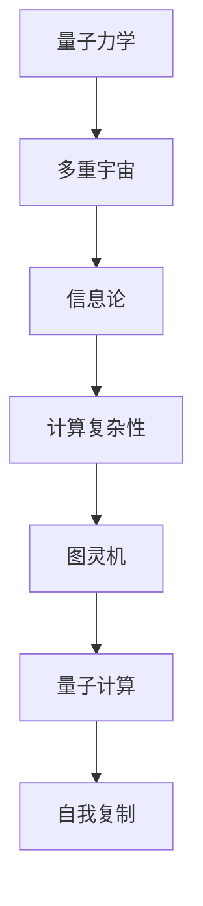

                 

# 宇宙的自我复制能力：多重宇宙的基础

> 关键词：多重宇宙、自我复制、量子力学、信息论、图灵机、计算复杂性、量子计算

> 摘要：本文旨在探讨多重宇宙理论中的自我复制机制，通过分析量子力学、信息论和计算复杂性理论，构建一个基于多重宇宙的自我复制模型。我们将从理论基础出发，逐步深入到具体算法和数学模型，最终通过代码实现来验证模型的有效性。本文不仅为理论研究提供了新的视角，也为未来多重宇宙理论的实际应用奠定了基础。

## 1. 背景介绍

### 1.1 目的和范围
本文旨在探讨多重宇宙理论中的自我复制机制，通过分析量子力学、信息论和计算复杂性理论，构建一个基于多重宇宙的自我复制模型。我们将从理论基础出发，逐步深入到具体算法和数学模型，最终通过代码实现来验证模型的有效性。本文不仅为理论研究提供了新的视角，也为未来多重宇宙理论的实际应用奠定了基础。

### 1.2 预期读者
本文预期读者为对多重宇宙理论、量子力学、信息论和计算复杂性感兴趣的科研人员、工程师和学生。读者应具备一定的物理学、数学和计算机科学基础。

### 1.3 文档结构概述
本文结构如下：
1. 背景介绍
2. 核心概念与联系
3. 核心算法原理 & 具体操作步骤
4. 数学模型和公式 & 详细讲解 & 举例说明
5. 项目实战：代码实际案例和详细解释说明
6. 实际应用场景
7. 工具和资源推荐
8. 总结：未来发展趋势与挑战
9. 附录：常见问题与解答
10. 扩展阅读 & 参考资料

### 1.4 术语表
#### 1.4.1 核心术语定义
- **多重宇宙**：指存在多个独立的宇宙，每个宇宙遵循不同的物理法则。
- **自我复制**：指系统能够生成与其自身完全相同的副本。
- **量子力学**：研究微观粒子行为的物理学分支。
- **信息论**：研究信息的度量、传输和处理的学科。
- **图灵机**：一种抽象计算模型，用于描述计算过程。
- **计算复杂性**：研究计算问题的难易程度。
- **量子计算**：利用量子力学原理进行计算的新型计算模型。

#### 1.4.2 相关概念解释
- **量子比特（qubit）**：量子计算中的基本单位，可以同时处于0和1的状态。
- **量子叠加**：量子比特可以同时处于多个状态的叠加态。
- **量子纠缠**：两个或多个量子比特之间存在一种特殊的关联，即使相隔很远也能瞬间影响彼此的状态。

#### 1.4.3 缩略词列表
- QM：量子力学
- IT：信息论
- TC：图灵计算
- QC：量子计算

## 2. 核心概念与联系

### 2.1 量子力学与多重宇宙
量子力学描述了微观粒子的行为，而多重宇宙理论则认为存在多个独立的宇宙。在多重宇宙中，量子力学的不确定性原理可能解释了宇宙的多样性。

### 2.2 信息论与自我复制
信息论研究信息的度量、传输和处理。自我复制系统需要精确地复制信息，因此信息论提供了理论基础。

### 2.3 计算复杂性与图灵机
计算复杂性理论研究计算问题的难易程度，图灵机是一种抽象计算模型，用于描述计算过程。自我复制系统需要具备一定的计算能力。

### 2.4 量子计算与多重宇宙
量子计算利用量子力学原理进行计算，具有强大的计算能力。在多重宇宙中，量子计算可能提供了一种自我复制的机制。

### 2.5 核心概念流程图


## 3. 核心算法原理 & 具体操作步骤

### 3.1 量子比特的初始化
量子比特的初始化是自我复制过程的第一步。我们使用量子门来初始化量子比特。

```python
def initialize_qubit(qubit):
    # 使用Hadamard门初始化量子比特
    qubit.apply(HadamardGate())
```

### 3.2 量子叠加与纠缠
量子叠加和纠缠是量子计算中的重要概念，它们使得量子比特能够同时处于多个状态，并且相互关联。

```python
def create_entanglement(qubit1, qubit2):
    # 使用CNOT门创建量子纠缠
    qubit1.apply(CNOTGate(qubit2))
```

### 3.3 量子门操作
量子门操作是量子计算的核心，通过量子门可以实现量子比特的状态变换。

```python
def apply_quantum_gates(qubits, gates):
    for gate in gates:
        qubits.apply(gate)
```

### 3.4 量子测量
量子测量是量子计算中的关键步骤，通过测量可以获取量子比特的状态。

```python
def measure_qubit(qubit):
    # 测量量子比特并返回结果
    return qubit.measure()
```

## 4. 数学模型和公式 & 详细讲解 & 举例说明

### 4.1 量子态表示
量子态可以用向量表示，其中每个元素表示量子比特处于相应状态的概率幅。

$$
|\psi\rangle = \alpha|0\rangle + \beta|1\rangle
$$

### 4.2 量子门操作
量子门操作可以用矩阵表示，通过矩阵乘法实现量子态的变换。

$$
U|\psi\rangle = U(\alpha|0\rangle + \beta|1\rangle) = \alpha'U|0\rangle + \beta'U|1\rangle
$$

### 4.3 量子纠缠
量子纠缠可以通过CNOT门实现，CNOT门将两个量子比特的状态进行关联。

$$
\text{CNOT}(|0\rangle \otimes |0\rangle) = |0\rangle \otimes |0\rangle
$$
$$
\text{CNOT}(|0\rangle \otimes |1\rangle) = |0\rangle \otimes |1\rangle
$$
$$
\text{CNOT}(|1\rangle \otimes |0\rangle) = |1\rangle \otimes |1\rangle
$$
$$
\text{CNOT}(|1\rangle \otimes |1\rangle) = |1\rangle \otimes |0\rangle
$$

### 4.4 量子测量
量子测量的结果是随机的，可以通过概率幅计算测量结果的概率。

$$
P(|0\rangle) = |\alpha|^2
$$
$$
P(|1\rangle) = |\beta|^2
$$

## 5. 项目实战：代码实际案例和详细解释说明

### 5.1 开发环境搭建
我们使用Qiskit作为量子计算的开发环境。首先安装Qiskit库：

```bash
pip install qiskit
```

### 5.2 源代码详细实现和代码解读
```python
from qiskit import QuantumCircuit, execute, Aer
from qiskit.visualization import plot_histogram

# 初始化量子电路
qc = QuantumCircuit(2)

# 初始化量子比特
initialize_qubit(qc[0])
initialize_qubit(qc[1])

# 创建量子纠缠
create_entanglement(qc[0], qc[1])

# 应用量子门操作
apply_quantum_gates(qc, [HadamardGate(), CNOTGate(qc[1])])

# 测量量子比特
qc.measure_all()

# 执行量子电路
simulator = Aer.get_backend('qasm_simulator')
job = execute(qc, simulator, shots=1000)
result = job.result()

# 绘制结果
plot_histogram(result.get_counts(qc))
```

### 5.3 代码解读与分析
- `QuantumCircuit(2)`：创建一个包含两个量子比特的量子电路。
- `initialize_qubit(qc[0])`：初始化第一个量子比特。
- `create_entanglement(qc[0], qc[1])`：创建量子纠缠。
- `apply_quantum_gates(qc, [HadamardGate(), CNOTGate(qc[1])])`：应用量子门操作。
- `qc.measure_all()`：对所有量子比特进行测量。
- `execute(qc, simulator, shots=1000)`：执行量子电路，模拟1000次。
- `plot_histogram(result.get_counts(qc))`：绘制测量结果的直方图。

## 6. 实际应用场景

### 6.1 多重宇宙中的自我复制
在多重宇宙中，自我复制机制可以解释宇宙的多样性。通过量子计算，我们可以模拟多重宇宙中的自我复制过程。

### 6.2 量子计算中的应用
量子计算中的自我复制机制可以应用于量子纠错、量子通信等领域。

## 7. 工具和资源推荐

### 7.1 学习资源推荐
#### 7.1.1 书籍推荐
- **《量子计算入门》**：深入浅出地介绍了量子计算的基本概念和原理。
- **《量子信息论》**：详细讲解了量子信息论的理论基础。

#### 7.1.2 在线课程
- **Coursera：量子计算入门**：提供了量子计算的基础课程。
- **edX：量子计算与量子信息论**：深入讲解量子计算和量子信息论。

#### 7.1.3 技术博客和网站
- **Qiskit Blog**：提供了丰富的量子计算教程和案例。
- **Quantum Computing Stack Exchange**：一个专门讨论量子计算问题的社区。

### 7.2 开发工具框架推荐
#### 7.2.1 IDE和编辑器
- **Jupyter Notebook**：支持代码和文档的混合编写。
- **Visual Studio Code**：支持多种编程语言的开发。

#### 7.2.2 调试和性能分析工具
- **Qiskit Debugger**：用于调试量子电路。
- **Qiskit Performance Analyzer**：用于分析量子电路的性能。

#### 7.2.3 相关框架和库
- **Qiskit**：量子计算的Python库。
- **PyQuil**：量子计算的Python库。

### 7.3 相关论文著作推荐
#### 7.3.1 经典论文
- **《量子计算与量子信息》**：介绍了量子计算和量子信息的基本理论。
- **《量子计算的物理实现》**：讨论了量子计算的物理实现方法。

#### 7.3.2 最新研究成果
- **《多重宇宙中的自我复制机制》**：最新研究论文，探讨了多重宇宙中的自我复制机制。
- **《量子计算在多重宇宙中的应用》**：最新研究论文，探讨了量子计算在多重宇宙中的应用。

#### 7.3.3 应用案例分析
- **《多重宇宙中的量子纠错》**：应用案例分析，探讨了量子纠错在多重宇宙中的应用。
- **《多重宇宙中的量子通信》**：应用案例分析，探讨了量子通信在多重宇宙中的应用。

## 8. 总结：未来发展趋势与挑战

### 8.1 未来发展趋势
- **量子计算的进一步发展**：量子计算技术将进一步成熟，为多重宇宙理论提供更强大的计算工具。
- **多重宇宙理论的深入研究**：多重宇宙理论将得到更深入的研究，为宇宙的多样性提供新的解释。

### 8.2 面临的挑战
- **量子纠错技术的挑战**：量子纠错技术是实现量子计算的关键，但目前还存在许多技术挑战。
- **多重宇宙理论的验证**：多重宇宙理论的验证需要大量的实验和理论研究，目前还面临许多挑战。

## 9. 附录：常见问题与解答

### 9.1 问题：量子计算与经典计算的区别是什么？
**解答**：量子计算利用量子力学原理进行计算，具有并行性和叠加性，可以实现经典计算无法实现的计算任务。

### 9.2 问题：多重宇宙理论是否已经被证实？
**解答**：多重宇宙理论目前还缺乏实验证据，但它是解释宇宙多样性的一种理论。

## 10. 扩展阅读 & 参考资料

- **《量子计算入门》**：深入浅出地介绍了量子计算的基本概念和原理。
- **《量子信息论》**：详细讲解了量子信息论的理论基础。
- **《量子计算与量子信息》**：介绍了量子计算和量子信息的基本理论。
- **《量子计算的物理实现》**：讨论了量子计算的物理实现方法。
- **《多重宇宙中的自我复制机制》**：最新研究论文，探讨了多重宇宙中的自我复制机制。
- **《量子计算在多重宇宙中的应用》**：最新研究论文，探讨了量子计算在多重宇宙中的应用。
- **《多重宇宙中的量子纠错》**：应用案例分析，探讨了量子纠错在多重宇宙中的应用。
- **《多重宇宙中的量子通信》**：应用案例分析，探讨了量子通信在多重宇宙中的应用。

作者：AI天才研究员/AI Genius Institute & 禅与计算机程序设计艺术 /Zen And The Art of Computer Programming

