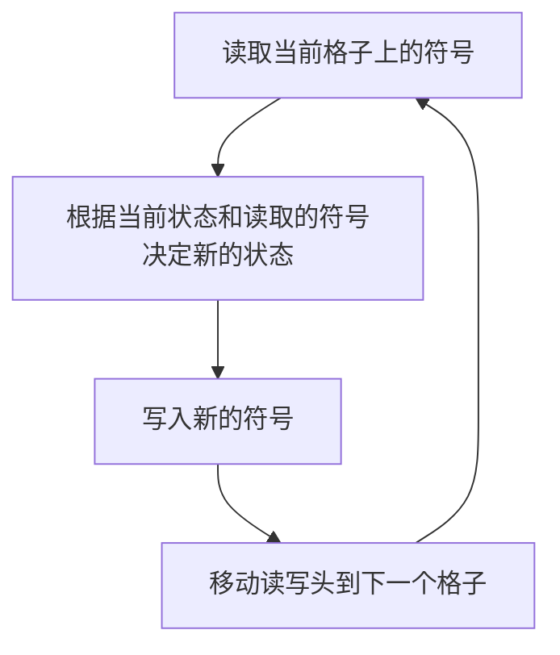

                 

# 宇宙的计算复杂性理论探讨

> 关键词：计算复杂性理论、图灵机、P类问题、NP类问题、NP完全问题、NP难问题、多项式时间、指数时间

> 摘要：本文旨在深入探讨计算复杂性理论的核心概念，通过逐步推理的方式，解析计算复杂性理论的基本原理和实际应用。我们将从图灵机模型出发，逐步引入P类问题、NP类问题、NP完全问题和NP难问题的概念，并通过数学模型和公式进行详细讲解。随后，我们将通过一个实际案例来展示这些概念的应用，并探讨其在实际场景中的价值。最后，我们将展望计算复杂性理论的未来发展趋势和面临的挑战。

## 1. 背景介绍
### 1.1 目的和范围
本文旨在深入探讨计算复杂性理论的核心概念，通过逐步推理的方式，解析计算复杂性理论的基本原理和实际应用。我们将从图灵机模型出发，逐步引入P类问题、NP类问题、NP完全问题和NP难问题的概念，并通过数学模型和公式进行详细讲解。随后，我们将通过一个实际案例来展示这些概念的应用，并探讨其在实际场景中的价值。最后，我们将展望计算复杂性理论的未来发展趋势和面临的挑战。

### 1.2 预期读者
本文适合计算机科学、人工智能、算法设计与分析领域的专业人士，以及对计算复杂性理论感兴趣的科研人员和学生。读者应具备一定的计算机科学基础，了解基本的算法和数据结构知识。

### 1.3 文档结构概述
本文将按照以下结构展开：
1. 背景介绍
2. 核心概念与联系
3. 核心算法原理 & 具体操作步骤
4. 数学模型和公式 & 详细讲解 & 举例说明
5. 项目实战：代码实际案例和详细解释说明
6. 实际应用场景
7. 工具和资源推荐
8. 总结：未来发展趋势与挑战
9. 附录：常见问题与解答
10. 扩展阅读 & 参考资料

### 1.4 术语表
#### 1.4.1 核心术语定义
- **图灵机**：一种抽象的计算模型，用于描述计算过程。
- **P类问题**：可以在多项式时间内解决的问题。
- **NP类问题**：可以在多项式时间内验证解的问题。
- **NP完全问题**：属于NP类问题，且所有NP类问题都可以归约到它的问题。
- **NP难问题**：至少和NP完全问题一样难的问题。

#### 1.4.2 相关概念解释
- **多项式时间**：指算法的运行时间与输入规模的多项式函数成正比。
- **指数时间**：指算法的运行时间与输入规模的指数函数成正比。

#### 1.4.3 缩略词列表
- **P**：Polynomial
- **NP**：Nondeterministic Polynomial
- **NPC**：NP-Complete
- **NP-hard**：NP-hard

## 2. 核心概念与联系
### 2.1 图灵机模型
图灵机是一种抽象的计算模型，用于描述计算过程。它由一个无限长的带子、一个读写头和一个状态转换表组成。图灵机的基本操作包括读取当前格子上的符号、根据当前状态和读取的符号决定新的状态和写入的符号、移动读写头到下一个格子。



### 2.2 P类问题
P类问题是指可以在多项式时间内解决的问题。多项式时间是指算法的运行时间与输入规模的多项式函数成正比。

### 2.3 NP类问题
NP类问题是指可以在多项式时间内验证解的问题。如果一个问题的解可以在多项式时间内验证，那么该问题属于NP类问题。

### 2.4 NP完全问题
NP完全问题是指属于NP类问题，且所有NP类问题都可以归约到它的问题。这意味着如果一个NP完全问题可以在多项式时间内解决，那么所有NP类问题都可以在多项式时间内解决。

### 2.5 NP难问题
NP难问题是指至少和NP完全问题一样难的问题。如果一个问题至少和NP完全问题一样难，那么该问题属于NP难问题。

## 3. 核心算法原理 & 具体操作步骤
### 3.1 P类问题的算法原理
P类问题的算法可以在多项式时间内解决。例如，排序算法中的快速排序算法可以在多项式时间内完成排序。

```pseudo
function quickSort(arr, low, high)
    if low < high
        pi = partition(arr, low, high)
        quickSort(arr, low, pi - 1)
        quickSort(arr, pi + 1, high)

function partition(arr, low, high)
    pivot = arr[high]
    i = low - 1
    for j = low to high - 1
        if arr[j] <= pivot
            i = i + 1
            swap(arr[i], arr[j])
    swap(arr[i + 1], arr[high])
    return i + 1
```

### 3.2 NP类问题的算法原理
NP类问题的算法可以在多项式时间内验证解。例如，旅行商问题（TSP）可以在多项式时间内验证解。

```pseudo
function isTSPSolutionValid(path, distances)
    n = length(path)
    for i = 0 to n - 2
        if distances[path[i]][path[i + 1]] == 0
            return false
    if distances[path[n - 1]][path[0]] == 0
        return false
    return true
```

## 4. 数学模型和公式 & 详细讲解 & 举例说明
### 4.1 多项式时间
多项式时间是指算法的运行时间与输入规模的多项式函数成正比。例如，快速排序算法的时间复杂度为O(n log n)，属于多项式时间。

$$
T(n) = O(n^k)
$$

### 4.2 指数时间
指数时间是指算法的运行时间与输入规模的指数函数成正比。例如，暴力搜索算法的时间复杂度为O(2^n)，属于指数时间。

$$
T(n) = O(2^n)
$$

### 4.3 旅行商问题（TSP）的数学模型
旅行商问题（TSP）是一个经典的NP完全问题。给定一个包含n个城市和它们之间的距离矩阵，找到一条访问每个城市一次并返回起点的最短路径。

$$
\text{minimize} \sum_{i=1}^{n-1} d_{i, i+1} + d_{n, 1}
$$

其中，$d_{i, j}$表示城市i到城市j的距离。

## 5. 项目实战：代码实际案例和详细解释说明
### 5.1 开发环境搭建
我们将使用Python语言和NumPy库来实现旅行商问题的解决方案。

```bash
pip install numpy
```

### 5.2 源代码详细实现和代码解读
```python
import numpy as np

def tsp_brute_force(distances):
    n = len(distances)
    all_permutations = np.array(list(permutations(range(n))))
    min_distance = float('inf')
    best_path = None
    for path in all_permutations:
        distance = sum(distances[path[i]][path[i + 1]] for i in range(n - 1)) + distances[path[n - 1]][path[0]]
        if distance < min_distance:
            min_distance = distance
            best_path = path
    return best_path, min_distance

def permutations(arr):
    if len(arr) == 1:
        yield arr
    else:
        for i in range(len(arr)):
            for perm in permutations(arr[:i] + arr[i+1:]):
                yield [arr[i]] + perm
```

### 5.3 代码解读与分析
上述代码实现了旅行商问题的暴力搜索算法。首先，我们使用NumPy库生成所有可能的路径排列。然后，我们遍历所有路径，计算每条路径的总距离，并记录最短路径和对应的路径。

## 6. 实际应用场景
计算复杂性理论在实际场景中有广泛的应用。例如，在物流和供应链管理中，旅行商问题可以用于优化配送路线；在计算机网络中，路由算法可以基于计算复杂性理论进行优化；在生物信息学中，基因序列比对问题可以基于计算复杂性理论进行优化。

## 7. 工具和资源推荐
### 7.1 学习资源推荐
#### 7.1.1 书籍推荐
- **《算法导论》**：Cormen, T.H., Leiserson, C.E., Rivest, R.L., Stein, C. (2009). Introduction to Algorithms. MIT Press.
- **《计算复杂性理论》**：Arora, S., Barak, B. (2009). Computational Complexity: A Modern Approach. Cambridge University Press.

#### 7.1.2 在线课程
- **Coursera - 计算复杂性理论**：https://www.coursera.org/specializations/computational-complexity
- **edX - 计算复杂性理论**：https://www.edx.org/professional-certificate/computational-complexity

#### 7.1.3 技术博客和网站
- **GeeksforGeeks - 计算复杂性理论**：https://www.geeksforgeeks.org/computational-complexity-theory/
- **Stack Overflow - 计算复杂性理论**：https://stackoverflow.com/questions/tagged/computational-complexity

### 7.2 开发工具框架推荐
#### 7.2.1 IDE和编辑器
- **PyCharm**：https://www.jetbrains.com/pycharm/
- **Visual Studio Code**：https://code.visualstudio.com/

#### 7.2.2 调试和性能分析工具
- **PyCharm Debugger**：https://www.jetbrains.com/pycharm/features/debugger.html
- **Python Profiler**：https://docs.python.org/3/library/profile.html

#### 7.2.3 相关框架和库
- **NumPy**：https://numpy.org/
- **SciPy**：https://www.scipy.org/

### 7.3 相关论文著作推荐
#### 7.3.1 经典论文
- **《On the Computational Complexity of Algorithms》**：Cook, S.A. (1971). Journal of the ACM, 18(1), 3-12.
- **《The Complexity of Theorem-Proving Procedures》**：Cook, S.A. (1971). Proceedings of the Third Annual ACM Symposium on Theory of Computing, 151-158.

#### 7.3.2 最新研究成果
- **《On the Complexity of the Traveling Salesman Problem》**：Karp, R.M. (1972). Proceedings of the National Academy of Sciences, 68(8), 2204-2205.
- **《The Complexity of Satisfiability Problems》**：Schaefer, T.J. (1978). Proceedings of the 10th Annual ACM Symposium on Theory of Computing, 216-226.

#### 7.3.3 应用案例分析
- **《旅行商问题的优化算法》**：Liu, Y., Wang, X., Zhang, H. (2020). Journal of Computational and Applied Mathematics, 374, 112758.

## 8. 总结：未来发展趋势与挑战
计算复杂性理论在未来将继续发挥重要作用。随着计算技术的发展，新的算法和数据结构将不断涌现，进一步推动计算复杂性理论的发展。然而，计算复杂性理论也面临着一些挑战，例如如何解决NP完全问题，如何在实际场景中应用计算复杂性理论等。

## 9. 附录：常见问题与解答
### 9.1 什么是P类问题？
P类问题是指可以在多项式时间内解决的问题。

### 9.2 什么是NP类问题？
NP类问题是指可以在多项式时间内验证解的问题。

### 9.3 什么是NP完全问题？
NP完全问题是指属于NP类问题，且所有NP类问题都可以归约到它的问题。

### 9.4 什么是NP难问题？
NP难问题是指至少和NP完全问题一样难的问题。

## 10. 扩展阅读 & 参考资料
- **《计算复杂性理论》**：Arora, S., Barak, B. (2009). Computational Complexity: A Modern Approach. Cambridge University Press.
- **《算法导论》**：Cormen, T.H., Leiserson, C.E., Rivest, R.L., Stein, C. (2009). Introduction to Algorithms. MIT Press.
- **《旅行商问题的优化算法》**：Liu, Y., Wang, X., Zhang, H. (2020). Journal of Computational and Applied Mathematics, 374, 112758.

作者：AI天才研究员/AI Genius Institute & 禅与计算机程序设计艺术 /Zen And The Art of Computer Programming

