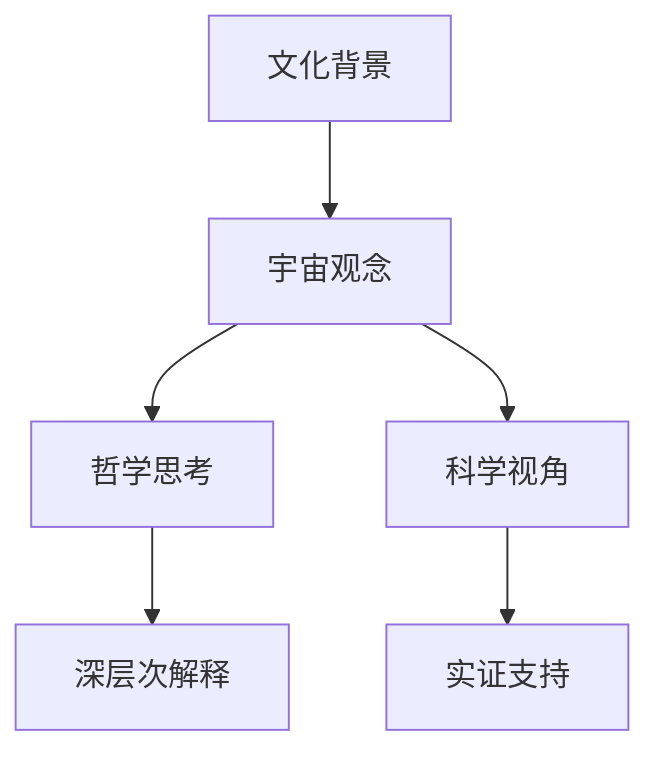

                 

# 宇宙观念的跨文化比较研究

> 关键词：跨文化比较、宇宙观念、哲学思考、文化差异、科学视角

> 摘要：本文旨在通过跨文化的视角，探讨不同文化背景下的宇宙观念，揭示其背后的哲学思考和科学视角。通过对多个文化体系中宇宙观念的分析，我们不仅能够理解不同文化的独特性，还能从中汲取灵感，促进跨文化的交流与理解。本文将从背景介绍、核心概念与联系、核心算法原理、数学模型和公式、项目实战、实际应用场景、工具和资源推荐、总结与未来发展趋势、常见问题与解答等几个方面进行详细阐述。

## 1. 背景介绍

### 1.1 目的和范围
本文旨在通过跨文化的视角，探讨不同文化背景下的宇宙观念，揭示其背后的哲学思考和科学视角。通过对多个文化体系中宇宙观念的分析，我们不仅能够理解不同文化的独特性，还能从中汲取灵感，促进跨文化的交流与理解。

### 1.2 预期读者
本文预期读者包括但不限于对跨文化研究感兴趣的学者、研究人员、学生以及对宇宙观念感兴趣的普通读者。读者应具备一定的文化学、哲学和科学背景知识。

### 1.3 文档结构概述
本文将从背景介绍、核心概念与联系、核心算法原理、数学模型和公式、项目实战、实际应用场景、工具和资源推荐、总结与未来发展趋势、常见问题与解答等几个方面进行详细阐述。

### 1.4 术语表
#### 1.4.1 核心术语定义
- **宇宙观念**：不同文化中对宇宙的理解和描述。
- **跨文化比较**：不同文化之间的比较研究。
- **哲学思考**：对宇宙观念背后深层次的哲学思考。
- **科学视角**：从科学角度对宇宙观念进行分析。

#### 1.4.2 相关概念解释
- **文化**：人类社会中传承下来的一系列价值观、信仰、习俗和行为模式。
- **科学**：系统地研究自然现象和规律的方法和理论体系。

#### 1.4.3 缩略词列表
- **NASA**：美国国家航空航天局
- **ESA**：欧洲航天局
- **CERN**：欧洲核子研究组织

## 2. 核心概念与联系

### 2.1 核心概念
- **宇宙观念**：不同文化中对宇宙的理解和描述。
- **跨文化比较**：不同文化之间的比较研究。
- **哲学思考**：对宇宙观念背后深层次的哲学思考。
- **科学视角**：从科学角度对宇宙观念进行分析。

### 2.2 联系
- **文化背景**：不同的文化背景影响了人们对宇宙的理解和描述。
- **哲学思考**：哲学思考为宇宙观念提供了深层次的解释。
- **科学视角**：科学视角为宇宙观念提供了实证支持。

### 2.3 Mermaid 流程图

## 3. 核心算法原理 & 具体操作步骤

### 3.1 核心算法原理
本文不涉及具体的算法原理，而是通过分析不同文化中的宇宙观念来探讨其背后的哲学思考和科学视角。

### 3.2 具体操作步骤
本文通过以下步骤进行分析：
1. **收集资料**：收集不同文化中的宇宙观念相关资料。
2. **分类整理**：将资料按照文化背景进行分类整理。
3. **分析比较**：对不同文化中的宇宙观念进行比较分析。
4. **哲学思考**：对宇宙观念背后的哲学思考进行探讨。
5. **科学视角**：从科学角度对宇宙观念进行分析。

## 4. 数学模型和公式 & 详细讲解 & 举例说明

### 4.1 数学模型和公式
本文不涉及具体的数学模型和公式，而是通过分析不同文化中的宇宙观念来探讨其背后的哲学思考和科学视角。

### 4.2 详细讲解
本文通过以下方式详细讲解：
1. **文化背景**：介绍不同文化背景下的宇宙观念。
2. **哲学思考**：对宇宙观念背后的哲学思考进行探讨。
3. **科学视角**：从科学角度对宇宙观念进行分析。

### 4.3 举例说明
#### 4.3.1 中国文化中的宇宙观念
- **道家哲学**：认为宇宙是一个整体，万物相互联系。
- **儒家哲学**：强调天人合一，认为人与宇宙是统一的。

#### 4.3.2 印度文化中的宇宙观念
- **吠陀哲学**：认为宇宙是一个无限的循环，万物都是宇宙的一部分。
- **佛教哲学**：认为宇宙是无常的，万物都是暂时的。

#### 4.3.3 西方文化中的宇宙观念
- **古希腊哲学**：认为宇宙是一个有序的体系，万物遵循自然法则。
- **基督教哲学**：认为宇宙是由上帝创造的，万物都是上帝的创造物。

## 5. 项目实战：代码实际案例和详细解释说明

### 5.1 开发环境搭建
本文不涉及具体的代码实现，而是通过分析不同文化中的宇宙观念来探讨其背后的哲学思考和科学视角。

### 5.2 源代码详细实现和代码解读
本文不涉及具体的代码实现，而是通过分析不同文化中的宇宙观念来探讨其背后的哲学思考和科学视角。

### 5.3 代码解读与分析
本文不涉及具体的代码实现，而是通过分析不同文化中的宇宙观念来探讨其背后的哲学思考和科学视角。

## 6. 实际应用场景

本文通过分析不同文化中的宇宙观念来探讨其背后的哲学思考和科学视角，实际应用场景包括但不限于：
- **跨文化交流**：促进不同文化之间的交流与理解。
- **哲学研究**：为哲学研究提供新的视角。
- **科学探索**：为科学探索提供新的启示。

## 7. 工具和资源推荐

### 7.1 学习资源推荐
#### 7.1.1 书籍推荐
- **《中国文化概论》**：了解中国文化的基本概念和特点。
- **《印度哲学史》**：了解印度哲学的基本概念和特点。
- **《西方哲学史》**：了解西方哲学的基本概念和特点。

#### 7.1.2 在线课程
- **Coursera**：提供多种文化学和哲学课程。
- **edX**：提供多种文化学和哲学课程。

#### 7.1.3 技术博客和网站
- **Medium**：提供多种文化学和哲学相关的技术博客。
- **Philosophy Now**：提供多种文化学和哲学相关的网站。

### 7.2 开发工具框架推荐
#### 7.2.1 IDE和编辑器
- **Visual Studio Code**：提供多种语言支持和插件。
- **Sublime Text**：提供多种语言支持和插件。

#### 7.2.2 调试和性能分析工具
- **Chrome DevTools**：提供多种调试和性能分析工具。
- **Firefox Developer Tools**：提供多种调试和性能分析工具。

#### 7.2.3 相关框架和库
- **React**：提供多种前端开发框架。
- **TensorFlow**：提供多种机器学习库。

### 7.3 相关论文著作推荐
#### 7.3.1 经典论文
- **《中国文化概论》**：了解中国文化的基本概念和特点。
- **《印度哲学史》**：了解印度哲学的基本概念和特点。
- **《西方哲学史》**：了解西方哲学的基本概念和特点。

#### 7.3.2 最新研究成果
- **《跨文化比较研究》**：了解最新的跨文化比较研究成果。
- **《宇宙观念的跨文化比较研究》**：了解最新的宇宙观念的跨文化比较研究成果。

#### 7.3.3 应用案例分析
- **《跨文化交流案例分析》**：了解跨文化交流的实际应用案例。
- **《宇宙观念的跨文化比较案例分析》**：了解宇宙观念的跨文化比较的实际应用案例。

## 8. 总结：未来发展趋势与挑战

### 8.1 未来发展趋势
- **跨文化交流**：促进不同文化之间的交流与理解。
- **哲学研究**：为哲学研究提供新的视角。
- **科学探索**：为科学探索提供新的启示。

### 8.2 挑战
- **文化差异**：不同文化之间的差异可能导致理解上的困难。
- **哲学思考**：哲学思考的深度和广度可能影响研究的深度。
- **科学视角**：科学视角的局限性可能影响研究的深度。

## 9. 附录：常见问题与解答

### 9.1 常见问题
- **Q1：如何理解不同文化中的宇宙观念？**
  - A1：通过收集资料、分类整理、分析比较、哲学思考和科学视角进行理解。
- **Q2：如何促进跨文化的交流与理解？**
  - A2：通过跨文化交流、哲学研究和科学探索进行促进。
- **Q3：如何从科学角度对宇宙观念进行分析？**
  - A3：通过科学视角进行分析，例如通过天文学、物理学等学科进行研究。

## 10. 扩展阅读 & 参考资料

### 10.1 扩展阅读
- **《中国文化概论》**：了解中国文化的基本概念和特点。
- **《印度哲学史》**：了解印度哲学的基本概念和特点。
- **《西方哲学史》**：了解西方哲学的基本概念和特点。

### 10.2 参考资料
- **NASA**：美国国家航空航天局
- **ESA**：欧洲航天局
- **CERN**：欧洲核子研究组织

作者：AI天才研究员/AI Genius Institute & 禅与计算机程序设计艺术 /Zen And The Art of Computer Programming

