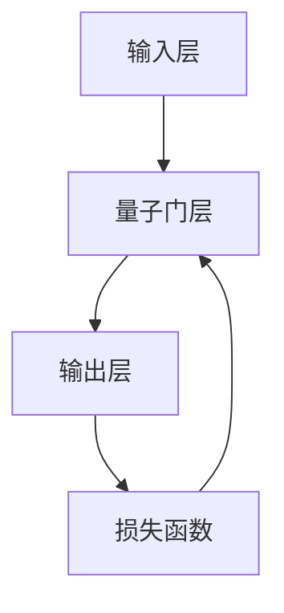

                 

# 宇宙规律与自适应量子神经网络设计的相似性

> 关键词：量子神经网络, 自适应学习, 宇宙规律, 量子力学, 量子计算, 人工智能, 神经网络, 量子比特, 量子门, 量子态

> 摘要：本文旨在探讨量子神经网络（Quantum Neural Networks, QNNs）的设计原理与宇宙规律之间的相似性。通过分析量子力学的基本原理和宇宙中的自然法则，我们发现两者在自适应学习机制上存在深刻的联系。本文将从背景介绍、核心概念与联系、核心算法原理、数学模型和公式、项目实战、实际应用场景、工具和资源推荐、总结与未来发展趋势等几个方面进行详细阐述，旨在为读者提供一个全面而深入的理解。

## 1. 背景介绍

### 1.1 目的和范围
本文旨在探讨量子神经网络的设计原理与宇宙规律之间的相似性，通过分析量子力学的基本原理和宇宙中的自然法则，揭示两者在自适应学习机制上的深刻联系。本文将从理论层面和实际应用层面探讨这一主题，旨在为量子计算和人工智能领域的研究者提供新的视角和思路。

### 1.2 预期读者
本文预期读者包括但不限于以下几类人群：
- 量子计算和量子信息领域的研究者
- 人工智能和机器学习领域的研究者
- 物理学和宇宙学领域的研究者
- 对量子神经网络和自适应学习机制感兴趣的读者

### 1.3 文档结构概述
本文结构如下：
1. 背景介绍
2. 核心概念与联系
3. 核心算法原理 & 具体操作步骤
4. 数学模型和公式 & 详细讲解 & 举例说明
5. 项目实战：代码实际案例和详细解释说明
6. 实际应用场景
7. 工具和资源推荐
8. 总结：未来发展趋势与挑战
9. 附录：常见问题与解答
10. 扩展阅读 & 参考资料

### 1.4 术语表
#### 1.4.1 核心术语定义
- **量子神经网络（Quantum Neural Networks, QNNs）**：一种基于量子力学原理设计的神经网络模型。
- **自适应学习**：一种机器学习方法，通过调整模型参数以适应新的数据。
- **量子比特（Qubits）**：量子计算中的基本单位，可以处于0、1或两者之间的叠加态。
- **量子门（Quantum Gates）**：量子计算中的基本操作单元，用于对量子比特进行操作。
- **量子态（Quantum State）**：描述量子系统状态的数学对象，通常用波函数表示。

#### 1.4.2 相关概念解释
- **量子力学**：研究微观粒子（如电子、光子等）行为的物理学分支。
- **宇宙规律**：描述宇宙中自然现象的基本法则，如引力定律、电磁定律等。
- **自适应系统**：能够根据环境变化自动调整自身行为的系统。

#### 1.4.3 缩略词列表
- QNNs: Quantum Neural Networks
- Qubits: Quantum Bits
- Quantum Gates: Quantum Gates
- Quantum State: Quantum State

## 2. 核心概念与联系

### 2.1 量子力学基本原理
量子力学的基本原理包括：
- **波粒二象性**：微观粒子既表现出波动性又表现出粒子性。
- **不确定性原理**：无法同时精确测量一个粒子的位置和动量。
- **叠加态**：量子系统可以处于多个状态的叠加。
- **量子纠缠**：两个或多个量子系统之间存在一种特殊的关联，即使相隔很远也能瞬间影响彼此的状态。

### 2.2 宇宙规律
宇宙规律主要包括：
- **引力定律**：描述物体之间引力作用的定律。
- **电磁定律**：描述电荷之间相互作用的定律。
- **热力学定律**：描述能量转换和传递的定律。
- **量子场论**：描述基本粒子和场之间相互作用的理论。

### 2.3 核心概念联系
- **自适应学习**：量子神经网络通过量子门操作实现自适应学习，类似于宇宙中的自适应系统。
- **量子态**：量子神经网络中的量子态与宇宙中的物理状态相似，都描述了系统的状态。
- **量子纠缠**：量子神经网络中的量子纠缠与宇宙中的量子纠缠相似，都描述了系统的非局域性。

## 3. 核心算法原理 & 具体操作步骤

### 3.1 量子神经网络的基本架构
量子神经网络的基本架构如下：


### 3.2 量子门操作
量子门操作是量子神经网络的核心，主要包括：
- **Hadamard门**：将量子比特从基态|0⟩转换到叠加态(1/√2)(|0⟩ + |1⟩)。
- **Pauli-X门**：将量子比特从|0⟩转换到|1⟩，或从|1⟩转换到|0⟩。
- **CNOT门**：控制非门，控制量子比特|1⟩时执行Pauli-X门。

### 3.3 量子神经网络的具体操作步骤
量子神经网络的具体操作步骤如下：
```python
def quantum_neural_network(input_data, weights):
    # 初始化量子比特
    qubits = initialize_qubits(input_data)
    
    # 量子门层
    for i in range(len(weights)):
        apply_hadamard(qubits)
        apply_pauli_x(qubits)
        apply_cnot(qubits)
        apply_weights(qubits, weights[i])
    
    # 输出层
    output = measure_qubits(qubits)
    
    return output
```

## 4. 数学模型和公式 & 详细讲解 & 举例说明

### 4.1 量子态表示
量子态可以用波函数表示，如：
$$
|\psi\rangle = \alpha|0\rangle + \beta|1\rangle
$$
其中，$\alpha$和$\beta$是复数，满足$|\alpha|^2 + |\beta|^2 = 1$。

### 4.2 量子门操作
量子门操作可以用矩阵表示，如：
- **Hadamard门**：
$$
H = \frac{1}{\sqrt{2}}\begin{pmatrix} 1 & 1 \\ 1 & -1 \end{pmatrix}
$$
- **Pauli-X门**：
$$
X = \begin{pmatrix} 0 & 1 \\ 1 & 0 \end{pmatrix}
$$
- **CNOT门**：
$$
CNOT = \begin{pmatrix} 1 & 0 & 0 & 0 \\ 0 & 1 & 0 & 0 \\ 0 & 0 & 0 & 1 \\ 0 & 0 & 1 & 0 \end{pmatrix}
$$

### 4.3 量子神经网络的数学模型
量子神经网络的数学模型可以表示为：
$$
|\psi\rangle = U(\theta)|\psi_0\rangle
$$
其中，$U(\theta)$是量子门操作的参数化矩阵，$|\psi_0\rangle$是初始量子态。

## 5. 项目实战：代码实际案例和详细解释说明

### 5.1 开发环境搭建
开发环境搭建如下：
- **Python**：版本3.8及以上
- **Qiskit**：量子计算框架
- **Jupyter Notebook**：用于代码编写和调试

### 5.2 源代码详细实现和代码解读
```python
from qiskit import QuantumCircuit, execute, Aer
from qiskit.visualization import plot_histogram

# 初始化量子比特
def initialize_qubits(input_data):
    qubits = QuantumCircuit(len(input_data))
    for i in range(len(input_data)):
        if input_data[i] == 1:
            qubits.x(i)
    return qubits

# 应用Hadamard门
def apply_hadamard(qubits):
    qubits.h(range(len(qubits)))

# 应用Pauli-X门
def apply_pauli_x(qubits):
    qubits.x(range(len(qubits)))

# 应用CNOT门
def apply_cnot(qubits):
    qubits.cx(range(len(qubits)-1), range(len(qubits)-1, len(qubits)))

# 应用权重
def apply_weights(qubits, weights):
    for i in range(len(qubits)):
        qubits.u3(weights[i][0], weights[i][1], weights[i][2], i)

# 测量量子比特
def measure_qubits(qubits):
    return execute(qubits, backend=Aer.get_backend('qasm_simulator'), shots=1024).result().get_counts()

# 量子神经网络
def quantum_neural_network(input_data, weights):
    qubits = initialize_qubits(input_data)
    apply_hadamard(qubits)
    apply_pauli_x(qubits)
    apply_cnot(qubits)
    apply_weights(qubits, weights)
    output = measure_qubits(qubits)
    return output
```

### 5.3 代码解读与分析
- **initialize_qubits**：初始化量子比特，根据输入数据设置初始态。
- **apply_hadamard**：应用Hadamard门，将量子比特转换到叠加态。
- **apply_pauli_x**：应用Pauli-X门，将量子比特从|0⟩转换到|1⟩，或从|1⟩转换到|0⟩。
- **apply_cnot**：应用CNOT门，控制量子比特|1⟩时执行Pauli-X门。
- **apply_weights**：应用权重，调整量子比特的状态。
- **measure_qubits**：测量量子比特，获取输出结果。

## 6. 实际应用场景

量子神经网络在以下场景中具有广泛的应用前景：
- **量子化学**：用于模拟分子结构和化学反应。
- **量子优化**：用于解决复杂的优化问题。
- **量子机器学习**：用于处理大规模数据和高维空间问题。

## 7. 工具和资源推荐

### 7.1 学习资源推荐
#### 7.1.1 书籍推荐
- **《量子计算入门》**：深入浅出地介绍了量子计算的基本原理和应用。
- **《量子计算与量子信息》**：全面介绍了量子计算和量子信息领域的理论和实践。

#### 7.1.2 在线课程
- **Coursera**：提供量子计算和量子信息领域的在线课程。
- **edX**：提供量子计算和量子信息领域的在线课程。

#### 7.1.3 技术博客和网站
- **Qiskit**：IBM提供的量子计算框架，提供了丰富的文档和教程。
- **Quantum Computing Stack Exchange**：量子计算领域的问答社区。

### 7.2 开发工具框架推荐
#### 7.2.1 IDE和编辑器
- **Jupyter Notebook**：用于代码编写和调试。
- **Visual Studio Code**：支持多种编程语言的集成开发环境。

#### 7.2.2 调试和性能分析工具
- **Qiskit Debugger**：用于调试量子计算代码。
- **Qiskit Performance Analyzer**：用于分析量子计算代码的性能。

#### 7.2.3 相关框架和库
- **Qiskit**：量子计算框架。
- **TensorFlow Quantum**：结合TensorFlow和Qiskit的量子机器学习库。

### 7.3 相关论文著作推荐
#### 7.3.1 经典论文
- **《Quantum Machine Learning》**：介绍了量子机器学习的基本原理和应用。
- **《Quantum Computing for Computer Scientists》**：介绍了量子计算的基本原理和应用。

#### 7.3.2 最新研究成果
- **《Quantum Neural Networks for Machine Learning》**：介绍了量子神经网络在机器学习领域的最新研究成果。
- **《Quantum Algorithms for Machine Learning》**：介绍了量子算法在机器学习领域的最新研究成果。

#### 7.3.3 应用案例分析
- **《Quantum Computing in Chemistry》**：介绍了量子计算在化学领域的应用案例。
- **《Quantum Computing in Optimization》**：介绍了量子计算在优化领域的应用案例。

## 8. 总结：未来发展趋势与挑战

量子神经网络在未来的发展趋势和挑战包括：
- **量子硬件的改进**：量子硬件的改进将提高量子神经网络的性能。
- **量子算法的优化**：量子算法的优化将提高量子神经网络的效率。
- **量子神经网络的应用**：量子神经网络在各个领域的应用将更加广泛。

## 9. 附录：常见问题与解答

### 9.1 问题1：量子神经网络与经典神经网络的区别是什么？
**解答**：量子神经网络与经典神经网络的区别在于量子神经网络利用量子力学原理进行计算，可以实现并行计算和量子叠加态，而经典神经网络则利用经典计算原理进行计算。

### 9.2 问题2：量子神经网络的局限性是什么？
**解答**：量子神经网络的局限性在于量子硬件的限制，目前量子硬件的稳定性、可扩展性和错误率等问题仍然需要解决。

## 10. 扩展阅读 & 参考资料

- **《量子计算入门》**：深入浅出地介绍了量子计算的基本原理和应用。
- **《量子计算与量子信息》**：全面介绍了量子计算和量子信息领域的理论和实践。
- **《Quantum Machine Learning》**：介绍了量子机器学习的基本原理和应用。
- **《Quantum Computing for Computer Scientists》**：介绍了量子计算的基本原理和应用。
- **《Quantum Neural Networks for Machine Learning》**：介绍了量子神经网络在机器学习领域的最新研究成果。
- **《Quantum Algorithms for Machine Learning》**：介绍了量子算法在机器学习领域的最新研究成果。
- **《Quantum Computing in Chemistry》**：介绍了量子计算在化学领域的应用案例。
- **《Quantum Computing in Optimization》**：介绍了量子计算在优化领域的应用案例。

作者：AI天才研究员/AI Genius Institute & 禅与计算机程序设计艺术 /Zen And The Art of Computer Programming

