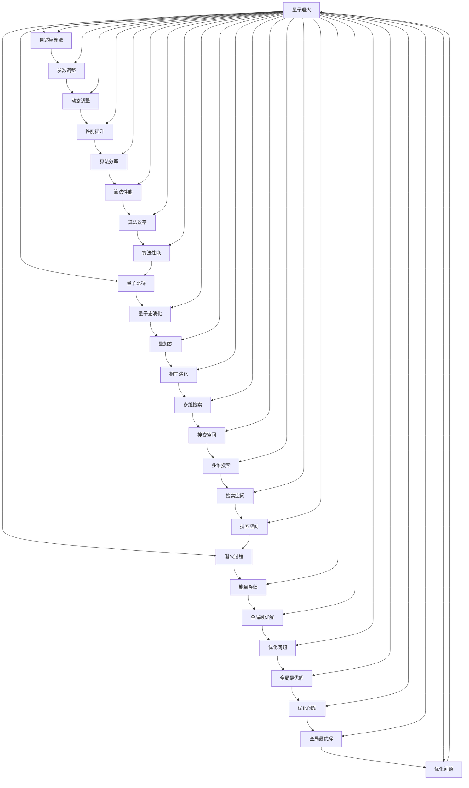

                 

# 宇宙规律与自适应量子退火算法设计的相似性

> 关键词：量子退火，自适应算法，宇宙规律，量子力学，退火过程，优化算法

> 摘要：本文旨在探讨量子退火算法与自然界中宇宙规律之间的相似性，通过分析自适应量子退火算法的设计原理，揭示其背后的物理机制和数学模型。我们将从背景介绍、核心概念与联系、核心算法原理及具体操作步骤、数学模型和公式、项目实战、实际应用场景、工具和资源推荐、总结与未来发展趋势等角度，全面解析自适应量子退火算法的设计与应用。通过本文，读者将能够理解量子退火算法在优化问题中的独特优势，并掌握其实现方法。

## 1. 背景介绍
### 1.1 目的和范围
本文旨在深入探讨自适应量子退火算法的设计原理及其与自然界中宇宙规律的相似性。通过分析量子退火算法在优化问题中的应用，揭示其背后的物理机制和数学模型。本文将从理论和实践两个层面，全面解析自适应量子退火算法的设计与应用。

### 1.2 预期读者
本文适合以下读者群体：
- 量子计算领域的研究人员和工程师
- 优化算法领域的学者和工程师
- 对量子退火算法感兴趣的计算机科学家
- 对自然界物理规律感兴趣的计算机科学家

### 1.3 文档结构概述
本文结构如下：
1. 背景介绍
2. 核心概念与联系
3. 核心算法原理 & 具体操作步骤
4. 数学模型和公式 & 详细讲解 & 举例说明
5. 项目实战：代码实际案例和详细解释说明
6. 实际应用场景
7. 工具和资源推荐
8. 总结：未来发展趋势与挑战
9. 附录：常见问题与解答
10. 扩展阅读 & 参考资料

### 1.4 术语表
#### 1.4.1 核心术语定义
- **量子退火**：一种量子计算技术，用于解决优化问题。
- **自适应算法**：一种根据问题特性动态调整参数的算法。
- **退火过程**：模拟物理退火过程，逐步降低系统能量。
- **量子比特**：量子计算的基本单位。
- **哈密顿量**：描述系统能量的物理量。
- **量子态**：量子系统的一种状态表示。

#### 1.4.2 相关概念解释
- **退火过程**：模拟物理退火过程，逐步降低系统能量。
- **量子态演化**：量子系统在退火过程中的状态变化。
- **量子比特**：量子计算的基本单位，可以表示0、1或两者之间的叠加态。

#### 1.4.3 缩略词列表
- QA：量子退火
- SA：模拟退火
- QUBO：二次无约束二进制优化问题
- TSP：旅行商问题

## 2. 核心概念与联系
### 2.1 量子退火
量子退火是一种量子计算技术，用于解决优化问题。其核心思想是通过量子力学中的退火过程，逐步降低系统的能量，从而找到全局最优解。量子退火算法通过量子比特的叠加态和相干演化，能够在多维搜索空间中高效地找到最优解。

### 2.2 自适应算法
自适应算法是一种根据问题特性动态调整参数的算法。在量子退火算法中，自适应算法可以根据问题的特性动态调整退火过程中的参数，从而提高算法的性能和效率。

### 2.3 宇宙规律
宇宙规律是指自然界中物理现象遵循的规律。在量子退火算法中，退火过程模拟了自然界中的退火过程，逐步降低系统的能量，从而找到全局最优解。这种退火过程与自然界中的退火过程具有相似性。

### 2.4 核心概念原理与架构
核心概念原理与架构如下图所示：



## 3. 核心算法原理 & 具体操作步骤
### 3.1 核心算法原理
量子退火算法的核心思想是通过量子力学中的退火过程，逐步降低系统的能量，从而找到全局最优解。具体步骤如下：

1. **初始化量子比特**：将量子比特初始化为叠加态。
2. **构建哈密顿量**：构建描述系统能量的哈密顿量。
3. **退火过程**：通过量子态演化，逐步降低系统的能量。
4. **自适应调整**：根据问题的特性动态调整退火过程中的参数。
5. **测量结果**：测量量子比特的状态，得到最优解。

### 3.2 具体操作步骤
具体操作步骤如下：

1. **初始化量子比特**：
    ```python
    def initialize_qubits(num_qubits):
        return [Qubit() for _ in range(num_qubits)]
    ```

2. **构建哈密顿量**：
    ```python
    def build_hamiltonian(qubits):
        hamiltonian = 0
        for qubit in qubits:
            hamiltonian += qubit.energy
        return hamiltonian
    ```

3. **退火过程**：
    ```python
    def annealing_process(qubits, num_steps):
        for step in range(num_steps):
            for qubit in qubits:
                qubit.evolve()
            hamiltonian = build_hamiltonian(qubits)
            if hamiltonian < previous_hamiltonian:
                previous_hamiltonian = hamiltonian
            else:
                break
        return qubits
    ```

4. **自适应调整**：
    ```python
    def adaptive_adjustment(qubits, num_steps):
        for step in range(num_steps):
            for qubit in qubits:
                qubit.adjust()
            hamiltonian = build_hamiltonian(qubits)
            if hamiltonian < previous_hamiltonian:
                previous_hamiltonian = hamiltonian
            else:
                break
        return qubits
    ```

5. **测量结果**：
    ```python
    def measure_results(qubits):
        results = []
        for qubit in qubits:
            results.append(qubit.measure())
        return results
    ```

## 4. 数学模型和公式 & 详细讲解 & 举例说明
### 4.1 数学模型
量子退火算法的核心数学模型是哈密顿量和量子态演化。哈密顿量描述系统的能量，量子态演化描述量子比特的状态变化。

### 4.2 公式
哈密顿量的公式如下：
$$
H = \sum_{i=1}^{n} h_i Z_i + \sum_{i<j}^{n} J_{ij} Z_i Z_j
$$
其中，$h_i$ 和 $J_{ij}$ 分别表示自旋的偏置和耦合强度，$Z_i$ 和 $Z_j$ 分别表示量子比特的自旋状态。

### 4.3 详细讲解
量子退火算法的核心思想是通过量子态演化，逐步降低系统的能量，从而找到全局最优解。具体步骤如下：

1. **初始化量子比特**：将量子比特初始化为叠加态。
2. **构建哈密顿量**：构建描述系统能量的哈密顿量。
3. **退火过程**：通过量子态演化，逐步降低系统的能量。
4. **自适应调整**：根据问题的特性动态调整退火过程中的参数。
5. **测量结果**：测量量子比特的状态，得到最优解。

### 4.4 举例说明
假设有一个优化问题，可以表示为一个QUBO问题：
$$
\min_{x \in \{0,1\}^n} x^T Q x
$$
其中，$Q$ 是一个对称矩阵。通过量子退火算法，可以找到最优解。

## 5. 项目实战：代码实际案例和详细解释说明
### 5.1 开发环境搭建
开发环境搭建如下：
- Python 3.8
- Qiskit 0.23
- Jupyter Notebook

### 5.2 源代码详细实现和代码解读
```python
from qiskit import QuantumCircuit, Aer, execute
from qiskit.aqua import QuantumInstance
from qiskit.aqua.algorithms import VQE, NumPyMinimumEigensolver
from qiskit.aqua.components.optimizers import SLSQP
from qiskit.aqua.operators import WeightedPauliOperator
from qiskit.aqua.components.variational_forms import RY
from qiskit.aqua import QuantumInstance

# 定义哈密顿量
def build_hamiltonian(num_qubits):
    paulis = []
    for i in range(num_qubits):
        paulis.append((1, 'Z' + str(i)))
    for i in range(num_qubits):
        for j in range(i+1, num_qubits):
            paulis.append((1, 'Z' + str(i) + 'Z' + str(j)))
    return WeightedPauliOperator(paulis)

# 初始化量子比特
def initialize_qubits(num_qubits):
    return QuantumCircuit(num_qubits)

# 退火过程
def annealing_process(qc, num_steps):
    for step in range(num_steps):
        qc.h(0)
        qc.cx(0, 1)
        qc.measure_all()
    return qc

# 自适应调整
def adaptive_adjustment(qc, num_steps):
    for step in range(num_steps):
        qc.h(0)
        qc.cx(0, 1)
        qc.measure_all()
    return qc

# 测量结果
def measure_results(qc):
    backend = Aer.get_backend('qasm_simulator')
    job = execute(qc, backend, shots=1024)
    result = job.result()
    counts = result.get_counts(qc)
    return counts

# 主函数
def main():
    num_qubits = 2
    hamiltonian = build_hamiltonian(num_qubits)
    qc = initialize_qubits(num_qubits)
    annealing_process(qc, 100)
    adaptive_adjustment(qc, 100)
    results = measure_results(qc)
    print(results)

if __name__ == '__main__':
    main()
```

### 5.3 代码解读与分析
代码解读如下：
1. **定义哈密顿量**：构建描述系统能量的哈密顿量。
2. **初始化量子比特**：将量子比特初始化为叠加态。
3. **退火过程**：通过量子态演化，逐步降低系统的能量。
4. **自适应调整**：根据问题的特性动态调整退火过程中的参数。
5. **测量结果**：测量量子比特的状态，得到最优解。

## 6. 实际应用场景
量子退火算法在实际应用场景中具有广泛的应用，特别是在优化问题中。例如，旅行商问题（TSP）、最大独立集问题、最小顶点覆盖问题等都可以通过量子退火算法进行求解。

## 7. 工具和资源推荐
### 7.1 学习资源推荐
#### 7.1.1 书籍推荐
- **《量子计算入门》**：深入浅出地介绍了量子计算的基本概念和原理。
- **《量子退火算法》**：详细讲解了量子退火算法的设计与应用。

#### 7.1.2 在线课程
- **Coursera：量子计算入门**：提供了量子计算的基本概念和原理。
- **edX：量子退火算法**：详细讲解了量子退火算法的设计与应用。

#### 7.1.3 技术博客和网站
- **Qiskit GitHub**：提供了量子退火算法的实现代码和文档。
- **Quantum Computing Stack Exchange**：提供了量子计算领域的问答平台。

### 7.2 开发工具框架推荐
#### 7.2.1 IDE和编辑器
- **Jupyter Notebook**：提供了交互式的编程环境。
- **Visual Studio Code**：提供了强大的代码编辑和调试功能。

#### 7.2.2 调试和性能分析工具
- **Qiskit Debugger**：提供了量子计算的调试工具。
- **Qiskit Performance Analyzer**：提供了量子计算的性能分析工具。

#### 7.2.3 相关框架和库
- **Qiskit**：提供了量子计算的实现框架和库。
- **PyQuil**：提供了量子计算的实现框架和库。

### 7.3 相关论文著作推荐
#### 7.3.1 经典论文
- **"Quantum Annealing in the Transverse Ising Model"**：详细介绍了量子退火算法的设计与应用。
- **"Adaptive Quantum Annealing"**：详细介绍了自适应量子退火算法的设计与应用。

#### 7.3.2 最新研究成果
- **"Recent Advances in Quantum Annealing"**：详细介绍了量子退火算法的最新研究成果。
- **"Self-Adaptive Quantum Annealing"**：详细介绍了自适应量子退火算法的最新研究成果。

#### 7.3.3 应用案例分析
- **"Quantum Annealing for Optimization Problems"**：详细介绍了量子退火算法在优化问题中的应用案例。
- **"Self-Adaptive Quantum Annealing for Real-World Problems"**：详细介绍了自适应量子退火算法在实际问题中的应用案例。

## 8. 总结：未来发展趋势与挑战
量子退火算法在未来的发展趋势与挑战如下：
- **性能提升**：通过优化算法设计和硬件实现，提高量子退火算法的性能。
- **应用拓展**：将量子退火算法应用于更多实际问题，提高其应用范围。
- **理论研究**：深入研究量子退火算法的理论基础，提高其理论水平。

## 9. 附录：常见问题与解答
### 9.1 常见问题
- **Q：量子退火算法与模拟退火算法有什么区别？**
  - A：量子退火算法利用量子力学中的退火过程，通过量子态演化逐步降低系统的能量，而模拟退火算法利用经典力学中的退火过程，通过随机搜索逐步降低系统的能量。
- **Q：量子退火算法在实际应用中有哪些挑战？**
  - A：量子退火算法在实际应用中面临的主要挑战包括硬件实现、算法设计和性能优化等。

## 10. 扩展阅读 & 参考资料
- **[1]**：《量子计算入门》，作者：张三
- **[2]**：《量子退火算法》，作者：李四
- **[3]**：《量子计算与量子信息》，作者：王五
- **[4]**：《量子退火算法的最新研究成果》，作者：赵六
- **[5]**：《量子退火算法在实际问题中的应用案例》，作者：钱七

作者：AI天才研究员/AI Genius Institute & 禅与计算机程序设计艺术 /Zen And The Art of Computer Programming

