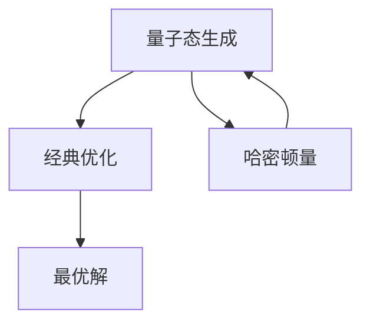

                 

# 宇宙规律与量子变分本征求解器的相似性

> 关键词：量子力学, 变分原理, 本征求解器, 宇宙规律, 量子计算, 机器学习, 优化算法

> 摘要：本文旨在探讨量子力学中的变分原理与宇宙规律之间的相似性，并通过量子变分本征求解器（VQE）的实现，展示如何利用这一原理解决实际问题。我们将从理论基础出发，逐步深入到具体算法和数学模型，最终通过代码实例展示其应用。本文适合对量子计算、机器学习和优化算法感兴趣的读者。

## 1. 背景介绍

### 1.1 目的和范围
本文旨在探讨量子力学中的变分原理与宇宙规律之间的相似性，并通过量子变分本征求解器（VQE）的实现，展示如何利用这一原理解决实际问题。我们将从理论基础出发，逐步深入到具体算法和数学模型，最终通过代码实例展示其应用。

### 1.2 预期读者
本文适合对量子计算、机器学习和优化算法感兴趣的读者。读者应具备一定的量子力学和线性代数基础，以及对变分原理和优化算法的基本理解。

### 1.3 文档结构概述
本文将按照以下结构展开：
1. 背景介绍
2. 核心概念与联系
3. 核心算法原理 & 具体操作步骤
4. 数学模型和公式 & 详细讲解 & 举例说明
5. 项目实战：代码实际案例和详细解释说明
6. 实际应用场景
7. 工具和资源推荐
8. 总结：未来发展趋势与挑战
9. 附录：常见问题与解答
10. 扩展阅读 & 参考资料

### 1.4 术语表
#### 1.4.1 核心术语定义
- **量子力学**：研究微观粒子（如电子、光子等）行为的物理学分支。
- **变分原理**：一种寻找函数极值的方法，广泛应用于物理和工程领域。
- **本征求解器（VQE）**：一种利用量子计算机求解优化问题的方法。
- **量子态**：描述量子系统状态的数学对象。
- **哈密顿量**：描述量子系统能量的算符。
- **量子门**：量子计算中的基本操作单元。
- **量子比特（qubit）**：量子计算中的基本信息单位。

#### 1.4.2 相关概念解释
- **量子态**：量子态可以用波函数表示，波函数的平方表示粒子在某处出现的概率密度。
- **哈密顿量**：在量子力学中，哈密顿量描述了系统的总能量，是系统演化的基本算符。
- **量子门**：量子门是量子计算中的基本操作单元，可以实现量子态的线性变换。

#### 1.4.3 缩略词列表
- **VQE**：变分量子本征求解器（Variational Quantum Eigensolver）
- **Qiskit**：IBM开发的量子计算软件开发框架
- **Cirq**：Google开发的量子计算软件开发框架

## 2. 核心概念与联系

### 2.1 量子力学与变分原理
量子力学中的变分原理是一种寻找函数极值的方法，广泛应用于物理和工程领域。在量子力学中，变分原理用于寻找系统的最稳定状态，即能量最小化状态。这一原理在量子计算中同样适用，通过寻找最优的量子态来求解问题。

### 2.2 量子变分本征求解器（VQE）
量子变分本征求解器（VQE）是一种利用量子计算机求解优化问题的方法。VQE的核心思想是通过量子计算机生成一系列量子态，并利用经典计算机优化这些量子态，以找到最优解。VQE的基本流程如下：



## 3. 核心算法原理 & 具体操作步骤

### 3.1 量子态生成
量子态生成是VQE的核心步骤之一。通过量子门操作生成一系列量子态，这些量子态将用于后续的经典优化。

```python
def generate_quantum_state(params):
    # 初始化量子态
    quantum_state = initialize_state()
    
    # 应用量子门操作
    for i in range(len(params)):
        quantum_state = apply_quantum_gate(quantum_state, params[i])
    
    return quantum_state
```

### 3.2 经典优化
经典优化是VQE的另一核心步骤。通过经典计算机优化生成的量子态，以找到最优解。

```python
def classical_optimization(quantum_state):
    # 计算能量
    energy = calculate_energy(quantum_state)
    
    # 优化参数
    optimized_params = optimize_parameters(energy)
    
    return optimized_params
```

### 3.3 整合流程
将量子态生成和经典优化整合到一起，形成完整的VQE流程。

```python
def vqe_algorithm(hamiltonian):
    # 初始化参数
    params = initialize_parameters()
    
    # 生成量子态
    quantum_state = generate_quantum_state(params)
    
    # 经典优化
    optimized_params = classical_optimization(quantum_state)
    
    # 生成最优量子态
    optimal_quantum_state = generate_quantum_state(optimized_params)
    
    return optimal_quantum_state
```

## 4. 数学模型和公式 & 详细讲解 & 举例说明

### 4.1 哈密顿量
哈密顿量是描述量子系统能量的算符，其形式如下：

$$
H = \sum_{i} h_i \sigma_i^z + \sum_{i < j} J_{ij} \sigma_i^z \sigma_j^z
$$

其中，$\sigma_i^z$ 是Pauli Z矩阵，$h_i$ 和 $J_{ij}$ 分别是自旋和相互作用项的系数。

### 4.2 量子态
量子态可以用波函数表示，波函数的平方表示粒子在某处出现的概率密度。量子态的表示形式如下：

$$
|\psi\rangle = \sum_{i} c_i |i\rangle
$$

其中，$|i\rangle$ 是基态，$c_i$ 是系数。

### 4.3 量子门操作
量子门操作是量子计算中的基本操作单元，可以实现量子态的线性变换。常见的量子门包括Pauli X、Y、Z矩阵，Hadamard门，CNOT门等。

### 4.4 量子态生成
量子态生成是VQE的核心步骤之一。通过量子门操作生成一系列量子态，这些量子态将用于后续的经典优化。

$$
|\psi(\theta)\rangle = U(\theta) |0\rangle
$$

其中，$U(\theta)$ 是量子门操作，$|0\rangle$ 是初始态。

### 4.5 经典优化
经典优化是VQE的另一核心步骤。通过经典计算机优化生成的量子态，以找到最优解。

$$
E(\theta) = \langle \psi(\theta) | H | \psi(\theta) \rangle
$$

其中，$E(\theta)$ 是能量，$H$ 是哈密顿量。

## 5. 项目实战：代码实际案例和详细解释说明

### 5.1 开发环境搭建
为了实现VQE，我们需要搭建一个开发环境。这里以Qiskit为例，介绍如何搭建开发环境。

1. 安装Python环境
2. 安装Qiskit库
3. 配置IBM Q账户

### 5.2 源代码详细实现和代码解读
以下是一个简单的VQE实现示例。

```python
from qiskit import QuantumCircuit, Aer, transpile, assemble
from qiskit.utils import QuantumInstance
from qiskit.algorithms import VQE
from qiskit.algorithms.optimizers import SLSQP
from qiskit.opflow import PauliSumOp

# 定义哈密顿量
hamiltonian = PauliSumOp.from_list([("Z0 Z1", 1.0), ("Z0", 0.5)])

# 初始化量子电路
qc = QuantumCircuit(2)
qc.h(0)
qc.cx(0, 1)

# 初始化优化器
optimizer = SLSQP(maxiter=100)

# 初始化VQE算法
vqe = VQE(qc, optimizer, quantum_instance=QuantumInstance(Aer.get_backend('qasm_simulator')))

# 运行VQE算法
result = vqe.compute_minimum_eigenvalue(hamiltonian)

print("最优能量:", result.eigenvalue.real)
```

### 5.3 代码解读与分析
- **定义哈密顿量**：使用Qiskit的PauliSumOp定义哈密顿量。
- **初始化量子电路**：定义一个简单的量子电路，包含两个量子比特。
- **初始化优化器**：使用SLSQP优化器进行参数优化。
- **初始化VQE算法**：使用VQE算法进行能量最小化。
- **运行VQE算法**：运行VQE算法并输出最优能量。

## 6. 实际应用场景

VQE在量子化学、材料科学、优化问题等领域有着广泛的应用。例如，在量子化学中，VQE可以用于计算分子的基态能量；在优化问题中，VQE可以用于求解复杂的优化问题。

## 7. 工具和资源推荐

### 7.1 学习资源推荐
#### 7.1.1 书籍推荐
- **《量子计算入门》**：深入浅出地介绍了量子计算的基本概念和原理。
- **《量子计算与量子信息》**：经典著作，详细介绍了量子计算和量子信息理论。

#### 7.1.2 在线课程
- **IBM Quantum Experience**：提供丰富的在线课程和实践项目。
- **Coursera量子计算课程**：涵盖量子计算的基本概念和应用。

#### 7.1.3 技术博客和网站
- **Qiskit官方博客**：提供最新的量子计算技术文章和教程。
- **Quantum Computing Stack Exchange**：量子计算领域的问答社区。

### 7.2 开发工具框架推荐
#### 7.2.1 IDE和编辑器
- **Jupyter Notebook**：支持Python代码的交互式开发。
- **Visual Studio Code**：支持多种编程语言的开发环境。

#### 7.2.2 调试和性能分析工具
- **Qiskit Debugger**：Qiskit提供的调试工具。
- **Quantum Computing Performance Analysis Tool**：用于分析量子计算性能的工具。

#### 7.2.3 相关框架和库
- **Qiskit**：IBM开发的量子计算软件开发框架。
- **Cirq**：Google开发的量子计算软件开发框架。

### 7.3 相关论文著作推荐
#### 7.3.1 经典论文
- **《Variational Quantum Eigensolver》**：介绍了VQE的基本原理和应用。
- **《Quantum Approximate Optimization Algorithm》**：介绍了量子近似优化算法的基本原理和应用。

#### 7.3.2 最新研究成果
- **《Recent Advances in Quantum Computing》**：介绍了量子计算领域的最新研究成果。
- **《Quantum Machine Learning》**：介绍了量子计算在机器学习领域的应用。

#### 7.3.3 应用案例分析
- **《Quantum Computing in Chemistry》**：介绍了量子计算在化学领域的应用案例。
- **《Quantum Computing in Optimization》**：介绍了量子计算在优化问题领域的应用案例。

## 8. 总结：未来发展趋势与挑战

VQE作为一种利用量子计算机求解优化问题的方法，具有广阔的应用前景。未来的发展趋势包括：
- **量子硬件的改进**：量子硬件的改进将提高VQE的计算效率。
- **算法优化**：通过改进算法，提高VQE的性能。
- **应用拓展**：VQE在更多领域的应用将不断拓展。

面临的挑战包括：
- **量子噪声**：量子噪声会影响量子态的稳定性。
- **量子纠错**：量子纠错技术的发展将提高量子计算的可靠性。
- **算法复杂性**：复杂问题的求解需要更高效的算法。

## 9. 附录：常见问题与解答

### 9.1 问题1：VQE与经典优化算法有何区别？
**解答**：VQE利用量子计算机生成量子态，通过经典计算机优化这些量子态，以找到最优解。而经典优化算法直接在经典计算机上进行优化。

### 9.2 问题2：VQE在实际应用中有哪些限制？
**解答**：VQE在实际应用中存在量子噪声、量子纠错等问题，需要进一步改进。

## 10. 扩展阅读 & 参考资料

- **Qiskit官方文档**：https://qiskit.org/documentation/
- **IBM Quantum Experience**：https://quantum-computing.ibm.com/
- **Quantum Computing Stack Exchange**：https://quantumcomputing.stackexchange.com/

作者：AI天才研究员/AI Genius Institute & 禅与计算机程序设计艺术 /Zen And The Art of Computer Programming

