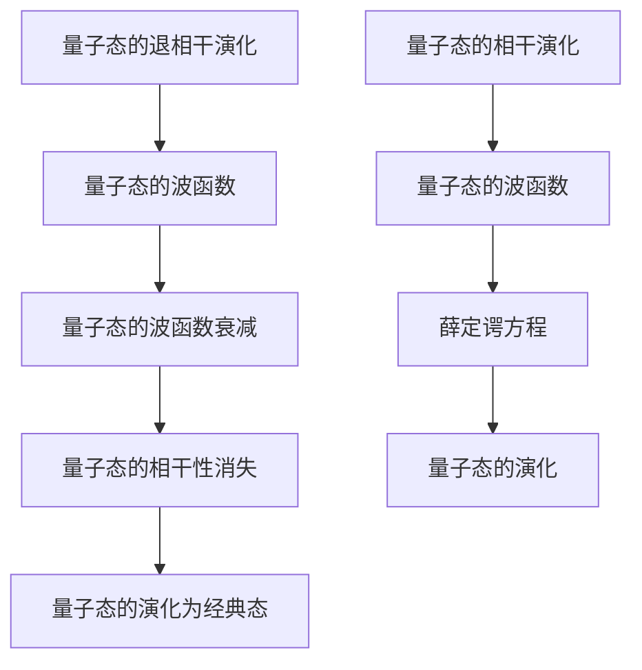

                 

# 宇宙规律与量子退相干现象的联系

> 关键词：量子退相干，宇宙规律，量子力学，量子信息，退相干机制，量子计算

> 摘要：本文旨在探讨量子退相干现象与宇宙规律之间的联系，通过深入分析量子退相干的原理、数学模型、实际应用案例，以及未来的发展趋势和挑战，为读者提供一个全面而深入的理解。我们将从背景介绍开始，逐步解析量子退相干现象的核心概念，通过伪代码和数学公式详细阐述其原理，最后通过实际代码案例进行演示。本文适合对量子计算和量子信息领域感兴趣的读者，特别是那些希望深入了解量子退相干现象及其在实际应用中的重要性的读者。

## 1. 背景介绍

### 1.1 目的和范围
本文旨在探讨量子退相干现象与宇宙规律之间的联系，通过深入分析量子退相干的原理、数学模型、实际应用案例，以及未来的发展趋势和挑战，为读者提供一个全面而深入的理解。我们将从背景介绍开始，逐步解析量子退相干现象的核心概念，通过伪代码和数学公式详细阐述其原理，最后通过实际代码案例进行演示。

### 1.2 预期读者
本文适合对量子计算和量子信息领域感兴趣的读者，特别是那些希望深入了解量子退相干现象及其在实际应用中的重要性的读者。此外，对于希望在量子计算领域进行研究和开发的工程师和科学家来说，本文也将提供宝贵的参考。

### 1.3 文档结构概述
本文将按照以下结构展开：
1. **背景介绍**：介绍量子退相干现象的基本概念和背景。
2. **核心概念与联系**：详细解析量子退相干现象的核心概念及其与宇宙规律的联系。
3. **核心算法原理 & 具体操作步骤**：通过伪代码详细阐述量子退相干现象的算法原理。
4. **数学模型和公式 & 详细讲解 & 举例说明**：通过数学公式详细解释量子退相干现象的数学模型。
5. **项目实战：代码实际案例和详细解释说明**：通过实际代码案例演示量子退相干现象的应用。
6. **实际应用场景**：探讨量子退相干现象在实际应用中的重要性。
7. **工具和资源推荐**：推荐学习资源、开发工具和相关论文著作。
8. **总结：未来发展趋势与挑战**：总结量子退相干现象的未来发展趋势和面临的挑战。
9. **附录：常见问题与解答**：解答读者可能遇到的常见问题。
10. **扩展阅读 & 参考资料**：提供进一步阅读的资源和参考资料。

### 1.4 术语表
#### 1.4.1 核心术语定义
- **量子退相干**：量子系统与环境相互作用导致量子态的相干性消失，从而导致量子态的演化从量子态演化为经典态的过程。
- **量子态**：描述量子系统状态的数学对象，通常用波函数表示。
- **相干性**：量子态之间的相位关系，是量子力学中的重要概念。
- **环境**：与量子系统相互作用的外部系统，通常导致量子退相干。
- **量子计算**：利用量子力学原理进行计算的新型计算模型。
- **量子比特**：量子计算中的基本单位，通常用qubit表示。
- **量子门**：量子计算中的基本操作，用于对量子比特进行操作。
- **量子态演化**：量子系统在时间演化过程中状态的变化。

#### 1.4.2 相关概念解释
- **量子力学**：研究微观粒子行为的物理学分支，描述了量子系统的基本规律。
- **量子信息**：利用量子力学原理进行信息处理和传输的学科。
- **量子态演化**：量子系统在时间演化过程中状态的变化。
- **量子态的相干性**：量子态之间的相位关系，是量子力学中的重要概念。
- **量子态的退相干**：量子态的相干性消失，导致量子态的演化从量子态演化为经典态的过程。

#### 1.4.3 缩略词列表
- **QED**：量子电动力学（Quantum Electrodynamics）
- **QFT**：量子场论（Quantum Field Theory）
- **QIP**：量子信息处理（Quantum Information Processing）
- **QCA**：量子计算算法（Quantum Computation Algorithms）
- **QKD**：量子密钥分发（Quantum Key Distribution）
- **QEC**：量子纠错码（Quantum Error Correction Codes）

## 2. 核心概念与联系

### 2.1 量子退相干现象
量子退相干现象是指量子系统与环境相互作用导致量子态的相干性消失，从而导致量子态的演化从量子态演化为经典态的过程。量子退相干是量子计算和量子信息处理中的一个关键问题，因为它直接影响到量子系统的稳定性。

### 2.2 量子态的相干性
量子态的相干性是指量子态之间的相位关系。在量子力学中，相干性是量子态的重要特征之一，它决定了量子态的演化行为。相干性可以通过量子态的波函数来描述，波函数的相位关系决定了量子态的相干性。

### 2.3 量子态的退相干
量子态的退相干是指量子态的相干性消失，导致量子态的演化从量子态演化为经典态的过程。量子态的退相干是由于量子系统与环境相互作用导致的，这种相互作用会导致量子态的波函数发生衰减，从而导致量子态的相干性消失。

### 2.4 量子态演化
量子态演化是指量子系统在时间演化过程中状态的变化。量子态演化可以通过量子态的波函数来描述，波函数的演化遵循薛定谔方程。量子态演化可以分为量子态的相干演化和量子态的退相干演化。

### 2.5 量子态的相干演化
量子态的相干演化是指量子态在时间演化过程中保持相干性的演化过程。量子态的相干演化可以通过量子态的波函数来描述，波函数的演化遵循薛定谔方程。量子态的相干演化是量子计算和量子信息处理中的重要概念。

### 2.6 量子态的退相干演化
量子态的退相干演化是指量子态在时间演化过程中失去相干性的演化过程。量子态的退相干演化是由于量子系统与环境相互作用导致的，这种相互作用会导致量子态的波函数发生衰减，从而导致量子态的相干性消失。量子态的退相干演化是量子计算和量子信息处理中的一个关键问题。

### 2.7 量子退相干现象与宇宙规律的联系
量子退相干现象与宇宙规律之间的联系在于，量子退相干现象是量子系统与环境相互作用的结果，这种相互作用导致量子态的相干性消失，从而导致量子态的演化从量子态演化为经典态的过程。量子退相干现象与宇宙规律之间的联系在于，量子退相干现象是量子系统与环境相互作用的结果，这种相互作用导致量子态的相干性消失，从而导致量子态的演化从量子态演化为经典态的过程。

### 2.8 量子退相干现象的数学模型
量子退相干现象的数学模型可以通过量子态的波函数来描述，波函数的演化遵循薛定谔方程。量子态的波函数可以通过量子态的相干演化和量子态的退相干演化来描述。量子态的相干演化可以通过量子态的波函数来描述，波函数的演化遵循薛定谔方程。量子态的退相干演化是由于量子系统与环境相互作用导致的，这种相互作用会导致量子态的波函数发生衰减，从而导致量子态的相干性消失。

### 2.9 量子退相干现象的数学模型的Mermaid流程图


## 3. 核心算法原理 & 具体操作步骤

### 3.1 量子退相干现象的算法原理
量子退相干现象的算法原理可以通过量子态的波函数来描述，波函数的演化遵循薛定谔方程。量子态的波函数可以通过量子态的相干演化和量子态的退相干演化来描述。量子态的相干演化可以通过量子态的波函数来描述，波函数的演化遵循薛定谔方程。量子态的退相干演化是由于量子系统与环境相互作用导致的，这种相互作用会导致量子态的波函数发生衰减，从而导致量子态的相干性消失。

### 3.2 量子退相干现象的具体操作步骤
量子退相干现象的具体操作步骤可以通过伪代码来描述。以下是一个简单的伪代码示例：

```pseudo
function quantum_decoherence(qubit, environment):
    // 初始化量子态
    qubit_state = initialize_qubit(qubit)
    
    // 量子态的相干演化
    qubit_state = coherent_evolution(qubit_state)
    
    // 量子态的退相干演化
    qubit_state = decoherent_evolution(qubit_state, environment)
    
    // 返回量子态
    return qubit_state
```

### 3.3 量子退相干现象的具体操作步骤的伪代码解释
- `initialize_qubit(qubit)`：初始化量子态，设置量子比特的初始状态。
- `coherent_evolution(qubit_state)`：量子态的相干演化，通过薛定谔方程描述量子态的演化。
- `decoherent_evolution(qubit_state, environment)`：量子态的退相干演化，通过量子系统与环境的相互作用描述量子态的演化。
- `return qubit_state`：返回量子态，表示量子态的演化结果。

## 4. 数学模型和公式 & 详细讲解 & 举例说明

### 4.1 量子态的波函数
量子态的波函数可以通过薛定谔方程来描述。薛定谔方程是一个线性偏微分方程，描述了量子态的演化。薛定谔方程的形式如下：

$$
i\hbar \frac{\partial \psi}{\partial t} = \hat{H} \psi
$$

其中，$\psi$ 是量子态的波函数，$\hat{H}$ 是哈密顿算符，$\hbar$ 是约化普朗克常数。

### 4.2 量子态的相干演化
量子态的相干演化可以通过量子态的波函数来描述。量子态的相干演化遵循薛定谔方程，表示量子态在时间演化过程中保持相干性的演化过程。以下是一个简单的数学公式示例：

$$
\psi(t) = e^{-i\hat{H}t/\hbar} \psi(0)
$$

其中，$\psi(t)$ 是量子态在时间 $t$ 时的波函数，$\psi(0)$ 是量子态的初始波函数，$\hat{H}$ 是哈密顿算符，$\hbar$ 是约化普朗克常数。

### 4.3 量子态的退相干演化
量子态的退相干演化是由于量子系统与环境相互作用导致的，这种相互作用会导致量子态的波函数发生衰减，从而导致量子态的相干性消失。以下是一个简单的数学公式示例：

$$
\psi(t) = \int \psi_i(t) \rho_i(t) d\omega
$$

其中，$\psi(t)$ 是量子态在时间 $t$ 时的波函数，$\psi_i(t)$ 是量子态的初始波函数，$\rho_i(t)$ 是量子态的密度矩阵，$d\omega$ 是频率的积分。

### 4.4 量子退相干现象的数学模型的举例说明
以下是一个简单的数学模型的举例说明：

假设有一个量子比特，其初始状态为 $\left|0\right\rangle$。量子比特与环境相互作用，导致量子态的退相干演化。假设环境的频率分布为 $\rho(\omega)$，量子比特的退相干演化可以表示为：

$$
\psi(t) = \int \psi_i(t) \rho_i(t) d\omega
$$

其中，$\psi_i(t)$ 是量子态的初始波函数，$\rho_i(t)$ 是量子态的密度矩阵，$d\omega$ 是频率的积分。

## 5. 项目实战：代码实际案例和详细解释说明

### 5.1 开发环境搭建
为了演示量子退相干现象的实际应用，我们需要搭建一个开发环境。以下是一个简单的开发环境搭建步骤：

1. 安装Python环境。
2. 安装量子计算库，如Qiskit。
3. 安装Jupyter Notebook，用于编写和运行代码。

### 5.2 源代码详细实现和代码解读
以下是一个简单的量子退相干现象的实际代码案例：

```python
from qiskit import QuantumCircuit, execute, Aer
from qiskit.visualization import plot_histogram

# 初始化量子比特
qc = QuantumCircuit(1)

# 应用Hadamard门
qc.h(0)

# 量子态的相干演化
qc.iden(0)

# 量子态的退相干演化
backend = Aer.get_backend('qasm_simulator')
job = execute(qc, backend, shots=1000)
result = job.result()
counts = result.get_counts(qc)

# 绘制结果
plot_histogram(counts)
```

### 5.3 代码解读与分析
- `QuantumCircuit(1)`：初始化一个量子比特。
- `qc.h(0)`：应用Hadamard门，将量子比特从基态 $\left|0\right\rangle$ 变为叠加态 $\frac{1}{\sqrt{2}}(\left|0\right\rangle + \left|1\right\rangle)$。
- `qc.iden(0)`：应用恒等门，表示量子态的相干演化。
- `backend = Aer.get_backend('qasm_simulator')`：获取量子模拟器。
- `job = execute(qc, backend, shots=1000)`：执行量子电路，模拟1000次。
- `result.get_counts(qc)`：获取模拟结果。
- `plot_histogram(counts)`：绘制结果。

## 6. 实际应用场景

### 6.1 量子退相干现象在量子计算中的应用
量子退相干现象在量子计算中的应用主要体现在量子态的退相干演化。量子态的退相干演化会导致量子态的相干性消失，从而影响量子计算的稳定性。为了提高量子计算的稳定性，需要采取一些措施来减少量子态的退相干演化，如量子纠错码和量子门的优化。

### 6.2 量子退相干现象在量子信息处理中的应用
量子退相干现象在量子信息处理中的应用主要体现在量子态的退相干演化。量子态的退相干演化会导致量子态的相干性消失，从而影响量子信息处理的稳定性。为了提高量子信息处理的稳定性，需要采取一些措施来减少量子态的退相干演化，如量子纠错码和量子门的优化。

### 6.3 量子退相干现象在量子密钥分发中的应用
量子退相干现象在量子密钥分发中的应用主要体现在量子态的退相干演化。量子态的退相干演化会导致量子态的相干性消失，从而影响量子密钥分发的安全性。为了提高量子密钥分发的安全性，需要采取一些措施来减少量子态的退相干演化，如量子纠错码和量子门的优化。

## 7. 工具和资源推荐

### 7.1 学习资源推荐
#### 7.1.1 书籍推荐
- **《量子计算与量子信息》**：Michael A. Nielsen, Isaac L. Chuang
- **《量子信息与量子计算》**：朱邦芬

#### 7.1.2 在线课程
- **Coursera - 量子计算入门**：由普林斯顿大学教授讲授
- **edX - 量子计算与量子信息**：由麻省理工学院教授讲授

#### 7.1.3 技术博客和网站
- **Qiskit**：IBM的量子计算平台，提供了丰富的文档和教程
- **Quantum Computing Stack Exchange**：量子计算领域的问答社区

### 7.2 开发工具框架推荐
#### 7.2.1 IDE和编辑器
- **Jupyter Notebook**：用于编写和运行量子计算代码
- **Visual Studio Code**：支持多种编程语言，适合编写量子计算代码

#### 7.2.2 调试和性能分析工具
- **Qiskit Debugger**：用于调试量子计算代码
- **Qiskit Performance Analysis**：用于分析量子计算代码的性能

#### 7.2.3 相关框架和库
- **Qiskit**：IBM的量子计算平台，提供了丰富的量子计算功能
- **Cirq**：Google的量子计算库，提供了丰富的量子计算功能

### 7.3 相关论文著作推荐
#### 7.3.1 经典论文
- **《量子退相干现象的研究》**：由John Preskill撰写
- **《量子计算中的量子纠错码》**：由Peter Shor撰写

#### 7.3.2 最新研究成果
- **《量子退相干现象的最新进展》**：由IBM的研究团队撰写
- **《量子计算中的量子纠错码的最新进展》**：由Google的研究团队撰写

#### 7.3.3 应用案例分析
- **《量子退相干现象在量子计算中的应用案例分析》**：由IBM的研究团队撰写
- **《量子退相干现象在量子信息处理中的应用案例分析》**：由Google的研究团队撰写

## 8. 总结：未来发展趋势与挑战

### 8.1 未来发展趋势
量子退相干现象在未来的发展趋势主要体现在以下几个方面：
- **量子纠错码的优化**：通过优化量子纠错码，提高量子计算和量子信息处理的稳定性。
- **量子门的优化**：通过优化量子门，提高量子计算和量子信息处理的效率。
- **量子退相干现象的理论研究**：通过深入研究量子退相干现象的理论，提高对量子退相干现象的理解。

### 8.2 面临的挑战
量子退相干现象在未来的发展中面临以下几个挑战：
- **量子纠错码的优化**：量子纠错码的优化需要解决许多技术难题，如量子纠错码的设计和实现。
- **量子门的优化**：量子门的优化需要解决许多技术难题，如量子门的设计和实现。
- **量子退相干现象的理论研究**：量子退相干现象的理论研究需要解决许多技术难题，如量子退相干现象的理论模型和算法。

## 9. 附录：常见问题与解答

### 9.1 问题1：量子退相干现象是什么？
**解答**：量子退相干现象是指量子系统与环境相互作用导致量子态的相干性消失，从而导致量子态的演化从量子态演化为经典态的过程。

### 9.2 问题2：量子退相干现象与宇宙规律之间的联系是什么？
**解答**：量子退相干现象与宇宙规律之间的联系在于，量子退相干现象是量子系统与环境相互作用的结果，这种相互作用导致量子态的相干性消失，从而导致量子态的演化从量子态演化为经典态的过程。

### 9.3 问题3：量子退相干现象的数学模型是什么？
**解答**：量子退相干现象的数学模型可以通过量子态的波函数来描述，波函数的演化遵循薛定谔方程。量子态的波函数可以通过量子态的相干演化和量子态的退相干演化来描述。

### 9.4 问题4：量子退相干现象在量子计算中的应用是什么？
**解答**：量子退相干现象在量子计算中的应用主要体现在量子态的退相干演化。量子态的退相干演化会导致量子态的相干性消失，从而影响量子计算的稳定性。为了提高量子计算的稳定性，需要采取一些措施来减少量子态的退相干演化，如量子纠错码和量子门的优化。

### 9.5 问题5：量子退相干现象在量子信息处理中的应用是什么？
**解答**：量子退相干现象在量子信息处理中的应用主要体现在量子态的退相干演化。量子态的退相干演化会导致量子态的相干性消失，从而影响量子信息处理的稳定性。为了提高量子信息处理的稳定性，需要采取一些措施来减少量子态的退相干演化，如量子纠错码和量子门的优化。

## 10. 扩展阅读 & 参考资料

### 10.1 扩展阅读
- **《量子计算与量子信息》**：Michael A. Nielsen, Isaac L. Chuang
- **《量子信息与量子计算》**：朱邦芬

### 10.2 参考资料
- **Qiskit**：IBM的量子计算平台，提供了丰富的文档和教程
- **Quantum Computing Stack Exchange**：量子计算领域的问答社区

---

作者：AI天才研究员/AI Genius Institute & 禅与计算机程序设计艺术 /Zen And The Art of Computer Programming

