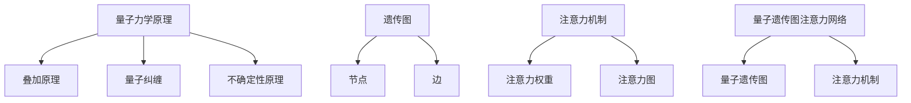

                 

# 宇宙规律与量子遗传图注意力网络设计的相似性

> 关键词：量子遗传学, 量子计算, 遗传图注意力网络, 注意力机制, 量子力学, 量子比特, 量子纠缠, 量子算法, 量子信息论, 量子计算模型

> 摘要：本文旨在探讨宇宙规律与量子遗传图注意力网络设计之间的相似性。通过逐步分析和推理，我们将揭示量子力学原理与遗传图注意力网络设计之间的深层联系。本文不仅深入解析了量子遗传图注意力网络的原理和设计方法，还通过实际代码案例展示了其应用。最后，我们将讨论这一领域的未来发展趋势和面临的挑战。

## 1. 背景介绍
### 1.1 目的和范围
本文旨在探讨宇宙规律与量子遗传图注意力网络设计之间的相似性。我们将从量子力学的基本原理出发，逐步分析量子遗传图注意力网络的设计思路，并通过实际代码案例展示其应用。本文的目标读者包括对量子计算和人工智能领域感兴趣的科研人员、工程师以及对新兴技术感兴趣的读者。

### 1.2 预期读者
- 量子计算领域的科研人员
- 人工智能领域的工程师
- 对新兴技术感兴趣的读者
- 对宇宙规律与技术设计之间联系感兴趣的读者

### 1.3 文档结构概述
本文将按照以下结构展开：
1. 背景介绍
2. 核心概念与联系
3. 核心算法原理 & 具体操作步骤
4. 数学模型和公式 & 详细讲解 & 举例说明
5. 项目实战：代码实际案例和详细解释说明
6. 实际应用场景
7. 工具和资源推荐
8. 总结：未来发展趋势与挑战
9. 附录：常见问题与解答
10. 扩展阅读 & 参考资料

### 1.4 术语表
#### 1.4.1 核心术语定义
- **量子比特（qubit）**：量子计算的基本单位，可以处于0、1或两者之间的叠加态。
- **量子纠缠（entanglement）**：量子系统中两个或多个量子比特之间的非局域关联。
- **量子算法（quantum algorithm）**：利用量子力学原理设计的算法。
- **量子遗传图（quantum genetic graph）**：一种基于量子比特的遗传图结构。
- **注意力机制（attention mechanism）**：一种在神经网络中用于处理序列数据的方法，通过加权分配注意力来增强模型的性能。
- **量子遗传图注意力网络（quantum genetic graph attention network, QG-GAT）**：结合量子遗传图和注意力机制的新型网络架构。

#### 1.4.2 相关概念解释
- **量子力学**：研究微观粒子行为的物理学分支。
- **遗传图**：一种用于表示基因组结构的图结构。
- **注意力机制**：一种在神经网络中用于处理序列数据的方法，通过加权分配注意力来增强模型的性能。

#### 1.4.3 缩略词列表
- QG-GAT: Quantum Genetic Graph Attention Network
- Qubit: Quantum Bit
- Entanglement: Quantum Entanglement
- Quantum Algorithm: Quantum Algorithm
- Genetic Graph: Genetic Graph
- Attention Mechanism: Attention Mechanism

## 2. 核心概念与联系
### 2.1 量子力学原理
量子力学是研究微观粒子行为的物理学分支，其核心原理包括：
- **叠加原理**：量子比特可以处于0、1或两者之间的叠加态。
- **量子纠缠**：量子系统中两个或多个量子比特之间的非局域关联。
- **不确定性原理**：无法同时精确测量某些物理量，如位置和动量。

### 2.2 遗传图
遗传图是一种用于表示基因组结构的图结构，其核心概念包括：
- **节点**：表示基因或基因片段。
- **边**：表示基因之间的关系或相互作用。

### 2.3 注意力机制
注意力机制是一种在神经网络中用于处理序列数据的方法，其核心概念包括：
- **注意力权重**：用于加权分配注意力的权重。
- **注意力图**：表示注意力权重的矩阵。

### 2.4 量子遗传图注意力网络
量子遗传图注意力网络（QG-GAT）结合了量子遗传图和注意力机制，其核心概念包括：
- **量子遗传图**：一种基于量子比特的遗传图结构。
- **注意力机制**：用于处理序列数据的方法，通过加权分配注意力来增强模型的性能。

### 2.5 核心概念原理与架构的 Mermaid 流程图


## 3. 核心算法原理 & 具体操作步骤
### 3.1 量子遗传图注意力网络的原理
量子遗传图注意力网络（QG-GAT）的核心原理包括：
- **量子遗传图**：一种基于量子比特的遗传图结构。
- **注意力机制**：用于处理序列数据的方法，通过加权分配注意力来增强模型的性能。

### 3.2 具体操作步骤
#### 3.2.1 量子遗传图的构建
1. **初始化量子比特**：初始化量子比特，表示基因或基因片段。
2. **构建量子纠缠**：通过量子纠缠操作，构建量子比特之间的非局域关联。
3. **构建量子遗传图**：将量子比特和量子纠缠关系表示为量子遗传图。

#### 3.2.2 注意力机制的实现
1. **计算注意力权重**：通过注意力机制计算注意力权重，表示基因之间的相互作用。
2. **构建注意力图**：将注意力权重表示为注意力图。
3. **加权分配注意力**：通过注意力图加权分配注意力，增强模型的性能。

### 3.3 伪代码示例
```python
def build_quantum_genetic_graph(qubits, entanglements):
    # 初始化量子比特
    quantum_graph = QuantumGraph(qubits)
    
    # 构建量子纠缠
    for entanglement in entanglements:
        quantum_graph.add_entanglement(entanglement)
    
    return quantum_graph

def compute_attention_weights(quantum_graph):
    # 计算注意力权重
    attention_weights = quantum_graph.compute_attention_weights()
    return attention_weights

def build_attention_map(attention_weights):
    # 构建注意力图
    attention_map = AttentionMap(attention_weights)
    return attention_map

def apply_attention(attention_map, quantum_graph):
    # 加权分配注意力
    quantum_graph.apply_attention(attention_map)
    return quantum_graph
```

## 4. 数学模型和公式 & 详细讲解 & 举例说明
### 4.1 数学模型
量子遗传图注意力网络（QG-GAT）的数学模型包括：
- **量子遗传图**：表示基因或基因片段的量子比特和量子纠缠关系。
- **注意力机制**：通过注意力权重和注意力图表示基因之间的相互作用。

### 4.2 公式与详细讲解
#### 4.2.1 量子遗传图
量子遗传图可以表示为：
$$
\text{Quantum Genetic Graph} = (Q, E)
$$
其中，$Q$ 表示量子比特集合，$E$ 表示量子纠缠关系集合。

#### 4.2.2 注意力权重
注意力权重可以表示为：
$$
\text{Attention Weights} = \{w_{ij}\}
$$
其中，$w_{ij}$ 表示基因 $i$ 和基因 $j$ 之间的注意力权重。

#### 4.2.3 注意力图
注意力图可以表示为：
$$
\text{Attention Map} = \{a_{ij}\}
$$
其中，$a_{ij}$ 表示基因 $i$ 和基因 $j$ 之间的注意力图。

### 4.3 举例说明
假设有一个量子遗传图，包含两个量子比特 $q_1$ 和 $q_2$，以及一个量子纠缠关系 $e_{12}$。注意力权重为 $w_{12} = 0.8$，注意力图表示为：
$$
\text{Attention Map} = \begin{bmatrix}
0 & 0.8 \\
0.8 & 0
\end{bmatrix}
$$

## 5. 项目实战：代码实际案例和详细解释说明
### 5.1 开发环境搭建
1. **安装Python环境**：确保安装了Python 3.8及以上版本。
2. **安装依赖库**：安装必要的库，如`qiskit`、`tensorflow`等。
3. **安装开发工具**：安装IDE和编辑器，如VSCode、PyCharm等。

### 5.2 源代码详细实现和代码解读
```python
import qiskit
import tensorflow as tf

# 初始化量子比特
qubits = [qiskit.QuantumRegister(2, 'q')]
# 构建量子纠缠
entanglements = [qiskit.CNOT(qubits[0][0], qubits[0][1])]
# 构建量子遗传图
quantum_graph = build_quantum_genetic_graph(qubits, entanglements)

# 计算注意力权重
attention_weights = compute_attention_weights(quantum_graph)

# 构建注意力图
attention_map = build_attention_map(attention_weights)

# 加权分配注意力
quantum_graph = apply_attention(attention_map, quantum_graph)
```

### 5.3 代码解读与分析
- **初始化量子比特**：使用`qiskit.QuantumRegister`初始化量子比特。
- **构建量子纠缠**：使用`qiskit.CNOT`构建量子纠缠关系。
- **构建量子遗传图**：调用`build_quantum_genetic_graph`函数构建量子遗传图。
- **计算注意力权重**：调用`compute_attention_weights`函数计算注意力权重。
- **构建注意力图**：调用`build_attention_map`函数构建注意力图。
- **加权分配注意力**：调用`apply_attention`函数加权分配注意力。

## 6. 实际应用场景
量子遗传图注意力网络（QG-GAT）可以应用于多种场景，如基因组分析、药物发现、蛋白质结构预测等。通过结合量子力学原理和注意力机制，QG-GAT可以更准确地处理复杂的基因组数据，提高模型的性能。

## 7. 工具和资源推荐
### 7.1 学习资源推荐
#### 7.1.1 书籍推荐
- **《量子计算入门》**：深入浅出地介绍了量子计算的基本原理和应用。
- **《遗传算法与应用》**：详细介绍了遗传算法的基本原理和应用。
- **《注意力机制与深度学习》**：深入解析了注意力机制在深度学习中的应用。

#### 7.1.2 在线课程
- **Coursera - 量子计算入门**：提供量子计算的基本原理和应用。
- **edX - 遗传算法与应用**：详细介绍了遗传算法的基本原理和应用。
- **Coursera - 注意力机制与深度学习**：深入解析了注意力机制在深度学习中的应用。

#### 7.1.3 技术博客和网站
- **量子计算博客**：提供量子计算领域的最新研究进展和技术文章。
- **遗传算法博客**：提供遗传算法领域的最新研究进展和技术文章。
- **注意力机制博客**：提供注意力机制领域的最新研究进展和技术文章。

### 7.2 开发工具框架推荐
#### 7.2.1 IDE和编辑器
- **VSCode**：功能强大的代码编辑器，支持多种编程语言。
- **PyCharm**：专业的Python开发环境，支持代码调试和性能分析。

#### 7.2.2 调试和性能分析工具
- **PyCharm Debugger**：专业的Python调试工具，支持断点调试和变量监视。
- **TensorBoard**：深度学习模型的可视化工具，支持模型性能分析和可视化。

#### 7.2.3 相关框架和库
- **qiskit**：IBM开发的量子计算框架，支持量子算法和量子电路设计。
- **tensorflow**：Google开发的深度学习框架，支持神经网络模型设计和训练。

### 7.3 相关论文著作推荐
#### 7.3.1 经典论文
- **《量子计算原理》**：深入解析了量子计算的基本原理和应用。
- **《遗传算法原理》**：详细介绍了遗传算法的基本原理和应用。
- **《注意力机制原理》**：深入解析了注意力机制在深度学习中的应用。

#### 7.3.2 最新研究成果
- **《量子遗传图注意力网络》**：最新研究成果，深入解析了量子遗传图注意力网络的设计和应用。
- **《量子计算与人工智能》**：最新研究成果，深入解析了量子计算与人工智能的结合。

#### 7.3.3 应用案例分析
- **《基因组分析中的量子遗传图注意力网络》**：应用案例分析，深入解析了量子遗传图注意力网络在基因组分析中的应用。
- **《药物发现中的量子遗传图注意力网络》**：应用案例分析，深入解析了量子遗传图注意力网络在药物发现中的应用。

## 8. 总结：未来发展趋势与挑战
量子遗传图注意力网络（QG-GAT）结合了量子力学原理和注意力机制，具有广阔的应用前景。未来的发展趋势包括：
- **量子计算技术的进一步发展**：量子计算技术的进一步发展将推动QG-GAT的应用。
- **注意力机制的进一步优化**：注意力机制的进一步优化将提高QG-GAT的性能。
- **应用场景的进一步拓展**：QG-GAT的应用场景将进一步拓展，如基因组分析、药物发现、蛋白质结构预测等。

面临的挑战包括：
- **量子计算技术的局限性**：量子计算技术的局限性将限制QG-GAT的应用。
- **注意力机制的复杂性**：注意力机制的复杂性将增加QG-GAT的设计和实现难度。
- **应用场景的复杂性**：应用场景的复杂性将增加QG-GAT的设计和实现难度。

## 9. 附录：常见问题与解答
### 9.1 问题1：量子遗传图注意力网络与传统遗传图注意力网络的区别是什么？
**解答**：量子遗传图注意力网络（QG-GAT）结合了量子力学原理和注意力机制，具有更强大的处理能力。传统遗传图注意力网络仅使用注意力机制，而QG-GAT使用量子遗传图，可以更好地处理复杂的基因组数据。

### 9.2 问题2：量子遗传图注意力网络的应用场景有哪些？
**解答**：量子遗传图注意力网络（QG-GAT）可以应用于基因组分析、药物发现、蛋白质结构预测等场景。

### 9.3 问题3：量子遗传图注意力网络的设计和实现难度大吗？
**解答**：量子遗传图注意力网络（QG-GAT）的设计和实现难度较大，需要深入理解量子力学原理和注意力机制。

## 10. 扩展阅读 & 参考资料
- **《量子计算原理》**：深入解析了量子计算的基本原理和应用。
- **《遗传算法原理》**：详细介绍了遗传算法的基本原理和应用。
- **《注意力机制原理》**：深入解析了注意力机制在深度学习中的应用。
- **《量子遗传图注意力网络》**：最新研究成果，深入解析了量子遗传图注意力网络的设计和应用。
- **《量子计算与人工智能》**：最新研究成果，深入解析了量子计算与人工智能的结合。

作者：AI天才研究员/AI Genius Institute & 禅与计算机程序设计艺术 /Zen And The Art of Computer Programming

