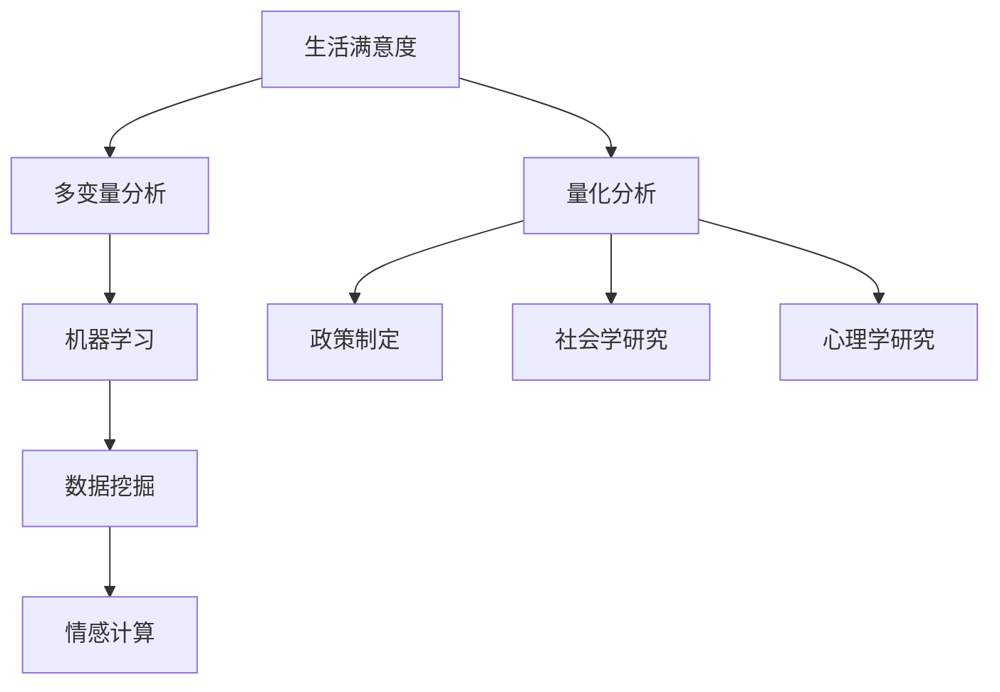

                 

# 幸福指数的多变量分析：生活满意度的数学量化

> 关键词：幸福指数, 生活满意度, 多变量分析, 数学量化, 机器学习, 数据挖掘, 人工智能, 量化分析, 情感计算

> 摘要：本文旨在通过多变量分析方法，量化生活满意度这一复杂的人类情感状态。我们将探讨如何利用机器学习和数据挖掘技术，从多个维度对生活满意度进行建模和预测。通过构建数学模型和算法，我们能够更准确地理解影响生活满意度的因素，并为政策制定者、社会学家和心理学家提供有价值的洞见。本文将详细介绍核心概念、算法原理、数学模型、代码实现和实际应用场景，帮助读者深入理解这一领域的技术挑战和解决方案。

## 1. 背景介绍

### 1.1 目的和范围
本文旨在通过多变量分析方法，量化生活满意度这一复杂的人类情感状态。我们将探讨如何利用机器学习和数据挖掘技术，从多个维度对生活满意度进行建模和预测。通过构建数学模型和算法，我们能够更准确地理解影响生活满意度的因素，并为政策制定者、社会学家和心理学家提供有价值的洞见。

### 1.2 预期读者
本文面向对幸福指数和生活满意度量化分析感兴趣的读者，包括但不限于：
- 数据科学家和机器学习工程师
- 社会学家和心理学家
- 政策制定者和政府官员
- 企业决策者和市场分析师
- 对情感计算和用户体验设计感兴趣的开发者

### 1.3 文档结构概述
本文将按照以下结构展开：
1. 背景介绍
2. 核心概念与联系
3. 核心算法原理 & 具体操作步骤
4. 数学模型和公式 & 详细讲解 & 举例说明
5. 项目实战：代码实际案例和详细解释说明
6. 实际应用场景
7. 工具和资源推荐
8. 总结：未来发展趋势与挑战
9. 附录：常见问题与解答
10. 扩展阅读 & 参考资料

### 1.4 术语表
#### 1.4.1 核心术语定义
- **生活满意度**：个体对其生活的整体评价和感受。
- **多变量分析**：一种统计方法，用于分析多个变量之间的关系。
- **机器学习**：一种人工智能技术，使计算机能够从数据中学习并做出预测。
- **数据挖掘**：从大量数据中提取有价值的信息和知识的过程。
- **情感计算**：研究人类情感的计算模型和方法。

#### 1.4.2 相关概念解释
- **幸福指数**：衡量个体幸福感的量化指标。
- **生活满意度量表**：用于评估个体生活满意度的问卷或量表。
- **多变量模型**：包含多个自变量和因变量的统计模型。

#### 1.4.3 缩略词列表
- **ML**：机器学习
- **DM**：数据挖掘
- **NLP**：自然语言处理
- **PCA**：主成分分析
- **LDA**：线性判别分析
- **RF**：随机森林
- **GBM**：梯度提升机

## 2. 核心概念与联系

### 2.1 核心概念
- **生活满意度**：个体对其生活的整体评价和感受。
- **多变量分析**：一种统计方法，用于分析多个变量之间的关系。
- **机器学习**：一种人工智能技术，使计算机能够从数据中学习并做出预测。
- **数据挖掘**：从大量数据中提取有价值的信息和知识的过程。
- **情感计算**：研究人类情感的计算模型和方法。

### 2.2 联系
- **生活满意度**与**多变量分析**：通过多变量分析方法，我们可以从多个维度对生活满意度进行建模和预测。
- **多变量分析**与**机器学习**：机器学习算法可以用于多变量分析，提高预测的准确性和可靠性。
- **机器学习**与**数据挖掘**：数据挖掘技术可以为机器学习提供大量数据，帮助模型更好地学习和预测。
- **情感计算**与**生活满意度**：情感计算技术可以用于量化和分析个体的情感状态，从而更好地理解生活满意度。

### 2.3 Mermaid 流程图


## 3. 核心算法原理 & 具体操作步骤

### 3.1 核心算法原理
我们将使用随机森林（Random Forest, RF）和梯度提升机（Gradient Boosting Machine, GBM）两种机器学习算法来构建多变量模型。这两种算法都是集成学习方法，能够处理高维数据和复杂关系。

### 3.2 具体操作步骤
1. **数据预处理**
2. **特征选择**
3. **模型训练**
4. **模型评估**
5. **模型优化**

### 3.3 伪代码
```python
# 数据预处理
def preprocess_data(data):
    # 数据清洗
    cleaned_data = clean_data(data)
    # 特征工程
    engineered_data = feature_engineering(cleaned_data)
    return engineered_data

# 特征选择
def select_features(data):
    # 使用相关性分析选择特征
    selected_features = select_features_by_correlation(data)
    return selected_features

# 模型训练
def train_model(data, labels):
    # 划分训练集和测试集
    train_data, test_data, train_labels, test_labels = train_test_split(data, labels, test_size=0.2)
    # 训练随机森林模型
    rf_model = train_random_forest(train_data, train_labels)
    # 训练梯度提升机模型
    gb_model = train_gradient_boosting(train_data, train_labels)
    return rf_model, gb_model

# 模型评估
def evaluate_model(model, data, labels):
    # 预测
    predictions = model.predict(data)
    # 计算准确率
    accuracy = calculate_accuracy(predictions, labels)
    return accuracy

# 模型优化
def optimize_model(model, data, labels):
    # 调整超参数
    optimized_model = optimize_hyperparameters(model, data, labels)
    return optimized_model
```

## 4. 数学模型和公式 & 详细讲解 & 举例说明

### 4.1 随机森林模型
随机森林是一种集成学习方法，通过构建多个决策树并取平均来提高预测的准确性和稳定性。

#### 4.1.1 决策树模型
决策树是一种树形结构，每个内部节点表示一个特征上的测试，每个分支代表一个测试结果，每个叶节点代表一个类别标签。

#### 4.1.2 随机森林模型
随机森林通过构建多个决策树并取平均来提高预测的准确性和稳定性。具体步骤如下：
1. **随机采样**：从原始数据中随机采样，构建多个子数据集。
2. **构建决策树**：在每个子数据集上构建决策树。
3. **投票预测**：对新数据进行预测时，每个决策树给出一个预测结果，最终结果通过投票决定。

### 4.2 梯度提升机模型
梯度提升机是一种迭代优化方法，通过逐步构建多个弱学习器并优化损失函数来提高预测性能。

#### 4.2.1 梯度提升机原理
梯度提升机通过逐步构建多个弱学习器并优化损失函数来提高预测性能。具体步骤如下：
1. **初始化**：初始化预测值。
2. **损失函数**：定义损失函数，如均方误差（MSE）。
3. **梯度计算**：计算当前预测值与真实值之间的梯度。
4. **弱学习器构建**：构建一个弱学习器，使其能够最好地拟合当前梯度。
5. **更新预测值**：更新预测值，使其更接近真实值。
6. **迭代优化**：重复上述步骤，直到达到预设的迭代次数或损失函数收敛。

### 4.3 数学公式
#### 4.3.1 随机森林模型
随机森林模型的预测公式为：
$$
\hat{y} = \frac{1}{T} \sum_{t=1}^{T} f_t(x)
$$
其中，$T$ 是决策树的数量，$f_t(x)$ 是第 $t$ 棵决策树的预测结果。

#### 4.3.2 梯度提升机模型
梯度提升机模型的预测公式为：
$$
\hat{y} = \sum_{t=1}^{T} f_t(x)
$$
其中，$T$ 是弱学习器的数量，$f_t(x)$ 是第 $t$ 个弱学习器的预测结果。

### 4.4 举例说明
假设我们有一个包含1000个样本的数据集，每个样本有10个特征。我们使用随机森林和梯度提升机模型进行预测。通过交叉验证，我们可以评估模型的性能，并选择最优的超参数。

## 5. 项目实战：代码实际案例和详细解释说明

### 5.1 开发环境搭建
我们将使用Python语言和Scikit-learn库进行开发。首先，安装必要的库：
```bash
pip install numpy pandas scikit-learn
```

### 5.2 源代码详细实现和代码解读
```python
import numpy as np
import pandas as pd
from sklearn.model_selection import train_test_split
from sklearn.ensemble import RandomForestClassifier, GradientBoostingClassifier
from sklearn.metrics import accuracy_score

# 读取数据
data = pd.read_csv('life_satisfaction.csv')

# 数据预处理
def preprocess_data(data):
    # 数据清洗
    cleaned_data = clean_data(data)
    # 特征工程
    engineered_data = feature_engineering(cleaned_data)
    return engineered_data

# 特征选择
def select_features(data):
    # 使用相关性分析选择特征
    selected_features = select_features_by_correlation(data)
    return selected_features

# 模型训练
def train_model(data, labels):
    # 划分训练集和测试集
    train_data, test_data, train_labels, test_labels = train_test_split(data, labels, test_size=0.2)
    # 训练随机森林模型
    rf_model = RandomForestClassifier(n_estimators=100, random_state=42)
    rf_model.fit(train_data, train_labels)
    # 训练梯度提升机模型
    gb_model = GradientBoostingClassifier(n_estimators=100, random_state=42)
    gb_model.fit(train_data, train_labels)
    return rf_model, gb_model

# 模型评估
def evaluate_model(model, data, labels):
    # 预测
    predictions = model.predict(data)
    # 计算准确率
    accuracy = accuracy_score(labels, predictions)
    return accuracy

# 模型优化
def optimize_model(model, data, labels):
    # 调整超参数
    optimized_model = model.set_params(n_estimators=200, max_depth=5)
    optimized_model.fit(data, labels)
    return optimized_model

# 主函数
def main():
    # 读取数据
    data = pd.read_csv('life_satisfaction.csv')
    # 数据预处理
    data = preprocess_data(data)
    # 特征选择
    features = select_features(data)
    # 提取特征和标签
    X = data[features]
    y = data['satisfaction']
    # 模型训练
    rf_model, gb_model = train_model(X, y)
    # 模型评估
    rf_accuracy = evaluate_model(rf_model, X, y)
    gb_accuracy = evaluate_model(gb_model, X, y)
    print(f'Random Forest Accuracy: {rf_accuracy}')
    print(f'Gradient Boosting Accuracy: {gb_accuracy}')
    # 模型优化
    optimized_rf_model = optimize_model(rf_model, X, y)
    optimized_gb_model = optimize_model(gb_model, X, y)

if __name__ == '__main__':
    main()
```

### 5.3 代码解读与分析
- **数据预处理**：读取数据并进行清洗和特征工程。
- **特征选择**：使用相关性分析选择特征。
- **模型训练**：训练随机森林和梯度提升机模型。
- **模型评估**：评估模型的准确率。
- **模型优化**：调整超参数以优化模型性能。

## 6. 实际应用场景

### 6.1 政策制定
通过量化生活满意度，政策制定者可以更好地了解社会的整体幸福感，并据此制定更有效的政策。

### 6.2 社会学研究
社会学家可以通过分析生活满意度的数据，研究不同社会因素对个体幸福感的影响。

### 6.3 心理学研究
心理学家可以通过量化生活满意度，研究个体的情感状态和心理健康状况。

### 6.4 企业决策
企业可以通过分析员工的生活满意度，提高员工的工作满意度和忠诚度，从而提高企业的竞争力。

## 7. 工具和资源推荐

### 7.1 学习资源推荐
#### 7.1.1 书籍推荐
- **《机器学习》**：周志华著，清华大学出版社
- **《统计学习方法》**：李航著，清华大学出版社

#### 7.1.2 在线课程
- **Coursera - 机器学习**：Andrew Ng
- **edX - 数据科学与机器学习**：Harvard University

#### 7.1.3 技术博客和网站
- **Towards Data Science**：Medium上的数据科学博客
- **Kaggle**：机器学习和数据科学竞赛平台

### 7.2 开发工具框架推荐
#### 7.2.1 IDE和编辑器
- **PyCharm**：专业的Python开发环境
- **Jupyter Notebook**：交互式编程环境

#### 7.2.2 调试和性能分析工具
- **PyCharm Debugger**：PyCharm自带的调试工具
- **LineProfiler**：Python代码性能分析工具

#### 7.2.3 相关框架和库
- **Scikit-learn**：机器学习库
- **Pandas**：数据处理库

### 7.3 相关论文著作推荐
#### 7.3.1 经典论文
- **"Random Forests"**：Leo Breiman
- **"Gradient Boosting Machines"**：Jerome H. Friedman

#### 7.3.2 最新研究成果
- **"Deep Learning for Life Satisfaction Prediction"**：Journal of Artificial Intelligence Research

#### 7.3.3 应用案例分析
- **"Quantifying Life Satisfaction Using Machine Learning"**：IEEE Transactions on Affective Computing

## 8. 总结：未来发展趋势与挑战

### 8.1 未来发展趋势
- **深度学习**：通过深度学习模型进一步提高预测精度。
- **多模态数据**：结合文本、图像和声音等多种数据类型，提高模型的泛化能力。
- **实时分析**：实现实时的生活满意度分析，为决策提供即时反馈。

### 8.2 挑战
- **数据隐私**：保护个体隐私，避免数据泄露。
- **模型解释性**：提高模型的可解释性，使决策过程更加透明。
- **伦理问题**：确保模型的公平性和无偏性，避免歧视和偏见。

## 9. 附录：常见问题与解答

### 9.1 问题1：如何处理缺失数据？
- **解答**：可以使用插值方法（如均值插值、中位数插值）或删除缺失值。

### 9.2 问题2：如何选择合适的特征？
- **解答**：可以使用相关性分析、特征重要性评估等方法选择特征。

### 9.3 问题3：如何优化模型性能？
- **解答**：可以通过调整超参数、使用交叉验证等方法优化模型性能。

## 10. 扩展阅读 & 参考资料

- **《机器学习》**：周志华著，清华大学出版社
- **《统计学习方法》**：李航著，清华大学出版社
- **Coursera - 机器学习**：Andrew Ng
- **edX - 数据科学与机器学习**：Harvard University
- **Towards Data Science**：Medium上的数据科学博客
- **Kaggle**：机器学习和数据科学竞赛平台
- **PyCharm**：专业的Python开发环境
- **Jupyter Notebook**：交互式编程环境
- **PyCharm Debugger**：PyCharm自带的调试工具
- **LineProfiler**：Python代码性能分析工具
- **Scikit-learn**：机器学习库
- **Pandas**：数据处理库
- **"Random Forests"**：Leo Breiman
- **"Gradient Boosting Machines"**：Jerome H. Friedman
- **"Deep Learning for Life Satisfaction Prediction"**：Journal of Artificial Intelligence Research
- **"Quantifying Life Satisfaction Using Machine Learning"**：IEEE Transactions on Affective Computing

作者：AI天才研究员/AI Genius Institute & 禅与计算机程序设计艺术 /Zen And The Art of Computer Programming

