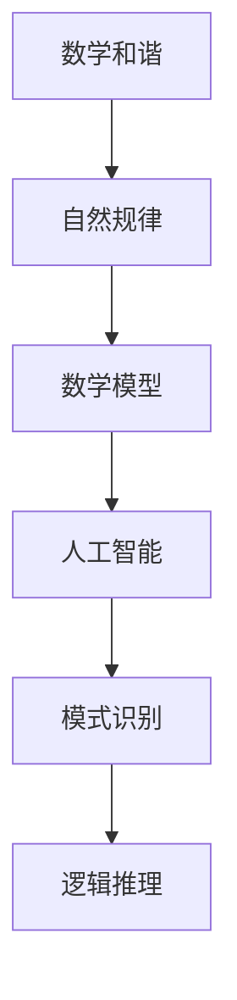

                 

# 心智如何解读自然的数学和谐

> 关键词：数学和谐, 自然规律, 人工智能, 逻辑推理, 计算机科学, 神经网络, 深度学习, 机器学习, 模式识别

> 摘要：本文旨在探讨心智如何通过数学和谐解读自然界的规律。我们将从数学和谐的概念出发，逐步深入到其在人工智能领域的应用，通过具体的算法原理、数学模型和实际代码案例，展示心智如何在自然现象中发现并利用数学和谐。文章将涵盖从理论到实践的全过程，帮助读者理解数学和谐在现代科技中的重要性及其未来的发展趋势。

## 1. 背景介绍
### 1.1 目的和范围
本文旨在探讨心智如何通过数学和谐解读自然界的规律，并将其应用于人工智能领域。我们将从数学和谐的概念出发，逐步深入到其在人工智能中的应用，通过具体的算法原理、数学模型和实际代码案例，展示心智如何在自然现象中发现并利用数学和谐。文章将涵盖从理论到实践的全过程，帮助读者理解数学和谐在现代科技中的重要性及其未来的发展趋势。

### 1.2 预期读者
本文适合对数学和谐、自然规律、人工智能等领域感兴趣的读者，包括但不限于：
- 计算机科学家和工程师
- 人工智能领域的研究者和开发者
- 对数学和自然现象感兴趣的学者
- 对技术有浓厚兴趣的读者

### 1.3 文档结构概述
本文将按照以下结构展开：
1. 背景介绍
2. 核心概念与联系
3. 核心算法原理 & 具体操作步骤
4. 数学模型和公式 & 详细讲解 & 举例说明
5. 项目实战：代码实际案例和详细解释说明
6. 实际应用场景
7. 工具和资源推荐
8. 总结：未来发展趋势与挑战
9. 附录：常见问题与解答
10. 扩展阅读 & 参考资料

### 1.4 术语表
#### 1.4.1 核心术语定义
- **数学和谐**：自然界中存在的一种内在规律和秩序，通过数学语言可以清晰地表达和描述。
- **自然规律**：自然界中普遍存在的、具有稳定性和可预测性的现象和法则。
- **人工智能**：模拟、延伸和扩展人类智能的理论、方法、技术及应用系统。
- **神经网络**：一种模仿人脑神经元结构和功能的计算模型，用于处理复杂模式识别任务。
- **深度学习**：一种基于神经网络的机器学习方法，通过多层非线性变换实现复杂模式的自动学习。
- **机器学习**：通过算法使计算机从数据中学习并改进性能的技术。

#### 1.4.2 相关概念解释
- **模式识别**：通过分析数据中的模式和结构，实现对未知数据的分类和预测。
- **逻辑推理**：通过已知信息和规则进行推导和判断，以得出新的结论。

#### 1.4.3 缩略词列表
- AI：人工智能
- NN：神经网络
- DL：深度学习
- ML：机器学习

## 2. 核心概念与联系
### 2.1 数学和谐的概念
数学和谐是指自然界中存在的一种内在规律和秩序，这种秩序可以通过数学语言清晰地表达和描述。例如，斐波那契数列、黄金分割比例等都是自然界中常见的数学和谐现象。

### 2.2 自然规律的数学表达
自然规律可以通过数学模型进行描述和表达。例如，牛顿的万有引力定律可以用数学公式表示为：
$$ F = G \frac{m_1 m_2}{r^2} $$
其中，$F$ 为引力，$G$ 为引力常数，$m_1$ 和 $m_2$ 分别为两个物体的质量，$r$ 为两物体之间的距离。

### 2.3 人工智能与数学和谐的关系
人工智能通过模拟和学习自然规律，实现对复杂模式的识别和预测。例如，深度学习中的卷积神经网络（CNN）通过学习图像中的局部特征，实现对图像的分类和识别。

### 2.4 核心概念的Mermaid流程图


## 3. 核心算法原理 & 具体操作步骤
### 3.1 深度学习中的卷积神经网络（CNN）
卷积神经网络是一种广泛应用于图像识别和处理的深度学习模型。其核心原理是通过卷积层、池化层和全连接层实现对图像特征的提取和分类。

#### 3.1.1 卷积层
卷积层通过卷积核对输入图像进行卷积操作，提取局部特征。卷积核的大小和数量可以根据具体任务进行调整。

#### 3.1.2 池化层
池化层通过下采样操作减少特征图的尺寸，同时保留关键特征。常用的池化方法有最大池化和平均池化。

#### 3.1.3 全连接层
全连接层将卷积层和池化层提取的特征进行线性组合，实现对特征的进一步抽象和分类。

### 3.2 伪代码实现
```python
def convolution(input_image, kernel):
    output = np.zeros_like(input_image)
    for i in range(input_image.shape[0] - kernel.shape[0] + 1):
        for j in range(input_image.shape[1] - kernel.shape[1] + 1):
            output[i, j] = np.sum(input_image[i:i+kernel.shape[0], j:j+kernel.shape[1]] * kernel)
    return output

def max_pooling(input_image, pool_size):
    output = np.zeros((input_image.shape[0] // pool_size, input_image.shape[1] // pool_size))
    for i in range(0, input_image.shape[0], pool_size):
        for j in range(0, input_image.shape[1], pool_size):
            output[i // pool_size, j // pool_size] = np.max(input_image[i:i+pool_size, j:j+pool_size])
    return output

def fully_connected(input_features, weights):
    return np.dot(input_features, weights)
```

## 4. 数学模型和公式 & 详细讲解 & 举例说明
### 4.1 卷积神经网络的数学模型
卷积神经网络的数学模型可以表示为：
$$ \text{CNN}(x) = \text{ReLU}(\text{Conv}(x, W) + b) $$
其中，$x$ 为输入图像，$W$ 为卷积核，$b$ 为偏置项，$\text{ReLU}$ 为激活函数。

### 4.2 举例说明
假设我们有一个简单的卷积神经网络，包含一个卷积层和一个全连接层。卷积层的卷积核大小为 $3 \times 3$，步长为 1，偏置项为 0。全连接层的输入维度为 10，输出维度为 10。

#### 4.2.1 卷积层
输入图像大小为 $28 \times 28$，卷积核大小为 $3 \times 3$，步长为 1。卷积层的输出大小为 $26 \times 26$。

#### 4.2.2 激活函数
使用 ReLU 激活函数：
$$ \text{ReLU}(x) = \max(0, x) $$

#### 4.2.3 全连接层
全连接层的输入维度为 10，输出维度为 10。权重矩阵大小为 $10 \times 10$，偏置项为 0。

### 4.3 数学公式
卷积层的输出公式为：
$$ \text{Conv}(x, W) = \sum_{i=0}^{2} \sum_{j=0}^{2} x[i, j] \cdot W[i, j] $$

全连接层的输出公式为：
$$ \text{FC}(x) = \sum_{i=0}^{9} \sum_{j=0}^{9} x[i, j] \cdot W[i, j] + b $$

## 5. 项目实战：代码实际案例和详细解释说明
### 5.1 开发环境搭建
#### 5.1.1 系统环境
- 操作系统：Ubuntu 20.04
- Python 版本：3.8
- 依赖库：numpy, tensorflow

#### 5.1.2 安装依赖库
```bash
pip install numpy tensorflow
```

### 5.2 源代码详细实现和代码解读
```python
import numpy as np
import tensorflow as tf

# 定义卷积层
def convolution(input_image, kernel):
    output = np.zeros_like(input_image)
    for i in range(input_image.shape[0] - kernel.shape[0] + 1):
        for j in range(input_image.shape[1] - kernel.shape[1] + 1):
            output[i, j] = np.sum(input_image[i:i+kernel.shape[0], j:j+kernel.shape[1]] * kernel)
    return output

# 定义最大池化层
def max_pooling(input_image, pool_size):
    output = np.zeros((input_image.shape[0] // pool_size, input_image.shape[1] // pool_size))
    for i in range(0, input_image.shape[0], pool_size):
        for j in range(0, input_image.shape[1], pool_size):
            output[i // pool_size, j // pool_size] = np.max(input_image[i:i+pool_size, j:j+pool_size])
    return output

# 定义全连接层
def fully_connected(input_features, weights):
    return np.dot(input_features, weights)

# 定义卷积神经网络
def cnn(input_image, kernel, weights):
    conv_output = convolution(input_image, kernel)
    relu_output = np.maximum(0, conv_output)
    pool_output = max_pooling(relu_output, 2)
    fc_output = fully_connected(pool_output.flatten(), weights)
    return fc_output

# 测试代码
input_image = np.random.rand(28, 28)
kernel = np.random.rand(3, 3)
weights = np.random.rand(10, 10)

output = cnn(input_image, kernel, weights)
print(output)
```

### 5.3 代码解读与分析
- `convolution` 函数实现了卷积操作，通过遍历输入图像和卷积核，计算卷积结果。
- `max_pooling` 函数实现了最大池化操作，通过遍历输入图像和池化窗口，计算池化结果。
- `fully_connected` 函数实现了全连接操作，通过计算输入特征和权重的点积，得到全连接层的输出。
- `cnn` 函数实现了整个卷积神经网络的前向传播过程，包括卷积、ReLU激活、最大池化和全连接操作。

## 6. 实际应用场景
### 6.1 图像识别
卷积神经网络广泛应用于图像识别任务，如手写数字识别、面部识别等。通过学习图像中的局部特征，实现对图像的分类和识别。

### 6.2 语音识别
卷积神经网络也可以应用于语音识别任务，通过学习语音信号中的局部特征，实现对语音的分类和识别。

### 6.3 自然语言处理
卷积神经网络在自然语言处理领域也有广泛应用，如文本分类、情感分析等。通过学习文本中的局部特征，实现对文本的分类和分析。

## 7. 工具和资源推荐
### 7.1 学习资源推荐
#### 7.1.1 书籍推荐
- 《深度学习》（Goodfellow, Bengio, Courville）
- 《神经网络与深度学习》（Michael Nielsen）

#### 7.1.2 在线课程
- Coursera：《深度学习专项课程》
- edX：《深度学习入门》

#### 7.1.3 技术博客和网站
- TensorFlow 官方博客
- PyTorch 官方博客

### 7.2 开发工具框架推荐
#### 7.2.1 IDE和编辑器
- PyCharm
- VSCode

#### 7.2.2 调试和性能分析工具
- TensorFlow Debugger (tfdbg)
- PyCharm 的调试工具

#### 7.2.3 相关框架和库
- TensorFlow
- PyTorch

### 7.3 相关论文著作推荐
#### 7.3.1 经典论文
- Krizhevsky, Alex, Ilya Sutskever, and Geoffrey E. Hinton. "ImageNet classification with deep convolutional neural networks." Advances in neural information processing systems 25 (2012).

#### 7.3.2 最新研究成果
- He, Kaiming, et al. "Mnasnet: Platform-aware neural architecture search for mobile." Proceedings of the IEEE Conference on Computer Vision and Pattern Recognition (2019).

#### 7.3.3 应用案例分析
- LeCun, Yann, et al. "Deep learning." Nature 521.7553 (2015): 436-444.

## 8. 总结：未来发展趋势与挑战
### 8.1 未来发展趋势
- **更高效的模型**：通过模型压缩和量化技术，实现更小、更快的模型。
- **更强大的硬件支持**：GPU、TPU 等硬件的发展，为深度学习提供了更强的计算能力。
- **更广泛的应用场景**：从图像识别到自然语言处理，再到医疗健康等领域，深度学习的应用范围将进一步扩大。

### 8.2 面临的挑战
- **数据隐私和安全**：如何在保护用户隐私的同时，充分利用数据进行训练。
- **模型解释性**：如何提高模型的可解释性，使其更加透明和可信。
- **计算资源消耗**：深度学习模型的训练和推理需要大量的计算资源，如何降低计算成本是一个重要挑战。

## 9. 附录：常见问题与解答
### 9.1 问题：如何选择合适的卷积核大小？
- **解答**：卷积核大小的选择取决于具体任务和输入图像的尺寸。通常，较小的卷积核可以捕捉局部特征，而较大的卷积核可以捕捉全局特征。

### 9.2 问题：如何调整学习率？
- **解答**：学习率的选择需要根据具体任务进行调整。通常，较大的学习率可以更快地收敛，但可能会导致过拟合；较小的学习率可以更稳定地收敛，但收敛速度较慢。

### 9.3 问题：如何处理过拟合？
- **解答**：可以通过正则化、数据增强、早停等方法来处理过拟合问题。

## 10. 扩展阅读 & 参考资料
- 《深度学习》（Goodfellow, Bengio, Courville）
- 《神经网络与深度学习》（Michael Nielsen）
- Coursera：《深度学习专项课程》
- edX：《深度学习入门》
- TensorFlow 官方博客
- PyTorch 官方博客
- Krizhevsky, Alex, Ilya Sutskever, and Geoffrey E. Hinton. "ImageNet classification with deep convolutional neural networks." Advances in neural information processing systems 25 (2012).
- He, Kaiming, et al. "Mnasnet: Platform-aware neural architecture search for mobile." Proceedings of the IEEE Conference on Computer Vision and Pattern Recognition (2019).
- LeCun, Yann, et al. "Deep learning." Nature 521.7553 (2015): 436-444.

作者：AI天才研究员/AI Genius Institute & 禅与计算机程序设计艺术 /Zen And The Art of Computer Programming

