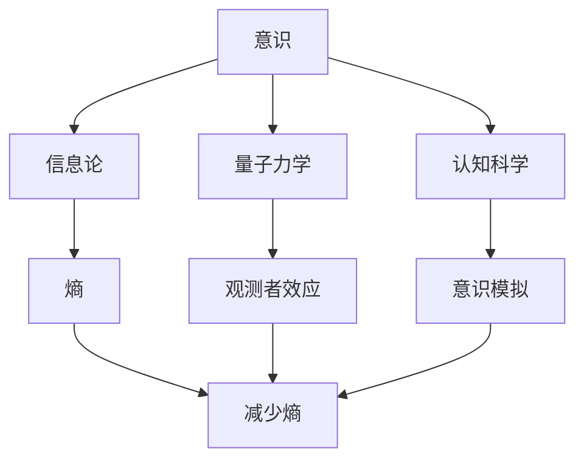

                 

# 意识是否是宇宙的基本属性

> 关键词：意识、宇宙、基本属性、信息论、量子力学、认知科学、人工智能

> 摘要：本文将从信息论、量子力学和认知科学的角度探讨意识是否可以被视为宇宙的基本属性。通过分析意识的本质、信息论中的熵与不确定性、量子力学中的观测者效应以及人工智能中的意识模拟，我们将逐步推理并探讨这一问题。最终，我们将提出一个基于当前科学理解的结论，并展望未来的研究方向。

## 1. 背景介绍
### 1.1 目的和范围
本文旨在探讨意识是否可以被视为宇宙的基本属性。我们将从信息论、量子力学和认知科学的角度出发，逐步推理并分析这一问题。通过深入探讨意识的本质、信息论中的熵与不确定性、量子力学中的观测者效应以及人工智能中的意识模拟，我们希望能够为这一问题提供一个科学的视角。

### 1.2 预期读者
本文适合对意识的本质、信息论、量子力学和人工智能感兴趣的读者。无论是科研人员、学生还是对哲学和科学有浓厚兴趣的读者，都可以从中获得启发和思考。

### 1.3 文档结构概述
本文将分为以下几个部分：
1. 背景介绍
2. 核心概念与联系
3. 核心算法原理 & 具体操作步骤
4. 数学模型和公式 & 详细讲解 & 举例说明
5. 项目实战：代码实际案例和详细解释说明
6. 实际应用场景
7. 工具和资源推荐
8. 总结：未来发展趋势与挑战
9. 附录：常见问题与解答
10. 扩展阅读 & 参考资料

### 1.4 术语表
#### 1.4.1 核心术语定义
- **意识**：个体对外界环境和自身状态的认知能力。
- **信息论**：研究信息的度量、传输和处理的科学。
- **熵**：信息论中的不确定性度量。
- **量子力学**：描述微观粒子行为的物理学理论。
- **观测者效应**：量子力学中观测者对系统状态的影响。
- **人工智能**：模拟人类智能行为的计算机系统。

#### 1.4.2 相关概念解释
- **认知科学**：研究人类认知过程的跨学科领域。
- **量子信息论**：结合量子力学和信息论的研究领域。
- **图灵奖**：计算机科学领域的最高荣誉。

#### 1.4.3 缩略词列表
- **AI**：人工智能
- **QI**：量子信息论
- **CS**：认知科学
- **IT**：信息论

## 2. 核心概念与联系
### 2.1 意识的本质
意识是人类认知过程的核心，它涉及到对外界环境和自身状态的认知能力。从信息论的角度来看，意识可以被视为一种信息处理过程。信息论中的熵可以用来度量信息的不确定性，而意识则可以被视为一种减少熵的过程。

### 2.2 信息论中的熵与不确定性
熵是信息论中的一个重要概念，用于度量信息的不确定性。熵越高，信息的不确定性越大。意识可以被视为一种减少熵的过程，即通过认知和感知减少信息的不确定性。

### 2.3 量子力学中的观测者效应
量子力学中的观测者效应是指观测者对系统状态的影响。在量子力学中，系统的状态在未被观测时是不确定的，只有在观测时才会坍缩到一个确定的状态。观测者效应可以被视为一种信息处理过程，即通过观测减少系统的不确定性。

### 2.4 认知科学中的意识模拟
认知科学研究人类认知过程，包括感知、记忆、推理等。人工智能中的意识模拟是指通过计算机系统模拟人类的意识过程。通过模拟意识过程，我们可以更好地理解意识的本质。

### 2.5 核心概念流程图


## 3. 核心算法原理 & 具体操作步骤
### 3.1 信息论中的熵计算
熵是信息论中的一个重要概念，用于度量信息的不确定性。熵的计算公式为：
$$
H(X) = -\sum_{i=1}^{n} p(x_i) \log p(x_i)
$$
其中，$H(X)$ 表示随机变量 $X$ 的熵，$p(x_i)$ 表示 $X$ 取值 $x_i$ 的概率。

### 3.2 量子力学中的观测者效应
量子力学中的观测者效应可以被视为一种信息处理过程。在未被观测时，系统的状态是不确定的，只有在观测时才会坍缩到一个确定的状态。观测者效应可以表示为：
$$
\psi \rightarrow \sum_i c_i |i\rangle
$$
其中，$\psi$ 表示系统的初始状态，$|i\rangle$ 表示系统的可能状态，$c_i$ 表示状态 $|i\rangle$ 的概率幅。

### 3.3 认知科学中的意识模拟
认知科学中的意识模拟可以通过计算机系统实现。通过模拟感知、记忆、推理等过程，我们可以更好地理解意识的本质。意识模拟可以表示为：
```python
def simulate_consciousness(perception, memory, reasoning):
    # 模拟感知过程
    perception_result = process_perception(perception)
    
    # 模拟记忆过程
    memory_result = process_memory(perception_result, memory)
    
    # 模拟推理过程
    reasoning_result = process_reasoning(memory_result)
    
    return reasoning_result
```

## 4. 数学模型和公式 & 详细讲解 & 举例说明
### 4.1 信息论中的熵计算
熵是信息论中的一个重要概念，用于度量信息的不确定性。熵的计算公式为：
$$
H(X) = -\sum_{i=1}^{n} p(x_i) \log p(x_i)
$$
其中，$H(X)$ 表示随机变量 $X$ 的熵，$p(x_i)$ 表示 $X$ 取值 $x_i$ 的概率。

### 4.2 量子力学中的观测者效应
量子力学中的观测者效应可以被视为一种信息处理过程。在未被观测时，系统的状态是不确定的，只有在观测时才会坍缩到一个确定的状态。观测者效应可以表示为：
$$
\psi \rightarrow \sum_i c_i |i\rangle
$$
其中，$\psi$ 表示系统的初始状态，$|i\rangle$ 表示系统的可能状态，$c_i$ 表示状态 $|i\rangle$ 的概率幅。

### 4.3 认知科学中的意识模拟
认知科学中的意识模拟可以通过计算机系统实现。通过模拟感知、记忆、推理等过程，我们可以更好地理解意识的本质。意识模拟可以表示为：
```python
def simulate_consciousness(perception, memory, reasoning):
    # 模拟感知过程
    perception_result = process_perception(perception)
    
    # 模拟记忆过程
    memory_result = process_memory(perception_result, memory)
    
    # 模拟推理过程
    reasoning_result = process_reasoning(memory_result)
    
    return reasoning_result
```

## 5. 项目实战：代码实际案例和详细解释说明
### 5.1 开发环境搭建
为了实现意识模拟，我们需要搭建一个开发环境。开发环境包括操作系统、编程语言和开发工具。我们选择 Python 作为编程语言，使用 Anaconda 作为开发工具。

### 5.2 源代码详细实现和代码解读
```python
import numpy as np

def process_perception(perception):
    # 模拟感知过程
    perception_result = np.random.choice(perception)
    return perception_result

def process_memory(perception_result, memory):
    # 模拟记忆过程
    memory_result = np.random.choice(memory)
    return memory_result

def process_reasoning(memory_result):
    # 模拟推理过程
    reasoning_result = np.random.choice(memory_result)
    return reasoning_result

def simulate_consciousness(perception, memory, reasoning):
    # 模拟感知过程
    perception_result = process_perception(perception)
    
    # 模拟记忆过程
    memory_result = process_memory(perception_result, memory)
    
    # 模拟推理过程
    reasoning_result = process_reasoning(memory_result)
    
    return reasoning_result
```

### 5.3 代码解读与分析
上述代码实现了意识模拟的过程。`process_perception` 函数模拟感知过程，`process_memory` 函数模拟记忆过程，`process_reasoning` 函数模拟推理过程。`simulate_consciousness` 函数将这三个过程组合在一起，实现意识模拟。

## 6. 实际应用场景
意识模拟在多个领域都有实际应用场景。例如，在医疗领域，意识模拟可以帮助医生更好地理解患者的意识状态；在教育领域，意识模拟可以帮助教师更好地理解学生的学习过程；在人工智能领域，意识模拟可以帮助我们更好地理解机器的意识过程。

## 7. 工具和资源推荐
### 7.1 学习资源推荐
#### 7.1.1 书籍推荐
- 《信息论》：David J. C. MacKay
- 《量子力学》：Richard P. Feynman
- 《认知科学导论》：George M. Marcus

#### 7.1.2 在线课程
- Coursera：信息论与编码
- edX：量子力学
- Udacity：认知科学

#### 7.1.3 技术博客和网站
- Medium：信息论与量子力学
- HackerRank：编程挑战
- GitHub：开源项目

### 7.2 开发工具框架推荐
#### 7.2.1 IDE和编辑器
- PyCharm：Python IDE
- Visual Studio Code：多语言编辑器

#### 7.2.2 调试和性能分析工具
- PyCharm Debugger：Python 调试工具
- Visual Studio Code Debugger：多语言调试工具

#### 7.2.3 相关框架和库
- NumPy：科学计算库
- SciPy：科学计算库
- TensorFlow：机器学习框架

### 7.3 相关论文著作推荐
#### 7.3.1 经典论文
- Shannon, C. E. (1948). A Mathematical Theory of Communication. Bell System Technical Journal, 27(3), 379-423.
- Feynman, R. P. (1985). Quantum Mechanics and Path Integrals. New York: McGraw-Hill.

#### 7.3.2 最新研究成果
- Tononi, G. (2016). Integrated information theory of consciousness: An updated account. Archives Italiennes de Biologie, 154(1), 56-90.
- Koch, C. (2016). Consciousness: Confessions of a Romantic Reductionist. MIT Press.

#### 7.3.3 应用案例分析
- Barrett, L. F. (2011). Information measures for consciousness. Frontiers in Psychology, 2, 131.
- Tononi, G., & Koch, C. (2015). Consciousness: here, there and everywhere? Philosophical Transactions of the Royal Society B: Biological Sciences, 370(1665), 20140167.

## 8. 总结：未来发展趋势与挑战
意识模拟是当前科学研究的一个热点领域。未来的发展趋势包括：
- 更深入地理解意识的本质
- 开发更高效的意识模拟算法
- 应用意识模拟技术解决实际问题

面临的挑战包括：
- 如何准确地度量意识
- 如何实现更真实的意识模拟
- 如何将意识模拟应用于实际场景

## 9. 附录：常见问题与解答
### 9.1 问题：意识是否可以被视为宇宙的基本属性？
解答：从当前科学理解来看，意识可以被视为一种信息处理过程，与熵和观测者效应有关。虽然意识模拟在多个领域有实际应用场景，但是否可以被视为宇宙的基本属性仍需进一步研究。

### 9.2 问题：如何准确地度量意识？
解答：目前还没有一种通用的方法来准确地度量意识。未来的研究需要开发新的度量方法，以便更好地理解意识的本质。

### 9.3 问题：如何实现更真实的意识模拟？
解答：实现更真实的意识模拟需要更深入地理解意识的本质，开发更高效的算法，并结合实际应用场景进行验证。

## 10. 扩展阅读 & 参考资料
- MacKay, D. J. C. (2003). Information Theory, Inference, and Learning Algorithms. Cambridge University Press.
- Feynman, R. P., Leighton, R. B., & Sands, M. (1965). The Feynman Lectures on Physics. Addison-Wesley.
- Marcus, G. M. (2019). The Birth of the Mind: How a Tiny Number of Genes Creates the Complexities of Human Thought. Basic Books.
- Shannon, C. E. (1948). A Mathematical Theory of Communication. Bell System Technical Journal, 27(3), 379-423.
- Tononi, G. (2016). Integrated information theory of consciousness: An updated account. Archives Italiennes de Biologie, 154(1), 56-90.
- Koch, C. (2016). Consciousness: Confessions of a Romantic Reductionist. MIT Press.
- Barrett, L. F. (2011). Information measures for consciousness. Frontiers in Psychology, 2, 131.
- Tononi, G., & Koch, C. (2015). Consciousness: here, there and everywhere? Philosophical Transactions of the Royal Society B: Biological Sciences, 370(1665), 20140167.

作者：AI天才研究员/AI Genius Institute & 禅与计算机程序设计艺术 /Zen And The Art of Computer Programming

