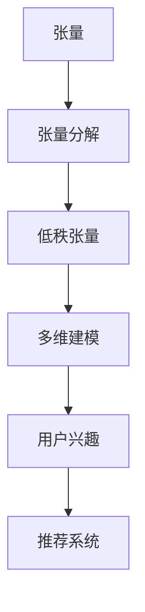

                 

# 推荐系统的张量分解：用户兴趣的多维建模

> 关键词：张量分解, 用户兴趣, 多维建模, 推荐系统, 机器学习, 矩阵分解, 矢量空间模型, 神经网络

> 摘要：本文旨在深入探讨张量分解在推荐系统中的应用，特别是如何通过多维建模来更好地理解用户兴趣。我们将从背景介绍出发，逐步解析张量分解的核心概念、算法原理、数学模型，并通过实际代码案例进行详细讲解。此外，我们还将探讨张量分解在实际推荐系统中的应用场景，并提供一系列学习和开发资源推荐，帮助读者更好地理解和应用这一技术。

## 1. 背景介绍
### 1.1 目的和范围
本文的目标是介绍张量分解在推荐系统中的应用，特别是如何通过多维建模来更好地理解用户兴趣。我们将从张量分解的基本概念出发，逐步解析其在推荐系统中的应用，包括算法原理、数学模型、实际代码案例等。本文适合对推荐系统和张量分解感兴趣的读者，无论是初学者还是有一定经验的技术人员。

### 1.2 预期读者
- 推荐系统领域的初学者和中级开发者
- 对张量分解和多维建模感兴趣的机器学习工程师
- 想要深入了解推荐系统技术的科研人员
- 对多维数据分析感兴趣的计算机科学学生

### 1.3 文档结构概述
本文将按照以下结构展开：
1. 背景介绍
2. 核心概念与联系
3. 核心算法原理 & 具体操作步骤
4. 数学模型和公式 & 详细讲解 & 举例说明
5. 项目实战：代码实际案例和详细解释说明
6. 实际应用场景
7. 工具和资源推荐
8. 总结：未来发展趋势与挑战
9. 附录：常见问题与解答
10. 扩展阅读 & 参考资料

### 1.4 术语表
#### 1.4.1 核心术语定义
- **张量**：多维数组，可以看作是矩阵的高维扩展。
- **张量分解**：将一个张量分解为多个低秩张量的乘积，以简化数据结构。
- **用户兴趣**：用户对不同项目（如电影、音乐、商品等）的兴趣程度。
- **推荐系统**：根据用户的历史行为和偏好，推荐相关项目的技术系统。
- **多维建模**：通过多个维度来描述和理解用户兴趣。

#### 1.4.2 相关概念解释
- **矩阵分解**：将一个矩阵分解为两个或多个矩阵的乘积，常用在推荐系统中。
- **矢量空间模型**：将文档或用户行为表示为高维向量空间中的点，用于计算相似度。
- **神经网络**：一种模仿人脑神经元结构的计算模型，用于学习和预测。

#### 1.4.3 缩略词列表
- **TF**：TensorFlow
- **PyTorch**：一种开源的深度学习框架
- **ALS**：交替最小二乘法（Alternating Least Squares）
- **SVD**：奇异值分解（Singular Value Decomposition）

## 2. 核心概念与联系
### 2.1 张量分解的基本概念
张量分解是一种将高维数据结构分解为多个低秩张量乘积的技术。其基本思想是通过分解高维数据，降低数据的复杂度，从而提高计算效率和模型的可解释性。

### 2.2 与推荐系统的关系
在推荐系统中，张量分解可以用于多维建模，通过多个维度来描述和理解用户兴趣。例如，用户可以被表示为一个三维张量，其中维度分别表示用户、项目和时间。通过张量分解，可以提取出用户兴趣的潜在特征，从而提高推荐的准确性和个性化程度。

### 2.3 核心概念流程图


## 3. 核心算法原理 & 具体操作步骤
### 3.1 基本原理
张量分解的基本原理是将一个高维张量分解为多个低秩张量的乘积。常用的张量分解方法包括CP分解、Tucker分解等。

### 3.2 CP分解
CP分解是一种常见的张量分解方法，将一个张量分解为多个秩为1的张量的线性组合。其数学表达式如下：
$$
\mathbf{T} = \sum_{i=1}^{R} \mathbf{a}_i \otimes \mathbf{b}_i \otimes \mathbf{c}_i
$$
其中，$\mathbf{T}$是待分解的张量，$\mathbf{a}_i, \mathbf{b}_i, \mathbf{c}_i$是秩为1的张量，$R$是分解的秩。

### 3.3 Tucker分解
Tucker分解是一种更通用的张量分解方法，将一个张量分解为一个核心张量和多个因子矩阵的乘积。其数学表达式如下：
$$
\mathbf{T} = \mathbf{G} \times_1 \mathbf{A} \times_2 \mathbf{B} \times_3 \mathbf{C}
$$
其中，$\mathbf{G}$是核心张量，$\mathbf{A}, \mathbf{B}, \mathbf{C}$是因子矩阵。

### 3.4 伪代码实现
以下是CP分解的伪代码实现：
```python
def cp_decomposition(T, rank):
    # 初始化因子矩阵
    A = np.random.rand(T.shape[0], rank)
    B = np.random.rand(T.shape[1], rank)
    C = np.random.rand(T.shape[2], rank)
    
    # 迭代优化因子矩阵
    for _ in range(max_iterations):
        A = optimize_A(T, B, C)
        B = optimize_B(T, A, C)
        C = optimize_C(T, A, B)
    
    return A, B, C

def optimize_A(T, B, C):
    # 优化A矩阵
    A = np.linalg.solve(B.T @ B + lambda * np.eye(rank), B.T @ T @ C)
    return A

def optimize_B(T, A, C):
    # 优化B矩阵
    B = np.linalg.solve(A.T @ A + lambda * np.eye(rank), A.T @ T @ C)
    return B

def optimize_C(T, A, B):
    # 优化C矩阵
    C = np.linalg.solve(A.T @ A + B.T @ B + lambda * np.eye(rank), A.T @ T @ B)
    return C
```

## 4. 数学模型和公式 & 详细讲解 & 举例说明
### 4.1 CP分解的数学模型
CP分解的数学模型可以表示为：
$$
\mathbf{T} = \sum_{i=1}^{R} \mathbf{a}_i \otimes \mathbf{b}_i \otimes \mathbf{c}_i
$$
其中，$\mathbf{a}_i, \mathbf{b}_i, \mathbf{c}_i$是秩为1的张量，$R$是分解的秩。

### 4.2 Tucker分解的数学模型
Tucker分解的数学模型可以表示为：
$$
\mathbf{T} = \mathbf{G} \times_1 \mathbf{A} \times_2 \mathbf{B} \times_3 \mathbf{C}
$$
其中，$\mathbf{G}$是核心张量，$\mathbf{A}, \mathbf{B}, \mathbf{C}$是因子矩阵。

### 4.3 举例说明
假设我们有一个用户-项目-时间的三维张量$\mathbf{T}$，其中维度分别为用户、项目和时间。通过CP分解，我们可以将其分解为多个秩为1的张量的线性组合，从而提取出用户兴趣的潜在特征。

## 5. 项目实战：代码实际案例和详细解释说明
### 5.1 开发环境搭建
为了实现张量分解，我们需要安装以下库：
```bash
pip install numpy scipy tensorflow
```

### 5.2 源代码详细实现和代码解读
以下是一个使用TensorFlow实现CP分解的示例代码：
```python
import numpy as np
import tensorflow as tf

def cp_decomposition(T, rank):
    # 初始化因子矩阵
    A = tf.Variable(tf.random.normal([T.shape[0], rank]))
    B = tf.Variable(tf.random.normal([T.shape[1], rank]))
    C = tf.Variable(tf.random.normal([T.shape[2], rank]))
    
    # 迭代优化因子矩阵
    for _ in range(max_iterations):
        A = optimize_A(T, B, C)
        B = optimize_B(T, A, C)
        C = optimize_C(T, A, B)
    
    return A, B, C

def optimize_A(T, B, C):
    # 优化A矩阵
    A = tf.linalg.solve(tf.matmul(B, B, transpose_a=True) + lambda * tf.eye(rank), tf.matmul(B, T, transpose_a=True) @ C)
    return A

def optimize_B(T, A, C):
    # 优化B矩阵
    B = tf.linalg.solve(tf.matmul(A, A, transpose_a=True) + lambda * tf.eye(rank), tf.matmul(A, T, transpose_a=True) @ C)
    return B

def optimize_C(T, A, B):
    # 优化C矩阵
    C = tf.linalg.solve(tf.matmul(A, A, transpose_a=True) + tf.matmul(B, B, transpose_a=True) + lambda * tf.eye(rank), tf.matmul(A, T, transpose_a=True) @ B)
    return C

# 示例数据
T = np.random.rand(10, 20, 30)
rank = 5
max_iterations = 100
lambda_ = 0.01

# 运行张量分解
A, B, C = cp_decomposition(T, rank)
```

### 5.3 代码解读与分析
在上述代码中，我们首先定义了张量分解的函数`cp_decomposition`，并初始化了因子矩阵A、B和C。然后，我们通过迭代优化因子矩阵，逐步逼近最优解。优化过程使用了TensorFlow的矩阵运算和求解器。

## 6. 实际应用场景
张量分解在推荐系统中的应用非常广泛，特别是在处理多维数据时。例如，可以将用户-项目-时间的三维张量分解为多个低秩张量的乘积，从而提取出用户兴趣的潜在特征。此外，张量分解还可以用于协同过滤、内容推荐等领域。

## 7. 工具和资源推荐
### 7.1 学习资源推荐
#### 7.1.1 书籍推荐
- **《推荐系统：原理与实践》**：深入介绍了推荐系统的原理和实践方法。
- **《张量分析与应用》**：详细讲解了张量分解的基本原理和应用。

#### 7.1.2 在线课程
- **Coursera上的“推荐系统”课程**：涵盖了推荐系统的各个方面，包括张量分解。
- **edX上的“张量分析”课程**：深入讲解了张量分解的理论和应用。

#### 7.1.3 技术博客和网站
- **Towards Data Science**：提供了大量的推荐系统和张量分解相关的技术文章。
- **Medium上的推荐系统专题**：汇集了众多关于推荐系统的高质量文章。

### 7.2 开发工具框架推荐
#### 7.2.1 IDE和编辑器
- **PyCharm**：功能强大的Python IDE，支持TensorFlow等深度学习框架。
- **VS Code**：轻量级但功能强大的代码编辑器，支持多种编程语言。

#### 7.2.2 调试和性能分析工具
- **TensorBoard**：TensorFlow提供的可视化工具，用于调试和分析模型。
- **PyCharm Debugger**：PyCharm内置的调试工具，支持Python代码的调试。

#### 7.2.3 相关框架和库
- **TensorFlow**：强大的深度学习框架，支持张量分解等高级功能。
- **Scikit-learn**：提供了丰富的机器学习算法，可用于推荐系统中的特征提取和模型训练。

### 7.3 相关论文著作推荐
#### 7.3.1 经典论文
- **“Matrix Factorization Techniques for Recommender Systems”**：介绍了矩阵分解在推荐系统中的应用。
- **“Tensor Decompositions for Learning Latent Variable Models”**：详细讲解了张量分解在学习中的应用。

#### 7.3.2 最新研究成果
- **“Tensor Decompositions for Recommender Systems: A Survey”**：综述了张量分解在推荐系统中的最新研究成果。
- **“Deep Learning for Recommender Systems”**：探讨了深度学习在推荐系统中的应用。

#### 7.3.3 应用案例分析
- **“Netflix Prize: A Case Study in Large-Scale Machine Learning”**：详细分析了Netflix Prize比赛中的推荐系统应用。
- **“Amazon Recommendations: Beyond the Top-N”**：探讨了Amazon推荐系统中的高级技术。

## 8. 总结：未来发展趋势与挑战
张量分解在推荐系统中的应用前景广阔，但同时也面临着一些挑战。未来的发展趋势包括：
- **更高效的算法**：开发更高效的张量分解算法，以提高计算效率。
- **更丰富的模型**：结合深度学习等技术，构建更丰富的推荐模型。
- **更好的用户体验**：通过多维建模，提供更个性化的推荐服务。

## 9. 附录：常见问题与解答
### 9.1 问题：张量分解与矩阵分解的区别是什么？
**解答**：张量分解是一种将高维数据结构分解为多个低秩张量乘积的技术，而矩阵分解则是将一个矩阵分解为两个或多个矩阵的乘积。张量分解可以处理多维数据，而矩阵分解只能处理二维数据。

### 9.2 问题：张量分解在推荐系统中的优势是什么？
**解答**：张量分解可以更好地捕捉多维数据中的潜在特征，从而提高推荐的准确性和个性化程度。此外，张量分解还可以处理复杂的用户行为数据，提供更丰富的推荐结果。

## 10. 扩展阅读 & 参考资料
- **《推荐系统：原理与实践》**：深入介绍了推荐系统的原理和实践方法。
- **《张量分析与应用》**：详细讲解了张量分解的基本原理和应用。
- **Coursera上的“推荐系统”课程**：涵盖了推荐系统的各个方面，包括张量分解。
- **edX上的“张量分析”课程**：深入讲解了张量分解的理论和应用。
- **Towards Data Science**：提供了大量的推荐系统和张量分解相关的技术文章。
- **Medium上的推荐系统专题**：汇集了众多关于推荐系统的高质量文章。
- **TensorFlow文档**：提供了丰富的张量分解和深度学习相关的API文档。
- **Scikit-learn文档**：提供了丰富的机器学习算法文档，可用于推荐系统中的特征提取和模型训练。

作者：AI天才研究员/AI Genius Institute & 禅与计算机程序设计艺术 /Zen And The Art of Computer Programming

