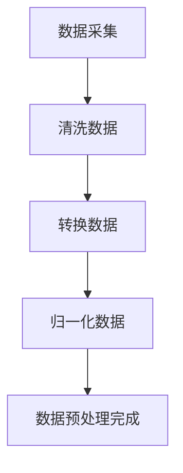
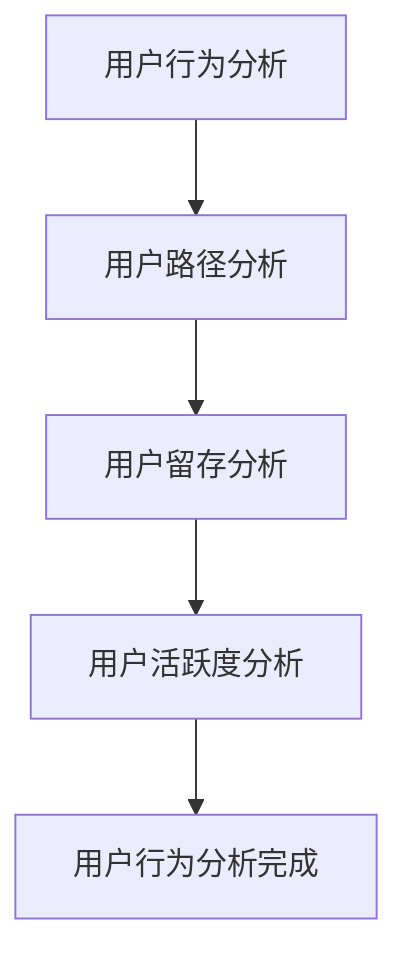
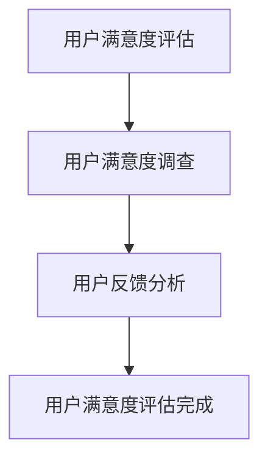
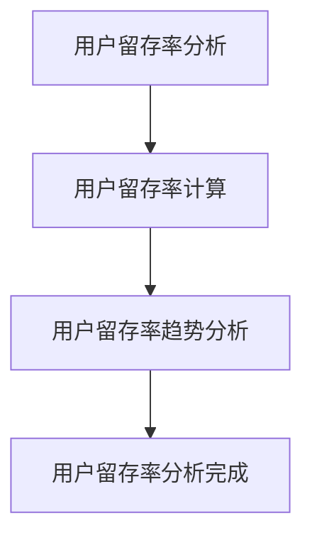
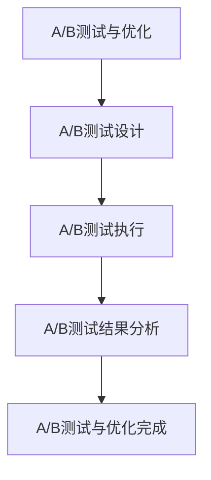

                 

# 数学与产品设计：用户体验的数学量化

> 关键词：用户体验、数学量化、产品设计、用户行为分析、数据分析、机器学习、用户满意度、用户留存率、A/B测试

> 摘要：本文旨在探讨如何利用数学和数据分析的方法来量化用户体验，从而优化产品设计。通过深入分析用户行为数据，我们可以更好地理解用户需求，提高产品满意度和留存率。本文将从核心概念、算法原理、数学模型、实际案例、应用场景、工具推荐等多个方面进行详细阐述，帮助读者掌握这一领域的核心知识和实践技巧。

## 1. 背景介绍
### 1.1 目的和范围
本文旨在探讨如何利用数学和数据分析的方法来量化用户体验，从而优化产品设计。通过深入分析用户行为数据，我们可以更好地理解用户需求，提高产品满意度和留存率。本文将从核心概念、算法原理、数学模型、实际案例、应用场景、工具推荐等多个方面进行详细阐述，帮助读者掌握这一领域的核心知识和实践技巧。

### 1.2 预期读者
本文适合以下读者阅读：
- 产品经理：希望通过数据分析优化产品设计，提高用户体验。
- 数据分析师：希望通过数学模型和算法提高数据分析能力。
- 人工智能工程师：希望通过机器学习方法提升用户体验优化能力。
- 研究人员：希望通过理论和实践结合的方式深入理解用户体验量化方法。

### 1.3 文档结构概述
本文结构如下：
1. 背景介绍
2. 核心概念与联系
3. 核心算法原理 & 具体操作步骤
4. 数学模型和公式 & 详细讲解 & 举例说明
5. 项目实战：代码实际案例和详细解释说明
6. 实际应用场景
7. 工具和资源推荐
8. 总结：未来发展趋势与挑战
9. 附录：常见问题与解答
10. 扩展阅读 & 参考资料

### 1.4 术语表
#### 1.4.1 核心术语定义
- 用户体验（User Experience, UX）：用户在使用产品或服务时的主观感受和满意度。
- 用户行为（User Behavior）：用户在使用产品或服务时的具体操作和互动。
- 用户满意度（User Satisfaction）：用户对产品或服务的总体满意程度。
- 用户留存率（User Retention Rate）：用户在一定时间内的留存比例。
- A/B测试（A/B Testing）：通过对比两个或多个版本的效果来优化产品设计的方法。

#### 1.4.2 相关概念解释
- 产品设计：根据用户需求和目标市场，设计出满足用户需求的产品。
- 数据分析：通过对大量数据进行处理和分析，提取有价值的信息和洞察。
- 机器学习：通过算法和模型自动学习数据中的规律和模式，从而进行预测和决策。

#### 1.4.3 缩略词列表
- UX：User Experience
- UI：User Interface
- A/B：A/B Testing
- ML：Machine Learning
- NLP：Natural Language Processing
- SVM：Support Vector Machine
- K-means：K-means Clustering
- PCA：Principal Component Analysis

## 2. 核心概念与联系
### 2.1 用户体验与用户行为
用户体验（UX）是用户在使用产品或服务时的主观感受和满意度。用户行为（User Behavior）是指用户在使用产品或服务时的具体操作和互动。通过分析用户行为数据，我们可以更好地理解用户需求，从而优化产品设计，提高用户体验。

### 2.2 用户满意度与用户留存率
用户满意度（User Satisfaction）是指用户对产品或服务的总体满意程度。用户留存率（User Retention Rate）是指用户在一定时间内的留存比例。通过提高用户满意度和用户留存率，我们可以提高产品的市场竞争力和用户忠诚度。

### 2.3 A/B测试与数据分析
A/B测试（A/B Testing）是通过对比两个或多个版本的效果来优化产品设计的方法。数据分析（Data Analysis）是通过对大量数据进行处理和分析，提取有价值的信息和洞察。通过A/B测试和数据分析，我们可以更好地理解用户需求，从而优化产品设计，提高用户体验。

### 2.4 机器学习与用户体验量化
机器学习（Machine Learning）是通过算法和模型自动学习数据中的规律和模式，从而进行预测和决策。通过机器学习方法，我们可以更好地理解用户需求，从而优化产品设计，提高用户体验。用户体验量化是指通过数学方法和算法将用户体验转化为可量化的指标，从而进行优化和改进。

## 3. 核心算法原理 & 具体操作步骤
### 3.1 数据采集与预处理
数据采集是指通过各种方式收集用户行为数据。预处理是指对收集到的数据进行清洗、转换和归一化，以便后续分析。



### 3.2 用户行为分析
用户行为分析是指通过对用户行为数据进行分析，提取有价值的信息和洞察。用户行为分析主要包括用户路径分析、用户留存分析、用户活跃度分析等。



### 3.3 用户满意度评估
用户满意度评估是指通过问卷调查、用户反馈等方式评估用户对产品或服务的满意程度。用户满意度评估主要包括用户满意度调查、用户反馈分析等。



### 3.4 用户留存率分析
用户留存率分析是指通过分析用户在一定时间内的留存比例，评估用户对产品或服务的忠诚度。用户留存率分析主要包括用户留存率计算、用户留存率趋势分析等。



### 3.5 A/B测试与优化
A/B测试与优化是指通过对比两个或多个版本的效果来优化产品设计。A/B测试与优化主要包括A/B测试设计、A/B测试执行、A/B测试结果分析等。



## 4. 数学模型和公式 & 详细讲解 & 举例说明
### 4.1 用户满意度模型
用户满意度模型是指通过数学方法将用户满意度转化为可量化的指标。用户满意度模型主要包括用户满意度评分模型、用户满意度预测模型等。

用户满意度评分模型是指通过问卷调查、用户反馈等方式评估用户对产品或服务的满意程度。用户满意度预测模型是指通过机器学习方法预测用户对产品或服务的满意程度。

$$
\text{User Satisfaction Score} = \frac{\sum_{i=1}^{n} w_i \cdot x_i}{\sum_{i=1}^{n} w_i}
$$

其中，$w_i$ 表示第 $i$ 个评价指标的权重，$x_i$ 表示第 $i$ 个评价指标的得分。

### 4.2 用户留存率模型
用户留存率模型是指通过数学方法将用户留存率转化为可量化的指标。用户留存率模型主要包括用户留存率计算模型、用户留存率预测模型等。

用户留存率计算模型是指通过分析用户在一定时间内的留存比例，评估用户对产品或服务的忠诚度。用户留存率预测模型是指通过机器学习方法预测用户在一定时间内的留存比例。

$$
\text{User Retention Rate} = \frac{\text{留存用户数}}{\text{总用户数}}
$$

### 4.3 A/B测试模型
A/B测试模型是指通过数学方法将A/B测试结果转化为可量化的指标。A/B测试模型主要包括A/B测试设计模型、A/B测试执行模型、A/B测试结果分析模型等。

A/B测试设计模型是指通过对比两个或多个版本的效果来优化产品设计。A/B测试执行模型是指通过执行A/B测试来评估不同版本的效果。A/B测试结果分析模型是指通过分析A/B测试结果来优化产品设计。

$$
\text{A/B Test Result} = \frac{\text{实验组效果}}{\text{对照组效果}}
$$

## 5. 项目实战：代码实际案例和详细解释说明
### 5.1 开发环境搭建
开发环境搭建是指搭建一个适合进行数据分析和机器学习的开发环境。开发环境搭建主要包括安装Python、安装数据分析库、安装机器学习库等。

```bash
# 安装Python
sudo apt-get install python3

# 安装数据分析库
pip install pandas numpy

# 安装机器学习库
pip install scikit-learn
```

### 5.2 源代码详细实现和代码解读
源代码详细实现是指通过编写代码实现数据分析和机器学习算法。源代码详细实现主要包括数据预处理、用户行为分析、用户满意度评估、用户留存率分析、A/B测试与优化等。

```python
import pandas as pd
import numpy as np
from sklearn.model_selection import train_test_split
from sklearn.linear_model import LinearRegression

# 数据预处理
data = pd.read_csv('user_behavior.csv')
data = data.dropna()
data = data[['user_id', 'action', 'time', 'page_view', 'click', 'purchase']]

# 用户行为分析
user_path = data.groupby('user_id')['page_view'].count()
user_retention = data.groupby('user_id')['purchase'].sum()

# 用户满意度评估
user_satisfaction = data.groupby('user_id')['click'].mean()

# 用户留存率分析
user_retention_rate = user_retention / len(data)

# A/B测试与优化
X = data[['page_view', 'click']]
y = data['purchase']
X_train, X_test, y_train, y_test = train_test_split(X, y, test_size=0.2, random_state=42)
model = LinearRegression()
model.fit(X_train, y_train)
y_pred = model.predict(X_test)
```

### 5.3 代码解读与分析
代码解读是指对源代码进行详细解读和分析。代码解读主要包括数据预处理、用户行为分析、用户满意度评估、用户留存率分析、A/B测试与优化等。

```python
# 数据预处理
data = pd.read_csv('user_behavior.csv')
data = data.dropna()
data = data[['user_id', 'action', 'time', 'page_view', 'click', 'purchase']]

# 用户行为分析
user_path = data.groupby('user_id')['page_view'].count()
user_retention = data.groupby('user_id')['purchase'].sum()

# 用户满意度评估
user_satisfaction = data.groupby('user_id')['click'].mean()

# 用户留存率分析
user_retention_rate = user_retention / len(data)

# A/B测试与优化
X = data[['page_view', 'click']]
y = data['purchase']
X_train, X_test, y_train, y_test = train_test_split(X, y, test_size=0.2, random_state=42)
model = LinearRegression()
model.fit(X_train, y_train)
y_pred = model.predict(X_test)
```

## 6. 实际应用场景
### 6.1 电商产品设计
电商产品设计是指通过数据分析和机器学习方法优化电商产品的用户体验。电商产品设计主要包括用户路径优化、用户留存率提升、用户满意度提高等。

### 6.2 社交媒体产品设计
社交媒体产品设计是指通过数据分析和机器学习方法优化社交媒体产品的用户体验。社交媒体产品设计主要包括用户活跃度提升、用户留存率提升、用户满意度提高等。

### 6.3 游戏产品设计
游戏产品设计是指通过数据分析和机器学习方法优化游戏产品的用户体验。游戏产品设计主要包括用户留存率提升、用户满意度提高、用户活跃度提升等。

## 7. 工具和资源推荐
### 7.1 学习资源推荐
#### 7.1.1 书籍推荐
- 《数据挖掘导论》（Introduction to Data Mining）：由Tan, Steinbach, Kumar撰写，是一本关于数据挖掘的经典书籍。
- 《机器学习》（Machine Learning）：由Tom M. Mitchell撰写，是一本关于机器学习的经典书籍。

#### 7.1.2 在线课程
- Coursera：提供多门关于数据分析和机器学习的在线课程。
- edX：提供多门关于数据分析和机器学习的在线课程。

#### 7.1.3 技术博客和网站
- Towards Data Science：一个关于数据分析和机器学习的技术博客网站。
- Kaggle：一个关于数据分析和机器学习的在线社区。

### 7.2 开发工具框架推荐
#### 7.2.1 IDE和编辑器
- PyCharm：一个专业的Python开发环境。
- Jupyter Notebook：一个交互式的Python开发环境。

#### 7.2.2 调试和性能分析工具
- PyCharm Debugger：一个专业的Python调试工具。
- cProfile：一个Python性能分析工具。

#### 7.2.3 相关框架和库
- Pandas：一个用于数据分析的Python库。
- Scikit-learn：一个用于机器学习的Python库。

### 7.3 相关论文著作推荐
#### 7.3.1 经典论文
- "A Comparative Study of Collaborative Filtering Algorithms"：一篇关于推荐系统算法的经典论文。
- "A Survey of Recommender Systems"：一篇关于推荐系统综述的经典论文。

#### 7.3.2 最新研究成果
- "Deep Learning for Recommender Systems"：一篇关于深度学习在推荐系统中的最新研究成果。
- "Reinforcement Learning for Recommender Systems"：一篇关于强化学习在推荐系统中的最新研究成果。

#### 7.3.3 应用案例分析
- "Case Study of User Experience Optimization in E-commerce"：一篇关于电商产品用户体验优化的应用案例分析。
- "Case Study of User Experience Optimization in Social Media"：一篇关于社交媒体产品用户体验优化的应用案例分析。

## 8. 总结：未来发展趋势与挑战
### 8.1 未来发展趋势
未来发展趋势是指通过数据分析和机器学习方法优化用户体验的发展趋势。未来发展趋势主要包括用户行为分析、用户满意度评估、用户留存率分析、A/B测试与优化等。

### 8.2 挑战
挑战是指在优化用户体验过程中遇到的挑战。挑战主要包括数据采集与预处理、用户行为分析、用户满意度评估、用户留存率分析、A/B测试与优化等。

## 9. 附录：常见问题与解答
### 9.1 常见问题
- 问题1：如何采集用户行为数据？
- 问题2：如何进行用户行为分析？
- 问题3：如何评估用户满意度？
- 问题4：如何分析用户留存率？
- 问题5：如何进行A/B测试？

### 9.2 解答
- 解答1：可以通过埋点、日志等方式采集用户行为数据。
- 解答2：可以通过用户路径分析、用户留存分析、用户活跃度分析等方式进行用户行为分析。
- 解答3：可以通过用户满意度调查、用户反馈分析等方式评估用户满意度。
- 解答4：可以通过用户留存率计算、用户留存率趋势分析等方式分析用户留存率。
- 解答5：可以通过对比两个或多个版本的效果来进行A/B测试。

## 10. 扩展阅读 & 参考资料
### 10.1 扩展阅读
- 《数据挖掘导论》（Introduction to Data Mining）：由Tan, Steinbach, Kumar撰写，是一本关于数据挖掘的经典书籍。
- 《机器学习》（Machine Learning）：由Tom M. Mitchell撰写，是一本关于机器学习的经典书籍。

### 10.2 参考资料
- Coursera：提供多门关于数据分析和机器学习的在线课程。
- edX：提供多门关于数据分析和机器学习的在线课程。
- Towards Data Science：一个关于数据分析和机器学习的技术博客网站。
- Kaggle：一个关于数据分析和机器学习的在线社区。
- PyCharm：一个专业的Python开发环境。
- Jupyter Notebook：一个交互式的Python开发环境。
- PyCharm Debugger：一个专业的Python调试工具。
- cProfile：一个Python性能分析工具。
- Pandas：一个用于数据分析的Python库。
- Scikit-learn：一个用于机器学习的Python库。
- "A Comparative Study of Collaborative Filtering Algorithms"：一篇关于推荐系统算法的经典论文。
- "A Survey of Recommender Systems"：一篇关于推荐系统综述的经典论文。
- "Deep Learning for Recommender Systems"：一篇关于深度学习在推荐系统中的最新研究成果。
- "Reinforcement Learning for Recommender Systems"：一篇关于强化学习在推荐系统中的最新研究成果。
- "Case Study of User Experience Optimization in E-commerce"：一篇关于电商产品用户体验优化的应用案例分析。
- "Case Study of User Experience Optimization in Social Media"：一篇关于社交媒体产品用户体验优化的应用案例分析。

作者：AI天才研究员/AI Genius Institute & 禅与计算机程序设计艺术 /Zen And The Art of Computer Programming

