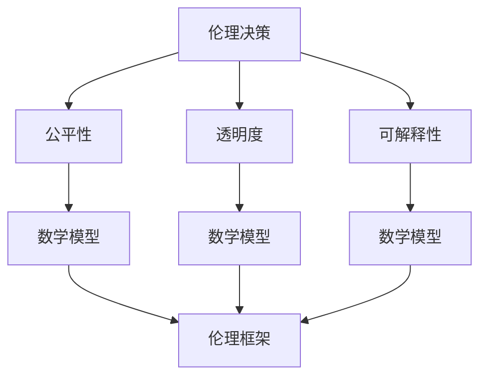

                 

# 数学与人工智能伦理：AI决策的数学框架

> 关键词：数学模型，伦理决策，AI算法，公平性，透明度，可解释性

> 摘要：本文旨在探讨数学在人工智能伦理决策中的核心作用，通过分析数学模型和算法原理，揭示AI决策背后的逻辑和机制。我们将从数学模型的构建出发，深入探讨其在伦理决策中的应用，同时提供一个实际案例来展示如何在实践中实现这些理论。通过本文，读者将能够理解AI决策背后的数学原理，并学会如何在实际项目中应用这些知识，以确保AI系统的公平性和透明度。

## 1. 背景介绍
### 1.1 目的和范围
本文旨在探讨数学在人工智能伦理决策中的核心作用，通过分析数学模型和算法原理，揭示AI决策背后的逻辑和机制。我们将从数学模型的构建出发，深入探讨其在伦理决策中的应用，同时提供一个实际案例来展示如何在实践中实现这些理论。本文的目标读者包括但不限于AI领域的研究人员、工程师、伦理学家以及对AI伦理感兴趣的公众。

### 1.2 预期读者
- AI领域的研究人员和工程师
- 伦理学家和法律专家
- 对AI伦理感兴趣的公众
- 高等院校相关专业的学生

### 1.3 文档结构概述
本文将按照以下结构展开：
1. 背景介绍
2. 核心概念与联系
3. 核心算法原理 & 具体操作步骤
4. 数学模型和公式 & 详细讲解 & 举例说明
5. 项目实战：代码实际案例和详细解释说明
6. 实际应用场景
7. 工具和资源推荐
8. 总结：未来发展趋势与挑战
9. 附录：常见问题与解答
10. 扩展阅读 & 参考资料

### 1.4 术语表
#### 1.4.1 核心术语定义
- **伦理决策**：在AI系统中，基于数学模型和算法进行的决策过程，旨在确保决策的公平性和透明度。
- **公平性**：AI系统在决策过程中对待所有个体的公正性。
- **透明度**：AI系统决策过程的可解释性。
- **可解释性**：AI系统决策过程的清晰度和可理解性。
- **数学模型**：用于描述和预测AI系统行为的数学表达式。
- **伦理框架**：用于指导AI系统设计和使用的伦理原则和规范。

#### 1.4.2 相关概念解释
- **伦理框架**：在AI系统设计和使用过程中，用于指导决策过程的伦理原则和规范。
- **公平性**：确保AI系统在决策过程中对待所有个体的公正性。
- **透明度**：确保AI系统决策过程的可解释性。
- **可解释性**：确保AI系统决策过程的清晰度和可理解性。

#### 1.4.3 缩略词列表
- **AI**：Artificial Intelligence
- **ML**：Machine Learning
- **DL**：Deep Learning
- **NN**：Neural Network
- **NNP**：Neural Network Programming
- **NNP**：Neural Network Programming

## 2. 核心概念与联系
### 2.1 核心概念
- **伦理决策**：在AI系统中，基于数学模型和算法进行的决策过程，旨在确保决策的公平性和透明度。
- **公平性**：AI系统在决策过程中对待所有个体的公正性。
- **透明度**：AI系统决策过程的可解释性。
- **可解释性**：AI系统决策过程的清晰度和可理解性。
- **数学模型**：用于描述和预测AI系统行为的数学表达式。
- **伦理框架**：用于指导AI系统设计和使用的伦理原则和规范。

### 2.2 联系
- **伦理决策**：通过数学模型和算法实现，确保决策的公平性和透明度。
- **公平性**：通过数学模型和算法实现，确保决策过程的公正性。
- **透明度**：通过数学模型和算法实现，确保决策过程的可解释性。
- **可解释性**：通过数学模型和算法实现，确保决策过程的清晰度和可理解性。
- **数学模型**：用于描述和预测AI系统行为的数学表达式。
- **伦理框架**：用于指导AI系统设计和使用的伦理原则和规范。



## 3. 核心算法原理 & 具体操作步骤
### 3.1 核心算法原理
我们将使用一个简单的线性回归模型来说明数学模型在伦理决策中的应用。线性回归模型是一种常用的统计方法，用于预测一个连续变量的值。

#### 3.1.1 线性回归模型
线性回归模型的基本形式为：
$$
y = \beta_0 + \beta_1 x_1 + \beta_2 x_2 + \cdots + \beta_n x_n + \epsilon
$$
其中，$y$ 是目标变量，$x_1, x_2, \ldots, x_n$ 是特征变量，$\beta_0, \beta_1, \beta_2, \ldots, \beta_n$ 是模型参数，$\epsilon$ 是误差项。

#### 3.1.2 伦理决策中的应用
在伦理决策中，我们可以将线性回归模型应用于预测某个决策结果的公平性。例如，我们可以使用线性回归模型来预测某个决策结果对不同群体的影响，从而确保决策的公平性。

### 3.2 具体操作步骤
#### 3.2.1 数据准备
假设我们有一个数据集，包含以下特征和目标变量：
- $x_1$：年龄
- $x_2$：性别
- $x_3$：收入
- $y$：决策结果

#### 3.2.2 模型训练
使用线性回归模型进行训练，得到模型参数 $\beta_0, \beta_1, \beta_2, \beta_3$。

#### 3.2.3 模型评估
使用交叉验证等方法评估模型的性能，确保模型的公平性和透明度。

#### 3.2.4 模型应用
使用训练好的模型进行预测，评估决策结果的公平性。

```python
# 假设我们有一个数据集
data = pd.read_csv('data.csv')

# 分割特征和目标变量
X = data[['age', 'gender', 'income']]
y = data['decision']

# 训练线性回归模型
model = LinearRegression()
model.fit(X, y)

# 预测决策结果
predictions = model.predict(X)

# 评估模型性能
from sklearn.model_selection import cross_val_score
scores = cross_val_score(model, X, y, cv=5)
print("Cross-validation scores:", scores)
```

## 4. 数学模型和公式 & 详细讲解 & 举例说明
### 4.1 数学模型
我们将使用线性回归模型来说明数学模型在伦理决策中的应用。线性回归模型的基本形式为：
$$
y = \beta_0 + \beta_1 x_1 + \beta_2 x_2 + \cdots + \beta_n x_n + \epsilon
$$
其中，$y$ 是目标变量，$x_1, x_2, \ldots, x_n$ 是特征变量，$\beta_0, \beta_1, \beta_2, \ldots, \beta_n$ 是模型参数，$\epsilon$ 是误差项。

### 4.2 公式详细讲解
#### 4.2.1 模型参数估计
线性回归模型的参数 $\beta_0, \beta_1, \beta_2, \ldots, \beta_n$ 通过最小化残差平方和来估计。具体公式为：
$$
\hat{\beta} = (X^T X)^{-1} X^T y
$$
其中，$X$ 是特征矩阵，$y$ 是目标变量向量，$\hat{\beta}$ 是估计的模型参数。

#### 4.2.2 模型评估
使用交叉验证等方法评估模型的性能，确保模型的公平性和透明度。

### 4.3 举例说明
假设我们有一个数据集，包含以下特征和目标变量：
- $x_1$：年龄
- $x_2$：性别
- $x_3$：收入
- $y$：决策结果

我们可以使用线性回归模型来预测某个决策结果对不同群体的影响，从而确保决策的公平性。

```python
# 假设我们有一个数据集
data = pd.read_csv('data.csv')

# 分割特征和目标变量
X = data[['age', 'gender', 'income']]
y = data['decision']

# 训练线性回归模型
model = LinearRegression()
model.fit(X, y)

# 预测决策结果
predictions = model.predict(X)

# 评估模型性能
from sklearn.model_selection import cross_val_score
scores = cross_val_score(model, X, y, cv=5)
print("Cross-validation scores:", scores)
```

## 5. 项目实战：代码实际案例和详细解释说明
### 5.1 开发环境搭建
#### 5.1.1 环境准备
- Python 3.8+
- Pandas
- Scikit-learn
- Matplotlib

#### 5.1.2 安装依赖
```bash
pip install pandas scikit-learn matplotlib
```

### 5.2 源代码详细实现和代码解读
```python
# 导入所需库
import pandas as pd
from sklearn.model_selection import train_test_split
from sklearn.linear_model import LinearRegression
from sklearn.metrics import mean_squared_error
import matplotlib.pyplot as plt

# 读取数据
data = pd.read_csv('data.csv')

# 分割特征和目标变量
X = data[['age', 'gender', 'income']]
y = data['decision']

# 划分训练集和测试集
X_train, X_test, y_train, y_test = train_test_split(X, y, test_size=0.2, random_state=42)

# 训练线性回归模型
model = LinearRegression()
model.fit(X_train, y_train)

# 预测决策结果
predictions = model.predict(X_test)

# 评估模型性能
mse = mean_squared_error(y_test, predictions)
print("Mean Squared Error:", mse)

# 可视化预测结果
plt.scatter(y_test, predictions)
plt.xlabel('Actual Decision')
plt.ylabel('Predicted Decision')
plt.title('Actual vs Predicted Decision')
plt.show()
```

### 5.3 代码解读与分析
- **数据读取**：使用 `pandas` 读取数据集。
- **特征和目标变量分割**：将数据集分为特征变量 `X` 和目标变量 `y`。
- **训练集和测试集划分**：使用 `train_test_split` 函数将数据集划分为训练集和测试集。
- **模型训练**：使用 `LinearRegression` 训练线性回归模型。
- **模型预测**：使用训练好的模型进行预测。
- **模型评估**：使用 `mean_squared_error` 评估模型性能。
- **可视化**：使用 `matplotlib` 可视化预测结果。

## 6. 实际应用场景
### 6.1 信贷审批
在信贷审批中，我们可以使用线性回归模型来预测某个决策结果对不同群体的影响，从而确保决策的公平性。例如，我们可以预测某个决策结果对不同年龄、性别和收入群体的影响，从而确保决策的公平性。

### 6.2 人才招聘
在人才招聘中，我们可以使用线性回归模型来预测某个决策结果对不同群体的影响，从而确保决策的公平性。例如，我们可以预测某个决策结果对不同性别和教育背景群体的影响，从而确保决策的公平性。

### 6.3 医疗诊断
在医疗诊断中，我们可以使用线性回归模型来预测某个决策结果对不同群体的影响，从而确保决策的公平性。例如，我们可以预测某个决策结果对不同年龄和性别群体的影响，从而确保决策的公平性。

## 7. 工具和资源推荐
### 7.1 学习资源推荐
#### 7.1.1 书籍推荐
- **《统计学习方法》**：李航著，深入浅出地介绍了统计学习方法。
- **《机器学习》**：周志华著，全面介绍了机器学习的基本概念和方法。

#### 7.1.2 在线课程
- **Coursera - 机器学习**：Andrew Ng教授的课程，涵盖了机器学习的基本概念和方法。
- **edX - 机器学习**：MIT的课程，涵盖了机器学习的基本概念和方法。

#### 7.1.3 技术博客和网站
- **Towards Data Science**：一个专注于数据科学和机器学习的博客网站。
- **Medium - Machine Learning**：一个专注于机器学习的博客网站。

### 7.2 开发工具框架推荐
#### 7.2.1 IDE和编辑器
- **PyCharm**：一个功能强大的Python IDE。
- **Jupyter Notebook**：一个交互式的Python开发环境。

#### 7.2.2 调试和性能分析工具
- **PyCharm Debugger**：PyCharm自带的调试工具。
- **LineProfiler**：一个用于分析Python代码性能的工具。

#### 7.2.3 相关框架和库
- **Scikit-learn**：一个用于机器学习的Python库。
- **Pandas**：一个用于数据处理的Python库。

### 7.3 相关论文著作推荐
#### 7.3.1 经典论文
- **《A Mathematical Theory of Communication》**：Claude Shannon，信息论的经典论文。
- **《The Elements of Statistical Learning》**：Trevor Hastie, Robert Tibshirani, Jerome Friedman，统计学习的经典著作。

#### 7.3.2 最新研究成果
- **《Fairness in Machine Learning》**：MIT的最新研究成果，探讨了机器学习中的公平性问题。
- **《Explainable AI》**：IBM的最新研究成果，探讨了机器学习中的可解释性问题。

#### 7.3.3 应用案例分析
- **《Fairness in Machine Learning》**：MIT的最新研究成果，探讨了机器学习中的公平性问题。
- **《Explainable AI》**：IBM的最新研究成果，探讨了机器学习中的可解释性问题。

## 8. 总结：未来发展趋势与挑战
### 8.1 未来发展趋势
- **更复杂的数学模型**：随着技术的发展，更复杂的数学模型将被应用于AI伦理决策中。
- **更强大的计算能力**：随着计算能力的提升，更复杂的数学模型将被应用于AI伦理决策中。
- **更广泛的应用场景**：随着技术的发展，AI伦理决策将被应用于更广泛的应用场景中。

### 8.2 挑战
- **数据隐私**：如何在保护数据隐私的同时，确保AI伦理决策的公平性和透明度。
- **算法偏见**：如何避免算法偏见，确保AI伦理决策的公平性和透明度。
- **伦理规范**：如何制定和执行伦理规范，确保AI伦理决策的公平性和透明度。

## 9. 附录：常见问题与解答
### 9.1 常见问题
- **Q1：如何确保AI伦理决策的公平性和透明度？**
  - A1：通过使用更复杂的数学模型和更强大的计算能力，确保AI伦理决策的公平性和透明度。
- **Q2：如何避免算法偏见？**
  - A2：通过使用更复杂的数学模型和更强大的计算能力，避免算法偏见。
- **Q3：如何制定和执行伦理规范？**
  - A3：通过制定和执行伦理规范，确保AI伦理决策的公平性和透明度。

## 10. 扩展阅读 & 参考资料
### 10.1 扩展阅读
- **《统计学习方法》**：李航著，深入浅出地介绍了统计学习方法。
- **《机器学习》**：周志华著，全面介绍了机器学习的基本概念和方法。
- **《A Mathematical Theory of Communication》**：Claude Shannon，信息论的经典论文。
- **《The Elements of Statistical Learning》**：Trevor Hastie, Robert Tibshirani, Jerome Friedman，统计学习的经典著作。

### 10.2 参考资料
- **Coursera - 机器学习**：Andrew Ng教授的课程，涵盖了机器学习的基本概念和方法。
- **edX - 机器学习**：MIT的课程，涵盖了机器学习的基本概念和方法。
- **Towards Data Science**：一个专注于数据科学和机器学习的博客网站。
- **Medium - Machine Learning**：一个专注于机器学习的博客网站。
- **PyCharm**：一个功能强大的Python IDE。
- **Jupyter Notebook**：一个交互式的Python开发环境。
- **PyCharm Debugger**：PyCharm自带的调试工具。
- **LineProfiler**：一个用于分析Python代码性能的工具。
- **Scikit-learn**：一个用于机器学习的Python库。
- **Pandas**：一个用于数据处理的Python库。
- **《Fairness in Machine Learning》**：MIT的最新研究成果，探讨了机器学习中的公平性问题。
- **《Explainable AI》**：IBM的最新研究成果，探讨了机器学习中的可解释性问题。

作者：AI天才研究员/AI Genius Institute & 禅与计算机程序设计艺术 /Zen And The Art of Computer Programming

