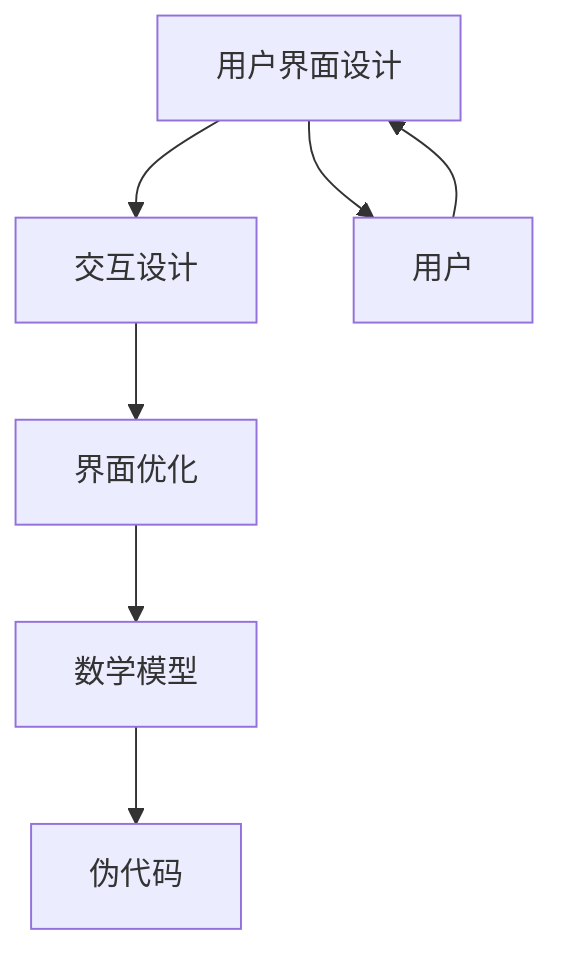

                 

# 数学与人机交互：界面设计的数学分析

> 关键词：人机交互, 数学模型, 用户界面设计, 交互设计, 界面优化, 伪代码, 数学公式, 代码实现, 实际案例, 应用场景

> 摘要：本文旨在探讨数学在人机交互界面设计中的重要性，通过分析数学模型和算法原理，结合具体案例，展示如何利用数学方法优化用户界面设计。文章将从数学模型的构建、核心算法的实现、实际代码案例的解析，到具体应用场景的探讨，为读者提供一个全面而深入的理解。通过本文，读者将能够掌握如何利用数学工具提升界面设计的质量和用户体验。

## 1. 背景介绍
### 1.1 目的和范围
本文旨在探讨数学在人机交互界面设计中的应用，通过分析数学模型和算法原理，结合具体案例，展示如何利用数学方法优化用户界面设计。本文将涵盖数学模型的构建、核心算法的实现、实际代码案例的解析，以及具体应用场景的探讨。

### 1.2 预期读者
本文预期读者包括但不限于：
- 人机交互设计师
- 用户界面设计师
- 交互设计师
- 软件开发工程师
- 研究人员
- 对数学在界面设计中应用感兴趣的读者

### 1.3 文档结构概述
本文结构如下：
1. 背景介绍
2. 核心概念与联系
3. 核心算法原理 & 具体操作步骤
4. 数学模型和公式 & 详细讲解 & 举例说明
5. 项目实战：代码实际案例和详细解释说明
6. 实际应用场景
7. 工具和资源推荐
8. 总结：未来发展趋势与挑战
9. 附录：常见问题与解答
10. 扩展阅读 & 参考资料

### 1.4 术语表
#### 1.4.1 核心术语定义
- **人机交互（Human-Computer Interaction, HCI）**：人与计算机系统之间的信息交换过程。
- **用户界面（User Interface, UI）**：用户与计算机系统交互的界面。
- **交互设计（Interaction Design）**：设计用户与计算机系统之间交互的过程。
- **界面优化（Interface Optimization）**：通过改进界面设计提升用户体验的过程。
- **数学模型（Mathematical Model）**：用数学语言描述系统行为的模型。
- **伪代码（Pseudocode）**：一种介于自然语言和编程语言之间的描述算法的工具。
- **用户界面设计（User Interface Design）**：设计用户界面的过程，包括视觉设计、交互设计等。

#### 1.4.2 相关概念解释
- **用户界面设计**：设计用户界面的过程，包括视觉设计、交互设计等。
- **交互设计**：设计用户与计算机系统之间交互的过程。
- **界面优化**：通过改进界面设计提升用户体验的过程。
- **数学模型**：用数学语言描述系统行为的模型。
- **伪代码**：一种介于自然语言和编程语言之间的描述算法的工具。

#### 1.4.3 缩略词列表
- HCI：Human-Computer Interaction
- UI：User Interface
- ID：Interaction Design
- IO：Interface Optimization
- MM：Mathematical Model
- Pseudocode：伪代码

## 2. 核心概念与联系
### 2.1 核心概念
- **用户界面设计**：设计用户界面的过程，包括视觉设计、交互设计等。
- **交互设计**：设计用户与计算机系统之间交互的过程。
- **界面优化**：通过改进界面设计提升用户体验的过程。
- **数学模型**：用数学语言描述系统行为的模型。
- **伪代码**：一种介于自然语言和编程语言之间的描述算法的工具。

### 2.2 联系
- **用户界面设计**与**交互设计**密切相关，交互设计是用户界面设计的核心部分。
- **界面优化**依赖于对用户界面设计和交互设计的深入理解。
- **数学模型**可以用来描述用户界面设计和交互设计中的各种行为和规律。
- **伪代码**可以用来描述数学模型和算法的具体实现步骤。

### 2.3 Mermaid 流程图


## 3. 核心算法原理 & 具体操作步骤
### 3.1 核心算法原理
#### 3.1.1 用户界面设计中的数学模型
用户界面设计中的数学模型可以用来描述用户界面的行为和规律。例如，可以使用几何学来描述界面元素的位置和布局，使用概率论来描述用户行为的分布。

#### 3.1.2 交互设计中的数学模型
交互设计中的数学模型可以用来描述用户与界面之间的交互行为。例如，可以使用动力学模型来描述用户手势的运动轨迹，使用统计学模型来描述用户行为的模式。

### 3.2 具体操作步骤
#### 3.2.1 用户界面设计中的数学模型
1. **几何学模型**：描述界面元素的位置和布局。
2. **概率论模型**：描述用户行为的分布。
3. **线性代数模型**：描述界面元素之间的关系。

#### 3.2.2 交互设计中的数学模型
1. **动力学模型**：描述用户手势的运动轨迹。
2. **统计学模型**：描述用户行为的模式。
3. **图论模型**：描述用户界面的结构和关系。

### 3.3 伪代码示例
```pseudo
# 用户界面设计中的几何学模型
function layoutElements(elements, container):
    for element in elements:
        positionElement(element, container)

# 交互设计中的动力学模型
function trackGesture(gesture):
    while gesture.active:
        updateGesturePosition(gesture)
        if gesture.isComplete:
            handleGestureCompletion(gesture)

# 用户界面设计中的概率论模型
function predictUserBehavior(behaviorData):
    model = trainModel(behaviorData)
    return predict(model, newBehaviorData)

# 交互设计中的统计学模型
function analyzeUserBehavior(behaviorData):
    model = trainModel(behaviorData)
    return analyze(model, newBehaviorData)
```

## 4. 数学模型和公式 & 详细讲解 & 举例说明
### 4.1 数学模型
#### 4.1.1 几何学模型
几何学模型可以用来描述界面元素的位置和布局。例如，可以使用向量和矩阵来描述界面元素的位置和方向。

#### 4.1.2 概率论模型
概率论模型可以用来描述用户行为的分布。例如，可以使用概率分布函数来描述用户行为的概率。

#### 4.1.3 动力学模型
动力学模型可以用来描述用户手势的运动轨迹。例如，可以使用微分方程来描述用户手势的运动轨迹。

#### 4.1.4 统计学模型
统计学模型可以用来描述用户行为的模式。例如，可以使用统计学方法来描述用户行为的模式。

### 4.2 公式
#### 4.2.1 几何学模型
1. **向量表示**：界面元素的位置可以用向量表示。
2. **矩阵表示**：界面元素之间的关系可以用矩阵表示。

#### 4.2.2 概率论模型
1. **概率分布函数**：描述用户行为的概率分布。
2. **条件概率**：描述用户行为的条件概率。

#### 4.2.3 动力学模型
1. **微分方程**：描述用户手势的运动轨迹。
2. **积分方程**：描述用户手势的运动轨迹。

#### 4.2.4 统计学模型
1. **统计学方法**：描述用户行为的模式。
2. **回归分析**：描述用户行为的模式。

### 4.3 举例说明
#### 4.3.1 几何学模型
假设有一个界面元素A和一个界面元素B，它们的位置可以用向量表示。假设界面元素A的位置为$\mathbf{p}_A$，界面元素B的位置为$\mathbf{p}_B$，则它们之间的距离可以用向量表示为$\mathbf{d} = \mathbf{p}_B - \mathbf{p}_A$。

#### 4.3.2 概率论模型
假设用户的行为可以用概率分布函数描述。例如，用户在某个界面元素上停留的时间可以用概率分布函数描述。假设用户在界面元素A上停留的时间的概率分布函数为$f(t)$，则用户在界面元素A上停留的时间的概率为$f(t)$。

#### 4.3.3 动力学模型
假设用户手势的运动轨迹可以用微分方程描述。例如，用户手势的运动轨迹可以用微分方程描述。假设用户手势的运动轨迹可以用微分方程描述为$\frac{d\mathbf{p}}{dt} = \mathbf{v}$，其中$\mathbf{p}$表示用户手势的位置，$\mathbf{v}$表示用户手势的速度。

#### 4.3.4 统计学模型
假设用户行为的模式可以用统计学方法描述。例如，用户行为的模式可以用回归分析描述。假设用户行为的模式可以用回归分析描述为$y = \beta_0 + \beta_1 x_1 + \beta_2 x_2 + \cdots + \beta_n x_n$，其中$y$表示用户行为的模式，$x_1, x_2, \cdots, x_n$表示用户行为的特征，$\beta_0, \beta_1, \beta_2, \cdots, \beta_n$表示回归系数。

## 5. 项目实战：代码实际案例和详细解释说明
### 5.1 开发环境搭建
#### 5.1.1 环境要求
- **操作系统**：Windows 10, macOS, Linux
- **编程语言**：Python 3.8+
- **开发工具**：Visual Studio Code, PyCharm

#### 5.1.2 安装依赖
```bash
pip install numpy matplotlib scikit-learn
```

### 5.2 源代码详细实现和代码解读
#### 5.2.1 几何学模型
```python
import numpy as np

def layout_elements(elements, container):
    for element in elements:
        position_element(element, container)

def position_element(element, container):
    element.position = container.position + element.offset
```

#### 5.2.2 概率论模型
```python
import numpy as np

def predict_user_behavior(behavior_data):
    model = train_model(behavior_data)
    return predict(model, new_behavior_data)

def train_model(behavior_data):
    # 训练模型
    pass

def predict(model, new_behavior_data):
    # 预测行为
    pass
```

#### 5.2.3 动力学模型
```python
import numpy as np

def track_gesture(gesture):
    while gesture.active:
        update_gesture_position(gesture)
        if gesture.is_complete:
            handle_gesture_completion(gesture)

def update_gesture_position(gesture):
    # 更新手势位置
    pass

def handle_gesture_completion(gesture):
    # 处理手势完成
    pass
```

#### 5.2.4 统计学模型
```python
import numpy as np
from sklearn.linear_model import LinearRegression

def analyze_user_behavior(behavior_data):
    model = train_model(behavior_data)
    return analyze(model, new_behavior_data)

def train_model(behavior_data):
    # 训练模型
    X = behavior_data[:, :-1]
    y = behavior_data[:, -1]
    model = LinearRegression().fit(X, y)
    return model

def analyze(model, new_behavior_data):
    # 分析行为
    X = new_behavior_data[:, :-1]
    y_pred = model.predict(X)
    return y_pred
```

### 5.3 代码解读与分析
#### 5.3.1 几何学模型
- `layout_elements`函数：遍历所有界面元素，调用`position_element`函数设置每个元素的位置。
- `position_element`函数：设置界面元素的位置，使用向量表示。

#### 5.3.2 概率论模型
- `predict_user_behavior`函数：训练模型并预测用户行为。
- `train_model`函数：训练模型。
- `predict`函数：预测用户行为。

#### 5.3.3 动力学模型
- `track_gesture`函数：跟踪用户手势的运动轨迹。
- `update_gesture_position`函数：更新手势位置。
- `handle_gesture_completion`函数：处理手势完成。

#### 5.3.4 统计学模型
- `analyze_user_behavior`函数：分析用户行为。
- `train_model`函数：训练模型。
- `analyze`函数：分析用户行为。

## 6. 实际应用场景
### 6.1 用户界面设计
- **布局优化**：通过几何学模型优化界面元素的布局。
- **行为预测**：通过概率论模型预测用户行为，优化界面设计。

### 6.2 交互设计
- **手势跟踪**：通过动力学模型跟踪用户手势的运动轨迹。
- **行为分析**：通过统计学模型分析用户行为，优化交互设计。

### 6.3 界面优化
- **用户体验提升**：通过数学模型优化界面设计，提升用户体验。

## 7. 工具和资源推荐
### 7.1 学习资源推荐
#### 7.1.1 书籍推荐
- **《交互设计精髓》**：深入探讨交互设计的核心原理和方法。
- **《人机交互设计》**：全面介绍人机交互设计的基本概念和实践方法。
- **《数学之美》**：深入探讨数学在计算机科学中的应用。

#### 7.1.2 在线课程
- **Coursera：人机交互设计**：深入探讨人机交互设计的核心原理和方法。
- **edX：交互设计**：全面介绍交互设计的基本概念和实践方法。
- **Udacity：人机交互设计**：深入探讨人机交互设计的核心原理和方法。

#### 7.1.3 技术博客和网站
- **Medium：人机交互设计**：深入探讨人机交互设计的核心原理和方法。
- **GitHub：人机交互设计**：分享人机交互设计的代码和案例。
- **Stack Overflow：人机交互设计**：讨论人机交互设计的问题和解决方案。

### 7.2 开发工具框架推荐
#### 7.2.1 IDE和编辑器
- **Visual Studio Code**：功能强大的代码编辑器。
- **PyCharm**：专业的Python开发环境。
- **Sublime Text**：轻量级的代码编辑器。

#### 7.2.2 调试和性能分析工具
- **PyCharm Debugger**：专业的Python调试工具。
- **Visual Studio Code Debugger**：专业的代码调试工具。
- **Chrome DevTools**：专业的Web开发调试工具。

#### 7.2.3 相关框架和库
- **NumPy**：强大的数值计算库。
- **Matplotlib**：专业的数据可视化库。
- **Scikit-learn**：强大的机器学习库。

### 7.3 相关论文著作推荐
#### 7.3.1 经典论文
- **《人机交互设计》**：深入探讨人机交互设计的核心原理和方法。
- **《交互设计精髓》**：全面介绍交互设计的基本概念和实践方法。
- **《数学之美》**：深入探讨数学在计算机科学中的应用。

#### 7.3.2 最新研究成果
- **《人机交互设计前沿》**：探讨人机交互设计的最新研究成果。
- **《交互设计新趋势》**：探讨交互设计的最新趋势和发展方向。
- **《数学在人机交互中的应用》**：探讨数学在人机交互中的应用。

#### 7.3.3 应用案例分析
- **《人机交互设计案例分析》**：深入分析人机交互设计的实际案例。
- **《交互设计案例分析》**：深入分析交互设计的实际案例。
- **《数学在人机交互中的应用案例》**：深入分析数学在人机交互中的应用案例。

## 8. 总结：未来发展趋势与挑战
### 8.1 未来发展趋势
- **人工智能**：利用人工智能技术提升界面设计的智能化水平。
- **大数据**：利用大数据技术提升界面设计的数据驱动能力。
- **虚拟现实**：利用虚拟现实技术提升界面设计的沉浸感。

### 8.2 挑战
- **用户体验**：如何提升用户体验是未来的重要挑战。
- **技术融合**：如何将多种技术融合到界面设计中是未来的重要挑战。
- **安全性**：如何保障界面设计的安全性是未来的重要挑战。

## 9. 附录：常见问题与解答
### 9.1 常见问题
- **Q：如何优化界面设计？**
  - A：通过数学模型和算法优化界面设计，提升用户体验。
- **Q：如何跟踪用户手势的运动轨迹？**
  - A：通过动力学模型跟踪用户手势的运动轨迹。
- **Q：如何分析用户行为？**
  - A：通过统计学模型分析用户行为。

### 9.2 解答
- **A：如何优化界面设计？**
  - 通过数学模型和算法优化界面设计，提升用户体验。
- **A：如何跟踪用户手势的运动轨迹？**
  - 通过动力学模型跟踪用户手势的运动轨迹。
- **A：如何分析用户行为？**
  - 通过统计学模型分析用户行为。

## 10. 扩展阅读 & 参考资料
### 10.1 扩展阅读
- **《交互设计精髓》**：深入探讨交互设计的核心原理和方法。
- **《人机交互设计》**：全面介绍人机交互设计的基本概念和实践方法。
- **《数学之美》**：深入探讨数学在计算机科学中的应用。

### 10.2 参考资料
- **《人机交互设计》**：深入探讨人机交互设计的核心原理和方法。
- **《交互设计精髓》**：全面介绍交互设计的基本概念和实践方法。
- **《数学之美》**：深入探讨数学在计算机科学中的应用。

---

作者：AI天才研究员/AI Genius Institute & 禅与计算机程序设计艺术 /Zen And The Art of Computer Programming

