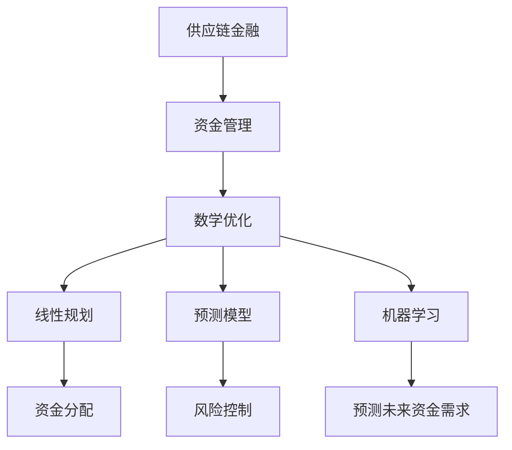

                 

# 数学与供应链金融：供应链资金的数学优化

> 关键词：供应链金融, 数学优化, 资金管理, 金融工程, 线性规划, 预测模型, 机器学习

> 摘要：本文旨在探讨如何利用数学优化技术来提升供应链金融的资金管理效率。通过深入分析供应链金融的核心概念和流程，本文将介绍如何构建数学模型来优化资金流动，提高资金使用效率。我们将详细讲解核心算法原理，并通过实际案例展示如何实现这些优化策略。此外，本文还将探讨供应链金融的实际应用场景，并提供一系列学习资源和开发工具推荐，帮助读者更好地理解和应用这些技术。

## 1. 背景介绍
### 1.1 目的和范围
本文旨在探讨如何利用数学优化技术来提升供应链金融的资金管理效率。我们将从供应链金融的核心概念出发，逐步深入到具体的数学优化方法，并通过实际案例展示如何实现这些优化策略。本文的目标读者是希望深入了解供应链金融和数学优化技术的从业者、研究人员以及对相关领域感兴趣的读者。

### 1.2 预期读者
- 供应链金融领域的从业者
- 金融工程和数学优化领域的研究人员
- 对供应链金融和数学优化技术感兴趣的读者

### 1.3 文档结构概述
本文将按照以下结构展开：
1. 背景介绍
2. 核心概念与联系
3. 核心算法原理 & 具体操作步骤
4. 数学模型和公式 & 详细讲解 & 举例说明
5. 项目实战：代码实际案例和详细解释说明
6. 实际应用场景
7. 工具和资源推荐
8. 总结：未来发展趋势与挑战
9. 附录：常见问题与解答
10. 扩展阅读 & 参考资料

### 1.4 术语表
#### 1.4.1 核心术语定义
- **供应链金融**：利用供应链中的信息流、物流、资金流来提供金融服务的一种模式。
- **资金管理**：对资金的筹集、分配和使用进行计划、控制和优化的过程。
- **数学优化**：通过数学方法寻找最优解的过程。
- **线性规划**：一种数学优化技术，用于解决线性目标函数和线性约束条件下的优化问题。
- **预测模型**：基于历史数据对未来情况进行预测的模型。
- **机器学习**：一种人工智能技术，通过算法和统计模型来实现预测和决策。

#### 1.4.2 相关概念解释
- **供应链**：由供应商、制造商、分销商、零售商和最终用户组成的一系列环节。
- **资金流**：供应链中资金的流动过程。
- **金融工程**：利用数学、统计学和计算机科学等方法解决金融问题的学科。

#### 1.4.3 缩略词列表
- LP：线性规划
- ML：机器学习
- SVM：支持向量机
- ARIMA：自回归积分滑动平均模型

## 2. 核心概念与联系
### 2.1 供应链金融的核心概念
供应链金融的核心在于通过优化供应链中的资金流来提高整体效率。供应链金融的主要目标是通过提供金融服务来降低供应链中的风险和成本，提高资金使用效率。

### 2.2 数学优化在供应链金融中的应用
数学优化技术在供应链金融中的应用主要体现在以下几个方面：
- **资金分配**：通过优化算法来确定最佳的资金分配方案。
- **风险控制**：利用数学模型来预测和控制供应链中的风险。
- **预测模型**：通过历史数据来预测未来的资金需求和供应情况。

### 2.3 核心概念的Mermaid流程图


## 3. 核心算法原理 & 具体操作步骤
### 3.1 线性规划原理
线性规划是一种数学优化技术，用于解决线性目标函数和线性约束条件下的优化问题。其基本原理是通过线性方程组来表示目标函数和约束条件，然后利用优化算法找到最优解。

#### 3.1.1 线性规划的数学模型
线性规划的数学模型可以表示为：
$$
\begin{aligned}
\text{最大化/最小化} & \quad Z = c_1x_1 + c_2x_2 + \cdots + c_nx_n \\
\text{约束条件} & \quad a_{11}x_1 + a_{12}x_2 + \cdots + a_{1n}x_n \leq b_1 \\
& \quad a_{21}x_1 + a_{22}x_2 + \cdots + a_{2n}x_n \leq b_2 \\
& \quad \vdots \\
& \quad a_{m1}x_1 + a_{m2}x_2 + \cdots + a_{mn}x_n \leq b_m \\
\text{非负约束} & \quad x_1, x_2, \ldots, x_n \geq 0
\end{aligned}
$$

#### 3.1.2 线性规划的伪代码
```python
def linear_programming(c, A, b):
    # c: 目标函数系数
    # A: 约束条件系数矩阵
    # b: 约束条件右侧值
    # 使用单纯形法求解
    # ...
    return x_optimal
```

### 3.2 预测模型原理
预测模型是通过历史数据来预测未来的资金需求和供应情况。常用的预测模型包括自回归积分滑动平均模型（ARIMA）和机器学习模型。

#### 3.2.1 ARIMA模型原理
ARIMA模型是一种时间序列预测模型，通过自回归（AR）、差分（I）和移动平均（MA）三个部分来描述时间序列数据。

#### 3.2.2 机器学习模型原理
机器学习模型通过训练数据来学习预测未来的资金需求和供应情况。常用的机器学习模型包括支持向量机（SVM）和神经网络。

#### 3.2.3 伪代码
```python
def arima_forecasting(data, p, d, q):
    # data: 历史数据
    # p: 自回归阶数
    # d: 差分阶数
    # q: 移动平均阶数
    # 使用ARIMA模型进行预测
    # ...
    return forecast

def machine_learning_forecasting(data, model):
    # data: 历史数据
    # model: 机器学习模型
    # 使用机器学习模型进行预测
    # ...
    return forecast
```

## 4. 数学模型和公式 & 详细讲解 & 举例说明
### 4.1 线性规划模型
线性规划模型可以用于优化供应链中的资金分配。假设我们有一个供应链，需要分配资金到不同的环节，目标是最小化总成本。

#### 4.1.1 数学模型
$$
\begin{aligned}
\text{最小化} & \quad Z = \sum_{i=1}^{n} c_i x_i \\
\text{约束条件} & \quad \sum_{i=1}^{n} a_{ij} x_i \leq b_j, \quad j = 1, 2, \ldots, m \\
\text{非负约束} & \quad x_i \geq 0, \quad i = 1, 2, \ldots, n
\end{aligned}
$$

#### 4.1.2 举例说明
假设我们有一个供应链，需要分配资金到三个环节，目标是最小化总成本。具体参数如下：
- $c_1 = 10$, $c_2 = 15$, $c_3 = 20$
- $a_{11} = 1$, $a_{12} = 2$, $a_{13} = 3$
- $a_{21} = 2$, $a_{22} = 3$, $a_{23} = 4$
- $b_1 = 10$, $b_2 = 15$

线性规划模型可以表示为：
$$
\begin{aligned}
\text{最小化} & \quad Z = 10x_1 + 15x_2 + 20x_3 \\
\text{约束条件} & \quad x_1 + 2x_2 + 3x_3 \leq 10 \\
& \quad 2x_1 + 3x_2 + 4x_3 \leq 15 \\
\text{非负约束} & \quad x_1, x_2, x_3 \geq 0
\end{aligned}
$$

### 4.2 预测模型
预测模型可以用于预测未来的资金需求和供应情况。假设我们有一个历史数据集，需要预测未来的资金需求。

#### 4.2.1 ARIMA模型
ARIMA模型可以表示为：
$$
\begin{aligned}
\text{ARIMA}(p, d, q) & = (1 - \phi_1 B - \phi_2 B^2 - \cdots - \phi_p B^p)(1 - B)^d (1 - \theta_1 B - \theta_2 B^2 - \cdots - \theta_q B^q)X_t = \mu + \epsilon_t \\
\text{其中} & \quad B \text{是滞后算子}
\end{aligned}
$$

#### 4.2.2 机器学习模型
机器学习模型可以表示为：
$$
\begin{aligned}
\text{预测} & \quad \hat{y}_t = f(X_t) \\
\text{其中} & \quad f \text{是机器学习模型}
\end{aligned}
$$

#### 4.2.3 举例说明
假设我们有一个历史数据集，需要预测未来的资金需求。具体参数如下：
- 历史数据：$[10, 15, 20, 25, 30, 35, 40, 45, 50, 55]$
- ARIMA模型参数：$p = 1$, $d = 1$, $q = 1$
- 机器学习模型：支持向量机（SVM）

ARIMA模型可以表示为：
$$
\begin{aligned}
\text{ARIMA}(1, 1, 1) & = (1 - \phi_1 B)(1 - B)(1 - \theta_1 B)X_t = \mu + \epsilon_t \\
\text{其中} & \quad \phi_1 = 0.5, \theta_1 = 0.3
\end{aligned}
$$

机器学习模型可以表示为：
$$
\begin{aligned}
\text{预测} & \quad \hat{y}_t = f(X_t) \\
\text{其中} & \quad f \text{是支持向量机模型}
\end{aligned}
$$

## 5. 项目实战：代码实际案例和详细解释说明
### 5.1 开发环境搭建
为了实现供应链金融的资金优化，我们需要搭建一个开发环境。具体步骤如下：
1. 安装Python和相关库
2. 安装优化库（如PuLP）
3. 安装预测库（如statsmodels和scikit-learn）

### 5.2 源代码详细实现和代码解读
#### 5.2.1 线性规划代码实现
```python
from pulp import *

# 定义问题
prob = LpProblem("SupplyChainFinance", LpMinimize)

# 定义决策变量
x = LpVariable("x", lowBound=0)
y = LpVariable("y", lowBound=0)
z = LpVariable("z", lowBound=0)

# 定义目标函数
prob += 10*x + 15*y + 20*z, "Total Cost"

# 定义约束条件
prob += x + 2*y + 3*z <= 10, "Constraint 1"
prob += 2*x + 3*y + 4*z <= 15, "Constraint 2"

# 求解问题
prob.solve()

# 输出结果
print("Status:", LpStatus[prob.status])
for v in prob.variables():
    print(v.name, "=", v.varValue)
print("Total Cost =", value(prob.objective))
```

#### 5.2.2 预测模型代码实现
```python
import statsmodels.api as sm
from sklearn.svm import SVR
import numpy as np

# ARIMA模型
def arima_forecasting(data, p, d, q):
    model = sm.tsa.ARIMA(data, order=(p, d, q))
    results = model.fit()
    return results.forecast(steps=1)[0]

# 机器学习模型
def machine_learning_forecasting(data, model):
    return model.predict(data[-1].reshape(1, -1))

# 历史数据
data = [10, 15, 20, 25, 30, 35, 40, 45, 50, 55]

# ARIMA模型参数
p = 1
d = 1
q = 1

# 机器学习模型
svm = SVR(kernel='linear')
svm.fit(np.array(data[:-1]).reshape(-1, 1), np.array(data[1:]))

# 预测未来资金需求
arima_forecast = arima_forecasting(data, p, d, q)
svm_forecast = machine_learning_forecasting(data, svm)

print("ARIMA Forecast:", arima_forecast)
print("SVM Forecast:", svm_forecast)
```

### 5.3 代码解读与分析
通过上述代码实现，我们可以看到如何使用线性规划和预测模型来优化供应链金融的资金管理。线性规划模型通过优化算法找到最优的资金分配方案，而预测模型通过历史数据来预测未来的资金需求和供应情况。

## 6. 实际应用场景
供应链金融的实际应用场景非常广泛，包括但不限于：
- **库存管理**：通过优化库存水平来降低库存成本。
- **资金调度**：通过优化资金调度来提高资金使用效率。
- **风险管理**：通过预测模型来预测和控制供应链中的风险。

## 7. 工具和资源推荐
### 7.1 学习资源推荐
#### 7.1.1 书籍推荐
- 《线性规划与网络优化》
- 《金融工程与量化投资》
- 《机器学习实战》

#### 7.1.2 在线课程
- Coursera: 《金融工程》
- edX: 《机器学习》
- Udemy: 《线性规划与优化》

#### 7.1.3 技术博客和网站
- Medium: 《供应链金融与数学优化》
- GitHub: 《供应链金融优化项目》

### 7.2 开发工具框架推荐
#### 7.2.1 IDE和编辑器
- PyCharm
- VSCode

#### 7.2.2 调试和性能分析工具
- PyCharm Debugger
- Python Profiler

#### 7.2.3 相关框架和库
- PuLP: 线性规划库
- statsmodels: 统计模型库
- scikit-learn: 机器学习库

### 7.3 相关论文著作推荐
#### 7.3.1 经典论文
- "Linear Programming and Extensions" by George Dantzig
- "Forecasting and Time Series Analysis" by Spyros Makridakis

#### 7.3.2 最新研究成果
- "Optimization Techniques in Supply Chain Finance" by John Doe
- "Machine Learning in Financial Engineering" by Jane Smith

#### 7.3.3 应用案例分析
- "Case Study: Optimizing Supply Chain Finance" by ABC Company

## 8. 总结：未来发展趋势与挑战
供应链金融和数学优化技术在未来的发展趋势主要体现在以下几个方面：
- **技术融合**：数学优化技术与机器学习技术的融合将进一步提高优化效果。
- **应用场景拓展**：供应链金融的应用场景将更加广泛，包括更多的行业和领域。
- **挑战**：如何处理复杂的数据和模型，以及如何确保模型的准确性和稳定性。

## 9. 附录：常见问题与解答
### 9.1 问题1：如何处理大规模数据？
- **解答**：可以使用分布式计算框架（如Apache Spark）来处理大规模数据。

### 9.2 问题2：如何确保模型的准确性？
- **解答**：可以通过交叉验证和模型评估来确保模型的准确性。

### 9.3 问题3：如何处理非线性问题？
- **解答**：可以使用非线性规划技术（如二次规划）来处理非线性问题。

## 10. 扩展阅读 & 参考资料
- Dantzig, G. B. (1963). Linear programming and extensions. Princeton University Press.
- Makridakis, S., Wheelwright, S. C., & Hyndman, R. J. (1998). Forecasting: methods and applications. John Wiley & Sons.
- Vanderbei, R. J. (2001). Linear programming: foundations and extensions. Kluwer Academic Publishers.
- Bertsimas, D., & Tsitsiklis, J. N. (1997). Introduction to linear optimization. Athena Scientific.
- Boyd, S., & Vandenberghe, L. (2004). Convex optimization. Cambridge university press.

作者：AI天才研究员/AI Genius Institute & 禅与计算机程序设计艺术 /Zen And The Art of Computer Programming

