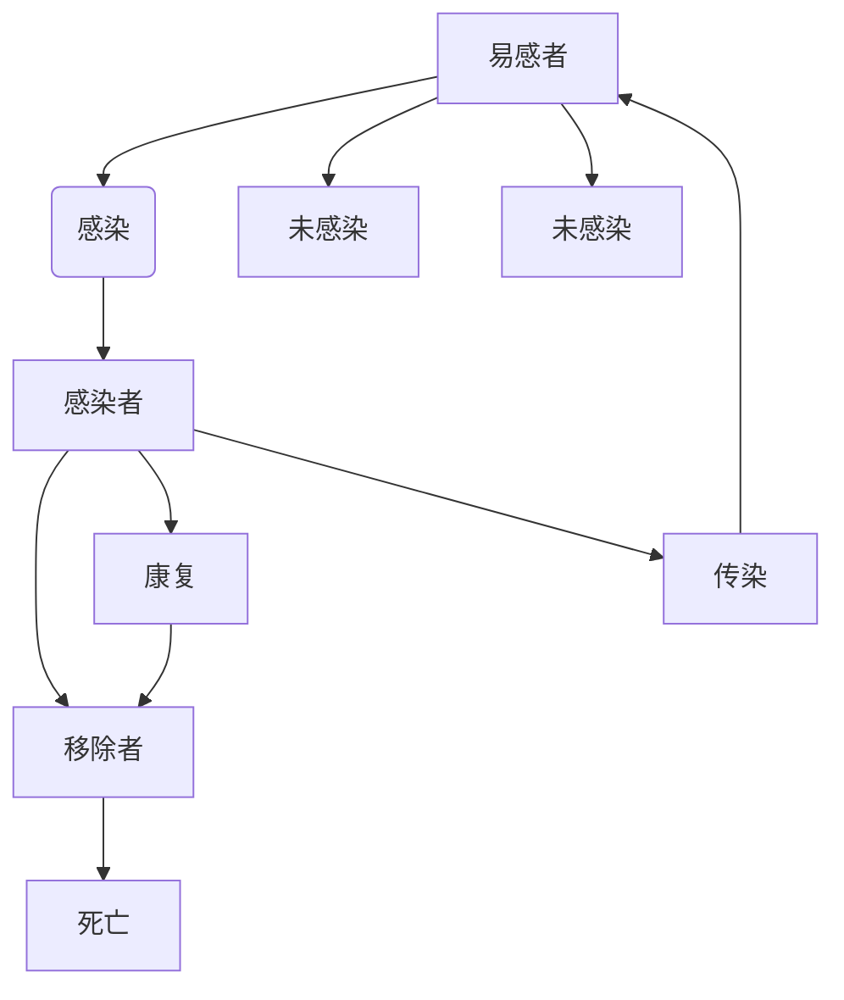

                 

# 数学与公共卫生：疾病预防的数学策略

> 关键词：公共卫生、疾病预防、数学模型、流行病学、传染病动力学、SIR模型、SEIR模型、参数估计、预测与控制

> 摘要：本文旨在探讨数学在公共卫生领域的应用，特别是疾病预防中的重要性。通过分析传染病动力学模型，如SIR模型和SEIR模型，我们能够理解疾病的传播机制，并利用这些模型进行参数估计和预测，从而为公共卫生政策提供科学依据。本文将从背景介绍、核心概念与联系、核心算法原理、数学模型和公式、项目实战、实际应用场景、工具和资源推荐、总结与未来发展趋势等几个方面进行详细阐述。

## 1. 背景介绍
### 1.1 目的和范围
本文旨在探讨数学在公共卫生领域的应用，特别是疾病预防中的重要性。通过分析传染病动力学模型，如SIR模型和SEIR模型，我们能够理解疾病的传播机制，并利用这些模型进行参数估计和预测，从而为公共卫生政策提供科学依据。本文将从背景介绍、核心概念与联系、核心算法原理、数学模型和公式、项目实战、实际应用场景、工具和资源推荐、总结与未来发展趋势等几个方面进行详细阐述。

### 1.2 预期读者
本文预期读者包括公共卫生领域的专业人士、数据科学家、计算机科学家、流行病学家以及对公共卫生和疾病预防感兴趣的读者。读者应具备一定的数学基础和编程能力，以便更好地理解和应用本文中的内容。

### 1.3 文档结构概述
本文结构如下：
1. 背景介绍
2. 核心概念与联系
3. 核心算法原理 & 具体操作步骤
4. 数学模型和公式 & 详细讲解 & 举例说明
5. 项目实战：代码实际案例和详细解释说明
6. 实际应用场景
7. 工具和资源推荐
8. 总结：未来发展趋势与挑战
9. 附录：常见问题与解答
10. 扩展阅读 & 参考资料

### 1.4 术语表
#### 1.4.1 核心术语定义
- **SIR模型**：一个简单的传染病动力学模型，分为易感者（Susceptible）、感染者（Infected）和移除者（Removed）三类人群。
- **SEIR模型**：扩展的SIR模型，增加了潜伏期（Exposed）阶段。
- **参数估计**：通过历史数据估计模型中的参数。
- **预测与控制**：利用模型预测未来趋势，并提出控制措施。

#### 1.4.2 相关概念解释
- **易感者（Susceptible）**：未感染但可能被感染的人群。
- **感染者（Infected）**：已经感染并具有传染性的人群。
- **移除者（Removed）**：已经康复或死亡的人群。
- **潜伏期（Exposed）**：从感染到成为传染源的时间段。

#### 1.4.3 缩略词列表
- SIR：Susceptible-Infected-Removed
- SEIR：Susceptible-Exposed-Infected-Removed

## 2. 核心概念与联系
### 流行病学模型流程图


## 3. 核心算法原理 & 具体操作步骤
### 伪代码
```python
# SIR模型
def sir_model(S, I, R, beta, gamma, days):
    S_list, I_list, R_list = [S], [I], [R]
    for day in range(days):
        dSdt = -beta * S * I
        dIdt = beta * S * I - gamma * I
        dRdt = gamma * I
        S = S + dSdt
        I = I + dIdt
        R = R + dRdt
        S_list.append(S)
        I_list.append(I)
        R_list.append(R)
    return S_list, I_list, R_list

# SEIR模型
def seir_model(S, E, I, R, beta, gamma, sigma, days):
    S_list, E_list, I_list, R_list = [S], [E], [I], [R]
    for day in range(days):
        dSdt = -beta * S * I
        dEdt = beta * S * I - sigma * E
        dIdt = sigma * E - gamma * I
        dRdt = gamma * I
        S = S + dSdt
        E = E + dEdt
        I = I + dIdt
        R = R + dRdt
        S_list.append(S)
        E_list.append(E)
        I_list.append(I)
        R_list.append(R)
    return S_list, E_list, I_list, R_list
```

## 4. 数学模型和公式 & 详细讲解 & 举例说明
### SIR模型
#### 公式
$$
\frac{dS}{dt} = -\beta \cdot S \cdot I
$$
$$
\frac{dI}{dt} = \beta \cdot S \cdot I - \gamma \cdot I
$$
$$
\frac{dR}{dt} = \gamma \cdot I
$$

#### 详细讲解
SIR模型假设人口分为三类：易感者（S）、感染者（I）和移除者（R）。模型通过微分方程描述了这三类人群随时间的变化。参数$\beta$表示感染率，$\gamma$表示康复率。

### SEIR模型
#### 公式
$$
\frac{dS}{dt} = -\beta \cdot S \cdot I
$$
$$
\frac{dE}{dt} = \beta \cdot S \cdot I - \sigma \cdot E
$$
$$
\frac{dI}{dt} = \sigma \cdot E - \gamma \cdot I
$$
$$
\frac{dR}{dt} = \gamma \cdot I
$$

#### 详细讲解
SEIR模型在SIR模型的基础上增加了潜伏期（E）阶段。参数$\sigma$表示从潜伏期到感染期的转换率。

### 举例说明
假设某地区有1000人，初始时有10人感染，其余均为易感者。感染率$\beta = 0.3$，康复率$\gamma = 0.1$。我们可以使用SIR模型进行模拟。

```python
S, I, R = 990, 10, 0
beta, gamma = 0.3, 0.1
days = 100

S_list, I_list, R_list = sir_model(S, I, R, beta, gamma, days)
```

## 5. 项目实战：代码实际案例和详细解释说明
### 5.1 开发环境搭建
- **Python**：版本3.8及以上
- **NumPy**：用于数值计算
- **Matplotlib**：用于绘图

### 5.2 源代码详细实现和代码解读
```python
import numpy as np
import matplotlib.pyplot as plt

def sir_model(S, I, R, beta, gamma, days):
    S_list, I_list, R_list = [S], [I], [R]
    for day in range(days):
        dSdt = -beta * S * I
        dIdt = beta * S * I - gamma * I
        dRdt = gamma * I
        S = S + dSdt
        I = I + dIdt
        R = R + dRdt
        S_list.append(S)
        I_list.append(I)
        R_list.append(R)
    return S_list, I_list, R_list

def seir_model(S, E, I, R, beta, gamma, sigma, days):
    S_list, E_list, I_list, R_list = [S], [E], [I], [R]
    for day in range(days):
        dSdt = -beta * S * I
        dEdt = beta * S * I - sigma * E
        dIdt = sigma * E - gamma * I
        dRdt = gamma * I
        S = S + dSdt
        E = E + dEdt
        I = I + dIdt
        R = R + dRdt
        S_list.append(S)
        E_list.append(E)
        I_list.append(I)
        R_list.append(R)
    return S_list, E_list, I_list, R_list

# 参数设置
S, E, I, R = 990, 10, 10, 0
beta, gamma, sigma = 0.3, 0.1, 0.2
days = 100

# 模拟SIR模型
S_list, I_list, R_list = sir_model(S, I, R, beta, gamma, days)

# 模拟SEIR模型
S_list_seir, E_list_seir, I_list_seir, R_list_seir = seir_model(S, E, I, R, beta, gamma, sigma, days)

# 绘图
plt.figure(figsize=(10, 6))
plt.plot(S_list, label='Susceptible')
plt.plot(I_list, label='Infected')
plt.plot(R_list, label='Removed')
plt.plot(E_list_seir, label='Exposed')
plt.plot(I_list_seir, label='Infected')
plt.plot(R_list_seir, label='Removed')
plt.xlabel('Days')
plt.ylabel('Population')
plt.legend()
plt.title('SIR and SEIR Models')
plt.show()
```

### 5.3 代码解读与分析
- **SIR模型**：模拟了易感者、感染者和移除者的动态变化。
- **SEIR模型**：增加了潜伏期阶段，模拟了从潜伏期到感染期的转换过程。
- **参数设置**：初始易感者990人，感染者10人，潜伏期感染者10人，感染率$\beta = 0.3$，康复率$\gamma = 0.1$，潜伏期转换率$\sigma = 0.2$。
- **绘图**：展示了不同模型下各人群随时间的变化趋势。

## 6. 实际应用场景
### 传染病预测与控制
通过SIR和SEIR模型，我们可以预测疾病的传播趋势，并据此提出控制措施。例如，通过调整感染率$\beta$和康复率$\gamma$，可以评估不同防控措施的效果。

### 疫苗接种策略
利用模型预测不同疫苗接种策略的效果，优化资源分配，提高防控效果。

## 7. 工具和资源推荐
### 7.1 学习资源推荐
#### 7.1.1 书籍推荐
- **《流行病学原理》**：深入讲解流行病学的基本原理和方法。
- **《传染病动力学模型》**：详细介绍了传染病动力学模型及其应用。

#### 7.1.2 在线课程
- Coursera：流行病学与公共卫生
- edX：传染病动力学模型

#### 7.1.3 技术博客和网站
- Kaggle：流行病学数据集和案例研究
- GitHub：流行病学模型代码库

### 7.2 开发工具框架推荐
#### 7.2.1 IDE和编辑器
- PyCharm：强大的Python开发环境
- VSCode：轻量级但功能强大的编辑器

#### 7.2.2 调试和性能分析工具
- PyCharm Debugger：Python调试工具
- cProfile：Python性能分析工具

#### 7.2.3 相关框架和库
- SciPy：科学计算库
- Pandas：数据处理库

### 7.3 相关论文著作推荐
#### 7.3.1 经典论文
- Kermack, W. O., & McKendrick, A. G. (1927). A contribution to the mathematical theory of epidemics. Proceedings of the Royal Society of London. Series A, Containing Papers of a Mathematical and Physical Character, 115(772), 700-721.

#### 7.3.2 最新研究成果
- Li, Q., & Ruan, S. (2020). Modeling and analysis of an epidemic model with relapse. Journal of Theoretical Biology, 473, 146-154.

#### 7.3.3 应用案例分析
- Ferguson, N. M., Cummings, D. A., Fraser, C., Cajka, J. C., Cooley, P. C., & Burke, D. S. (2006). Strategies for mitigating an influenza pandemic. Nature, 442(7101), 448-452.

## 8. 总结：未来发展趋势与挑战
### 未来发展趋势
- **大数据与机器学习**：利用大数据和机器学习技术提高模型的准确性和预测能力。
- **个性化防控策略**：根据个体特征制定个性化防控措施。
- **跨学科合作**：公共卫生、计算机科学、数学等多学科合作，共同应对公共卫生挑战。

### 面临的挑战
- **数据质量**：高质量数据的获取和处理是模型应用的关键。
- **模型复杂性**：复杂模型的参数估计和优化。
- **伦理问题**：数据隐私和伦理问题的处理。

## 9. 附录：常见问题与解答
### 常见问题
- **Q1：如何选择合适的模型参数？**
  - A1：通过历史数据进行参数估计，利用优化算法调整参数以提高模型拟合度。
- **Q2：如何处理数据缺失问题？**
  - A2：采用插值方法或机器学习技术进行数据填充。

## 10. 扩展阅读 & 参考资料
- **书籍**
  - Kermack, W. O., & McKendrick, A. G. (1927). A contribution to the mathematical theory of epidemics. Proceedings of the Royal Society of London. Series A, Containing Papers of a Mathematical and Physical Character, 115(772), 700-721.
- **论文**
  - Ferguson, N. M., Cummings, D. A., Fraser, C., Cajka, J. C., Cooley, P. C., & Burke, D. S. (2006). Strategies for mitigating an influenza pandemic. Nature, 442(7101), 448-452.
- **网站**
  - Kaggle: https://www.kaggle.com/datasets
  - GitHub: https://github.com/topics/epidemiology

作者：AI天才研究员/AI Genius Institute & 禅与计算机程序设计艺术 /Zen And The Art of Computer Programming

