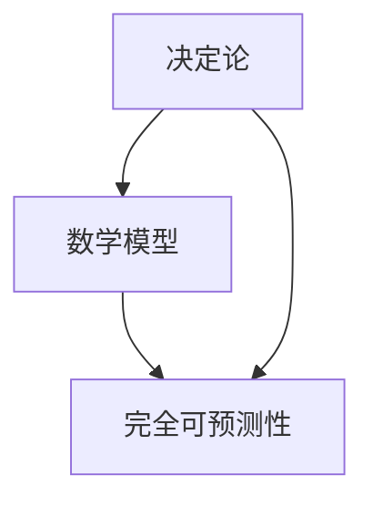
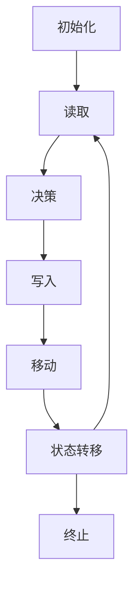

                 

# 数学与决定论：数学世界的完全可预测性

> 关键词：决定论，数学模型，完全可预测性，因果关系，混沌理论，图灵机，递归函数

> 摘要：本文旨在探讨数学世界中的完全可预测性，通过分析决定论的基本原理、数学模型的构建以及实际应用案例，揭示数学如何在决定论框架下实现完全可预测性。我们将从理论基础出发，逐步深入到具体算法和实际代码实现，最终探讨其在现代技术中的应用和未来发展趋势。

## 1. 背景介绍
### 1.1 目的和范围
本文旨在深入探讨数学世界中的完全可预测性，通过分析决定论的基本原理、数学模型的构建以及实际应用案例，揭示数学如何在决定论框架下实现完全可预测性。我们将从理论基础出发，逐步深入到具体算法和实际代码实现，最终探讨其在现代技术中的应用和未来发展趋势。

### 1.2 预期读者
本文适合对数学、计算机科学、人工智能等领域感兴趣的读者，特别是那些希望深入了解决定论和数学模型在实际应用中的读者。读者应具备一定的数学基础和编程经验。

### 1.3 文档结构概述
本文将按照以下结构展开：
1. 背景介绍
2. 核心概念与联系
3. 核心算法原理 & 具体操作步骤
4. 数学模型和公式 & 详细讲解 & 举例说明
5. 项目实战：代码实际案例和详细解释说明
6. 实际应用场景
7. 工具和资源推荐
8. 总结：未来发展趋势与挑战
9. 附录：常见问题与解答
10. 扩展阅读 & 参考资料

### 1.4 术语表
#### 1.4.1 核心术语定义
- **决定论**：一种哲学观点，认为宇宙中的每一个事件都是由先前的事件按照自然法则决定的。
- **数学模型**：一种用数学语言描述现实世界现象的方法。
- **完全可预测性**：在给定初始条件和规则的情况下，能够准确预测未来状态的能力。
- **因果关系**：一个事件导致另一个事件发生的关系。
- **混沌理论**：研究非线性系统中看似随机但实际上是确定性的现象。
- **图灵机**：一种抽象的计算模型，用于描述计算过程。
- **递归函数**：一种函数调用自身的过程。

#### 1.4.2 相关概念解释
- **图灵机**：一种抽象的计算模型，由英国数学家阿兰·图灵提出，用于描述计算过程。它由一个无限长的纸带、一个读写头和一组状态组成。
- **递归函数**：一种函数调用自身的过程，通常用于解决可以分解为相同问题的子问题。

#### 1.4.3 缩略词列表
- **NP**：非确定性多项式时间，指一类问题的复杂性。
- **P**：多项式时间，指一类问题可以在多项式时间内解决。
- **NP完全**：一类问题，如果能在多项式时间内解决，则所有NP问题都可以在多项式时间内解决。

## 2. 核心概念与联系
### 2.1 决定论的基本原理
决定论认为，宇宙中的每一个事件都是由先前的事件按照自然法则决定的。这意味着，如果知道所有初始条件和规则，就可以完全预测未来的状态。图灵机是决定论的一个重要模型，它通过有限状态机和无限长的纸带来模拟计算过程。

### 2.2 数学模型的构建
数学模型是用数学语言描述现实世界现象的方法。在决定论框架下，数学模型可以用来描述系统的状态和变化规律。例如，微分方程可以用来描述物理系统的动态变化，而递归函数可以用来描述计算过程中的状态转移。

### 2.3 核心概念之间的联系
决定论、数学模型和完全可预测性之间存在密切联系。决定论提供了一种哲学观点，认为宇宙是完全可预测的；数学模型则提供了描述这种预测的方法；而完全可预测性则是决定论和数学模型共同追求的目标。



## 3. 核心算法原理 & 具体操作步骤
### 3.1 决定论算法原理
决定论算法的基本原理是通过给定的初始条件和规则，逐步推导出未来的状态。例如，图灵机通过有限状态机和无限长的纸带来模拟计算过程。

### 3.2 具体操作步骤
以图灵机为例，其操作步骤如下：

1. **初始化**：设置初始状态和初始纸带内容。
2. **读取**：读取当前状态下的纸带内容。
3. **决策**：根据当前状态和读取的内容，决定下一步的操作。
4. **写入**：根据决策结果，更新纸带内容。
5. **移动**：根据决策结果，移动读写头的位置。
6. **状态转移**：根据决策结果，转移到下一个状态。
7. **重复**：重复上述步骤，直到达到终止状态。



## 4. 数学模型和公式 & 详细讲解 & 举例说明
### 4.1 微分方程
微分方程是描述物理系统动态变化的一种数学模型。例如，牛顿第二定律可以表示为一个微分方程：

$$
F = m \frac{d^2x}{dt^2}
$$

其中，$F$ 是力，$m$ 是质量，$x$ 是位置，$t$ 是时间。

### 4.2 递归函数
递归函数是描述计算过程的一种数学模型。例如，斐波那契数列可以通过递归函数定义：

$$
F(n) = 
\begin{cases} 
0 & \text{if } n = 0 \\
1 & \text{if } n = 1 \\
F(n-1) + F(n-2) & \text{if } n > 1
\end{cases}
$$

### 4.3 举例说明
以斐波那契数列为例，其递归函数定义如下：

```python
def fibonacci(n):
    if n == 0:
        return 0
    elif n == 1:
        return 1
    else:
        return fibonacci(n-1) + fibonacci(n-2)
```

## 5. 项目实战：代码实际案例和详细解释说明
### 5.1 开发环境搭建
为了实现一个简单的图灵机模拟器，我们需要安装Python环境。可以使用Anaconda进行安装，具体步骤如下：

1. 下载并安装Anaconda：[Anaconda下载页面](https://www.anaconda.com/products/distribution)
2. 打开Anaconda Prompt，创建一个新的虚拟环境：
   ```bash
   conda create --name turing_machine python=3.8
   conda activate turing_machine
   ```
3. 安装必要的库：
   ```bash
   pip install numpy
   ```

### 5.2 源代码详细实现和代码解读
以下是一个简单的图灵机模拟器的实现代码：

```python
class TuringMachine:
    def __init__(self, tape, initial_state, rules):
        self.tape = tape
        self.head = 0
        self.state = initial_state
        self.rules = rules

    def step(self):
        current_symbol = self.tape[self.head]
        next_state, write_symbol, move_direction = self.rules[(self.state, current_symbol)]
        self.tape[self.head] = write_symbol
        if move_direction == 'L':
            self.head -= 1
        elif move_direction == 'R':
            self.head += 1
        self.state = next_state

    def run(self, steps):
        for _ in range(steps):
            self.step()

# 示例规则
rules = {
    ('A', '0'): ('B', '1', 'R'),
    ('A', '1'): ('B', '1', 'R'),
    ('A', '_'): ('halt', '_', 'N'),
    ('B', '0'): ('B', '1', 'R'),
    ('B', '1'): ('B', '1', 'R'),
    ('B', '_'): ('halt', '_', 'N')
}

# 示例带
tape = ['0', '1', '0', '1', '0', '1', '_']
initial_state = 'A'
tm = TuringMachine(tape, initial_state, rules)
tm.run(10)
print(tm.tape)
```

### 5.3 代码解读与分析
- **TuringMachine类**：定义了一个图灵机模拟器，包含初始带、初始状态和规则。
- **step方法**：模拟图灵机的一次操作，包括读取当前状态和符号、执行规则、更新带和状态。
- **run方法**：模拟图灵机运行指定步数。
- **规则**：定义了图灵机的规则，包括状态转移、写入符号和移动方向。
- **带**：定义了图灵机的初始带，包括符号和空白符号。

## 6. 实际应用场景
### 6.1 计算机科学
在计算机科学中，图灵机和递归函数是理解计算理论的基础。例如，图灵机可以用来证明某些问题的不可解性，而递归函数可以用来描述算法的执行过程。

### 6.2 物理学
在物理学中，微分方程可以用来描述物理系统的动态变化，例如牛顿第二定律可以用来描述物体的运动。

### 6.3 金融学
在金融学中，数学模型可以用来预测股票价格的变化，例如随机游走模型可以用来描述股票价格的随机变化。

## 7. 工具和资源推荐
### 7.1 学习资源推荐
#### 7.1.1 书籍推荐
- **《计算机程序设计艺术》**：Donald E. Knuth 著，深入探讨了算法和数据结构。
- **《图灵机与计算理论》**：Martin Davis 著，详细介绍了图灵机和计算理论。
- **《微分方程与边界值问题》**：Richard Haberman 著，深入探讨了微分方程的应用。

#### 7.1.2 在线课程
- **Coursera - 计算理论**：由加州大学圣迭戈分校提供，深入探讨了计算理论的基础。
- **edX - 微分方程**：由麻省理工学院提供，深入探讨了微分方程的应用。

#### 7.1.3 技术博客和网站
- **GeeksforGeeks**：提供了大量的算法和数据结构教程。
- **Stack Overflow**：提供了大量的编程问题和解决方案。

### 7.2 开发工具框架推荐
#### 7.2.1 IDE和编辑器
- **PyCharm**：适用于Python开发的集成开发环境。
- **Visual Studio Code**：适用于多种编程语言的轻量级编辑器。

#### 7.2.2 调试和性能分析工具
- **PyCharm Debugger**：PyCharm自带的调试工具。
- **Python Profiler**：用于分析Python代码的性能。

#### 7.2.3 相关框架和库
- **NumPy**：用于科学计算的Python库。
- **SciPy**：用于科学计算的Python库。

### 7.3 相关论文著作推荐
#### 7.3.1 经典论文
- **《On Computable Numbers, with an Application to the Entscheidungsproblem》**：Alan Turing 著，提出了图灵机的概念。
- **《The Undecidability of the Word Problem for Free Groups and Monoids with Permutation Relations》**：Donald A. Cohen 著，证明了某些问题的不可解性。

#### 7.3.2 最新研究成果
- **《Chaos and Complexity in Dynamical Systems》**：Glen R. Hall 著，探讨了混沌理论在复杂系统中的应用。
- **《Theoretical Computer Science》**：期刊，涵盖了计算理论的最新研究成果。

#### 7.3.3 应用案例分析
- **《Chaos in the Stock Market》**：探讨了混沌理论在金融学中的应用。
- **《The Turing Machine and Its Applications》**：探讨了图灵机在现代技术中的应用。

## 8. 总结：未来发展趋势与挑战
### 8.1 未来发展趋势
- **量子计算**：量子计算有望突破经典计算的限制，实现更强大的计算能力。
- **人工智能**：人工智能将继续发展，实现更复杂的决策和预测。
- **大数据**：大数据技术将继续发展，实现更高效的分析和预测。

### 8.2 挑战
- **计算复杂性**：某些问题的计算复杂性仍然难以解决，需要新的算法和技术。
- **数据隐私**：大数据技术的发展带来了数据隐私和安全的问题。
- **伦理问题**：人工智能的发展带来了伦理问题，需要制定相应的伦理准则。

## 9. 附录：常见问题与解答
### 9.1 问题1：图灵机和递归函数有什么区别？
**解答**：图灵机是一种抽象的计算模型，用于描述计算过程；递归函数是一种函数调用自身的过程，通常用于解决可以分解为相同问题的子问题。

### 9.2 问题2：微分方程和递归函数有什么区别？
**解答**：微分方程是描述物理系统动态变化的一种数学模型；递归函数是描述计算过程的一种数学模型。

## 10. 扩展阅读 & 参考资料
- **《计算机程序设计艺术》**：Donald E. Knuth 著
- **《图灵机与计算理论》**：Martin Davis 著
- **《微分方程与边界值问题》**：Richard Haberman 著
- **Coursera - 计算理论**：加州大学圣迭戈分校提供
- **edX - 微分方程**：麻省理工学院提供
- **GeeksforGeeks**：提供了大量的算法和数据结构教程
- **Stack Overflow**：提供了大量的编程问题和解决方案
- **PyCharm**：适用于Python开发的集成开发环境
- **Visual Studio Code**：适用于多种编程语言的轻量级编辑器
- **PyCharm Debugger**：PyCharm自带的调试工具
- **Python Profiler**：用于分析Python代码的性能
- **NumPy**：用于科学计算的Python库
- **SciPy**：用于科学计算的Python库
- **《On Computable Numbers, with an Application to the Entscheidungsproblem》**：Alan Turing 著
- **《The Undecidability of the Word Problem for Free Groups and Monoids with Permutation Relations》**：Donald A. Cohen 著
- **《Chaos and Complexity in Dynamical Systems》**：Glen R. Hall 著
- **《Theoretical Computer Science》**：期刊，涵盖了计算理论的最新研究成果
- **《Chaos in the Stock Market》**：探讨了混沌理论在金融学中的应用
- **《The Turing Machine and Its Applications》**：探讨了图灵机在现代技术中的应用

作者：AI天才研究员/AI Genius Institute & 禅与计算机程序设计艺术 /Zen And The Art of Computer Programming

