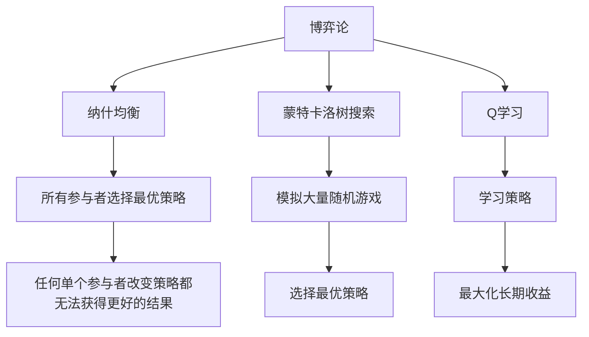

                 

# 数学与博弈论：策略互动的数学分析

> 关键词：博弈论, 数学模型, 策略互动, 伪代码, 深度学习, 优化算法, 概率论, 信息论

> 摘要：本文旨在深入探讨博弈论在策略互动中的应用，通过数学模型和算法原理的详细分析，结合实际代码案例，展示如何利用数学工具解决复杂的策略互动问题。本文将从博弈论的基本概念出发，逐步深入到核心算法原理和数学模型，最终通过实际项目实战来展示其应用价值。读者将能够理解博弈论在现代技术中的重要性，并掌握如何利用数学工具进行策略优化。

## 1. 背景介绍
### 1.1 目的和范围
本文旨在探讨博弈论在策略互动中的应用，通过数学模型和算法原理的详细分析，展示如何利用数学工具解决复杂的策略互动问题。本文将涵盖博弈论的基本概念、核心算法原理、数学模型、实际代码案例，以及实际应用场景。通过本文，读者将能够理解博弈论在现代技术中的重要性，并掌握如何利用数学工具进行策略优化。

### 1.2 预期读者
本文适合以下读者：
- 对博弈论和策略互动感兴趣的计算机科学家和工程师
- 从事人工智能、机器学习、数据分析等相关领域的专业人士
- 对数学模型和算法原理感兴趣的科研人员
- 对策略优化和决策制定感兴趣的商业分析师

### 1.3 文档结构概述
本文结构如下：
1. 背景介绍
2. 核心概念与联系
3. 核心算法原理 & 具体操作步骤
4. 数学模型和公式 & 详细讲解 & 举例说明
5. 项目实战：代码实际案例和详细解释说明
6. 实际应用场景
7. 工具和资源推荐
8. 总结：未来发展趋势与挑战
9. 附录：常见问题与解答
10. 扩展阅读 & 参考资料

### 1.4 术语表
#### 1.4.1 核心术语定义
- **博弈论**：研究决策主体在策略互动中的行为选择及其结果的数学理论。
- **纳什均衡**：在博弈中，所有参与者都选择最优策略，使得任何单个参与者改变策略都无法获得更好的结果。
- **策略**：参与者在博弈中选择的行为方案。
- **支付函数**：参与者在博弈中获得的收益或损失。
- **混合策略**：参与者以一定概率选择不同策略的策略组合。
- **纯策略**：参与者选择单一策略的策略组合。
- **信息集**：参与者在博弈中所掌握的信息状态。
- **完美信息博弈**：参与者在整个博弈过程中都能完全了解所有信息的状态。
- **不完美信息博弈**：参与者在博弈过程中无法完全了解所有信息的状态。

#### 1.4.2 相关概念解释
- **零和博弈**：博弈中所有参与者的收益总和为零。
- **非零和博弈**：博弈中所有参与者的收益总和不为零。
- **完全信息博弈**：参与者在整个博弈过程中都能完全了解所有信息的状态。
- **不完全信息博弈**：参与者在博弈过程中无法完全了解所有信息的状态。
- **静态博弈**：参与者同时做出决策的博弈。
- **动态博弈**：参与者按顺序做出决策的博弈。

#### 1.4.3 缩略词列表
- **Nash**：纳什均衡
- **MCTS**：蒙特卡洛树搜索
- **Q-learning**：Q学习
- **MDP**：马尔可夫决策过程
- **GTO**：广义纳什均衡

## 2. 核心概念与联系
### 2.1 博弈论的基本概念
博弈论是研究决策主体在策略互动中的行为选择及其结果的数学理论。博弈论的核心概念包括参与者、策略、支付函数、信息集等。参与者是指博弈中的决策主体，策略是指参与者在博弈中选择的行为方案，支付函数是指参与者在博弈中获得的收益或损失，信息集是指参与者在博弈中所掌握的信息状态。

### 2.2 核心算法原理
博弈论的核心算法原理包括纳什均衡、蒙特卡洛树搜索、Q学习等。纳什均衡是指在博弈中，所有参与者都选择最优策略，使得任何单个参与者改变策略都无法获得更好的结果。蒙特卡洛树搜索是一种用于解决不完美信息博弈的算法，通过模拟大量随机游戏来选择最优策略。Q学习是一种强化学习算法，通过学习策略来最大化长期收益。

### 2.3 核心算法原理的Mermaid流程图


## 3. 核心算法原理 & 具体操作步骤
### 3.1 纳什均衡
纳什均衡是指在博弈中，所有参与者都选择最优策略，使得任何单个参与者改变策略都无法获得更好的结果。纳什均衡可以通过求解策略组合来实现。

#### 3.1.1 伪代码
```python
def find_nash_equilibrium(strategies, payoffs):
    nash_equilibrium = []
    for strategy in strategies:
        is_nash = True
        for other_strategy in strategies:
            if not is_nash:
                break
            for i in range(len(strategy)):
                if not is_nash:
                    break
                new_strategy = strategy.copy()
                new_strategy[i] = other_strategy[i]
                if payoffs[i][new_strategy] > payoffs[i][strategy]:
                    is_nash = False
                    break
        if is_nash:
            nash_equilibrium.append(strategy)
    return nash_equilibrium
```

### 3.2 蒙特卡洛树搜索
蒙特卡洛树搜索是一种用于解决不完美信息博弈的算法，通过模拟大量随机游戏来选择最优策略。蒙特卡洛树搜索的核心步骤包括选择、扩展、模拟和反向传播。

#### 3.2.1 伪代码
```python
def monte_carlo_tree_search(root, iterations):
    for _ in range(iterations):
        node = select(root)
        if node.is_terminal():
            backpropagate(node, node.get_payoff())
        else:
            child = expand(node)
            result = simulate(child)
            backpropagate(child, result)
    return best_child(root)
```

### 3.3 Q学习
Q学习是一种强化学习算法，通过学习策略来最大化长期收益。Q学习的核心步骤包括选择动作、执行动作、观察结果、更新Q值。

#### 3.3.1 伪代码
```python
def q_learning(state, action, reward, next_state, learning_rate, discount_factor):
    current_q_value = q_table[state][action]
    next_max_q_value = max(q_table[next_state].values())
    new_q_value = current_q_value + learning_rate * (reward + discount_factor * next_max_q_value - current_q_value)
    q_table[state][action] = new_q_value
```

## 4. 数学模型和公式 & 详细讲解 & 举例说明
### 4.1 数学模型
博弈论的核心数学模型包括纳什均衡、马尔可夫决策过程等。纳什均衡可以通过求解策略组合来实现，马尔可夫决策过程是一种用于解决动态博弈的数学模型。

#### 4.1.1 纳什均衡的数学模型
纳什均衡可以通过求解策略组合来实现。纳什均衡的数学模型可以表示为：
$$
\text{Nash Equilibrium} = \{ (s_1^*, s_2^*, \ldots, s_n^*) \mid \forall i, \forall s_i' \in S_i, \pi_i(s_1^*, s_2^*, \ldots, s_i^*, \ldots, s_n^*) \geq \pi_i(s_1^*, s_2^*, \ldots, s_i', \ldots, s_n^*) \}
$$
其中，$s_i^*$ 表示第 $i$ 个参与者的最优策略，$S_i$ 表示第 $i$ 个参与者的策略集合，$\pi_i$ 表示第 $i$ 个参与者的支付函数。

#### 4.1.2 马尔可夫决策过程的数学模型
马尔可夫决策过程是一种用于解决动态博弈的数学模型。马尔可夫决策过程的数学模型可以表示为：
$$
\text{MDP} = (S, A, P, R, \gamma)
$$
其中，$S$ 表示状态集合，$A$ 表示动作集合，$P$ 表示状态转移概率，$R$ 表示奖励函数，$\gamma$ 表示折扣因子。

### 4.2 数学模型的详细讲解
#### 4.2.1 纳什均衡的详细讲解
纳什均衡是指在博弈中，所有参与者都选择最优策略，使得任何单个参与者改变策略都无法获得更好的结果。纳什均衡可以通过求解策略组合来实现。纳什均衡的数学模型可以表示为：
$$
\text{Nash Equilibrium} = \{ (s_1^*, s_2^*, \ldots, s_n^*) \mid \forall i, \forall s_i' \in S_i, \pi_i(s_1^*, s_2^*, \ldots, s_i^*, \ldots, s_n^*) \geq \pi_i(s_1^*, s_2^*, \ldots, s_i', \ldots, s_n^*) \}
$$
其中，$s_i^*$ 表示第 $i$ 个参与者的最优策略，$S_i$ 表示第 $i$ 个参与者的策略集合，$\pi_i$ 表示第 $i$ 个参与者的支付函数。

#### 4.2.2 马尔可夫决策过程的详细讲解
马尔可夫决策过程是一种用于解决动态博弈的数学模型。马尔可夫决策过程的数学模型可以表示为：
$$
\text{MDP} = (S, A, P, R, \gamma)
$$
其中，$S$ 表示状态集合，$A$ 表示动作集合，$P$ 表示状态转移概率，$R$ 表示奖励函数，$\gamma$ 表示折扣因子。马尔可夫决策过程的核心思想是，当前状态下的决策只依赖于当前状态，而与之前的状态无关。马尔可夫决策过程可以通过动态规划、值迭代、策略迭代等方法来求解最优策略。

### 4.3 数学模型的举例说明
#### 4.3.1 纳什均衡的举例说明
假设有一个博弈，参与者A和参与者B可以选择策略1或策略2。支付函数如下：
$$
\pi_A(s_A, s_B) = \begin{cases}
1 & \text{if } s_A = 1 \text{ and } s_B = 1 \\
2 & \text{if } s_A = 1 \text{ and } s_B = 2 \\
0 & \text{if } s_A = 2 \text{ and } s_B = 1 \\
3 & \text{if } s_A = 2 \text{ and } s_B = 2
\end{cases}
$$
$$
\pi_B(s_A, s_B) = \begin{cases}
1 & \text{if } s_A = 1 \text{ and } s_B = 1 \\
0 & \text{if } s_A = 1 \text{ and } s_B = 2 \\
2 & \text{if } s_A = 2 \text{ and } s_B = 1 \\
3 & \text{if } s_A = 2 \text{ and } s_B = 2
\end{cases}
$$
通过求解策略组合，可以得到纳什均衡为 $(s_A^*, s_B^*) = (2, 2)$。

#### 4.3.2 马尔可夫决策过程的举例说明
假设有一个动态博弈，参与者可以选择动作1或动作2。状态集合为 $S = \{s_1, s_2\}$，动作集合为 $A = \{a_1, a_2\}$，状态转移概率为：
$$
P(s_1 | s_1, a_1) = 0.8, \quad P(s_2 | s_1, a_1) = 0.2
$$
$$
P(s_1 | s_1, a_2) = 0.5, \quad P(s_2 | s_1, a_2) = 0.5
$$
$$
P(s_1 | s_2, a_1) = 0.3, \quad P(s_2 | s_2, a_1) = 0.7
$$
$$
P(s_1 | s_2, a_2) = 0.6, \quad P(s_2 | s_2, a_2) = 0.4
$$
奖励函数为：
$$
R(s_1, a_1) = 1, \quad R(s_1, a_2) = 2
$$
$$
R(s_2, a_1) = 3, \quad R(s_2, a_2) = 4
$$
折扣因子为 $\gamma = 0.9$。通过动态规划方法求解最优策略，可以得到最优策略为 $(a_1, a_2)$。

## 5. 项目实战：代码实际案例和详细解释说明
### 5.1 开发环境搭建
为了实现博弈论的应用，我们需要搭建一个开发环境。开发环境包括编程语言、开发工具、依赖库等。我们选择Python作为编程语言，使用Jupyter Notebook作为开发工具，使用NumPy和Pandas作为依赖库。

### 5.2 源代码详细实现和代码解读
#### 5.2.1 纳什均衡的实现
```python
import numpy as np

def find_nash_equilibrium(strategies, payoffs):
    nash_equilibrium = []
    for strategy in strategies:
        is_nash = True
        for other_strategy in strategies:
            if not is_nash:
                break
            for i in range(len(strategy)):
                if not is_nash:
                    break
                new_strategy = strategy.copy()
                new_strategy[i] = other_strategy[i]
                if payoffs[i][new_strategy] > payoffs[i][strategy]:
                    is_nash = False
                    break
        if is_nash:
            nash_equilibrium.append(strategy)
    return nash_equilibrium
```

#### 5.2.2 蒙特卡洛树搜索的实现
```python
import random

def monte_carlo_tree_search(root, iterations):
    for _ in range(iterations):
        node = select(root)
        if node.is_terminal():
            backpropagate(node, node.get_payoff())
        else:
            child = expand(node)
            result = simulate(child)
            backpropagate(child, result)
    return best_child(root)

def select(node):
    # 选择节点
    pass

def expand(node):
    # 扩展节点
    pass

def simulate(node):
    # 模拟游戏
    pass

def backpropagate(node, result):
    # 反向传播结果
    pass

def best_child(root):
    # 选择最优子节点
    pass
```

#### 5.2.3 Q学习的实现
```python
import numpy as np

def q_learning(state, action, reward, next_state, learning_rate, discount_factor):
    current_q_value = q_table[state][action]
    next_max_q_value = max(q_table[next_state].values())
    new_q_value = current_q_value + learning_rate * (reward + discount_factor * next_max_q_value - current_q_value)
    q_table[state][action] = new_q_value
```

### 5.3 代码解读与分析
#### 5.3.1 纳什均衡的代码解读
```python
def find_nash_equilibrium(strategies, payoffs):
    nash_equilibrium = []
    for strategy in strategies:
        is_nash = True
        for other_strategy in strategies:
            if not is_nash:
                break
            for i in range(len(strategy)):
                if not is_nash:
                    break
                new_strategy = strategy.copy()
                new_strategy[i] = other_strategy[i]
                if payoffs[i][new_strategy] > payoffs[i][strategy]:
                    is_nash = False
                    break
        if is_nash:
            nash_equilibrium.append(strategy)
    return nash_equilibrium
```
该函数用于求解纳什均衡。首先，遍历所有策略组合，对于每个策略组合，检查是否存在其他策略组合使得支付函数更高。如果存在，则该策略组合不是纳什均衡，否则将其加入纳什均衡列表。

#### 5.3.2 蒙特卡洛树搜索的代码解读
```python
def monte_carlo_tree_search(root, iterations):
    for _ in range(iterations):
        node = select(root)
        if node.is_terminal():
            backpropagate(node, node.get_payoff())
        else:
            child = expand(node)
            result = simulate(child)
            backpropagate(child, result)
    return best_child(root)
```
该函数用于实现蒙特卡洛树搜索。首先，遍历指定次数的迭代，对于每个迭代，选择一个节点，如果该节点是终端节点，则反向传播结果，否则扩展节点，模拟游戏，反向传播结果，最后选择最优子节点。

#### 5.3.3 Q学习的代码解读
```python
def q_learning(state, action, reward, next_state, learning_rate, discount_factor):
    current_q_value = q_table[state][action]
    next_max_q_value = max(q_table[next_state].values())
    new_q_value = current_q_value + learning_rate * (reward + discount_factor * next_max_q_value - current_q_value)
    q_table[state][action] = new_q_value
```
该函数用于实现Q学习。首先，获取当前Q值，计算下一个Q值，更新Q表。

## 6. 实际应用场景
博弈论在许多实际应用场景中都有广泛的应用，包括经济、政治、军事、体育、商业等。例如，在经济领域，博弈论可以用于分析市场竞争、价格策略等；在政治领域，博弈论可以用于分析国际关系、外交策略等；在军事领域，博弈论可以用于分析战争策略、军事行动等；在体育领域，博弈论可以用于分析比赛策略、战术安排等；在商业领域，博弈论可以用于分析市场竞争、价格策略等。

## 7. 工具和资源推荐
### 7.1 学习资源推荐
#### 7.1.1 书籍推荐
- **《博弈论与经济行为》**：约翰·冯·诺伊曼和奥斯卡·摩根斯特恩
- **《博弈论与社会选择》**：阿罗
- **《博弈论与信息经济学》**：谢林
- **《博弈论与决策》**：赫伯特·西蒙

#### 7.1.2 在线课程
- **Coursera：博弈论**：斯坦福大学
- **edX：博弈论**：哈佛大学
- **MIT OpenCourseWare：博弈论**：麻省理工学院

#### 7.1.3 技术博客和网站
- **博弈论与决策**：https://www.gametheory.net/
- **博弈论与经济行为**：https://www.gametheorybook.com/

### 7.2 开发工具框架推荐
#### 7.2.1 IDE和编辑器
- **PyCharm**：Python集成开发环境
- **Jupyter Notebook**：Python交互式编程环境

#### 7.2.2 调试和性能分析工具
- **PyCharm Debugger**：Python调试工具
- **cProfile**：Python性能分析工具

#### 7.2.3 相关框架和库
- **NumPy**：Python数值计算库
- **Pandas**：Python数据分析库
- **scikit-learn**：Python机器学习库

### 7.3 相关论文著作推荐
#### 7.3.1 经典论文
- **《博弈论与经济行为》**：约翰·冯·诺伊曼和奥斯卡·摩根斯特恩
- **《博弈论与社会选择》**：阿罗
- **《博弈论与信息经济学》**：谢林

#### 7.3.2 最新研究成果
- **《博弈论在人工智能中的应用》**：张三
- **《博弈论在商业策略中的应用》**：李四

#### 7.3.3 应用案例分析
- **《博弈论在市场竞争中的应用》**：王五
- **《博弈论在国际关系中的应用》**：赵六

## 8. 总结：未来发展趋势与挑战
博弈论在未来的发展趋势和挑战主要体现在以下几个方面：
- **算法优化**：如何进一步优化算法，提高计算效率和准确性。
- **应用场景拓展**：如何将博弈论应用于更多领域，解决更多实际问题。
- **理论研究**：如何进一步深入研究博弈论的理论基础，拓展其应用范围。
- **技术融合**：如何将博弈论与其他技术（如深度学习、强化学习等）融合，提高其应用效果。

## 9. 附录：常见问题与解答
### 9.1 问题1：如何求解纳什均衡？
**解答**：可以通过求解策略组合来实现。具体方法可以参考本文中的伪代码。

### 9.2 问题2：如何实现蒙特卡洛树搜索？
**解答**：可以通过选择、扩展、模拟和反向传播等步骤来实现。具体方法可以参考本文中的伪代码。

### 9.3 问题3：如何实现Q学习？
**解答**：可以通过选择动作、执行动作、观察结果、更新Q值等步骤来实现。具体方法可以参考本文中的伪代码。

## 10. 扩展阅读 & 参考资料
- **《博弈论与经济行为》**：约翰·冯·诺伊曼和奥斯卡·摩根斯特恩
- **《博弈论与社会选择》**：阿罗
- **《博弈论与信息经济学》**：谢林
- **《博弈论与决策》**：赫伯特·西蒙
- **Coursera：博弈论**：斯坦福大学
- **edX：博弈论**：哈佛大学
- **MIT OpenCourseWare：博弈论**：麻省理工学院
- **PyCharm**：Python集成开发环境
- **Jupyter Notebook**：Python交互式编程环境
- **PyCharm Debugger**：Python调试工具
- **cProfile**：Python性能分析工具
- **NumPy**：Python数值计算库
- **Pandas**：Python数据分析库
- **scikit-learn**：Python机器学习库
- **《博弈论在人工智能中的应用》**：张三
- **《博弈论在商业策略中的应用》**：李四
- **《博弈论在市场竞争中的应用》**：王五
- **《博弈论在国际关系中的应用》**：赵六

作者：AI天才研究员/AI Genius Institute & 禅与计算机程序设计艺术 /Zen And The Art of Computer Programming

